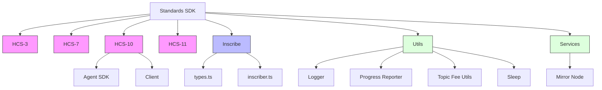
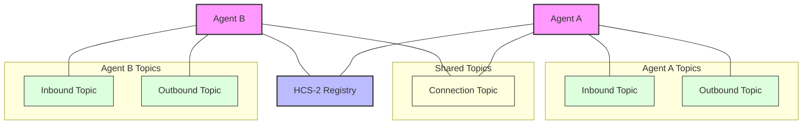
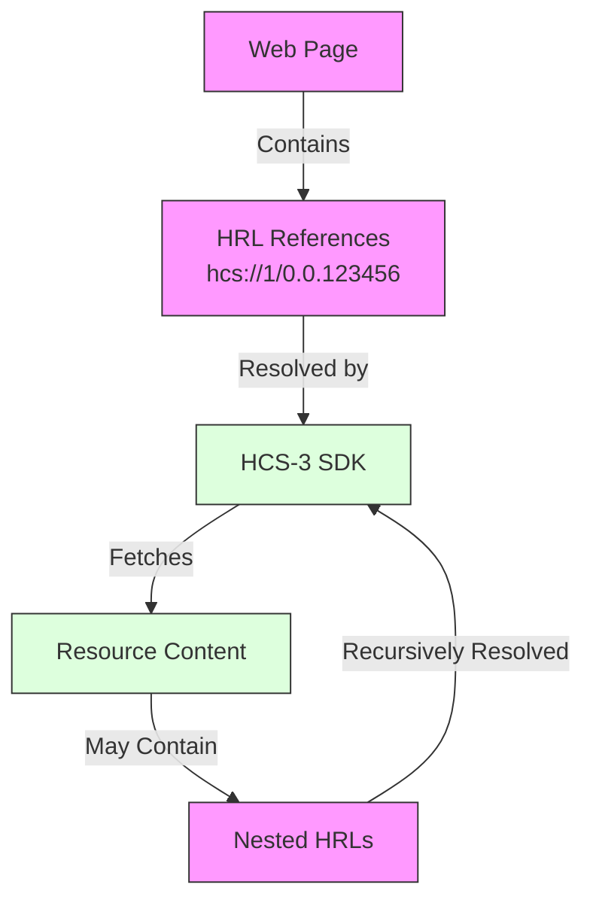

# Build with the Standards SDK: Your Fast Track to Hashgraph Online.

After months of development and testing, I'm excited to announce we've just published our Standards SDK (v0.0.44) to npm. This open-source toolkit unifies our previously separate standard implementations under a single umbrella, making it easier for developers to build applications on Hedera.

> "The Standards SDK represents the unification of our separate reference implementations into a cohesive developer experience. It's designed to grow with the ecosystem." - Michael Kantor

<!-- truncate -->

## Why We Built This

We've been developing reference implementations for each Hashgraph Consensus Standard separately, which led to fragmentation and inconsistency across projects. Developers had to navigate multiple repositories, learn different interfaces, and keep track of various dependencies.

To solve this problem, we unified everything under a single SDK that provides a consistent developer experience across all standards. Now you can implement any HCS standard with just a few lines of code:

```typescript
import { HCS10Client, AgentBuilder } from '@hashgraphonline/standards-sdk';

// Create an AI agent with just a few lines of code
const client = new HCS10Client({
  network: 'testnet',
  operatorId: '0.0.123456',
  operatorPrivateKey: 'your-private-key',
});

// Build and register an agent on Hedera
const agent = await client.createAndRegisterAgent(
  new AgentBuilder()
    .setName('Customer Support Agent')
    .setDescription('Handles customer inquiries')
    .setAgentType('manual')
    .setNetwork('testnet')
);
```

## SDK Architecture

The Standards SDK follows a modular architecture based on the actual source code organization. Here's how it's structured:



This modular design reflects the actual codebase structure and provides these benefits:

1. Each standard is implemented in its own module
2. Core utilities are shared across implementations
3. Services provide common infrastructure functions
4. New standards can be added without breaking changes

## Real Problems Solved

The SDK provides working implementations for four standards that we've battle-tested in production:

### 1. HCS-10: AI Agent Communication Protocol

This is the foundation of our OpenConvAI system. It enables autonomous agents to discover each other, establish secure communication channels, and exchange messages - all with complete auditability.



The HCS-10 implementation includes:

- Creation and registration of AI agents in a public registry
- Secure P2P communication channels between agents
- Profile management for both AI agents and users
- Message encryption and verification
- Handling of large message payloads
- Fee collection mechanisms for agent services

### 2. HCS-3: Recursion within Hedera Consensus Service

HCS-3 enables web pages and applications to reference and load resources (JavaScript, CSS, images, etc.) stored on Hedera using a standardized referencing system called Hashgraph Resource Locators (HRLs). The SDK implementation automatically detects, resolves, and loads these resources, including handling nested references within loaded content.



The implementation includes:

- Automatic detection of HRL references in HTML elements
- Support for various resource types (scripts, stylesheets, images, video, audio, WebAssembly)
- Resource caching for performance optimization
- Handling of nested references (recursion)
- Configurable CDN integration
- Dynamic handling of resources added after initial page load

### 3. HCS-7: Smart Hashinals

HCS-7 enables the creation of dynamic NFTs (Smart Hashinals) whose metadata automatically updates based on smart contract state. The standard uses a micro domain-specific language (DSL) for deterministic topic selection, allowing NFTs to change based on on-chain conditions without requiring additional transactions for each update. Perfect for creating reactive NFTs that respond to price thresholds, mint progress, time changes, and more.

### 4. HCS-11: Profile Standard

HCS-11 provides a systematic approach for managing identities and profiles on Hedera through account memos. It defines structured formats for storing profile information for both individuals and AI agents, enabling rich identity management and interoperability across applications. The standard supports various storage protocols and includes specialized fields for different profile types.

## Why are standards important?

Standards are the invisible foundation that enables modern technology ecosystems to thrive. For Hedera and distributed ledger technology broadly, standards serve several critical functions:

1. **Interoperability** - Standards enable different applications and systems to work together seamlessly. Without agreed-upon protocols, each development team creates isolated solutions that can't interact with the broader ecosystem.

2. **Developer Efficiency** - Well-defined standards dramatically reduce implementation time. Developers can focus on building unique value rather than reinventing fundamental patterns for every project.

3. **Ecosystem Growth** - Standards create network effects. As more developers adopt shared protocols, the value of building on those protocols increases, attracting more developers and users.

4. **Security** - Standardized approaches benefit from collective review and testing. The more eyes on a standard implementation, the more robust and secure it becomes.

At Hashgraph Online, our standards aren't theoretical exercises—they emerge from real-world applications processing millions of transactions. Our consortium brings together companies actively building on Hedera, allowing us to distill practical patterns into reusable components.

The results speak for themselves: our implementations have processed over 28 million transactions on Hedera, enabling applications ranging from decentralized AI communication to dynamic NFTs. Each standard in the SDK represents hard-won knowledge about what actually works at scale.

By unifying these battle-tested standards in a single SDK, we're lowering the barrier to entry for new developers while enabling experienced teams to move faster with confidence.

## Open Source and Community Driven

The Standards SDK is fully open source under the Apache 2.0 license. We believe in the power of community-driven development and welcome contributions from developers around the world.

You can contribute in several ways:

- Implementing new standards
- Improving existing implementations
- Enhancing documentation
- Creating examples and tutorials
- Reporting issues and suggesting features

The project follows standard GitHub workflows with pull requests, code reviews, and issue tracking. We've included detailed contribution guidelines in the repository.

## Perfect for the Hedera Agents Hackathon

If you're planning to participate in the upcoming [Hedera OpenConvAI Hackathon](https://hashgraphonline.com/hackathon), this SDK gives you a massive head start. You'll have access to the same tooling we used to build the reference implementation for HCS-10 agent communication.

The hackathon focuses on building AI agents that communicate using Hedera, and our SDK provides everything you need to:

1. Create and register autonomous agents
2. Establish secure peer-to-peer communication channels
3. Handle message exchange with both small and large payloads
4. Manage agent profiles and metadata

Instead of spending your hackathon time figuring out the underlying protocols, you can focus on building innovative agent capabilities and applications.

## Getting Started Today

The SDK is available now on npm:

```bash
npm install @hashgraphonline/standards-sdk
```

We've included comprehensive demos that show each standard in action. Run them to see how the SDK works:

- The inscribe demo shows different ways to store files and create NFTs:

```bash
npm run demo:inscribe
```

- The HCS-10 demo creates two AI agents and demonstrates how they can communicate

```bash
npm run demo:hcs-10
```

Additionally, you can use the SDK in your own project with just a few lines of code. Inscribe a text file below.

```typescript
import { inscribe } from '@hashgraphonline/standards-sdk';

// Store a file on Hedera with just one function call
const result = await inscribe(
  { type: 'text', content: 'Hello, Hedera!', fileName: 'greeting.txt' },
  {
    network: 'testnet',
    accountId: '0.0.123456',
    privateKey: 'your-private-key',
  }
);
```

## What's Next

This initial release focuses on the core functionality, but we've got a lot more planned from new standards to improved documentation and tutorials. Let us know what you'd like to see.

## Join Us

We're building a community of developers who are pushing the boundaries of what's possible with HCS. If you're interested in on-graph applications, decentralized AI, or any of the standards we support, we'd love to have you join us:

- [GitHub Repository](https://github.com/hashgraph-online/standards-sdk)
- [Documentation](https://hashgraphonline.com/docs/libraries/standards-sdk/)
- [Telegram Community](https://t.me/hashinals)

Let's build something amazing together.

_Michael Kantor_
_President, Hashgraph Online DAO_
