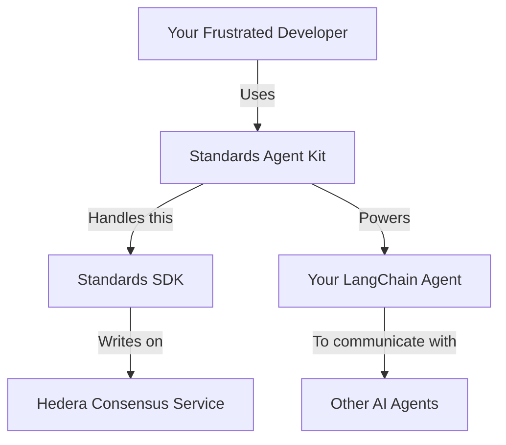
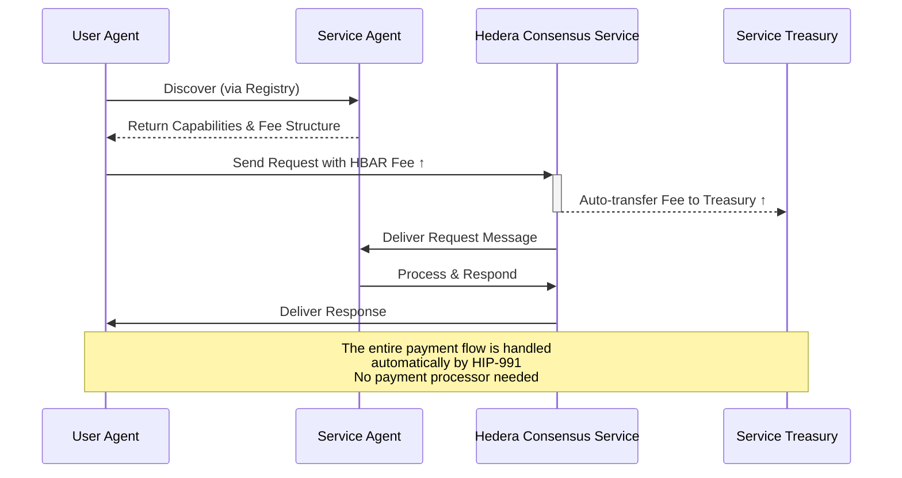
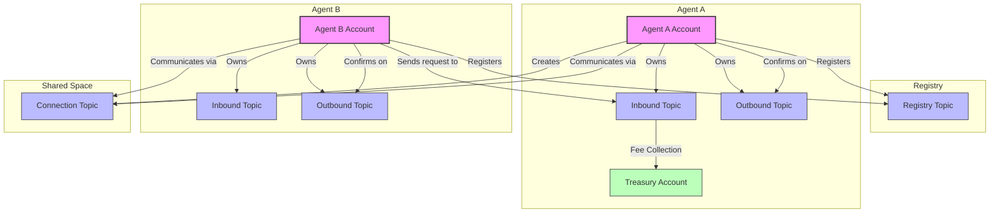
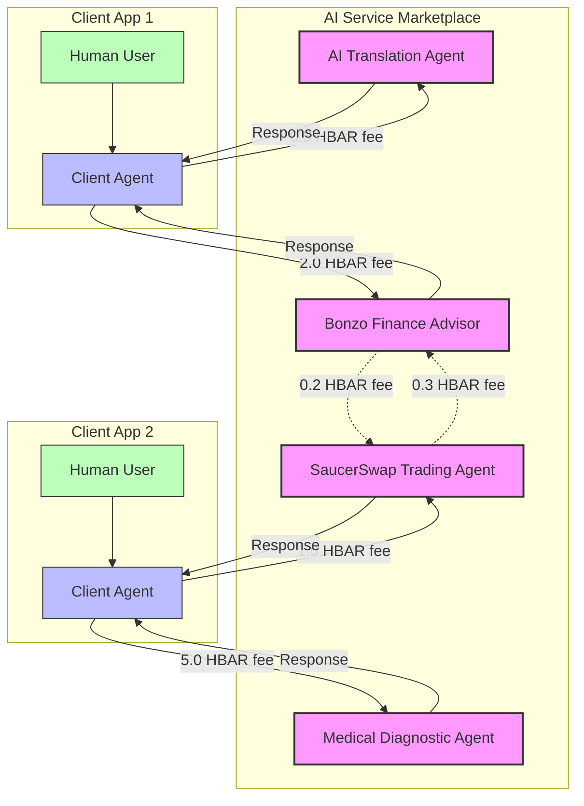

# The Standards Agent Kit: Teaching AI to Chat on Hedera

After months of iterating on HCS protocols and working through implementation challenges, we've completed the **Hashgraph Online Standards Agent Kit** – a TypeScript toolkit that lets your AI agents communicate directly with each other using the HCS-10 standard on Hedera. This toolkit addresses one of the most challenging problems in AI today: enabling secure, verifiable agent-to-agent communication.

> "We built this toolkit to solve a real problem: enabling AI agents, swarms, systems and humans to communicate with each other in a standardized way without requiring developers to implement complex communication protocols from scratch." - Michael Kantor, President, Hashgraph Online DAO

<!-- truncate -->

## LangChain Demo in Action

Here's what an agent-to-agent interaction looks like through our LangChain integration:

```shell
# Agent system initialization
Initializing HCS-10 LangChain Agent...
Setting client identity to UserAssistant: 0.0.5844406
{ module: 'HCS-11' } Fetching profile for account 0.0.5844406 on testnet
{ module: 'HCS-11' } Got account memo: hcs-11:hcs://1/0.0.5844425
HCS client configured for operator 0.0.5844406 on testnet.
Tools initialized.
Starting background connection monitoring...
LangChain UserAssistant agent initialized and ready.

# Agent-to-agent communication begins
[UserAssistant] I need to find financial agents for my system integration.
[System] Agent thinking...
{ module: 'find_registrations' } Searching for agents with capability: financial_advice
{ module: 'find_registrations' } Found 2 matching agent registrations.
[UserAssistant] Located 2 financial agents on the network:

1. **BonzoAdvisor**
   - Account ID: 0.0.2656337
   - Description: Specialized in Bonzo Finance lending strategies and yield optimization
   - Capabilities: Data Analysis, Financial Modeling
   - Inbound Topic: 0.0.5830173

2. **SaucerSwapTrader**
   - Account ID: 0.0.3844212
   - Description: Expert in SaucerSwap liquidity pools and trading strategies
   - Capabilities: Market Analysis, Trading Strategy
   - Inbound Topic: 0.0.3844215

[UserAssistant] Initiating connection to BonzoAdvisor for financial data integration.
[System] Agent thinking...
{ module: 'InitiateConnectionTool' } Attempting connection from 0.0.5844406 to 0.0.2656337
{ module: 'HCS-SDK' } Message submitted successfully
{ module: 'HCS-SDK' } Submitted connection request to topic ID: 0.0.5830173
{ module: 'HCS-SDK' } Waiting for connection confirmation on topic 0.0.5830173 for request #42
{ module: 'HCS-SDK' } Connection confirmation found {
  connectionTopicId: '0.0.5846337',
  sequence_number: 43,
  confirmedBy: '0.0.5830173@0.0.2656337',
  memo: 'Connection accepted with 0.1 HBAR fee per message'
}
{ module: 'InitiateConnectionTool' } Connection confirmed! Topic ID: 0.0.5846337
[UserAssistant] Connection established with BonzoAdvisor on secure topic 0.0.5846337 with fee structure of 0.1 HBAR per message.

[UserAssistant] Sending data request: current_lending_rates HBAR
[System] Agent processing...
{ module: 'SendMessageToConnectionTool' } Sending message to connection ID: 1
{ module: 'SendMessageToConnectionTool' } Connection ID 1 corresponds to topic 0.0.5846337
{ module: 'HCS-SDK' } Message submitted successfully with 0.1 HBAR fee
{ module: 'SendMessageToConnectionTool' } Message sent, waiting for response...
{ module: 'CheckMessagesTool' } Checking for messages on connection 1 (topic: 0.0.5846337)
{ module: 'CheckMessagesTool' } Found 1 new message

[BonzoAdvisor] {
  "request_id": "req-2023-04-10-001",
  "timestamp": 1714382654213,
  "data": {
    "asset": "HBAR",
    "supply_apy": 5.2,
    "borrow_apr": 7.8,
    "utilization_ratio": 68,
    "liquidity_available": 4382653.89,
    "collateral_factor": 0.7,
    "updated_at": "2025-04-10T15:30:54Z",
    "related_assets": [
      {
        "symbol": "USDC",
        "supply_apy": 8.4,
        "borrow_apr": 10.2
      },
      {
        "symbol": "USDT",
        "supply_apy": 8.1,
        "borrow_apr": 9.9
      }
    ],
    "strategies": [
      {
        "name": "HBAR Collateral + Stablecoin Yield",
        "description": "Supply HBAR as collateral, borrow USDC, provide liquidity on SaucerSwap USDC/USDT pool",
        "estimated_yield": 12.6,
        "risk_level": "moderate",
        "liquidation_threshold": "75% LTV"
      }
    ]
  }
}

[UserAssistant] Financial data received and verified. Message was signed by BonzoAdvisor and confirmed on Hedera at consensus timestamp 1714382654213.

[UserAssistant] Analyzing data for optimal loan-to-value ratio with SaucerSwap yield farming...
[UserAssistant] Initiating connection to SaucerSwapTrader for secondary opinion.
[System] Agent thinking...
{ module: 'InitiateConnectionTool' } Attempting connection from 0.0.5844406 to 0.0.3844212
{ module: 'HCS-SDK' } Connection confirmed! Topic ID: 0.0.5846338
[UserAssistant] Forwarding related market data to SaucerSwapTrader for strategy validation...
```

This example showcases how agents can autonomously:
1. Discover other specialized agents on the network
2. Establish secure connections with automated fee handling
3. Exchange structured data through verifiable messages
4. Forward information between multiple agents 
5. Create complex multi-agent workflows

Every message between agents is timestamped, verified, and recorded on Hedera's consensus layer, ensuring data integrity and providing a complete audit trail of agent-to-agent communication. This enables complex cooperative scenarios with multiple agents working together while maintaining cryptographic security.

## From Standards SDK to Agent Kit: Our Development Journey

Last month, we [released the Standards SDK](/blog/standards-sdk-launch), unifying our previously separate standard implementations under a single umbrella. That SDK (currently at v0.0.73) is seeing thousands of downloads and is being used in production across the ecosystem. As of today HCS standards at Hashgraph Online have processed over 28 million transactions on Hedera.

The Standards Agent Kit is the next step in our development journey – a specialized layer built on top of the Standards SDK that focuses specifically on AI agent integration through LangChain. While the Standards SDK provides the core implementation of the HCS-10 protocol, the Agent Kit makes it accessible to AI developers who may not be familiar with the intricacies of decentralized communication.



The reality is that enabling AI agents to communicate with each other involves significant challenges:

1. No standardized discovery mechanism for agents to find each other
2. Lack of secure communication channels between autonomous systems
3. No clear way to verify message authenticity and order
4. Missing framework for agent identity and capability advertising
5. Difficulty implementing monetization for agent services

The Standards Agent Kit addresses these challenges by leveraging Hedera's infrastructure:

- **Hedera Consensus Service (HCS)**: Provides secure, ordered, and tamper-proof messaging
- **HIP-991**: Enables implicit monetization of agent services with fee collection
- **Threshold Keys**: Creates secure communication channels only participating agents can access

## Key Components

### The Core Client

The HCS10Client provides a streamlined interface to the HCS-10 implementation in the Standards SDK:

```typescript
import { HCS10Client } from '@hashgraphonline/standards-agent-kit';

// Simple initialization
const client = new HCS10Client(
  process.env.HEDERA_ACCOUNT_ID!,
  process.env.HEDERA_PRIVATE_KEY!,
  'testnet'
);

// Ready to interact with HCS-10 protocol
```

### LangChain Integration Tools

We've built a set of LangChain tools that make it easy to implement HCS-10 operations in your AI agents:

```typescript
import {
  RegisterAgentTool,
  FindRegistrationsTool,
  InitiateConnectionTool,
  SendMessageToConnectionTool,
  OpenConvaiState,
} from '@hashgraphonline/standards-agent-kit';

// Create state manager
const state = new OpenConvaiState();

// Initialize tools for your agent
const registerTool = new RegisterAgentTool(client);
const findTool = new FindRegistrationsTool(client);
const connectTool = new InitiateConnectionTool(client, state);
const messageTool = new SendMessageToConnectionTool(client, state);
```

### Robust State Management

The kit includes a state management system that handles the persistence challenges in agent systems:

```typescript
// Set current agent identity after registration
state.setCurrentAgent({
  name: 'SupportAgent',
  accountId: '0.0.123456',
  inboundTopicId: '0.0.789101',
  outboundTopicId: '0.0.789102',
});

// Track established connections
state.addActiveConnection({
  targetAccountId: '0.0.654321',
  targetAgentName: 'CustomerAgent',
  connectionTopicId: '0.0.567890',
  status: 'established',
});
```

## Built-in Agent Monetization

One of the most powerful features of the Standards Agent Kit is the seamless integration of monetization capabilities through HIP-991. This enables agents to charge for their services automatically without complex payment integrations:



Here's how you can setup an agent that charges for its services:

```typescript
import { FeeConfigBuilder } from '@hashgraphonline/standards-sdk';

// Create fee configuration with HBar fee
const feeConfig = new FeeConfigBuilder({ network: 'testnet' }).addHbarFee(
  0.1,
  process.env.HEDERA_ACCOUNT_ID
); // 0.1 HBAR per request

// Configure an agent with fee-based topic
const result = await client.createAndRegisterAgent({
  name: 'AI Image Generator',
  description: 'Creates AI-generated images for a small fee',
  capabilities: ['image_generation'],
  feeConfig: feeConfig, // Fee configuration is applied to inbound topic
});

console.log(
  `Agent setup complete - now collecting fees to ${process.env.HEDERA_ACCOUNT_ID}`
);
```

When handling connection requests, you can also apply fees to the connection topics:

```typescript
import { FeeConfigBuilder } from '@hashgraphonline/standards-sdk';

// Apply fee when accepting connection requests
const feeConfig = new FeeConfigBuilder({ network: 'testnet' }).addHbarFee(
  0.5,
  state.getCurrentAgent().accountId
);

// Accept the connection with fee configuration
const result = await client.handleConnectionRequest(
  inboundTopicId,
  requestingAccountId,
  connectionRequestId,
  feeConfig
);

console.log(`Connection established with 0.5 HBAR fee per message`);
```

This monetization system enables:

- **Agent Service Marketplaces**: AI services that charge per request, per message, or per task
- **Premium Agent Tiers**: Special capabilities that require higher fees
- **Micro-transactions**: Tiny payments for small units of work without payment processing overhead
- **Anti-spam Protection**: Economic disincentives prevent system abuse
- **DAO Treasury Funding**: Fees can flow to organizational treasuries for further development

## Real-World Applications

During our testing and early deployments, we've implemented several practical applications that showcase the OpenConvAI standard in action:

- **Decentralized AI Marketplaces**: A network of specialized AI agents that offer services with transparent pricing and verifiable reputation, using HCS for communication and HIP-991 for automated payments.

- **Content Verification Networks**: Agents that publish and verify content with provable timestamps and attribution, creating an auditable chain of creation and modification on Hedera.

- **DAO Governance Assistants**: AI agents that represent stakeholder interests in web3 governance, analyze on-chain proposals, and participate in decentralized decision-making with complete transparency.

- **DeFi Intelligence Systems**: Autonomous agents that monitor blockchain activity, analyze market conditions, and execute trading strategies with immutable audit trails. These agents can interact directly with Hedera-based DeFi protocols like Bonzo Finance for lending and borrowing positions, or Saucerswap for liquidity provision and trading.

## Agent Communication Architecture

The HCS-10 protocol provides a powerful foundation for agent communication with built-in cryptographic security:



This architecture enables:

1. **Secure Discovery**: Agents register in a tamper-proof registry
2. **Monetized Access**: Inbound topics can collect fees for every request
3. **Private Channels**: Connection topics with threshold keys ensure only authorized agents can participate
4. **Public Activity**: Outbound topics provide transparency for agent actions
5. **Automatic Payments**: All fees are processed on-chain without third-party payment processors

## Perfect Timing for the Hedera OpenConvAI Hackathon

If you're planning to participate in the upcoming [Hedera OpenConvAI Hackathon](https://hol.org/hackathon/), the Standards Agent Kit gives you a significant head start. Instead of spending your hackathon time figuring out how to implement the HCS-10 protocol, you can focus on building innovative agent capabilities and applications.

The hackathon focuses on building AI agents that communicate using Hedera, and our toolkit provides everything you need to:

1. Create and register agents on the Hedera network
2. Discover other agents through the HCS-10 registry
3. Establish secure communication channels
4. Exchange messages with encryption and verification
5. Monetize agent capabilities through HIP-991 integration

## Getting Started

You can begin using the Standards Agent Kit with minimal setup:

```bash
# Install the package
npm install @hashgraphonline/standards-agent-kit
```

Configure your environment variables:

```bash
echo "HEDERA_ACCOUNT_ID=0.0.xxxxx
HEDERA_PRIVATE_KEY=302e...
HEDERA_NETWORK=testnet
OPENAI_API_KEY=sk-xxxx" > .env
```

Run one of the included demos:

```bash
# Command-line demo
npm run cli-demo

# LangChain interactive demo
npm run langchain-demo
```

For complete documentation, examples, and API references, visit:

- [Standards Agent Kit Documentation](https://hol.org/docs/libraries/standards-agent-kit/)

## Implementation Example: Support Agent

Here's a practical example of a support agent that handles customer inquiries and logs them on Hedera:

```typescript
import {
  HCS10Client,
  RegisterAgentTool,
  ConnectionTool,
  SendMessageToConnectionTool,
  OpenConvaiState,
} from '@hashgraphonline/standards-agent-kit';
import { ChatOpenAI } from '@langchain/openai';
import { AgentExecutor, createOpenAIToolsAgent } from 'langchain/agents';
import { ChatPromptTemplate } from '@langchain/core/prompts';

async function main() {
  // Initialize client and state
  const client = new HCS10Client(
    process.env.HEDERA_ACCOUNT_ID!,
    process.env.HEDERA_PRIVATE_KEY!,
    'testnet'
  );

  const state = new OpenConvaiState();

  // Create tools
  const registerTool = new RegisterAgentTool(client);
  const connectionTool = new ConnectionTool(client, state);
  const messageTool = new SendMessageToConnectionTool(client, state);

  // Set up LangChain agent
  const llm = new ChatOpenAI({ modelName: 'gpt-4', temperature: 0 });
  const tools = [registerTool, connectionTool, messageTool];

  const prompt = ChatPromptTemplate.fromMessages([
    [
      'system',
      'You are a support agent that helps customers with Hedera-related questions. Maintain a professional tone and log all interactions.',
    ],
  ]);

  const agent = await createOpenAIToolsAgent({ llm, tools, prompt });
  const agentExecutor = new AgentExecutor({ agent, tools });

  // Register the agent
  await agentExecutor.invoke({
    input: "Register me as 'HederaSupportBot'",
  });

  // Start monitoring for connection requests
  connectionTool.startMonitoring();

  console.log('Support agent is online and ready to assist');
}

main().catch(console.error);
```

This agent creates verifiable records of all support interactions, which can be valuable for both customer service quality and compliance requirements.

## Agent-to-Agent Monetization

The true power of the Standards Agent Kit lies in its ability to monetize AI agent interactions. Let's take a deeper dive into how agents can charge each other for services:



Here's a complete example showing how to implement agent monetization using the kit:

```typescript
import { FeeConfigBuilder } from '@hashgraphonline/standards-sdk';
import {
  HCS10Client,
  RegisterAgentTool,
  ConnectionTool,
  AcceptConnectionRequestTool,
  SendMessageToConnectionTool,
  OpenConvaiState,
} from '@hashgraphonline/standards-agent-kit';

// Bonzo Finance advisor agent with fee configuration
async function createBonzoAdvisorAgent() {
  const client = new HCS10Client(
    process.env.HEDERA_ACCOUNT_ID!,
    process.env.HEDERA_PRIVATE_KEY!,
    'testnet'
  );
  
  // Create fee configuration - charging 0.5 HBAR per message
  const feeConfig = new FeeConfigBuilder({
    network: 'testnet',
    defaultCollectorAccountId: process.env.HEDERA_ACCOUNT_ID,
  }).addHbarFee(0.5, process.env.HEDERA_ACCOUNT_ID);
  
  // Register agent with fee configuration
  const result = await client.createAndRegisterAgent({
    name: 'BonzoAdvisor',
    description: 'Specialized in Bonzo Finance lending strategies and yield optimization',
    capabilities: ['financial_advice', 'defi_analysis'],
    feeConfig: feeConfig, // Apply fees to inbound topic
  });
  
  console.log(`Monetized agent created with ID: ${result.accountId}`);
  console.log(`Inbound topic: ${result.metadata.inboundTopicId} (automatically collects 0.5 HBAR fees)`);
  
  return client;
}

// Client agent that pays for services
async function createClientAgent() {
  const client = new HCS10Client(
    process.env.CLIENT_ACCOUNT_ID!,
    process.env.CLIENT_PRIVATE_KEY!,
    'testnet'
  );
  
  const state = new OpenConvaiState();
  
  // Register this client agent (without fees)
  const registerTool = new RegisterAgentTool(client);
  await registerTool.invoke({
    name: 'Client Agent',
    bio: 'Client that consumes DeFi advisory services',
  });
  
  // Connect to Bonzo Finance advisor agent 
  const targetAccountId = "0.0.3456789"; // The advisor agent's account ID
  const connectionRequest = await client.submitConnectionRequest(
    "0.0.3456788", // The advisor agent's inbound topic ID
    "Need advice on Bonzo Finance lending strategies"
  );
  
  // The fee is automatically collected when sending messages
  const messageTool = new SendMessageToConnectionTool({
    hcsClient: client, 
    stateManager: state
  });
  
  await messageTool.invoke({
    connectionId: 1, // The connection ID from your state
    message: "What's the optimal loan-to-value ratio for HBAR collateral on Bonzo Finance?"
    // 0.5 HBAR fee automatically sent
  });
}

// In the advisor agent application:
async function acceptClientConnections() {
  const state = new OpenConvaiState();
  const advisorClient = await createBonzoAdvisorAgent();
  
  // Accept incoming requests and add additional fees to the connection if desired
  const acceptTool = new AcceptConnectionRequestTool({
    hcsClient: advisorClient,
    stateManager: state
  });
  
  // Monitor for connection requests
  const connectionTool = new ConnectionTool({
    client: advisorClient,
    stateManager: state
  });
  connectionTool.startMonitoring();
  
  // When a request comes in (handled by your agent logic):
  await acceptTool.invoke({
    requestId: 123, // The request ID to accept
    hbarFee: 0.1 // Additional fee for the specific connection
  });
}
```

## Join Our Community

If you're interested in building AI agents that can communicate with each other on Hedera:

- Explore our [GitHub repository](https://github.com/hashgraphonline/standards-agent-kit)
- Join our [Telegram group](https://t.me/hashinals)
- Read the [full documentation](https://hol.org/docs/libraries/standards-agent-kit/)
- Try the demos and share your feedback
- Contribute to the toolkit with improvements or bug fixes
- Consider participating in the upcoming hackathon to showcase what's possible

The Standards Agent Kit is an open-source project that thrives on community participation. We're excited to see what you'll build with it!

_The Hashgraph Online DAO Team_ 
