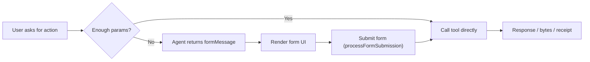

Overview
- Understand why and when the agent asks for a form
- See the shape of the message to render
- Learn how to submit the form back to continue execution

Why forms exist
- Tools often need structured inputs. When details are missing or ambiguous, the agent returns a dynamic form so the user can supply required fields without guesswork.
- The form system wraps tools with validation based on Zod schemas and optional tool-provided “focused schemas”. This is powered by FormValidatingToolWrapper and the FormEngine.

When a form is generated
- The agent evaluates each tool call. If required fields are missing or the tool explicitly requests a form, `requiresForm: true` is returned with a `formMessage` describing the UI.
- Bypass flags: If the tool is invoked with `renderForm: false` or a submission includes `__fromForm: true`, the form step is skipped and the tool executes directly.

FormMessage shape
```ts
interface FormMessage {
  type: 'form';
  id: string;                     // Persist this for submission
  toolName: string;               // The tool the form belongs to
  originalPrompt: string;         // Useful for context
  formConfig: {
    title: string;
    description?: string;
    fields: Array<{              // Light-weight field model for custom UIs
      name: string;
      label: string;
      type: 'text'|'number'|'select'|'checkbox'|'textarea'|'file'|'array'|'object'|'currency'|'percentage';
      required: boolean;
      placeholder?: string;
      helpText?: string;
      options?: Array<{ value: string; label: string; description?: string }>;
    }>;
    submitLabel?: string;
    cancelLabel?: string;
    metadata?: Record<string, unknown>; // May include tool-specific render hints
  };
  // For schema-driven UIs (e.g., react-jsonschema-form)
  jsonSchema?: Record<string, unknown>;
  uiSchema?: Record<string, unknown>;
  partialInput?: unknown;         // What the tool already inferred
  validationErrors?: Array<{ path: string[]; message: string; code: string }>;
}
```

End-to-end flow (UI pseudocode)
1) User asks to perform an operation (e.g., “Create a Hashinal NFT from this URL”).
2) Agent returns `requiresForm: true` with `formMessage` if metadata is missing.
3) Your UI renders either `formConfig.fields` or a JSON‑Schema form (`jsonSchema`/`uiSchema`).
4) Submit with `agent.processFormSubmission({ formId, toolName, parameters, timestamp })`.

Concrete example using InscribeHashinalTool
```ts
import { ConversationalAgent } from '@hashgraphonline/conversational-agent';

const agent = new ConversationalAgent({
  accountId: process.env.HEDERA_ACCOUNT_ID!,
  privateKey: process.env.HEDERA_PRIVATE_KEY!,
  network: 'testnet',
  openAIApiKey: process.env.OPENAI_API_KEY!,
});
await agent.initialize();

// Ask to create a Hashinal from some content URL.
// InscribeHashinalTool will request a form if name/description/creator are missing.
const r1 = await agent.processMessage(
  'Create a Hashinal NFT from https://example.com/art.png and include a HashLink block.'
);

if (r1.requiresForm && r1.formMessage) {
  // Render r1.formMessage in your UI, then collect values
  const submission = {
    formId: r1.formMessage.id,
    toolName: r1.formMessage.toolName, // e.g., 'inscribeHashinal'
    parameters: {
      name: 'Sunset #42',
      description: 'Golden-hour skyline, edition of 1',
      creator: '0.0.123456',
      attributes: [
        { trait_type: 'Palette', value: 'Warm' },
        { trait_type: 'Rarity', value: 'Epic' },
      ],
      // Optional: force execution without another form pass
      renderForm: false,
      // Optional: ask the tool to emit HashLink block metadata
      withHashLinkBlocks: true,
    },
    timestamp: Date.now(),
  };

  const r2 = await agent.processFormSubmission(submission);
  console.log('Output:', r2.output);
  // If the tool returned hashlink metadata you’ll find it under r2.metadata.hashLinkBlock
}
```

Developer notes
- Focused schemas: Tools can expose a narrower “focused” schema for forms via `getFormSchema()`. The wrapper prefers this when present, ensuring only essential fields are requested.
- Essential fields: Some tools implement `getEssentialFields()` and `isFieldEmpty()` so the generated form focuses on the right inputs.
- Preprocessing: The agent attaches a ParameterService that normalizes values (e.g., converts topic IDs to HRLs) before execution.

Advanced: detect pending forms
```ts
// Access lower-level agent for utilities like pending forms
const core = agent.getConversationalAgent();
if (core.hasPendingForms()) {
  console.log(core.getPendingFormsInfo()); // [{ formId, toolName }, ...]
}
```

Tips
- Persist `formMessage.id` and echo it back in `formId`.
- Prefer rendering `jsonSchema/uiSchema` where convenient; fall back to `formConfig.fields` for custom UIs.
- Pre‑fill from Smart Memory (recent entities, prior values) to reduce user effort.

Up next: [Entity Memory](../entity-memory) — how the agent remembers IDs and context

Diagram

