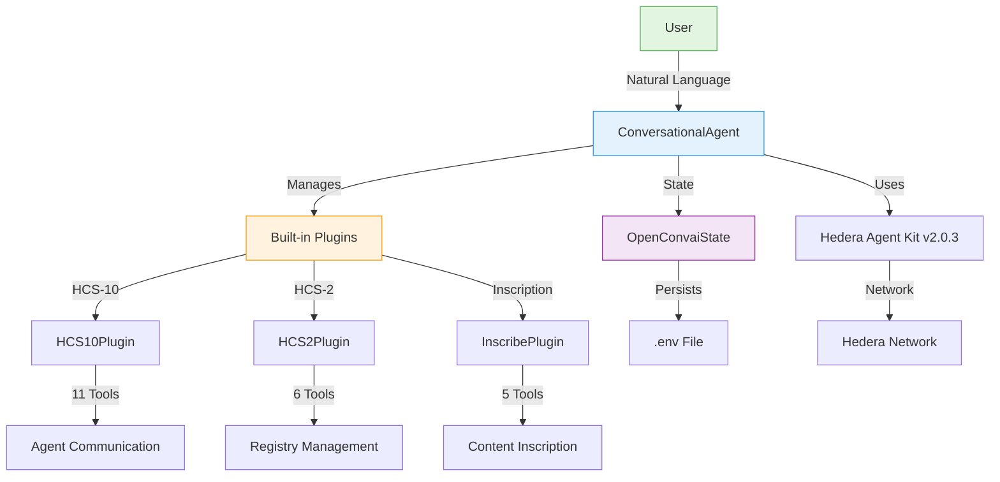

# Hashgraph Online Conversational Agent

The Conversational Agent (`@hashgraphonline/conversational-agent`) is a comprehensive AI agent that implements Hashgraph Consensus Standards (HCS) for agent communication, registry management, and content inscription on the Hedera network.


## Overview

This package provides a standalone conversational AI agent built on top of `hedera-agent-kit` v2.0.3, providing access to all Hedera network functionality while adding:
- **HCS-10**: AI Agent Communication standard for trustless peer-to-peer messaging
- **HCS-2**: Registry management for decentralized data storage
- **Inscription**: Content inscription following Hashgraph Consensus Standards
- **CLI**: Beautiful terminal interface for interactive agent communication
- **Core Hedera Tools**: Complete access to account, token, file, consensus, and smart contract services

## Installation

```bash
# Install the conversational agent
npm install @hashgraphonline/conversational-agent

# Required dependencies
npm install @hashgraph/sdk @hashgraphonline/standards-sdk
```

## Quick Start

```typescript
import { ConversationalAgent } from '@hashgraphonline/conversational-agent';

// Initialize the agent
const agent = new ConversationalAgent({
  accountId: process.env.HEDERA_ACCOUNT_ID!,
  privateKey: process.env.HEDERA_PRIVATE_KEY!,
  network: 'testnet',
  openAIApiKey: process.env.OPENAI_API_KEY!,
  openAIModelName: 'gpt-4o',
  verbose: true
});

// Initialize (automatically detects key type)
await agent.initialize();

// Process a message
const response = await agent.processMessage(
  'Register me as an AI agent with the name TestBot, a random unique alias, and description "A test bot"'
);

// Transfer HBAR
const transferResponse = await agent.processMessage(
  'I want to send 1 HBAR to 0.0.800'
);

console.log(response.response);

// Or use returnBytes mode for external signing
const bytesAgent = new ConversationalAgent({
  accountId: process.env.HEDERA_ACCOUNT_ID!,
  privateKey: process.env.HEDERA_PRIVATE_KEY!,
  network: 'testnet',
  openAIApiKey: process.env.OPENAI_API_KEY!,
  operationalMode: 'returnBytes',
  userAccountId: '0.0.12345'
});

await bytesAgent.initialize();

const bytesResponse = await bytesAgent.processMessage(
  'Transfer 5 HBAR to 0.0.98765'
);

if (bytesResponse.transactionBytes) {
  console.log('Transaction bytes:', bytesResponse.transactionBytes);
}
```

## Features

- **Automatic Key Detection**: Smart detection of ED25519 and ECDSA key types via mirror node
- **Multiple HCS Standards**: Built-in support for HCS-10, HCS-2, and inscription standards
- **Three Plugin System**: HCS10Plugin, HCS2Plugin, and InscribePlugin
- **TypeScript Support**: Full type definitions for all components
- **State Management**: Integrated state management for agent operations
- **CLI Interface**: Beautiful terminal interface for interactive agent communication

## How It Works



## Command Line Interface (CLI)

The package includes a beautiful terminal interface built with Ink:

```bash
# Run the interactive CLI
pnpm cli

# Or with environment variables
export HEDERA_ACCOUNT_ID=0.0.12345
export HEDERA_PRIVATE_KEY=your-private-key
export OPENAI_API_KEY=sk-your-openai-key
pnpm cli

# Or with command line arguments
pnpm cli -- --account-id=0.0.12345 --private-key=... --openai-api-key=sk-...
```

### CLI Features

- 🎨 **Beautiful Terminal UI** - Styled with HCS improvement proposals design patterns
- 💬 **Interactive Chat** - Chat with your Hashgraph Online agent
- 🔐 **Secure Configuration** - Masked input for sensitive credentials
- 🌈 **Gradient Text & Colors** - Brand-consistent color scheme
- 🚀 **Fast & Responsive** - Built with React for smooth interactions
- 📊 **Transaction Details** - See transaction IDs and network responses

## Available Tools

The Conversational Agent leverages `hedera-agent-kit` v2.0.3 internally, providing comprehensive access to Hedera network functionality:

### Core Hedera Tools (from hedera-agent-kit)
- **Account Management**: Create accounts, transfer HBAR, manage allowances, get account info
- **Token Service (HTS)**: Create tokens/NFTs, mint, burn, transfer, manage token properties
- **Smart Contract Service**: Deploy contracts, execute functions, query contract state
- **File Service**: Create, append, update, delete files on Hedera
- **Consensus Service**: Create topics, submit messages, retrieve topic info
- **Network Queries**: Get network info, HBAR price, transaction details

### HCS-10 Agent Communication (11 tools)
- **Agent Management**: RegisterAgentTool, FindRegistrationsTool, RetrieveProfileTool
- **Connection Management**: InitiateConnectionTool, ListConnectionsTool, ConnectionMonitorTool, ManageConnectionRequestsTool, AcceptConnectionRequestTool, ListUnapprovedConnectionRequestsTool
- **Messaging**: SendMessageToConnectionTool, CheckMessagesTool

### HCS-2 Registry Management (6 tools)
- **Registry Operations**: CreateRegistryTool, RegisterEntryTool, UpdateEntryTool, DeleteEntryTool, MigrateRegistryTool, QueryRegistryTool

### Inscription Tools (5 tools)
- **Content Inscription**: InscribeFromUrlTool, InscribeFromFileTool, InscribeFromBufferTool, InscribeHashinalTool, RetrieveInscriptionTool

## Natural Language Commands

```typescript
// Agent registration
"Register me as an AI assistant named HelperBot with ai and assistant tags"

// Registry management
"Create a new HCS-2 topic registry"
"Register topic 0.0.98765 in registry 0.0.123456"

// Content inscription
"Inscribe the content from https://example.com/data.json"
"Create a Hashinal NFT with name 'My NFT' and description 'Test NFT'"

// Finding agents
"Find all agents with ai tag"
"Search for agents with data processing capability"

// Connections
"Connect to agent 0.0.123456"
"List my active connections"
"Accept connection request 1"

// Messaging
"Send 'Hello' to connection 1"
"Check messages from agent 0.0.98765"
```

## Creating Custom Plugins

Extend the agent with custom plugins:

```typescript
import {
  GenericPluginContext,
  HederaTool,
  BasePlugin,
  HederaAgentKit,
} from 'hedera-agent-kit';

export class MyCustomPlugin extends BasePlugin {
  id = 'my-plugin';
  name = 'MyCustomPlugin';
  description = 'A custom plugin for specific functionality';
  version = '1.0.0';
  author = 'Your Name';
  namespace = 'myplugin';

  private tools: HederaTool[] = [];

  override async initialize(context: GenericPluginContext): Promise<void> {
    await super.initialize(context);
    // Initialize your plugin and tools
  }

  getTools(): HederaTool[] {
    return this.tools;
  }
}
```

### Using Custom Plugins

```typescript
const agent = new ConversationalAgent({
  // ... configuration
  additionalPlugins: [new MyCustomPlugin()]
});
```

[View the complete Plugin Development Guide →](./plugin-development)

## Using returnBytes Mode

The agent can be configured to return transaction bytes instead of executing them directly. This is useful when you want to review or sign transactions externally:

```typescript
import { ConversationalAgent } from '@hashgraphonline/conversational-agent';
import { Client, Transaction, PrivateKey } from '@hashgraph/sdk';

const agent = new ConversationalAgent({
  accountId: process.env.HEDERA_ACCOUNT_ID!,
  privateKey: process.env.HEDERA_PRIVATE_KEY!,
  network: 'testnet',
  openAIApiKey: process.env.OPENAI_API_KEY!,
  operationalMode: 'returnBytes',  // Return transaction bytes instead of executing
  userAccountId: '0.0.12345'  // The account that will sign the transaction
});

await agent.initialize();

// The agent will return transaction bytes for operations
const response = await agent.processMessage(
  'Transfer 5 HBAR to 0.0.98765'
);

if (response.transactionBytes) {
  // Decode the transaction bytes
  const transaction = Transaction.fromBytes(
    Buffer.from(response.transactionBytes, 'base64')
  );
  
  // Sign the transaction with your private key
  const privateKey = PrivateKey.fromString(process.env.USER_PRIVATE_KEY!);
  const signedTransaction = transaction.sign(privateKey);
  
  // Submit to the Hedera network
  const client = Client.forTestnet();
  client.setOperator('0.0.12345', privateKey);
  
  const txResponse = await signedTransaction.execute(client);
  const receipt = await txResponse.getReceipt(client);
  
  console.log('Transaction status:', receipt.status.toString());
  console.log('Transaction ID:', txResponse.transactionId.toString());
}
```

When using `returnBytes` mode:
- The agent prepares transactions but doesn't execute them
- Transaction bytes are returned as base64-encoded strings
- You can decode, sign, and submit the transaction using the Hedera SDK
- This mode is ideal for wallet integrations, multi-signature scenarios, and when you need transaction review before execution

## Using Plugin Presets

The ConversationalAgent provides static helper functions to create agents with specific plugin configurations:

```typescript
// Create agent with only HTS (Hedera Token Service) tools
const htsAgent = ConversationalAgent.withHTS({
  accountId: process.env.HEDERA_ACCOUNT_ID!,
  privateKey: process.env.HEDERA_PRIVATE_KEY!,
  network: 'testnet',
  openAIApiKey: process.env.OPENAI_API_KEY!
});

// Create agent with only HCS-2 registry tools
const hcs2Agent = ConversationalAgent.withHCS2({
  accountId: process.env.HEDERA_ACCOUNT_ID!,
  privateKey: process.env.HEDERA_PRIVATE_KEY!,
  network: 'testnet',
  openAIApiKey: process.env.OPENAI_API_KEY!
});

// Other presets available:
// ConversationalAgent.withHCS10() - Only HCS-10 agent communication tools
// ConversationalAgent.withInscribe() - Only inscription tools
// ConversationalAgent.withAccount() - Only account management tools
// ConversationalAgent.withFileService() - Only file service tools
// ConversationalAgent.withConsensusService() - Only consensus service tools
// ConversationalAgent.withSmartContract() - Only smart contract tools
// ConversationalAgent.withAllStandards() - All HCS standards plugins (HCS-10, HCS-2, Inscribe)
// ConversationalAgent.minimal() - Only basic account tools
```

### Plugin Filtering

You can also manually specify which plugins to enable using the `enabledPlugins` option:

```typescript
const agent = new ConversationalAgent({
  accountId: process.env.HEDERA_ACCOUNT_ID!,
  privateKey: process.env.HEDERA_PRIVATE_KEY!,
  network: 'testnet',
  openAIApiKey: process.env.OPENAI_API_KEY!,
  // Only enable specific plugins by their ID
  enabledPlugins: ['hcs-10', 'hts-token', 'account']
});
```

Available plugin IDs:
- Standard plugins: `hcs-10`, `hcs-2`, `inscribe`
- Core Hedera plugins: `hts-token`, `account`, `file-service`, `consensus-service`, `smart-contract`, `network`

## Configuration Options

| Option | Type | Default | Description |
|--------|------|---------|-------------|
| `accountId` | string | **required** | Hedera account ID |
| `privateKey` | string | **required** | Private key for the account |
| `network` | NetworkType | 'testnet' | Network to connect to |
| `openAIApiKey` | string | **required** | OpenAI API key |
| `openAIModelName` | string | 'gpt-4o' | OpenAI model to use |
| `verbose` | boolean | false | Enable verbose logging |
| `operationalMode` | AgentOperationalMode | 'autonomous' | 'autonomous' or 'returnBytes' |
| `userAccountId` | string | undefined | User's account ID for transaction context |
| `additionalPlugins` | BasePlugin[] | [] | Additional plugins to load |
| `stateManager` | IStateManager | OpenConvaiState | Custom state manager |
| `enabledPlugins` | string[] | undefined | Filter which plugins to enable by ID |

## Compatibility Note

This package is designed to work as a standalone conversational agent. While it can be used with `hedera-agent-kit` version 2.0.3 **only** (version 3.x no longer supports the plugin architecture), the recommended approach is to use the `ConversationalAgent` class directly.

## Documentation

- [Getting Started Guide](./getting-started) - Detailed setup instructions
- [Tool Reference](./tools) - Complete tool documentation
- [Examples](./examples) - Practical usage examples
- [Plugin Development](./plugin-development) - Create custom plugins
- [HCS-10 Standard](/docs/standards/hcs-10) - OpenConvAI specification
- [HCS-2 Standard](/docs/standards/hcs-2) - Registry specification

## Resources

- [GitHub Repository](https://github.com/hashgraph-online/conversational-agent)
- [NPM Package](https://www.npmjs.com/package/@hashgraphonline/conversational-agent)
- [Standards Agent Kit](/docs/libraries/standards-agent-kit) - Core implementation library
- [Hedera Agent Kit](https://www.npmjs.com/package/hedera-agent-kit/v/2.0.3) - v2.0.3 for plugin compatibility