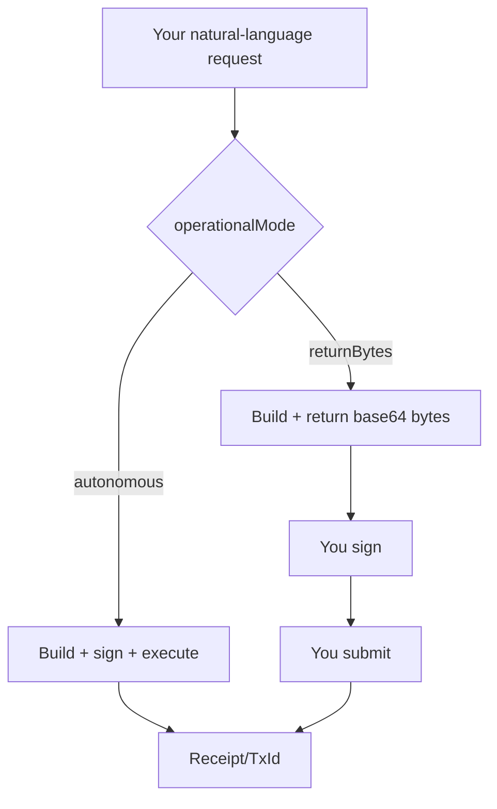

Overview
- The agent runs in two modes:
  - `autonomous` (default): executes transactions directly with the configured signer.
  - `returnBytes`: prepares transactions and returns `transactionBytes` so your app can sign/submit.

Overview
- Pick the right mode for your app
- See how to read responses in each mode
- Learn when tools may still execute directly in bytes mode

Diagram


Configuration
```typescript
import { ConversationalAgent } from '@hashgraphonline/conversational-agent';

const agent = new ConversationalAgent({
  accountId: process.env.HEDERA_ACCOUNT_ID!,
  privateKey: process.env.HEDERA_PRIVATE_KEY!,
  openAIApiKey: process.env.OPENAI_API_KEY!,
  operationalMode: 'returnBytes',
  // Optional: also schedule automatically while in bytes mode
  scheduleUserTransactionsInBytesMode: true,
});
await agent.initialize();
```

Inspecting Responses
```typescript
const r = await agent.processMessage('Create an HCS topic for release announcements');

if (r.transactionBytes) {
  // returnBytes mode: sign & submit manually using Hedera SDK
  // const tx = Transaction.fromBytes(Buffer.from(r.transactionBytes, 'base64'))
  // tx.sign(yourKey); await tx.execute(client);
}

if (r.transactionId || r.receipt) {
  // autonomous mode or scheduled result
}
```

Best Practices
- Use `returnBytes` where you must control user signatures or custodial policy.
- Use `autonomous` for faster prototyping and internal automation.
- Provide `userAccountId` when the operation context depends on a specific user.

Notes
- In `returnBytes` mode, many write tools support bytes; others may execute directly (see tool docs). The agent’s system prompt already instructs tools accordingly.
- `scheduleUserTransactionsInBytesMode: true` makes the agent schedule user actions when bytes are requested and a `userAccountId` is set; the returned payload includes a ScheduleId.

Up next: [Factory Helpers & Plugins](../factory-helpers-and-plugins) — choose exactly which abilities your agent has
