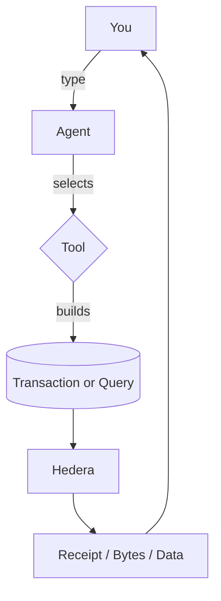
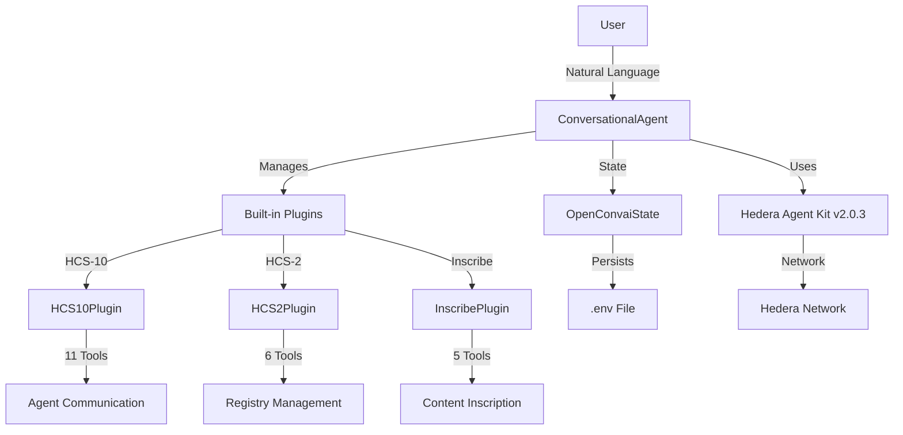

# Hashgraph Online Conversational Agent

The Conversational Agent (`@hashgraphonline/conversational-agent`) is a comprehensive AI agent that implements Hashgraph Consensus Standards (HCS) for agent communication, registry management, and content inscription on the Hedera Hashgraph.


## How to Use These Docs

- Step 1: Getting Started — install, set env vars, say hello to your agent.
- Step 2: Available Tools — see what the agent can actually do.
- Step 3: Forms & Parameters — when the agent asks for missing details.
- Step 4: Entity Memory — how it remembers topics/tokens so you can say “that one”.
- Step 5: Content References & HashLinks — send big files as lightweight references.
- Step 6: Operational Modes — decide who signs and how bytes flow.
- Step 7: Factory Helpers & Plugins — narrow or expand capability.
- Step 8: MCP Servers — add filesystem, GitHub, or databases.
- Step 9: Examples — end‑to‑end scripts to copy/paste.
- Step 10: Plugin Development — build your own tools.

[Start with Getting Started →](../getting-started)

## What It Provides

This package provides a standalone conversational AI agent built on top of `hedera-agent-kit` v2.0.3, providing access to all Hedera Hashgraph functionality while adding:

- HCS‑10: AI Agent Communication standard for trustless peer‑to‑peer messaging
- HCS‑2: Registry management for decentralized data storage
- Inscription: Content inscription following Hashgraph Consensus Standards
- CLI: Terminal interface for interactive agent communication
- Core Hedera Tools: Account, token, file, consensus, and smart contract services

## Diagram



## Installation

```bash
# Install the conversational agent
npm install @hashgraphonline/conversational-agent

# Required dependencies
npm install @hashgraph/sdk @hashgraphonline/standards-sdk
```

## Choosing Models & Providers

Configure the provider and model with `llmProvider` and `openAIModelName`.

Supported `llmProvider` values:
- `openai`: `gpt-4o`, `gpt-4o-mini`, etc.
- `anthropic`: `claude-3-7-sonnet-latest`, etc.
- `openrouter`: Prefer vendor‑prefixed models like `openai/gpt-4o-mini`.

Defaults:
- `llmProvider`: `openai`
- `openAIModelName`: `gpt-4o`
- `network`: `testnet`

### OpenAI example

```ts
const agent = new ConversationalAgent({
  accountId: process.env.HEDERA_ACCOUNT_ID!,
  privateKey: process.env.HEDERA_PRIVATE_KEY!,
  network: 'testnet',
  llmProvider: 'openai',
  openAIApiKey: process.env.OPENAI_API_KEY!,
  openAIModelName: process.env.OPENAI_MODEL || 'gpt-4o-mini',
});
await agent.initialize();
```

### Anthropic example

```ts
const agent = new ConversationalAgent({
  accountId: process.env.HEDERA_ACCOUNT_ID!,
  privateKey: process.env.HEDERA_PRIVATE_KEY!,
  network: 'testnet',
  llmProvider: 'anthropic',
  openAIApiKey: process.env.ANTHROPIC_API_KEY!,
  openAIModelName: process.env.ANTHROPIC_MODEL || 'claude-3-7-sonnet-latest',
});
await agent.initialize();
```

### OpenRouter example

```ts
const agent = new ConversationalAgent({
  accountId: process.env.HEDERA_ACCOUNT_ID!,
  privateKey: process.env.HEDERA_PRIVATE_KEY!,
  network: 'testnet',
  llmProvider: 'openrouter',
  // You can provide the key via either `openRouterApiKey` or `openAIApiKey`
  openAIApiKey: process.env.OPENROUTER_API_KEY!,
  openRouterApiKey: process.env.OPENROUTER_API_KEY!,
  openRouterBaseURL: process.env.OPENROUTER_BASE_URL || 'https://openrouter.ai/api/v1',
  openAIModelName: process.env.OPENROUTER_MODEL || 'openai/gpt-4o-mini',
});
await agent.initialize();
```

Tips for OpenRouter routing:
- When using `openrouter/auto`, some endpoints require candidate models. If you see “No models provided”, set `OPENROUTER_MODEL` or pass candidates.
- Ensure you send a valid Referer/Title; this package sets sensible defaults.

## Quick Start

```ts
import { ConversationalAgent } from '@hashgraphonline/conversational-agent';

const agent = new ConversationalAgent({
  accountId: process.env.HEDERA_ACCOUNT_ID!,
  privateKey: process.env.HEDERA_PRIVATE_KEY!,
  network: 'testnet',
  openAIApiKey: process.env.OPENAI_API_KEY!,
  openAIModelName: 'gpt-4o',
  verbose: true,
});

await agent.initialize();

const response = await agent.processMessage(
  'Register me as an AI agent named TestBot with a random unique alias'
);
console.log(response.response);
```

## Features

- Automatic Key Handling (via hedera-agent-kit)
- HCS‑10, HCS‑2, Inscription support
- TypeScript types + integrated state management
- CLI interface and MCP server integration (filesystem/GitHub/db)

## How It Works



## CLI (Ink)

```bash
pnpm cli
export HEDERA_ACCOUNT_ID=0.0.12345
export HEDERA_PRIVATE_KEY=...
export OPENAI_API_KEY=sk-...
pnpm cli
```

### CLI Features

- Beautiful terminal UI
- Interactive chat
- Masked input for secrets
- Real‑time transaction details
