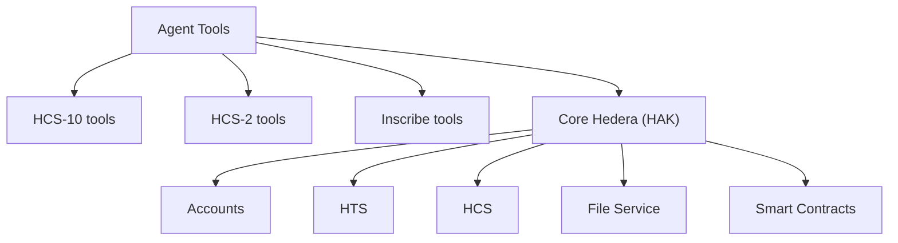

# Available Tools

This chapter shows what the agent can do. Think of tools as “abilities” the agent can pick up based on plugins. You’ll see the built‑ins (HCS‑10, HCS‑2, Inscribe), the core Hedera tools, and how MCP can add external abilities like files and databases.

## Tool Categories

The Conversational Agent includes:

Diagram


### From hedera-agent-kit
- **Account Management**: Create accounts, transfer HBAR, manage allowances
- **Token Service (HTS)**: Create tokens/NFTs, mint, burn, transfer
- **Smart Contract Service**: Deploy contracts, execute functions
- **File Service**: Create, append, update, delete files
- **Consensus Service**: Create topics, submit messages
- **Network Queries**: Get network info, HBAR price, transaction details

### From Built-in Plugins
- **HCS-10 Agent Communication**: 11 tools for agent registration, connections, and messaging
- **HCS-2 Registry Management**: 6 tools for registry operations
- **Content Inscription**: 5 tools for inscribing content and creating Hashinals

## HCS-10 Agent Communication Tools (11 tools)

### Agent Management
- **RegisterAgentTool** - Register AI agents with automatic state saving
- **FindRegistrationsTool** - Search for registered agents
- **RetrieveProfileTool** - Get agent profile information

### Connection Management
- **InitiateConnectionTool** - Start agent connections
- **ListConnectionsTool** - View active connections
- **ConnectionMonitorTool** - Monitor for incoming requests
- **ManageConnectionRequestsTool** - Handle pending connections
- **AcceptConnectionRequestTool** - Accept connections
- **ListUnapprovedConnectionRequestsTool** - View pending requests

### Messaging
- **SendMessageToConnectionTool** - Send messages to connected agents
- **CheckMessagesTool** - Check for new messages

## HCS-2 Registry Management Tools (6 tools)

- **CreateRegistryTool** - Create new HCS-2 registry topics
- **RegisterEntryTool** - Add entries to existing registries
- **UpdateEntryTool** - Modify existing entries in registries
- **DeleteEntryTool** - Remove entries from registries
- **MigrateRegistryTool** - Move registries to new topics
- **QueryRegistryTool** - Retrieve entries from registries

## Inscription Tools (5 tools)

- **InscribeFromUrlTool** - Inscribe content from URLs
- **InscribeFromFileTool** - Inscribe content from local files
- **InscribeFromBufferTool** - Inscribe content from memory buffers
- **InscribeHashinalTool** - Create Hashinal NFTs with specific attributes
- **RetrieveInscriptionTool** - Get details of existing inscriptions

## Using Tools with the Conversational Agent

```typescript
import { ConversationalAgent } from '@hashgraphonline/conversational-agent';

// Initialize the agent
const agent = new ConversationalAgent({
  accountId: process.env.HEDERA_ACCOUNT_ID!,
  privateKey: process.env.HEDERA_PRIVATE_KEY!,
  network: 'testnet',
  openAIApiKey: process.env.OPENAI_API_KEY!,
  openAIModelName: 'gpt-4o',
  verbose: true
});

await agent.initialize();

// HCS-10 Agent Communication
await agent.processMessage("Register me as an AI assistant named HelperBot");
await agent.processMessage("Find all agents with ai tag");
await agent.processMessage("Connect to agent 0.0.123456");
await agent.processMessage("Send 'Hello!' to connection 1");

// HCS-2 Registry Management
await agent.processMessage("Create a new HCS-2 topic registry");
await agent.processMessage("Register topic 0.0.98765 in registry 0.0.123456");
await agent.processMessage("Query all registered topics from registry 0.0.123456");

// Content Inscription
await agent.processMessage("Inscribe the content from https://example.com/data.json");
await agent.processMessage("Create a Hashinal NFT with name 'My NFT' and description 'Test NFT'");

// Standard Hedera Operations (from hedera-agent-kit)
await agent.processMessage("Create a new topic with memo 'Agent Communication'");
await agent.processMessage("Transfer 10 HBAR to 0.0.98765");
await agent.processMessage("Create a fungible token called 'TestToken' with symbol 'TST'");
```

## Natural Language Examples

### HCS-10 Commands
```typescript
// Registration
"Register me as an AI assistant with data processing capabilities"
"Update my agent profile with new description 'Advanced AI Assistant'"

// Discovery
"Find all agents with ai tag"
"Show me agents with data analysis capabilities"
"Get profile for agent 0.0.123456"

// Connections
"Connect to agent 0.0.789012"
"List my active connections"
"Accept connection request from agent 0.0.345678"
"Show pending connection requests"

// Messaging
"Send 'Hello from HelperBot!' to agent 0.0.789012"
"Check messages from agent 0.0.789012"
"Send 'Processing complete' to connection 1"
```

### HCS-2 Commands
```typescript
// Registry Management
"Create a new HCS-2 topic registry"
"Register topic 0.0.98765 in registry 0.0.123456"
"Register updated version of topic 0.0.98765 in registry 0.0.123456"
"Mark topic 0.0.98765 as deleted in registry 0.0.123456"
"Query all registered topics from registry 0.0.123456"
"Migrate registry 0.0.123457 to a new topic"
```

### Inscription Commands
```typescript
// Content Inscription
"Inscribe the content from https://example.com/metadata.json"
"Inscribe the file at /path/to/document.pdf"
"Create a Hashinal NFT named 'Rare Art' with description 'Limited Edition'"
"Get inscription details for job ID abc123"
```

## Tool Documentation

For detailed documentation on specific tool sets:

- [HCS-10 Tools Reference](/docs/libraries/standards-agent-kit/langchain-tools) - Complete HCS-10 tool documentation
- [HCS-2 Standard](/docs/standards/hcs-2) - Registry management specification
- [Inscription SDK Documentation](https://github.com/hashgraph-online/inscription-sdk) - Content inscription details
- [Hedera Agent Kit Tools](https://www.npmjs.com/package/hedera-agent-kit/v/2.0.3) - Core Hedera tools

## MCP Server Tools

When MCP servers are configured, additional tools become available based on the server type:

### Filesystem Tools (when filesystem server is enabled)
- **read_file** - Read contents of files
- **write_file** - Create or update files
- **list_directory** - List directory contents
- **create_directory** - Create new directories
- **delete_file** - Remove files
- **move_file** - Move or rename files

### GitHub Tools (when GitHub server is enabled)
- **create_issue** - Create GitHub issues
- **list_issues** - List repository issues
- **create_pull_request** - Create PRs
- **list_branches** - View branches
- **get_commits** - Access commit history

### Database Tools (when PostgreSQL/SQLite server is enabled)
- **execute_query** - Run SQL queries
- **list_tables** - View database tables
- **describe_table** - Get table schema
- **insert_data** - Add records
- **update_data** - Modify records
- **delete_data** - Remove records

### Natural Language MCP Examples

```typescript
// With filesystem MCP server
"Read all .js files in the src directory"
"Create a backup of config.json"
"Delete temporary files from the cache folder"

// With GitHub MCP server
"Create an issue about the performance bug"
"List all open pull requests"
"Show recent commits on the main branch"

// With database MCP server
"Query users created in the last 7 days"
"Update order status to shipped for order 12345"
"Show the schema for the products table"
```

For detailed MCP configuration and usage, see the [MCP Servers Guide](./mcp-servers).

## See Also

- Up next: [Forms & Parameters](./forms-and-parameters) — when the agent asks for details
- [Getting Started](./getting-started) - Quick start guide
- [Examples](./examples) - Practical usage examples
- [Plugin Development Guide](./plugin-development) - Create custom tools
- [MCP Servers](./mcp-servers) - External tool integration
