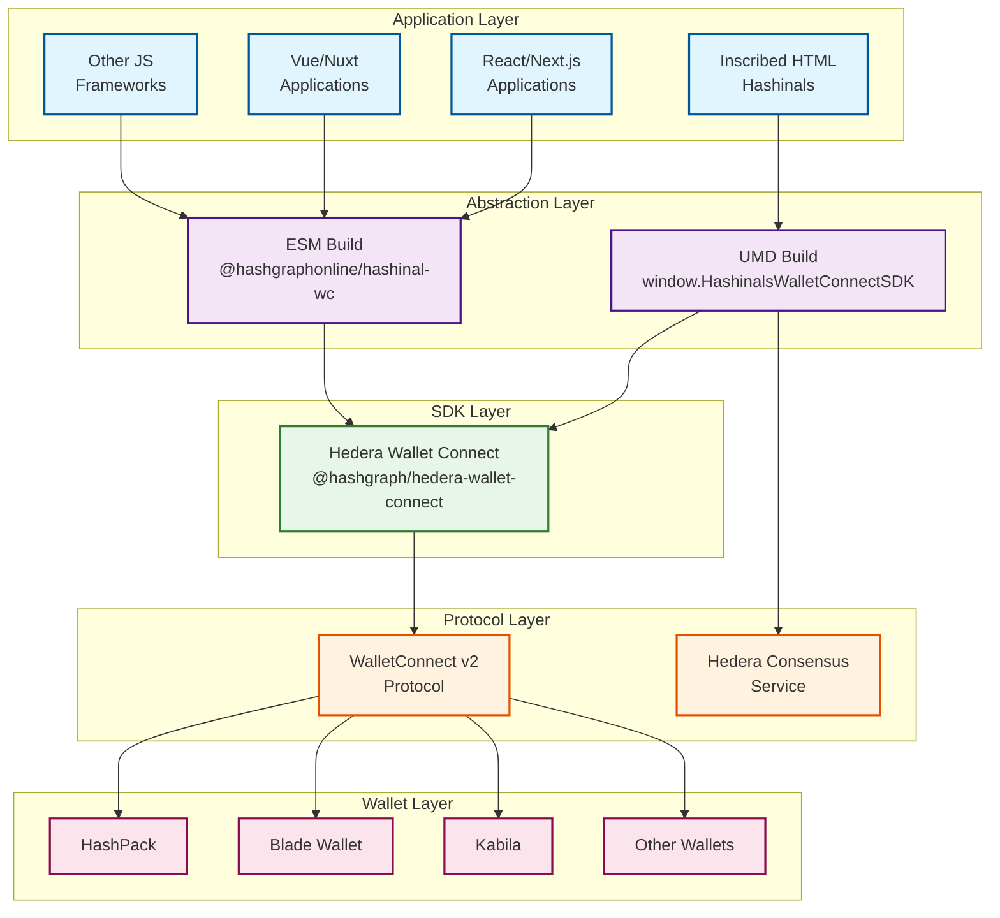

# Hashinal Wallet Connect SDK

## Overview

Hashinal Wallet Connect SDK is a powerful abstraction layer for Hedera Wallet Connect that simplifies wallet integration for Hedera applications. Whether you're building inscribed HTML Hashinals using HCS-3 or modern JavaScript applications, this SDK provides a unified interface for all Hedera operations.

### Key Benefits

- 🚀 **Simple Integration**: One SDK for both inscribed HTML files (UMD) and modern frameworks (ESM)
- 🔐 **Secure Wallet Connection**: Built on WalletConnect v2 protocol for secure communication
- 📦 **Comprehensive Features**: Full suite of Hedera operations from transfers to smart contracts
- 🎯 **Developer Friendly**: Consistent API with clear examples for every method
- 🔄 **Auto-versioning**: Inscribed versions automatically updated via HCS topics

## Architecture

The SDK architecture provides two deployment models to suit different application needs:



## Quick Start

### Wallet Operations

| Feature | Description | Use Case |
|---------|-------------|----------|
| **Connect/Disconnect** | Establish and manage wallet connections | User authentication |
| **Account Info** | Retrieve account details and balances | Display user data |
| **HBAR Transfers** | Send HBAR between accounts | Payments, tips |
| **Token Operations** | Transfer, associate, dissociate tokens | DeFi, gaming |

### Topic & Messaging

| Feature | Description | Use Case |
|---------|-------------|----------|
| **Create Topics** | Create new HCS topics with optional keys | Decentralized messaging |
| **Submit Messages** | Write messages to HCS topics | Data storage, communication |
| **Retrieve Messages** | Read messages from topics | Data retrieval, verification |

### NFT & Token Management

| Feature | Description | Use Case |
|---------|-------------|----------|
| **Create Tokens** | Deploy new fungible or non-fungible tokens | Token launches |
| **Mint NFTs** | Mint NFTs with metadata | Digital collectibles |
| **NFT Validation** | Verify NFT ownership | Access control, gating |
| **Token Queries** | Get account tokens and NFTs | Portfolio display |

### Smart Contract Integration

| Feature | Description | Use Case |
|---------|-------------|----------|
| **Execute Contracts** | Call smart contract functions | DeFi protocols |
| **Read Contracts** | Query contract state without gas | Data fetching |
| **Contract Parameters** | Build complex function parameters | Advanced interactions |

### For Inscribed HTML (Hashinals)

```html
<!-- Include the SDK via HCS -->
<script data-src="hcs://1/0.0.8084872" data-script-id="wallet-connect"></script>

<script>
// Initialize and connect
async function connectWallet() {
  const projectId = 'YOUR_PROJECT_ID';
  const metadata = {
    name: 'My Hashinal',
    description: 'Inscribed application on Hedera',
    url: window.location.href,
    icons: ['https://example.com/icon.png']
  };
  
  await window.HashinalsWalletConnectSDK.init(projectId, metadata);
  const session = await window.HashinalsWalletConnectSDK.connect();
  console.log('Connected:', session);
}
</script>
```

### For Modern JavaScript Applications

```typescript
import { HashinalsWalletConnectSDK } from '@hashgraphonline/hashinal-wc';
import { LedgerId } from '@hashgraph/sdk';

const sdk = HashinalsWalletConnectSDK.getInstance();

// Initialize with network selection
await sdk.init(
  'YOUR_PROJECT_ID',
  {
    name: 'My dApp',
    description: 'Modern Hedera application',
    url: 'https://myapp.com',
    icons: ['https://myapp.com/icon.png']
  },
  LedgerId.MAINNET
);

// Connect wallet
const session = await sdk.connect();
```

## Core Features

### Wallet Operations

| Feature | Description | Use Case |
|---------|-------------|----------|
| **Connect/Disconnect** | Establish and manage wallet connections | User authentication |
| **Account Info** | Retrieve account details and balances | Display user data |
| **HBAR Transfers** | Send HBAR between accounts | Payments, tips |
| **Token Operations** | Transfer, associate, dissociate tokens | DeFi, gaming |

### Topic & Messaging

| Feature | Description | Use Case |
|---------|-------------|----------|
| **Create Topics** | Create new HCS topics with optional keys | Decentralized messaging |
| **Submit Messages** | Write messages to HCS topics | Data storage, communication |
| **Retrieve Messages** | Read messages from topics | Data retrieval, verification |

### NFT & Token Management

| Feature | Description | Use Case |
|---------|-------------|----------|
| **Create Tokens** | Deploy new fungible or non-fungible tokens | Token launches |
| **Mint NFTs** | Mint NFTs with metadata | Digital collectibles |
| **NFT Validation** | Verify NFT ownership | Access control, gating |
| **Token Queries** | Get account tokens and NFTs | Portfolio display |

### Smart Contract Integration

| Feature | Description | Use Case |
|---------|-------------|----------|
| **Execute Contracts** | Call smart contract functions | DeFi protocols |
| **Read Contracts** | Query contract state without gas | Data fetching |
| **Contract Parameters** | Build complex function parameters | Advanced interactions |

## Supported Wallets

The SDK supports all WalletConnect-compatible Hedera wallets:

- **HashPack** - Most popular Hedera wallet
- **Blade Wallet** - Gaming-focused wallet
- **Kabila** - Mobile-first wallet
- **Other WalletConnect v2 compatible wallets**

## Network Support

The SDK supports all Hedera networks:

| Network | LedgerId | Use Case |
|---------|----------|----------|
| **Mainnet** | `LedgerId.MAINNET` | Production applications |
| **Testnet** | `LedgerId.TESTNET` | Development and testing |
| **Previewnet** | `LedgerId.PREVIEWNET` | Preview features |


## Getting Started

Choose your integration path:

<div style={{ display: 'grid', gridTemplateColumns: 'repeat(auto-fit, minmax(250px, 1fr))', gap: '1rem', marginTop: '2rem' }}>
  <a href="./installation" style={{ textDecoration: 'none' }}>
    <div style={{ padding: '1.5rem', border: '1px solid var(--ifm-color-emphasis-300)', borderRadius: '8px', height: '100%' }}>
      <h3>📦 Installation</h3>
      <p>Set up the SDK for your project type</p>
    </div>
  </a>
  
  <a href="./methods" style={{ textDecoration: 'none' }}>
    <div style={{ padding: '1.5rem', border: '1px solid var(--ifm-color-emphasis-300)', borderRadius: '8px', height: '100%' }}>
      <h3>📖 API Reference</h3>
      <p>Complete method documentation</p>
    </div>
  </a>
  
  <a href="./usage-with-recursion" style={{ textDecoration: 'none' }}>
    <div style={{ padding: '1.5rem', border: '1px solid var(--ifm-color-emphasis-300)', borderRadius: '8px', height: '100%' }}>
      <h3>🎨 Hashinals Guide</h3>
      <p>Build inscribed HTML applications</p>
    </div>
  </a>
  
  <a href="./usage-with-react" style={{ textDecoration: 'none' }}>
    <div style={{ padding: '1.5rem', border: '1px solid var(--ifm-color-emphasis-300)', borderRadius: '8px', height: '100%' }}>
      <h3>⚛️ React Integration</h3>
      <p>Use with React and Next.js</p>
    </div>
  </a>
</div>