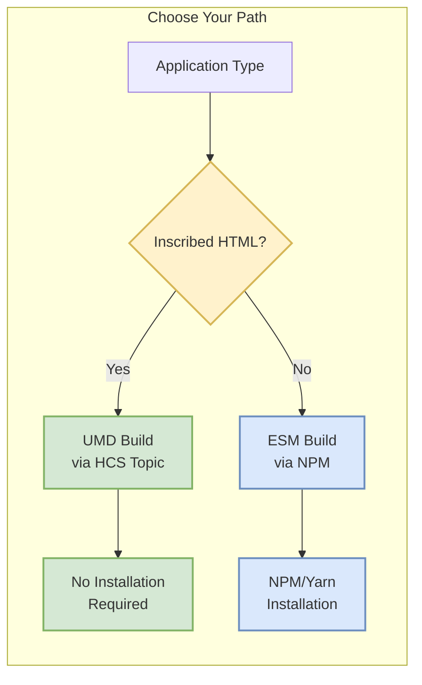

# Installation Guide

This guide will help you set up Hashinal Wallet Connect SDK for your specific use case. Choose the installation method that matches your application type.

## Installation Methods

The SDK provides two distribution formats to support different application architectures:



## Option 1: Inscribed HTML Files (UMD)

### Overview

For inscribed HTML Hashinals, the SDK is loaded directly from Hedera Consensus Service using the HCS-3 recursion standard. This approach requires no traditional installation and ensures your application always uses an immutable, on-chain version of the SDK.

### Setup Steps

#### 1. Create Your Hashinal

First, create your inscribed HTML file following the [HCS-3 Recursion Standard](../recursion-sdk/what-is-recursion.md).

#### 2. Include the SDK

Add the following script tag to your HTML file:

```html
<!DOCTYPE html>
<html>
<head>
    <title>My Hashinal</title>
</head>
<body>
    <!-- Load Hashinal Wallet Connect SDK from HCS -->
    <script data-src="hcs://1/0.0.8084872" data-script-id="wallet-connect"></script>
    
    <!-- Your application code -->
    <script>
        // SDK is available as window.HashinalsWalletConnectSDK
        async function initializeApp() {
            const sdk = window.HashinalsWalletConnectSDK;
            // Your code here
        }
    </script>
</body>
</html>
```

### Version Selection

| Version | Topic ID | Status | Features |
|---------|----------|--------|----------|
| **v1.0.92** | `0.0.8084872` | 🟢 Latest | All features including NFT validation |
| v1.0.89 | `0.0.7812387` | Stable | Core features + smart contracts |
| v1.0.82 | `0.0.7522981` | Legacy | Basic wallet operations |

📍 **Note**: Always check the [Topics](./topics.md) page for the latest version.

### Benefits

- ✅ **No Installation**: Load directly from Hedera
- ✅ **Immutable**: Code cannot be changed once inscribed
- ✅ **Automatic**: No dependency management needed
- ✅ **Decentralized**: Hosted on Hedera, not traditional servers

## Option 2: Modern JavaScript Applications (ESM)

### Prerequisites

Before installing the SDK for modern JavaScript applications, ensure you have:

#### 1. Node.js Environment

| Requirement | Version | Installation |
|-------------|---------|-------------|
| **Node.js** | ≥ 20.0 | [Download](https://nodejs.org/) or use [NVM](https://github.com/nvm-sh/nvm) |
| **NPM** | ≥ 8.0 | Included with Node.js |
| **Yarn** (optional) | ≥ 1.22 | `npm install --global yarn` |

```bash
# Check your versions
node --version  # Should be >= 20.0.0
npm --version   # Should be >= 8.0.0

# Using NVM (recommended)
nvm install 20
nvm use 20
nvm alias default 20
```

#### 2. WalletConnect Project ID

You'll need a WalletConnect Cloud Project ID to enable wallet connections:


**Steps to get your Project ID:**

1. 🌐 Visit [WalletConnect Cloud](https://cloud.walletconnect.com)
2. 🔐 Sign in or create a new account
3. ➕ Click "Create New Project"
4. 🏷️ Name your project (e.g., "My Hedera App")
5. 📋 Copy the Project ID from the dashboard

#### 3. Framework Compatibility

The SDK is compatible with:

| Framework | Version | Guide |
|-----------|---------|-------|
| **React** | ≥ 17.0 | [React Guide](./usage-with-react) |
| **Next.js** | ≥ 12.0 | [Next.js Guide](./usage-with-nextjs) |
| **Vue** | ≥ 3.0 | Coming Soon |
| **Vite** | ≥ 4.0 | [Vite Guide](./usage-with-vite) |
| **Vanilla JS** | ES6+ | See examples below |

### Installation Commands

Choose your package manager and install the SDK with all required dependencies:

#### Using NPM

```bash
# Install all required packages
npm install @hashgraphonline/hashinal-wc \
  @hashgraph/sdk \
  @hashgraph/proto \
  @hashgraph/hedera-wallet-connect \
  @walletconnect/modal \
  @walletconnect/qrcode-modal \
  @walletconnect/utils \
  @walletconnect/modal-core
```

#### Using Yarn

```bash
# Install all required packages
yarn add @hashgraphonline/hashinal-wc \
  @hashgraph/sdk \
  @hashgraph/proto \
  @hashgraph/hedera-wallet-connect \
  @walletconnect/modal \
  @walletconnect/qrcode-modal \
  @walletconnect/utils \
  @walletconnect/modal-core
```

#### Using PNPM

```bash
# Install all required packages
pnpm add @hashgraphonline/hashinal-wc \
  @hashgraph/sdk \
  @hashgraph/proto \
  @hashgraph/hedera-wallet-connect \
  @walletconnect/modal \
  @walletconnect/qrcode-modal \
  @walletconnect/utils \
  @walletconnect/modal-core
```

### Package Dependencies Explained

| Package | Purpose | Required |
|---------|---------|----------|
| `@hashgraphonline/hashinal-wc` | Main SDK package | ✅ Yes |
| `@hashgraph/sdk` | Hedera SDK for core functionality | ✅ Yes |
| `@hashgraph/proto` | Protocol buffers for Hedera | ✅ Yes |
| `@hashgraph/hedera-wallet-connect` | Hedera WalletConnect integration | ✅ Yes |
| `@walletconnect/modal` | Connection modal UI | ✅ Yes |
| `@walletconnect/qrcode-modal` | QR code display | ✅ Yes |
| `@walletconnect/utils` | Utility functions | ✅ Yes |
| `@walletconnect/modal-core` | Core modal functionality | ✅ Yes |

### Basic Setup Example

Once installed, here's a minimal setup:

```typescript
// 1. Import the SDK
import { HashinalsWalletConnectSDK } from '@hashgraphonline/hashinal-wc';
import { LedgerId } from '@hashgraph/sdk';

// 2. Get SDK instance (singleton)
const sdk = HashinalsWalletConnectSDK.getInstance();

// 3. Initialize with your configuration
async function initializeSDK() {
  try {
    await sdk.init(
      'YOUR_WALLETCONNECT_PROJECT_ID', // From WalletConnect Cloud
      {
        name: 'My Hedera App',
        description: 'A modern Hedera application',
        url: 'https://myapp.com',
        icons: ['https://myapp.com/icon.png']
      },
      LedgerId.MAINNET // or TESTNET for development
    );
    
    console.log('SDK initialized successfully');
  } catch (error) {
    console.error('Failed to initialize SDK:', error);
  }
}

// 4. Connect wallet
async function connectWallet() {
  try {
    const session = await sdk.connect();
    console.log('Wallet connected:', session);
    
    // Get account info
    const accountInfo = await sdk.getAccountInfo();
    console.log('Connected account:', accountInfo.accountId);
  } catch (error) {
    console.error('Failed to connect wallet:', error);
  }
}
```

## Troubleshooting

### Common Issues and Solutions

| Issue | Solution |
|-------|----------|
| **Module not found errors** | Ensure all peer dependencies are installed |
| **TypeScript errors** | Install `@types/node` if using TypeScript |
| **Connection timeout** | Check network connectivity and WalletConnect project status |
| **Invalid Project ID** | Verify your WalletConnect Cloud project ID is correct |
| **Wallet not connecting** | Ensure wallet supports WalletConnect v2 |

### Environment Variables

For security, store your Project ID in environment variables:

```bash
# .env file
VITE_WALLETCONNECT_PROJECT_ID=your_project_id_here
NEXT_PUBLIC_WALLETCONNECT_PROJECT_ID=your_project_id_here
REACT_APP_WALLETCONNECT_PROJECT_ID=your_project_id_here
```

## Next Steps

Now that you have the SDK installed, explore:

- 📖 [API Reference](./methods) - Complete method documentation
- ⚛️ [React Integration](./usage-with-react) - React-specific patterns
- 🌐 [Next.js Integration](./usage-with-nextjs) - Server-side considerations
- ⚡ [Vite Integration](./usage-with-vite) - Vite configuration
- 🎨 [Hashinals Guide](./usage-with-recursion) - Building inscribed applications

## Additional Resources

- [Hedera Wallet Connect Documentation](https://hwc-docs.hgraph.app/)
- [WalletConnect v2 Documentation](https://docs.walletconnect.com/2.0)
- [Hedera SDK Documentation](https://docs.hedera.com/hedera/sdks-and-apis/sdks)
- [GitHub Repository](https://github.com/hashgraph-online/hashinal-wc)
