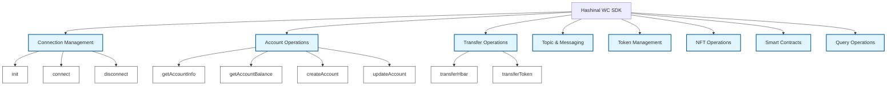

# API Methods

Complete reference documentation for all Hashinal Wallet Connect SDK methods.

## Method Categories

The SDK provides methods organized into functional categories:



## Connection Management

### init()

Initializes the SDK with WalletConnect configuration.

| Parameter | Type | Required | Description |
|-----------|------|----------|-------------|
| `projectId` | `string` | ✅ Yes | WalletConnect Cloud Project ID |
| `metadata` | `SignClientTypes.Metadata` | ✅ Yes | Application metadata |
| `network` | `LedgerId` | ❌ No | Network selection (default: MAINNET) |

**Metadata Structure:**
```typescript
interface Metadata {
  name: string;        // Your app name
  description: string; // App description
  url: string;        // App URL
  icons: string[];    // App icon URLs
}
```

**Examples:**

<details>
<summary>UMD (Inscribed HTML)</summary>

```javascript
await window.HashinalsWalletConnectSDK.init(
  'your_project_id',
  {
    name: 'My Hashinal App',
    description: 'Inscribed application on Hedera',
    url: window.location.href,
    icons: ['https://example.com/icon.png']
  }
);
```
</details>

<details>
<summary>ESM (Modern JS)</summary>

```typescript
import { HashinalsWalletConnectSDK } from '@hashgraphonline/hashinal-wc';
import { LedgerId } from '@hashgraph/sdk';

const sdk = HashinalsWalletConnectSDK.getInstance();
await sdk.init(
  process.env.WALLETCONNECT_PROJECT_ID,
  {
    name: 'My dApp',
    description: 'Modern Hedera application',
    url: 'https://myapp.com',
    icons: ['https://myapp.com/icon.png']
  },
  LedgerId.TESTNET // Optional: specify network
);
```
</details>

### connect()

Opens the WalletConnect modal for wallet connection.

| Returns | Description |
|---------|-------------|
| `Promise<SessionTypes.Struct>` | WalletConnect session object |

**Session Object Contains:**
- `topic`: Unique session identifier
- `namespaces`: Connected blockchain namespaces
- `acknowledged`: Connection acknowledgment status
- `peer`: Connected wallet metadata

**Examples:**

<details>
<summary>Complete Connection Flow</summary>

```typescript
try {
  // Connect wallet
  const session = await sdk.connect();
  
  if (session) {
    console.log('Connected to:', session.peer.metadata.name);
    console.log('Session topic:', session.topic);
    
    // Get account details
    const accountInfo = await sdk.getAccountInfo();
    console.log('Account:', accountInfo.accountId);
    console.log('Network:', accountInfo.network);
  }
} catch (error) {
  console.error('Connection failed:', error);
}
```
</details>

### disconnect()

Terminates all active wallet connections.

| Returns | Description |
|---------|-------------|
| `Promise<void>` | Resolves when disconnection is complete |

**Example:**
```javascript
await sdk.disconnect();
console.log('Wallet disconnected');
```

## Account Operations

### getAccountInfo()

Retrieves the connected account's information.

| Returns | Description |
|---------|-------------|
| `Promise<{accountId: string, network: string}>` | Account ID and network |

**Example:**
```javascript
const info = await sdk.getAccountInfo();
console.log(`Connected: ${info.accountId} on ${info.network}`);
// Output: Connected: 0.0.123456 on mainnet
```

### getAccountBalance()

Gets the HBAR balance of the connected account.

| Returns | Description |
|---------|-------------|
| `Promise<string>` | Balance in HBAR (as string) |

**Example:**
```javascript
const balance = await sdk.getAccountBalance();
console.log(`Balance: ${balance} HBAR`);
// Output: Balance: 150.5 HBAR
```

### createAccount()

Creates a new Hedera account with initial balance.

| Parameter | Type | Required | Description |
|-----------|------|----------|-------------|
| `initialBalance` | `number` | ✅ Yes | Initial balance in HBAR |

| Returns | Description |
|---------|-------------|
| `Promise<TransactionReceipt>` | Transaction receipt with new account ID |

**Example:**
```javascript
const receipt = await sdk.createAccount(100); // 100 HBAR initial balance
console.log('New account:', receipt.accountId.toString());
```

### updateAccount()

Updates account properties.

| Parameter | Type | Required | Description |
|-----------|------|----------|-------------|
| `accountId` | `string` | ✅ Yes | Account to update |
| `maxAutomaticTokenAssociations` | `number` | ✅ Yes | Max auto token associations |

**Example:**
```javascript
await sdk.updateAccount('0.0.123456', 10);
console.log('Account updated with 10 automatic token associations');
```

## Transfer Operations

### transferHbar()

Transfers HBAR between accounts.

| Parameter | Type | Required | Description |
|-----------|------|----------|-------------|
| `fromAccountId` | `string` | ✅ Yes | Sender account |
| `toAccountId` | `string` | ✅ Yes | Recipient account |
| `amount` | `number` | ✅ Yes | Amount in HBAR |

**Example:**
```javascript
const receipt = await sdk.transferHbar(
  '0.0.123456',  // from
  '0.0.789012',  // to
  25.5           // amount in HBAR
);
console.log('Transfer complete:', receipt.status);
```

### transferToken()

Transfers fungible tokens between accounts.

| Parameter | Type | Required | Description |
|-----------|------|----------|-------------|
| `tokenId` | `string` | ✅ Yes | Token ID |
| `fromAccountId` | `string` | ✅ Yes | Sender account |
| `toAccountId` | `string` | ✅ Yes | Recipient account |
| `amount` | `number` | ✅ Yes | Amount to transfer |

**Example:**
```javascript
await sdk.transferToken(
  '0.0.456789',  // token ID
  '0.0.123456',  // from account
  '0.0.789012',  // to account
  1000           // amount
);
```

## Topic & Messaging

### createTopic()

Creates a new HCS topic.

| Parameter | Type | Required | Description |
|-----------|------|----------|-------------|
| `memo` | `string` | ❌ No | Topic memo/description |
| `adminKey` | `string \| PrivateKey` | ❌ No | Admin key for topic management |
| `submitKey` | `string \| PrivateKey` | ❌ No | Submit key for access control |

| Returns | Description |
|---------|-------------|
| `Promise<string>` | New topic ID |

**Examples:**

<details>
<summary>Public Topic (No Keys)</summary>

```javascript
const topicId = await sdk.createTopic('Public discussion topic');
console.log('Created public topic:', topicId);
```
</details>

<details>
<summary>Private Topic (With Keys)</summary>

```javascript
import { PrivateKey } from '@hashgraph/sdk';

const adminKey = PrivateKey.generate();
const submitKey = PrivateKey.generate();

const topicId = await sdk.createTopic(
  'Private topic',
  adminKey.toString(),
  submitKey.toString()
);
console.log('Created private topic:', topicId);
```
</details>

### submitMessageToTopic()

Submits a message to an HCS topic.

| Parameter | Type | Required | Description |
|-----------|------|----------|-------------|
| `topicId` | `string` | ✅ Yes | Target topic ID |
| `message` | `string` | ✅ Yes | Message content |
| `submitKey` | `PrivateKey` | ❌ No | Required for private topics |

**Examples:**

<details>
<summary>Public Topic Message</summary>

```javascript
await sdk.submitMessageToTopic(
  '0.0.123456',
  JSON.stringify({ type: 'greeting', text: 'Hello Hedera!' })
);
```
</details>

<details>
<summary>Private Topic Message</summary>

```javascript
import { PrivateKey } from '@hashgraph/sdk';

const submitKey = PrivateKey.fromString('your-submit-key');
await sdk.submitMessageToTopic(
  '0.0.123456',
  'Private message',
  submitKey
);
```
</details>

### getMessages()

Retrieves messages from a topic.

| Parameter | Type | Required | Description |
|-----------|------|----------|-------------|
| `topicId` | `string` | ✅ Yes | Topic to query |
| `lastTimestamp` | `number` | ❌ No | Start timestamp (ms) |
| `disableTimestampFilter` | `boolean` | ❌ No | Disable filtering |

| Returns | Description |
|---------|-------------|
| `Promise<{messages: Array}>` | Array of topic messages |

**Message Structure:**
```typescript
interface Message {
  consensus_timestamp: string;
  message: string;  // Base64 encoded
  payer_account_id: string;
  running_hash: string;
  sequence_number: number;
}
```

**Example:**
```javascript
const result = await sdk.getMessages('0.0.123456');
result.messages.forEach(msg => {
  const decoded = atob(msg.message);
  console.log(`Message #${msg.sequence_number}: ${decoded}`);
});
```

## Token Management

### createToken()

Creates a new fungible token.

| Parameter | Type | Required | Description |
|-----------|------|----------|-------------|
| `name` | `string` | ✅ Yes | Token name |
| `symbol` | `string` | ✅ Yes | Token symbol |
| `initialSupply` | `number` | ✅ Yes | Initial supply |
| `decimals` | `number` | ✅ Yes | Decimal places |
| `treasuryAccountId` | `string` | ✅ Yes | Treasury account |
| `adminKey` | `string \| PrivateKey` | ✅ Yes | Admin key |
| `supplyKey` | `string \| PrivateKey` | ✅ Yes | Supply key |

**Example:**
```javascript
const tokenId = await sdk.createToken(
  'My Token',      // name
  'MTK',          // symbol
  1000000,        // initial supply
  2,              // decimals
  '0.0.123456',   // treasury
  adminKey,       // admin key
  supplyKey       // supply key
);
console.log('Created token:', tokenId);
```

### associateTokenToAccount()

Associates a token with an account.

| Parameter | Type | Required | Description |
|-----------|------|----------|-------------|
| `accountId` | `string` | ✅ Yes | Account ID |
| `tokenId` | `string` | ✅ Yes | Token ID |

**Example:**
```javascript
await sdk.associateTokenToAccount('0.0.123456', '0.0.789012');
console.log('Token associated with account');
```

### dissociateTokenFromAccount()

Removes token association from an account.

| Parameter | Type | Required | Description |
|-----------|------|----------|-------------|
| `accountId` | `string` | ✅ Yes | Account ID |
| `tokenId` | `string` | ✅ Yes | Token ID |

**Example:**
```javascript
await sdk.dissociateTokenFromAccount('0.0.123456', '0.0.789012');
console.log('Token dissociated from account');
```

### getAccountTokens()

Lists all tokens associated with an account.

| Parameter | Type | Required | Description |
|-----------|------|----------|-------------|
| `accountId` | `string` | ✅ Yes | Account to query |

| Returns | Description |
|---------|-------------|
| `Promise<Array>` | Array of token balances |

**Example:**
```javascript
const tokens = await sdk.getAccountTokens('0.0.123456');
tokens.forEach(token => {
  console.log(`Token ${token.token_id}: ${token.balance}`);
});
```

## NFT Operations

### mintNFT()

Mints a new NFT for an existing token.

| Parameter | Type | Required | Description |
|-----------|------|----------|-------------|
| `tokenId` | `string` | ✅ Yes | NFT collection token ID |
| `metadata` | `string` | ✅ Yes | NFT metadata (URI or data) |
| `supplyKey` | `PrivateKey` | ✅ Yes | Token supply key |

**Example:**
```javascript
import { PrivateKey } from '@hashgraph/sdk';

const supplyKey = PrivateKey.fromString('your-supply-key');
const receipt = await sdk.mintNFT(
  '0.0.123456',
  'ipfs://QmXxx...', // or 'hcs://1/0.0.xxxxx' for Hashinals
  supplyKey
);
console.log('Minted NFT serial:', receipt.serials[0]);
```

### getAccountNFTs()

Retrieves NFTs owned by an account.

| Parameter | Type | Required | Description |
|-----------|------|----------|-------------|
| `accountId` | `string` | ✅ Yes | Account to query |
| `tokenId` | `string` | ❌ No | Filter by specific token |

**Example:**
```javascript
// Get all NFTs
const allNFTs = await sdk.getAccountNFTs('0.0.123456');

// Get NFTs from specific collection
const collectionNFTs = await sdk.getAccountNFTs('0.0.123456', '0.0.789012');

console.log(`Account owns ${allNFTs.length} NFTs`);
```

### validateNFTOwnership()

Verifies NFT ownership.

| Parameter | Type | Required | Description |
|-----------|------|----------|-------------|
| `serialNumber` | `string` | ✅ Yes | NFT serial number |
| `accountId` | `string` | ✅ Yes | Account to verify |
| `tokenId` | `string` | ✅ Yes | Token ID |

| Returns | Description |
|---------|-------------|
| `Promise<NFT \| null>` | NFT details if owned, null otherwise |

**Example:**
```javascript
const nft = await sdk.validateNFTOwnership('1', '0.0.123456', '0.0.789012');
if (nft) {
  console.log('NFT verified:', nft);
} else {
  console.log('Account does not own this NFT');
}
```

## Smart Contract Operations

### executeSmartContract()

Executes a smart contract function.

| Parameter | Type | Required | Description |
|-----------|------|----------|-------------|
| `contractId` | `string` | ✅ Yes | Contract ID |
| `functionName` | `string` | ✅ Yes | Function to call |
| `parameters` | `ContractFunctionParameters` | ✅ Yes | Function parameters |
| `gas` | `number` | ❌ No | Gas limit (default: 100000) |

**Example:**
```javascript
import { ContractFunctionParameters } from '@hashgraph/sdk';

const params = new ContractFunctionParameters()
  .addString('Hello')
  .addUint256(42);

const receipt = await sdk.executeSmartContract(
  '0.0.123456',     // contract ID
  'myFunction',     // function name
  params,           // parameters
  150000           // gas limit
);
console.log('Contract executed:', receipt.status);
```

### readSmartContract()

Makes a read-only contract call via mirror node.

| Parameter | Type | Required | Description |
|-----------|------|----------|-------------|
| `data` | `string` | ✅ Yes | Encoded function call data |
| `fromAccount` | `AccountId` | ✅ Yes | Calling account |
| `contractId` | `ContractId` | ✅ Yes | Contract to call |
| `estimate` | `boolean` | ❌ No | Estimate gas only |
| `value` | `number` | ❌ No | HBAR to send |

**Example:**
```javascript
import { AccountId, ContractId } from '@hashgraph/sdk';

const result = await sdk.readSmartContract(
  '0x...', // encoded function call
  AccountId.fromString('0.0.123456'),
  ContractId.fromString('0.0.789012')
);
console.log('Contract state:', result);
```

## Query Operations

### getTransaction()

Retrieves transaction details by ID.

| Parameter | Type | Required | Description |
|-----------|------|----------|-------------|
| `transactionId` | `string` | ✅ Yes | Transaction ID |

**Example:**
```javascript
const tx = await sdk.getTransaction('0.0.123456@1234567890.000000000');
console.log('Transaction:', tx);
```

### getTransactionByTimestamp()

Retrieves transaction by consensus timestamp.

| Parameter | Type | Required | Description |
|-----------|------|----------|-------------|
| `timestamp` | `string` | ✅ Yes | Consensus timestamp |

**Example:**
```javascript
const tx = await sdk.getTransactionByTimestamp('1234567890.000000000');
console.log('Transaction:', tx);
```

## Error Handling

The SDK throws descriptive errors that should be handled appropriately:

```javascript
try {
  await sdk.transferHbar(from, to, amount);
} catch (error) {
  if (error.message.includes('INSUFFICIENT_PAYER_BALANCE')) {
    console.error('Insufficient balance for transfer');
  } else if (error.message.includes('USER_REJECTED')) {
    console.error('User rejected the transaction');
  } else {
    console.error('Transaction failed:', error.message);
  }
}
```

### Common Error Types

| Error | Description | Solution |
|-------|-------------|----------|
| `USER_REJECTED` | User declined in wallet | Handle gracefully |
| `INSUFFICIENT_PAYER_BALANCE` | Not enough HBAR | Check balance first |
| `INVALID_ACCOUNT_ID` | Malformed account ID | Validate format |
| `TOKEN_NOT_ASSOCIATED` | Token not associated | Associate token first |
| `INVALID_SIGNATURE` | Key mismatch | Verify keys |

## Best Practices

### 1. Always Initialize First
```javascript
// ✅ Good
await sdk.init(projectId, metadata);
const session = await sdk.connect();

// ❌ Bad - not initialized
const session = await sdk.connect(); // Will fail
```

### 2. Handle Connection State
```javascript
let isConnected = false;

async function ensureConnected() {
  if (!isConnected) {
    const session = await sdk.connect();
    isConnected = !!session;
  }
  return isConnected;
}
```

### 3. Validate Inputs
```javascript
function validateAccountId(accountId) {
  const pattern = /^\d+\.\d+\.\d+$/;
  if (!pattern.test(accountId)) {
    throw new Error('Invalid account ID format');
  }
}
```

### 4. Use Environment Variables
```javascript
const PROJECT_ID = process.env.VITE_WALLETCONNECT_PROJECT_ID;
if (!PROJECT_ID) {
  throw new Error('WalletConnect Project ID not configured');
}
```

## TypeScript Support

The SDK includes full TypeScript definitions:

```typescript
import { 
  HashinalsWalletConnectSDK,
  TransactionReceipt,
  SessionTypes 
} from '@hashgraphonline/hashinal-wc';

const sdk: HashinalsWalletConnectSDK = HashinalsWalletConnectSDK.getInstance();

async function typedExample(): Promise<void> {
  const session: SessionTypes.Struct = await sdk.connect();
  const receipt: TransactionReceipt = await sdk.transferHbar(
    '0.0.123456',
    '0.0.789012',
    10
  );
}
```