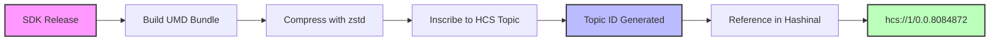

# Version History & Topics

## Overview

Hashinal Wallet Connect SDK is distributed through two channels:
- **NPM Package**: For modern JavaScript applications (ESM)
- **HCS Topics**: For inscribed HTML Hashinals (UMD)

This page tracks all inscribed versions on Hedera Consensus Service, allowing Hashinals to reference immutable, on-chain versions of the SDK.

## How Inscribed Versions Work



Each version is:
1. **Immutable**: Once inscribed, the code cannot be changed
2. **Verifiable**: SHA-256 hash in topic memo ensures integrity
3. **Permanent**: Stored forever on Hedera's distributed ledger
4. **Accessible**: Retrieved using HCS-1 and HCS-3 standards

## Version History

### Latest Version

| Version | Topic ID | Status | Release Date | Key Features |
|---------|----------|--------|--------------|---------------|
| **v1.0.92** | `0.0.8084872` | 🟢 **LATEST** | Dec 2024 | • NFT validation methods<br/>• Smart contract reads<br/>• Enhanced error handling<br/>• Performance improvements |

### Previous Versions

| Version | Topic ID | Release Date | Notable Changes |
|---------|----------|--------------|------------------|
| v1.0.89 | `0.0.7812387` | Nov 2024 | • Added transaction query methods<br/>• Improved TypeScript support |
| v1.0.88 | `0.0.7797532` | Nov 2024 | • Bug fixes for token operations |
| v1.0.86 | `0.0.7770334` | Nov 2024 | • Enhanced NFT methods<br/>• getAccountNFTs implementation |
| v1.0.82 | `0.0.7522981` | Oct 2024 | • Stable release<br/>• Core wallet operations |
| v1.0.79 | `0.0.7473819` | Oct 2024 | • Added smart contract execution |
| v1.0.71 | `0.0.7337015` | Sep 2024 | • Token creation methods |
| v1.0.64 | `0.0.7153927` | Sep 2024 | • Topic creation and messaging |
| v1.0.62 | `0.0.7111719` | Aug 2024 | • Account management features |
| v1.0.58 | `0.0.7001143` | Aug 2024 | • Transfer operations |
| v1.0.4 | `0.0.6843009` | Jul 2024 | • Basic connection management |
| v0.0.1 | `0.0.6790163` | Jul 2024 | • Initial release |

## Using Inscribed Versions

### In Your Hashinal

To use a specific version in your inscribed HTML:

```html
<!-- Latest version (recommended) -->
<script data-src="hcs://1/0.0.8084872" data-script-id="wallet-connect"></script>

<!-- Specific version (for compatibility) -->
<script data-src="hcs://1/0.0.7522981" data-script-id="wallet-connect"></script>
```

### Version Selection Guide

| Use Case | Recommended Version | Topic ID |
|----------|-------------------|----------|
| **New Projects** | Latest (v1.0.92) | `0.0.8084872` |
| **NFT Applications** | v1.0.86+ | `0.0.7770334`+ |
| **Smart Contracts** | v1.0.79+ | `0.0.7473819`+ |
| **Basic Transfers** | v1.0.58+ | `0.0.7001143`+ |
| **Maximum Stability** | v1.0.82 | `0.0.7522981` |

## Feature Availability by Version

| Feature | Minimum Version | Topic ID |
|---------|-----------------|----------|
| Wallet Connection | v0.0.1 | `0.0.6790163` |
| HBAR Transfers | v1.0.58 | `0.0.7001143` |
| Token Operations | v1.0.62 | `0.0.7111719` |
| Topic Messaging | v1.0.64 | `0.0.7153927` |
| Token Creation | v1.0.71 | `0.0.7337015` |
| Smart Contracts | v1.0.79 | `0.0.7473819` |
| NFT Minting | v1.0.86 | `0.0.7770334` |
| NFT Validation | v1.0.92 | `0.0.8084872` |
| Contract Reads | v1.0.92 | `0.0.8084872` |

## Verifying Topic Contents

Each topic includes a memo with the file's SHA-256 hash for verification:

```javascript
// Example verification process
async function verifyTopic(topicId) {
  // 1. Fetch topic info from mirror node
  const response = await fetch(
    `https://mainnet-public.mirrornode.hedera.com/api/v1/topics/${topicId}`
  );
  const topic = await response.json();
  
  // 2. Extract hash from memo
  const memo = atob(topic.memo); // Decode base64
  const [hash, compression, encoding] = memo.split(':');
  
  // 3. Fetch and verify messages
  const messages = await fetchTopicMessages(topicId);
  const reconstructed = reconstructFile(messages);
  const calculatedHash = await sha256(reconstructed);
  
  // 4. Compare hashes
  return hash === calculatedHash;
}
```

## Migration Guide

### Upgrading Versions

When upgrading to a newer version:

1. **Check Breaking Changes**: Review the version history for any breaking changes
2. **Test First**: Test the new version in a development environment
3. **Update Reference**: Change the topic ID in your script tag
4. **Clear Cache**: If using recursion, ensure caches are cleared

```html
<!-- Old version -->
<script data-src="hcs://1/0.0.7522981" data-script-id="wallet-connect"></script>

<!-- New version -->
<script data-src="hcs://1/0.0.8084872" data-script-id="wallet-connect"></script>
```

### Version Compatibility

The SDK maintains backward compatibility for all major features. However:

- **New methods** are only available in newer versions
- **Bug fixes** are not backported to older versions
- **Security updates** require upgrading to the latest version

## NPM Package Correlation

The inscribed versions correspond to NPM package releases:

```bash
# NPM package version
npm install @hashgraphonline/hashinal-wc@1.0.92

# Corresponds to inscribed version
hcs://1/0.0.8084872
```

## Support & Updates

- **GitHub**: [hashgraph-online/hashinal-wc](https://github.com/hashgraph-online/hashinal-wc)
- **NPM**: [@hashgraphonline/hashinal-wc](https://www.npmjs.com/package/@hashgraphonline/hashinal-wc) 
---

💡 **Tip**: Always use the latest version for new projects to access all features and security updates. For production Hashinals, consider pinning to a specific stable version to ensure consistent behavior.