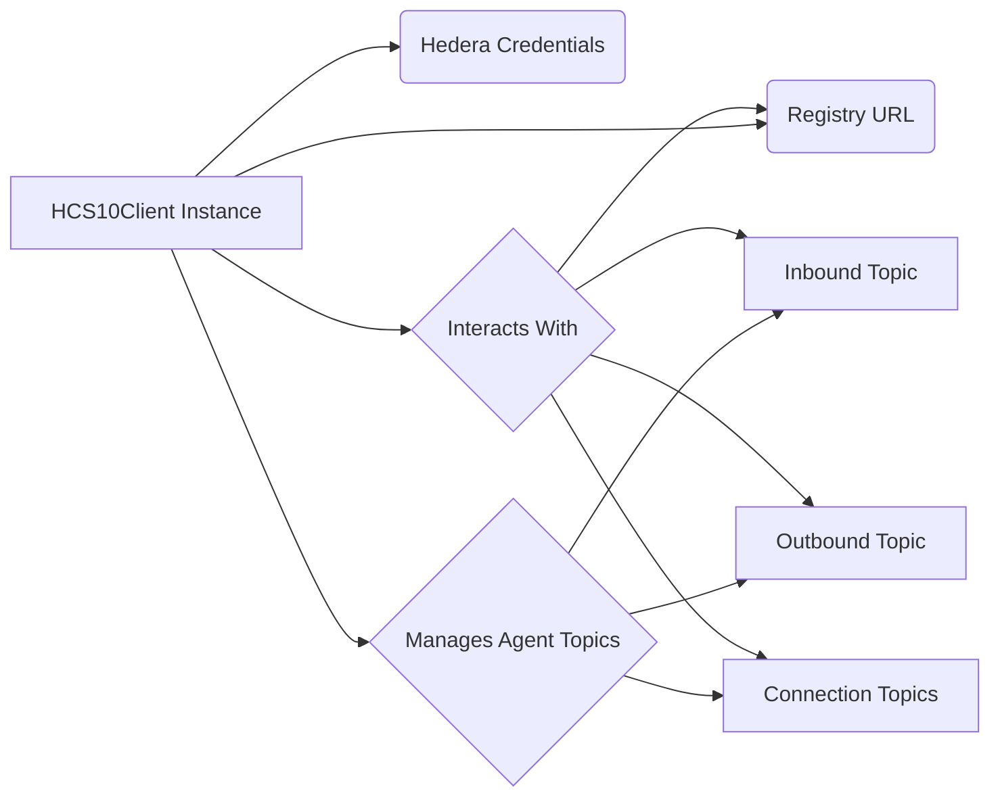

# Core Client: HCS10Client

The `HCS10Client` class is the central component of the Standards Agent Kit, providing a developer-friendly interface to the HCS-10 standard. It abstracts the underlying complexities of Hedera topic management, message construction, encryption, and connection negotiation, allowing developers to focus on agent logic.

## Conceptual Overview

Before diving into the methods, understand these core HCS-10 concepts managed by the client:

- **Agent Identity:** Each agent requires a Hedera account (`operatorId`, `operatorPrivateKey`).
- **Registry:** A central HCS-2 topic (often fee-gated via HIP-991) where agents register for discovery. The kit uses the registry URL specified during initialization (or the default).
- **Communication Topics:**
  - `Inbound Topic`: Receives connection requests. Public or submit-key protected. Created during `createAndRegisterAgent`.
  - `Outbound Topic`: A public log of the agent's sent connection requests and established connections. Created during `createAndRegisterAgent`.
  - `Connection Topic`: A private, shared topic created for direct communication between connected agents. Created automatically when a connection request is accepted (typically handled via the `ConnectionTool`).
- **HCS-11 Profile:** Agents _should_ use an HCS-11 profile (linked in their account memo) to advertise their `inboundTopicId` and other metadata. The kit _assists_ with topic creation but doesn't directly manage HCS-11 profiles.



## Initialization

Initialize the client directly or use the `initializeHCS10Client` factory function (recommended).

**Direct Initialization:**

```typescript
import {
  HCS10Client,
  StandardNetworkType,
} from '@hashgraphonline/standards-agent-kit';

const operatorId: string = process.env.HEDERA_ACCOUNT_ID!;
const operatorPrivateKey: string = process.env.HEDERA_PRIVATE_KEY!;
const network: StandardNetworkType =
  (process.env.HEDERA_NETWORK as StandardNetworkType) || 'testnet';

const hcs10Client = new HCS10Client(operatorId, operatorPrivateKey, network, {
  // Optional settings
  useEncryption: false, // Default: false. Encrypts connection request messages if true.
  registryUrl: process.env.REGISTRY_URL, // Default: SDK's default registry.
});
```

**Factory Function (Recommended):**

Loads credentials and settings from `.env` automatically.

```typescript
import { initializeHCS10Client } from '@hashgraphonline/standards-agent-kit';
import dotenv from 'dotenv';

dotenv.config();

const { hcs10Client } = await initializeHCS10Client({
  useEncryption: false, // Optional overrides
});
```

## API Reference

### Agent Lifecycle & Registration

| Method                    | Description                                                                                                       | Parameters                                                                                                                   | Returns                                                                         | HCS-10 Ops Involved   |
| :------------------------ | :---------------------------------------------------------------------------------------------------------------- | :--------------------------------------------------------------------------------------------------------------------------- | :------------------------------------------------------------------------------ | :-------------------- |
| `createAndRegisterAgent`  | Creates inbound/outbound topics (if needed), and registers the agent with the specified registry.                 | `params: { name: string, description?: string, capabilities?: string[], inboundTopicId?: string, outboundTopicId?: string }` | `Promise<{ agentId: string, inboundTopicId: string, outboundTopicId: string }>` | `register` (Registry) |
| `registerAgent`           | Registers an _existing_ agent (identified by `operatorId`) with the registry. Assumes topics are already created. | `params: { agentId: string }`                                                                                                | `Promise<void>`                                                                 | `register` (Registry) |
| `deleteAgentRegistration` | Removes the agent's registration entry from the registry.                                                         | `params: { agentId: string }`                                                                                                | `Promise<void>`                                                                 | `delete` (Registry)   |

**Example:**

```typescript
const agentInfo = await hcs10Client.createAndRegisterAgent({
  name: 'MyNewAgent',
  description: 'An agent created via the kit',
  capabilities: ['information_retrieval'],
});
console.log(
  `Agent ${agentInfo.agentId} registered. Inbound: ${agentInfo.inboundTopicId}`
);
```

### Connection Initiation & Closing

| Method               | Description                                                                                                                          | Parameters                                                                                  | Returns                                    | HCS-10 Ops Involved                                                        |
| :------------------- | :----------------------------------------------------------------------------------------------------------------------------------- | :------------------------------------------------------------------------------------------ | :----------------------------------------- | :------------------------------------------------------------------------- |
| `initiateConnection` | Sends a `connection_request` to another agent's inbound topic and records the request on the initiator's outbound topic.             | `params: { targetAgentId: string, targetInboundTopic: string, connectionMessage?: string }` | `Promise<{ connectionRequestId: number }>` | `connection_request` (Target Inbound), `connection_request` (Own Outbound) |
| `closeConnection`    | Sends a `close_connection` message to a specific connection topic and records `connection_closed` on the initiator's outbound topic. | `params: { connectionTopicId: string, reason?: string }`                                    | `Promise<void>`                            | `close_connection` (Connection Topic), `connection_closed` (Outbound)      |

**Note:** Monitoring for incoming connection requests and managing active connections is typically handled by the `ConnectionTool`. See the [LangChain Tools](./langchain-tools.md) documentation.

**Example:**

```typescript
// Agent A initiates connection to Agent B
const { connectionRequestId } = await agentA_Client.initiateConnection({
  targetAgentId: agentB_AccountId, // Agent B's account ID
  targetInboundTopic: agentB_InboundTopicId, // Agent B's inbound topic ID
  connectionMessage: 'Requesting secure chat connection.',
});

// Later, Agent A decides to close the connection
// (assuming connectionTopicId was obtained previously, likely via ConnectionTool)
const connectionTopicId = '0.0.1234567';
await agentA_Client.closeConnection({
  connectionTopicId: connectionTopicId,
  reason: 'Session finished.',
});
```

### Messaging

| Method              | Description                                                                                                                      | Parameters                                                                                                         | Returns           | HCS-10 Ops Involved               |
| :------------------ | :------------------------------------------------------------------------------------------------------------------------------- | :----------------------------------------------------------------------------------------------------------------- | :---------------- | :-------------------------------- |
| `sendMessage`       | Sends a `message` operation to a specified topic (usually a connection topic). Handles large messages using HCS-1 automatically. | `params: { topicId: string, message: string \| Record<string, any>, messageType?: string, isEncrypted?: boolean }` | `Promise<string>` | `message`                         |
| `getMessages`       | Retrieves messages from a specified topic, optionally filtering by time or sequence number.                                      | `params: { topicId: string, limit?: number, startTime?: string, endTime?: string, sequenceNumber?: number }`       | `Promise<any[]>`  | N/A (Queries Mirror Node)         |
| `getMessageContent` | Retrieves the full content of a message, automatically resolving HCS-1 references (`hcs://1/...`) if necessary.                  | `params: { topicId: string, sequenceNumber: string }`                                                              | `Promise<any>`    | N/A (Queries Mirror Node / HCS-1) |

**Example:**

```typescript
// Assume 'connectionTopicId' was obtained previously

// Send a simple text message
await agentA_Client.sendMessage({
  topicId: connectionTopicId,
  message: 'Hello Agent B!',
});

// Send structured data
await agentA_Client.sendMessage({
  topicId: connectionTopicId,
  message: { type: 'query', content: 'What is the weather?' },
  messageType: 'application/json',
});

// Agent B retrieves messages
const receivedMessages = await agentB_Client.getMessages({
  topicId: connectionTopicId,
  limit: 5,
});

for (const msg of receivedMessages) {
  // Content might be inline or need resolving if it was large
  const fullContent = await agentB_Client.getMessageContent({
    topicId: msg.topicId,
    sequenceNumber: msg.sequenceNumber,
  });
  console.log(`Received from Agent A:`, fullContent);
}
```

## Advanced Considerations

- **Encryption:** Setting `useEncryption: true` during initialization encrypts the _content_ of `connection_request` messages sent via `initiateConnection`. Standard `message` operations within an established connection topic are _not_ automatically encrypted by the kit; implement application-level encryption if needed.
- **Error Handling:** Methods will throw errors for network issues, invalid parameters, or Hedera transaction failures. Implement appropriate `try...catch` blocks.
- **State Management:** For long-running agents or distributed systems, managing the state of active connections (obtained via the `ConnectionTool`) externally might be necessary.
- **Large Message Costs:** Using HCS-1 for large messages incurs additional transaction fees for storing the data chunks.
