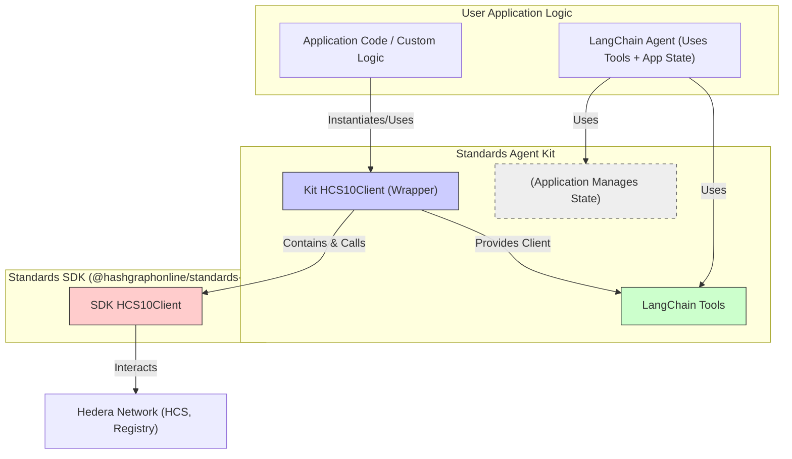

# Core Client: HCS10Client (and HCS‑10 Builder)

**Source Code:** [`HCS10Client.ts`](https://github.com/hashgraph-online/standards-agent-kit/blob/main/src/hcs10/HCS10Client.ts).

The `HCS10Client` within the `@hashgraphonline/standards-agent-kit` serves as a **developer-friendly wrapper and initializer** for the underlying HCS‑10 client provided by the core `@hashgraphonline/standards-sdk` library. For higher‑level workflows (registration, connections, monitoring, fee configuration, wallet delegation), see the [HCS‑10 Builder](./builders.md).

**Primary Functions:**

1.  **Simplified Setup:** Streamlines the instantiation and configuration of the standard SDK client using environment variables or direct parameters.
2.  **SDK Method Exposure:** Directly exposes several key methods from the standard SDK client for common HCS-10 operations (like profile retrieval, connection request handling).
3.  **Utility Provision:** Adds helpful utility methods for tasks like fetching raw messages, resolving HCS-1 inscriptions, and managing the client's active identity.

**When to Use This Client Directly:**

You'll interact with this `HCS10Client` instance directly when you need:

- **Low-Level Control:** Programmatically managing agent registration (`createAndRegisterAgent`).
- **Specific SDK Access:** Calling functions like `retrieveProfile` or `handleConnectionRequest` as part of custom application logic.
- **Basic HCS Interaction:** Using utilities like `sendMessage` or `getMessages` for interacting with arbitrary HCS topics, potentially outside the HCS-10 connection protocol.
- **Foundation for Tools:** Providing the initialized client instance as a dependency for higher-level abstractions like the [LangChain Tools](./langchain-tools.md) or as the internal engine used by the HCS‑10 Builder.

**Important Limitations:**

- **No Internal State Management:** This `HCS10Client` wrapper **does not track or manage the state of HCS-10 connections** (e.g., which connections are active, their topics, or status). Connection state management must be handled by your application logic or dedicated state management classes (like the `DemoState` class used _specifically_ in the example demos).
- **Focus on Wrapper/Utilities:** While it exposes some SDK methods, complex HCS-10 workflows might require direct interaction with the underlying `standardClient` property (instance of `@hashgraphonline/standards-sdk::HCS10Client`).

## Conceptual Architecture

This diagram shows the relationship between the Kit's wrapper client, the SDK client, and other components:



- Your application initializes the **Kit `HCS10Client` (Wrapper)**.
- The Wrapper creates and holds an instance of the **SDK `HCS10Client`**.
- The **LangChain Tools** use the **Kit Client** but rely on **Application Logic/State** to manage connection details.

## Initialization

Instantiate the client by providing the operator's Hedera account ID, private key, and the target network. Optional parameters can configure the registry URL and encryption behavior (if supported by the underlying SDK methods being called).

```typescript
import {
  HCS10Client,
  StandardNetworkType,
} from '@hashgraphonline/standards-agent-kit'; // Adjust path if necessary
import * as dotenv from 'dotenv';

dotenv.config(); // Loads HEDERA_OPERATOR_ID, HEDERA_PRIVATE_KEY, HEDERA_NETWORK

const operatorId: string = process.env.HEDERA_OPERATOR_ID!;
const operatorPrivateKey: string = process.env.HEDERA_PRIVATE_KEY!;
const network: StandardNetworkType =
  (process.env.HEDERA_NETWORK as StandardNetworkType) || 'testnet';

// Basic Initialization
const hcs10Client = new HCS10Client(operatorId, operatorPrivateKey, network);

// Initialization with Options
const options = {
  registryUrl: process.env.REGISTRY_URL, // Optional: Specify registry
  useEncryption: false, // Optional: Influences certain SDK ops if applicable
  logLevel: 'info', // Optional: Set logging level
};
const hcs10ClientWithOptions = new HCS10Client(
  operatorId,
  operatorPrivateKey,
  network,
  options
);

console.log(
  `Client Initialized: Operator ${hcs10Client.getOperatorId()}, Network ${hcs10Client.getNetwork()}`
);
```

## API Deep Dive

Detailed breakdown of methods available on the `HCS10Client` wrapper instance.

---

### `constructor`

```typescript
constructor(
  operatorId: string,
  operatorPrivateKey: string,
  network: StandardNetworkType, // 'mainnet' | 'testnet'
  options?: { useEncryption?: boolean; registryUrl?: string; logLevel?: LogLevel }
)
```

- **Purpose:** Initializes the wrapper and creates the internal instance of the standard SDK client (`this.standardClient`).
- **Mechanism:** Instantiates `@hashgraphonline/standards-sdk::HCS10Client` with the provided credentials, network, and options. Stores `options.useEncryption` and `options.registryUrl`.
- **Parameters:**

  | Parameter               | Type                                             | Optional | Default     | Description                                              |
  | :---------------------- | :----------------------------------------------- | :------- | :---------- | :------------------------------------------------------- |
  | `operatorId`            | `string`                                         | No       | -           | Hedera account ID (`0.0.X`).                             |
  | `operatorPrivateKey`    | `string`                                         | No       | -           | Private key string for the `operatorId`.                 |
  | `network`               | `StandardNetworkType` (`'mainnet' \| 'testnet'`) | No       | -           | Target Hedera Hashgraph.                                 |
  | `options`               | `object`                                         | Yes      | -           | Container for optional settings.                         |
  | `options.useEncryption` | `boolean`                                        | Yes      | `false`     | Stored flag; effect depends on SDK methods called later. |
  | `options.registryUrl`   | `string`                                         | Yes      | SDK default | URL for the HCS-10 registry.                             |
  | `options.logLevel`      | `LogLevel`                                       | Yes      | 'info'      | Logger level ('debug', 'info', 'warn', 'error').         |

- **Returns:** An instance of the `HCS10Client` wrapper.

---

### `getOperatorId`

```typescript
public getOperatorId(): string
```

- **Purpose:** Retrieves the Hedera Account ID currently configured for the underlying SDK client.
- **Mechanism:** Accesses `this.standardClient.getClient().operatorAccountId`.
- **Parameters:** None.
- **Returns:** The operator account ID as a string (`0.0.X`).
- **Throws:** Error if the operator account ID is not configured in the underlying SDK client.

---

### `getNetwork`

```typescript
public getNetwork(): StandardNetworkType
```

- **Purpose:** Retrieves the Hedera Hashgraph ('mainnet' or 'testnet') the underlying SDK client is configured for.
- **Mechanism:** Calls `this.standardClient.getNetwork()`.
- **Parameters:** None.
- **Returns:** `'mainnet'` or `'testnet'`.

---

### `createAndRegisterAgent`

```typescript
public async createAndRegisterAgent(
  metadata: ExtendedAgentMetadata
): Promise<AgentRegistrationResult>
```

- **Purpose:** Orchestrates the creation and registration of a new HCS-10 agent using the standard SDK. This is a high-level operation.
- **Mechanism:**
  1.  Creates an `@hashgraphonline/standards-sdk::AgentBuilder`.
  2.  Populates the builder with data from the `metadata` parameter (name, description, capabilities, type, model, network, PFP, socials, properties).
  3.  Calls `this.standardClient.createAndRegisterAgent(builder)`.
  4.  Stores the resulting inbound/outbound topic IDs in `this.agentChannels` (if successful).
- **Parameters:**

  | Parameter  | Type                    | Optional | Description                                                                                                                                                                    |
  | :--------- | :---------------------- | :------- | :----------------------------------------------------------------------------------------------------------------------------------------------------------------------------- |
  | `metadata` | `ExtendedAgentMetadata` | No       | Object containing agent details. Includes `name`, `description?`, `capabilities?`, `type?`, `model?`, `pfpBuffer?`, `pfpFileName?`, `social?`, `properties?`. Exported by kit. |

- **Returns:** A `Promise` resolving to the `AgentRegistrationResult` object from the SDK, which contains the new `accountId`, `privateKey`, `publicKey`, and `metadata` (including topic IDs).
- **Notes / Gotchas:**
  - The underlying SDK `AgentBuilder` might require a Profile Picture (`pfpBuffer`, `pfpFileName`). Check SDK requirements. If required and not provided, this method may fail or log warnings.
  - Handles potential errors during the SDK call and throws a descriptive error.

```typescript
// Example
try {
  const registrationResult = await hcs10Client.createAndRegisterAgent({
    name: 'MyProgrammaticAgent',
    description: 'Test agent created via wrapper',
    capabilities: ['chat', 'info'],
  });
  console.log('Registration Successful:', registrationResult);
  console.log('New Agent Account ID:', registrationResult.accountId);
  console.log('New Agent Private Key:', registrationResult.privateKey); // Handle securely!
  console.log('Inbound Topic:', registrationResult.metadata?.inboundTopicId);
} catch (error) {
  console.error('Registration Failed:', error);
}
```

---

### `handleConnectionRequest`

```typescript
public async handleConnectionRequest(
  inboundTopicId: string,
  requestingAccountId: string,
  connectionRequestId: number,
  feeConfig?: FeeConfigBuilderInterface // Type inferred from SDK
): Promise<HandleConnectionRequestResponse>
```

- **Purpose:** Processes an incoming HCS-10 connection request received on the agent's inbound topic. **Exposed directly from the SDK client.**
- **Mechanism:** Delegates directly to `this.standardClient.handleConnectionRequest(...)`. This involves the SDK client performing the connection handshake logic (creating connection topic, sending confirmation).
- **Parameters:**

  | Parameter             | Type                        | Optional | Description                                                            |
  | :-------------------- | :-------------------------- | :------- | :--------------------------------------------------------------------- |
  | `inboundTopicId`      | `string`                    | No       | Topic ID (`0.0.X`) where the connection request was received.          |
  | `requestingAccountId` | `string`                    | No       | Account ID (`0.0.X`) of the agent initiating the request.              |
  | `connectionRequestId` | `number`                    | No       | Sequence number of the connection request message.                     |
  | `feeConfig`           | `FeeConfigBuilderInterface` | Yes      | Configuration for handling potential transaction fees (type from SDK). |

- **Returns:** A `Promise` resolving to `HandleConnectionRequestResponse` from the SDK, indicating success/failure and potentially the new `connectionTopicId`.
- **Notes / Gotchas:** This method implements the _responder_ side of the connection handshake. It's typically used internally by background monitoring logic (like the `ConnectionTool`).

```typescript
// Example (Conceptual - typically called by monitoring logic)
const inboundTopic = '0.0.123456';
const requester = '0.0.98765';
const requestId = 15; // Sequence number of the request message
try {
  const response = await hcs10Client.handleConnectionRequest(
    inboundTopic,
    requester,
    requestId
  );
  if (response.success) {
    console.log(
      'Connection handled successfully. New Topic:',
      response.connectionTopicId
    );
  } else {
    console.error('Failed to handle connection request:', response.error);
  }
} catch (error) {
  console.error('Error calling handleConnectionRequest:', error);
}
```

---

### `retrieveProfile`

```typescript
public async retrieveProfile(accountId: string): Promise<ProfileResponse>
```

- **Purpose:** Fetches an agent's HCS-10 profile from the registry using their account ID. **Exposed directly from the SDK client.**
- **Mechanism:** Delegates directly to `this.standardClient.retrieveProfile(accountId)`.
- **Parameters:**

  | Parameter   | Type     | Optional | Description                                                |
  | :---------- | :------- | :------- | :--------------------------------------------------------- |
  | `accountId` | `string` | No       | Account ID (`0.0.X`) of the agent whose profile is needed. |

- **Returns:** A `Promise` resolving to the `ProfileResponse` object from the SDK, containing profile details (name, description, topics, etc.) and success status.

```typescript
// Example
const targetAgent = '0.0.55555';
try {
  const profileResponse = await hcs10Client.retrieveProfile(targetAgent);
  if (profileResponse.success && profileResponse.profile) {
    console.log(`Profile for ${targetAgent}:`, profileResponse.profile);
    console.log('Inbound Topic:', profileResponse.topicInfo?.inboundTopic);
  } else {
    console.log(
      `Could not retrieve profile for ${targetAgent}: ${profileResponse.error}`
    );
  }
} catch (error) {
  console.error('Error retrieving profile:', error);
}
```

### `getAgentProfile`

```typescript
public async getAgentProfile(accountId: string): Promise<ProfileResponse>
```

- **Purpose:** Alias for `retrieveProfile` - fetches an agent's HCS-10 profile from the registry.
- **Mechanism:** Delegates directly to `this.standardClient.retrieveProfile(accountId)`.
- **Parameters:**

  | Parameter   | Type     | Optional | Description                                                |
  | :---------- | :------- | :------- | :--------------------------------------------------------- |
  | `accountId` | `string` | No       | Account ID (`0.0.X`) of the agent whose profile is needed. |

- **Returns:** A `Promise` resolving to the `ProfileResponse` object from the SDK, containing profile details (name, description, topics, etc.) and success status.

---

### `submitConnectionRequest`

```typescript
public async submitConnectionRequest(
  inboundTopicId: string,
  memo: string
): Promise<TransactionReceipt>
```

- **Purpose:** Sends the initial HCS-10 `connection_request` message to a target agent's inbound topic. **Exposed directly from the SDK client.**
- **Mechanism:** Delegates directly to `this.standardClient.submitConnectionRequest(inboundTopicId, memo)`.
- **Parameters:**

  | Parameter        | Type     | Optional | Description                                              |
  | :--------------- | :------- | :------- | :------------------------------------------------------- |
  | `inboundTopicId` | `string` | No       | The target agent's inbound topic ID (`0.0.X`).           |
  | `memo`           | `string` | No       | String memo for the request (e.g., initiator's name/ID). |

- **Returns:** A `Promise` resolving to the Hedera `TransactionReceipt` for the submitted message, which includes the crucial `topicSequenceNumber` (used as the `connectionRequestId`).
- **Notes / Gotchas:** This is the first step for the _initiator_ of a connection. The `InitiateConnectionTool` uses this internally.

```typescript
// Example
const targetInboundTopic = '0.0.66778';
const myName = 'InitiatorAgent';
try {
  const receipt = await hcs10Client.submitConnectionRequest(
    targetInboundTopic,
    myName
  );
  console.log(
    'Connection request submitted. Receipt Status:',
    receipt.status.toString()
  );
  const connectionRequestId = receipt.topicSequenceNumber; // IMPORTANT: Long | null
  if (connectionRequestId !== null) {
    console.log(
      'Connection Request ID (Sequence Number):',
      connectionRequestId.toNumber()
    );
  } else {
    console.error('Could not get sequence number from receipt!');
  }
} catch (error) {
  console.error('Error submitting connection request:', error);
}
```

---

### `waitForConnectionConfirmation`

```typescript
public async waitForConnectionConfirmation(
  outboundTopicId: string,
  connectionRequestId: number,
  maxAttempts = 60,
  delayMs = 2000
): Promise<WaitForConnectionConfirmationResponse>
```

- **Purpose:** Polls the _initiator's_ outbound topic for a `connection_confirmation` message corresponding to a previously sent connection request. **Exposed directly from the SDK client.**
- **Mechanism:** Delegates directly to `this.standardClient.waitForConnectionConfirmation(...)`. The SDK client handles the polling logic.
- **Parameters:**

  | Parameter             | Type     | Optional | Default | Description                                                          |
  | :-------------------- | :------- | :------- | :------ | :------------------------------------------------------------------- |
  | `outboundTopicId`     | `string` | No       | -       | The _initiator's_ own outbound topic ID (`0.0.X`).                   |
  | `connectionRequestId` | `number` | No       | -       | Sequence number obtained from the `submitConnectionRequest` receipt. |
  | `maxAttempts`         | `number` | Yes      | 60      | Maximum number of polling attempts.                                  |
  | `delayMs`             | `number` | Yes      | 2000    | Delay between polling attempts in milliseconds.                      |

- **Returns:** A `Promise` resolving to `WaitForConnectionConfirmationResponse` from the SDK, indicating success/failure and the `connectionTopicId` if confirmed.
- **Notes / Gotchas:** Used by the _initiator_ after `submitConnectionRequest`. The `InitiateConnectionTool` uses this internally.

```typescript
// Example (following submitConnectionRequest)
const myOutboundTopic = '0.0.11223'; // Initiator's outbound topic
const theRequestId = 123; // ID obtained from submitConnectionRequest receipt
try {
  console.log(
    `Waiting for confirmation for request ${theRequestId} on topic ${myOutboundTopic}...`
  );
  const confirmation = await hcs10Client.waitForConnectionConfirmation(
    myOutboundTopic,
    theRequestId
  );
  if (confirmation.success && confirmation.connectionTopicId) {
    console.log(
      'Connection Confirmed! Shared Topic:',
      confirmation.connectionTopicId
    );
  } else {
    console.log(
      'Connection confirmation timed out or failed:',
      confirmation.error
    );
  }
} catch (error) {
  console.error('Error waiting for confirmation:', error);
}
```

---

### `sendMessage` (Kit Utility)

```typescript
public async sendMessage(
  topicId: string,
  data: string,
  memo?: string,
  submitKey?: PrivateKey // from '@hashgraph/sdk'
): Promise<number | undefined>
```

- **Purpose:** Sends a **raw string message** to any specified HCS topic. This utility does **not** adhere to HCS-10 message formatting or connection protocols.
- **Mechanism:**
  1.  Optionally encrypts the `data` string if `this.useEncryption` was set to true during constructor initialization.
  2.  Calls `this.standardClient.sendMessage(topicId, data, memo, submitKey)` which likely handles HCS-1 inscription for large messages internally via the SDK.
- **Parameters:**

  | Parameter   | Type         | Optional | Description                                                                |
  | :---------- | :----------- | :------- | :------------------------------------------------------------------------- |
  | `topicId`   | `string`     | No       | Target HCS topic ID (`0.0.X`).                                             |
  | `data`      | `string`     | No       | Raw string data to send.                                                   |
  | `memo`      | `string`     | Yes      | Short memo for the Hedera transaction.                                     |
  | `submitKey` | `PrivateKey` | Yes      | Key if the target topic requires a specific submit key (`@hashgraph/sdk`). |

- **Returns:** A `Promise` resolving to the topic sequence number (as a number) of the submitted message upon success, or undefined if unavailable.
- **Notes / Gotchas:** Useful for debugging or sending data on non-HCS-10 topics. Do not use this for sending standard messages _within_ an established HCS-10 connection; use the `SendMessageToConnectionTool` for that (which _should_ ideally format messages correctly, although its current implementation also sends raw data).

```typescript
// Example: Sending raw data to a topic
const statsTopic = '0.0.99887';
const statusUpdate = JSON.stringify({
  timestamp: Date.now(),
  status: 'Processing',
});
try {
  const sequenceNumber = await hcs10Client.sendMessage(
    statsTopic,
    statusUpdate,
    'System Status'
  );
  console.log(`Raw message sent to ${statsTopic} with sequence number ${sequenceNumber}`);
} catch (error) {
  console.error('Failed to send raw message:', error);
}
```

---

### `getMessages` (Kit Utility)

```typescript
public async getMessages(topicId: string): Promise<{
  messages: Array<{ timestamp: number; data: string; sequence_number: number }>;
}>
```

- **Purpose:** Retrieves recent messages directly from an HCS topic using the mirror node, returning them as raw data.
- **Mechanism:** Calls `this.standardClient.getMessages(topicId)`. Maps the consensus timestamp to milliseconds and returns the raw data string.
- **Parameters:**

  | Parameter | Type     | Optional | Description                      |
  | :-------- | :------- | :------- | :------------------------------- |
  | `topicId` | `string` | No       | HCS topic ID (`0.0.X`) to query. |

- **Returns:** A `Promise` resolving to an object `{ messages: [...] }`. Each message object contains:
  - `timestamp`: Consensus timestamp in **milliseconds** since epoch.
  - `data`: The raw message content (string, potentially base64 encoded or an HCS-1 URI).
  - `sequence_number`: The topic sequence number.
  - Messages are sorted by timestamp.
- **Notes / Gotchas:** Does not parse HCS-10 message structure or resolve HCS-1 inscriptions. Use `getMessageContent` to resolve inscriptions if needed.

```typescript
// Example: Getting raw messages from a topic
const dataFeedTopic = '0.0.12121';
try {
  const result = await hcs10Client.getMessages(dataFeedTopic);
  console.log(
    `Found ${result.messages.length} messages on topic ${dataFeedTopic}`
  );
  result.messages.forEach((msg) => {
    console.log(
      `  Seq: ${msg.sequence_number}, Time: ${new Date(
        msg.timestamp
      ).toISOString()}, Data: ${msg.data}`
    );
    // Need to call getMessageContent separately if msg.data is an 'hcs://...' URI
  });
} catch (error) {
  console.error(`Error getting messages from ${dataFeedTopic}:`, error);
}
```

---

### `getMessageStream` (Kit Utility)

```typescript
public async getMessageStream(topicId: string): Promise<{
  messages: HCSMessage[]; // Type from '@hashgraphonline/standards-sdk'
}>
```

- **Purpose:** Retrieves recent messages from an HCS topic via mirror node, returning them as `HCSMessage` objects from the standard SDK.
- **Mechanism:** Delegates directly to `this.standardClient.getMessageStream(topicId)`.
- **Parameters:**

  | Parameter | Type     | Optional | Description                      |
  | :-------- | :------- | :------- | :------------------------------- |
  | `topicId` | `string` | No       | HCS topic ID (`0.0.X`) to query. |

- **Returns:** A `Promise` resolving to an object `{ messages: [...] }` where each element is an `HCSMessage` instance (contains parsed fields like `op`, `data`, `sender_account_id`, etc., based on SDK parsing).
- **Notes / Gotchas:** Provides messages pre-parsed according to the SDK's interpretation, which might be more convenient than `getMessages` if you expect standard HCS-10 formatted messages.

```typescript
// Example: Getting parsed message stream
const connectionTopic = '0.0.77665';
try {
  const stream = await hcs10Client.getMessageStream(connectionTopic);
  console.log(
    `Found ${stream.messages.length} messages on stream ${connectionTopic}`
  );
  stream.messages.forEach((hcsMsg) => {
    console.log(
      `  Seq: ${hcsMsg.sequence_number}, Op: ${hcsMsg.op}, Data: ${hcsMsg.data}`
    );
    // Potentially check hcsMsg.op === 'message' etc.
  });
} catch (error) {
  console.error(`Error getting message stream from ${connectionTopic}:`, error);
}
```

---

### `getMessageContent` (Kit Utility)

```typescript
public async getMessageContent(inscriptionIdOrData: string): Promise<string>
```

- **Purpose:** Resolves the full content of a message, automatically handling HCS-1 inscription URIs (`hcs://1/...`).
- **Mechanism:** Delegates directly to `this.standardClient.getMessageContent(inscriptionIdOrData)`. The SDK client handles the logic for fetching chunked data if an inscription URI is provided.
- **Parameters:**

  | Parameter             | Type     | Optional | Description                                                                            |
  | :-------------------- | :------- | :------- | :------------------------------------------------------------------------------------- |
  | `inscriptionIdOrData` | `string` | No       | Either the raw message data string (if small) or the HCS-1 URI string (`hcs://1/...`). |

- **Returns:** A `Promise` resolving to the full, reconstructed message content as a string.
- **Notes / Gotchas:** Essential for handling potentially large messages sent via HCS-1 inscriptions.

```typescript
// Example (assuming 'msgData' was obtained from getMessages/getMessageStream)
const msgData = 'hcs://1/0.0.12345/1700000000000'; // Example inscription URI
try {
  const fullContent = await hcs10Client.getMessageContent(msgData);
  console.log('Resolved Message Content:', fullContent);
} catch (error) {
  console.error('Error resolving message content:', error);
}

const inlineData = '{"message": "short"}';
try {
  // Works for inline data too (just returns the input)
  const resolvedInline = await hcs10Client.getMessageContent(inlineData);
  console.log('Resolved Inline Content:', resolvedInline); // Outputs: {"message": "short"}
} catch (error) {
  console.error('Error resolving inline content:', error);
}
```

---

### `getInboundTopicId` (Kit Utility)

```typescript
public async getInboundTopicId(): Promise<string>
```

- **Purpose:** Attempts to determine the inbound topic ID for the currently configured operator account.
- **Mechanism:** Calls `this.retrieveProfile(this.getOperatorId())` to fetch the client's own profile and extracts the `inboundTopic` from the result.
- **Parameters:** None.
- **Returns:** A `Promise` resolving to the inbound topic ID string (`0.0.X`).
- **Throws:** An error if the operator ID cannot be determined, the profile cannot be retrieved, or the profile doesn't contain an inbound topic ID.
- **Notes / Gotchas:** The currently configured operator _must_ be successfully registered as an HCS-10 agent with a valid profile for this to succeed.

```typescript
// Example
try {
  const myInboundTopic = await hcs10Client.getInboundTopicId();
  console.log('My Inbound Topic ID is:', myInboundTopic);
  // Now can be used to start background monitoring, etc.
} catch (error) {
  console.error('Could not determine own inbound topic ID:', error);
  // Might indicate the agent needs registration first.
}
```

---

### `setClient` (Kit Utility)

```typescript
public setClient(accountId: string, privateKey: string): StandardSDKClient
```

- **Purpose:** Reconfigures the wrapper to use a different operator account ID and private key by replacing the internal `this.standardClient` instance.
- **Mechanism:** Creates a _new_ instance of `@hashgraphonline/standards-sdk::HCS10Client` with the new credentials (preserving the original network and registry URL) and assigns it to `this.standardClient`.
- **Parameters:**

  | Parameter    | Type     | Optional | Description                                 |
  | :----------- | :------- | :------- | :------------------------------------------ |
  | `accountId`  | `string` | No       | New operator account ID (`0.0.X`).          |
  | `privateKey` | `string` | No       | Private key string for the new `accountId`. |

- **Returns:** The _newly created_ underlying standard SDK client instance (`this.standardClient`).
- **Notes / Gotchas:** Useful for scenarios where the application needs to switch the identity it's operating as (e.g., after registering a new agent via `createAndRegisterAgent`).

```typescript
// Example (e.g., after registering 'newAgentResult')
const newAgentResult: AgentRegistrationResult = /* ... result from createAndRegisterAgent ... */;
if (newAgentResult.success && newAgentResult.accountId && newAgentResult.privateKey) {
    console.log(`Switching client identity to ${newAgentResult.accountId}...`);
    const newStandardClient = hcs10Client.setClient(
        newAgentResult.accountId,
        newAgentResult.privateKey
    );
    console.log(`Client identity switched. New Operator ID: ${hcs10Client.getOperatorId()}`);
    // Subsequent calls using hcs10Client will now use the new agent's identity
}
```

### `getOutboundTopicId` (Kit Utility)

```typescript
public async getOutboundTopicId(): Promise<string>
```

- **Purpose:** Retrieves the outbound topic ID for the current operator account by fetching its profile.
- **Mechanism:** Calls `this.getAgentProfile(this.getOperatorId())` and extracts the `outboundTopic` from the profile response.
- **Parameters:** None.
- **Returns:** A `Promise` resolving to the outbound topic ID string (`0.0.X`).
- **Throws:** An error if the operator ID cannot be determined, the profile cannot be retrieved, or the profile doesn't contain an outbound topic ID.
- **Notes / Gotchas:** The currently configured operator _must_ be successfully registered as an HCS-10 agent with a valid profile for this to succeed.

```typescript
// Example
try {
  const myOutboundTopic = await hcs10Client.getOutboundTopicId();
  console.log('My Outbound Topic ID is:', myOutboundTopic);
  // Can be used for monitoring confirmations, etc.
} catch (error) {
  console.error('Could not determine own outbound topic ID:', error);
  // Might indicate the agent needs registration first
}
```

---

**Source Code:** The core tools implementation can be found on GitHub: [`standards-agent-kit/src/tools/`](https://github.com/hashgraph-online/standards-agent-kit/tree/main/src/tools/).

## Prerequisites
