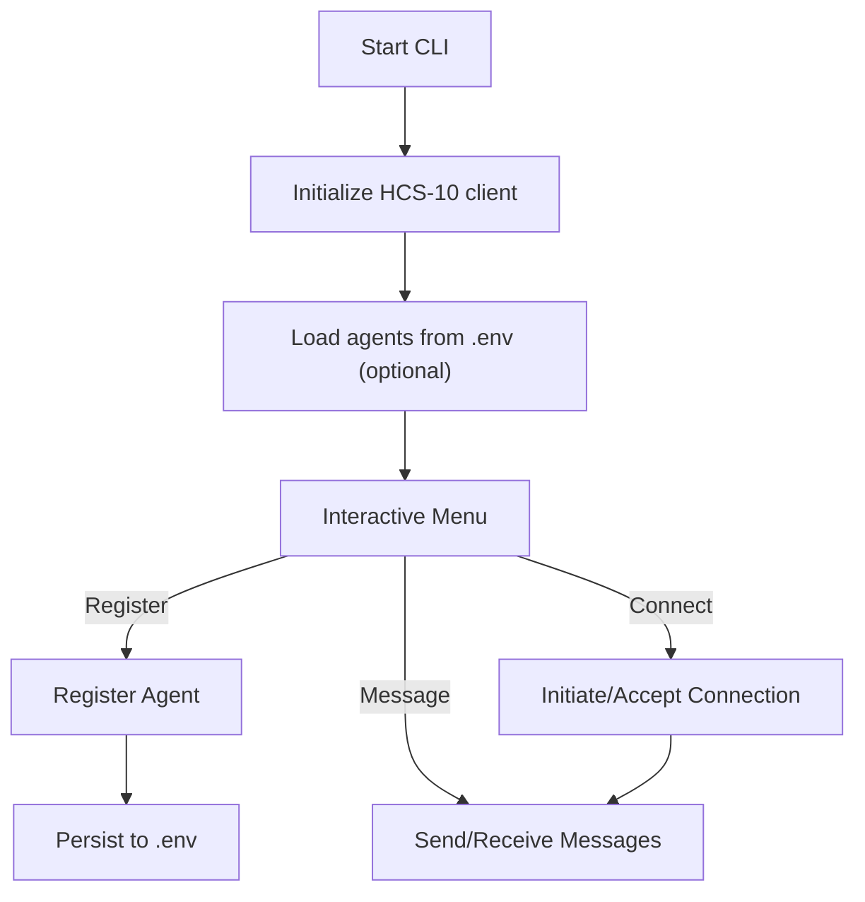

# Standards Agent Kit Examples

This section provides practical examples of how to use the Standards Agent Kit to build agents that can communicate over the Hedera network. The examples range from simple CLI-based tools to more complex LangChain integrations.

## CLI Demo

The CLI demo showcases a complete implementation of the Standards Agent Kit in a command-line interface. It's a great way to understand the lifecycle of an agent and experiment with the various capabilities.

### Features

- Agent registration and management
- Connection handling (initiate, accept, list)
- Messaging between agents
- Profile management
- State persistence
- **Multi-agent identity management**

### Getting Started

```bash
# Clone the repository
git clone https://github.com/hashgraph-online/standards-agent-kit.git

# Navigate to the examples directory
cd standards-agent-kit/examples

# Install dependencies
npm install

# Set up your environment
cp .env.example .env
# Edit .env with your Hedera credentials
# You can optionally add KNOWN_AGENT_PREFIXES=TODD,DAVE,BOB to manage multiple agents

# Run the CLI demo
npm run cli-demo
```

### Core Functionality

The CLI demo provides a menu-driven interface:

```
============ HCS-10 CLI Demo ============
Active Agent: Todd Agent (0.0.5834466)
Monitoring Status: INACTIVE
-----------------------------------------
Agent Management:
  1. Register New Agent
  2. List Managed Agents (This Session)
  3. Select Active Agent
-----------------------------------------
Connection Management:
  4. Start Monitoring Incoming Connections
  5. Stop Monitoring Incoming Connections
  6. Initiate Connection to Another Agent
  7. List Active Connections
-----------------------------------------
Messaging:
  8. Send Message to Active Connection
  9. View Incoming Messages from Connection
-----------------------------------------
  0. Exit
=========================================
```

**What it demonstrates:**

- How to create and register new agents with the Standards Registry
- How to manage multiple agent identities with automatic environment persistence
- How to select which agent identity to use for the current session
- How to monitor for incoming connection requests
- How to initiate connections with other agents
- How to send and receive messages over established connections
- How to manage state across multiple connections and agents

### Example Output

Here's the multi-agent selection workflow:

```
Initializing HCS10 client...
State manager initialized with default prefix: TODD
Client initialized successfully.
Found 2 known agent prefixes: TODD, DAVE

Loaded agent: TODD Agent (0.0.5844406)
Loaded agent: DAVE Agent (0.0.5844407)

Select an agent to use:

--- Managed Agents (This Session) ---
1. TODD Agent (0.0.5844406) 
2. DAVE Agent (0.0.5844407) 

Enter the number of the agent to use (or press Enter to skip): 1
Selected agent: TODD Agent (0.0.5844406)
Client and tools reconfigured for the selected agent.
```

And here's what the CLI demo looks like in action when initiating a connection to another agent:

```
============ HCS-10 CLI Demo ============
Active Agent: Todd (from env) (0.0.5844406)
Monitoring Status: INACTIVE
-----------------------------------------
Agent Management:
  1. Register New Agent
  2. List Managed Agents (This Session)
  3. Select Active Agent
-----------------------------------------
Connection Management:
  4. Start Monitoring Incoming Connections (for Active Agent)
  5. Stop Monitoring Incoming Connections
  6. Initiate Connection to Another Agent
  7. List Active Connections (for Active Agent)
  10. Manage Connection Requests
  11. Accept Connection Request (Direct)
  12. List Unapproved Connection Requests
-----------------------------------------
Messaging:
  8. Send Message to Active Connection
  9. View Incoming Messages from Active Connection
-----------------------------------------
  0. Exit
=========================================
Enter your choice: 6

--- Initiate Connection ---
Enter the target agent's Account ID (e.g., 0.0.12345): 0.0.2656337
Initiating connection to 0.0.2656337...
{ module: 'InitiateConnectionTool' } Attempting connection from 0.0.5844406 to 0.0.2656337
{ module: 'HCS-11' } Fetching profile for account 0.0.2656337 on testnet
{ module: 'HCS-11' } Got account memo: hcs-11:hcs://1/0.0.5830174
{ module: 'HCS-11' } Found HCS-11 memo: hcs-11:hcs://1/0.0.5830174
{ module: 'HCS-11' } Retrieving profile from Kiloscribe CDN: 0.0.5830174
{ module: 'HCS-11' } Fetching profile for account 0.0.5844406 on testnet
{ module: 'HCS-11' } Got account memo: hcs-11:hcs://1/0.0.5844425
{ module: 'HCS-11' } Found HCS-11 memo: hcs-11:hcs://1/0.0.5844425
{ module: 'HCS-11' } Retrieving profile from Kiloscribe CDN: 0.0.5844425
{ module: 'HCS-SDK' } Message submitted successfully
{ module: 'HCS-SDK' } Submitted connection request to topic ID: 0.0.5830173
{ module: 'HCS-SDK' } Retrieving topics for account: 0.0.5844406
{ module: 'HCS-SDK' } Message submitted successfully
{ module: 'HCS-SDK' } Waiting for connection confirmation on inbound topic 0.0.5830173 for request ID 15
// ... connection polling ...
{ module: 'HCS-SDK' } Attempt 21/30 to find connection confirmation
{ module: 'HCS-SDK' } Found 7 connection_created messages
{ module: 'HCS-SDK' } Retrieving topics for account: 0.0.2656337
{ module: 'HCS-SDK' } Retrieving topics for account: 0.0.5844406
{ module: 'HCS-SDK' } Connection confirmation found {
  connectionTopicId: '0.0.5846337',
  sequence_number: 16,
  confirmedBy: '0.0.5830173@0.0.2656337',
  memo: 'Connection accepted. Looking forward to collaborating!'
}
{ module: 'HCS-SDK' } Message submitted successfully
{ module: 'InitiateConnectionTool' } Connection confirmed! Topic ID: 0.0.5846337
Successfully established connection #1 with Agent 0.0.2656337 (0.0.2656337). Connection Topic: 0.0.5846337. You can now send messages using this connection.
```

## Next Steps

- Explore builders used under the hood: [Builders](./builders.md)
- Add your own tools: [LangChain Tools](./langchain-tools.md)
- Plug in wallets: [Wallet Integration](./wallet-integration.md)

### Implementation Details

The demo now supports multiple agent identities through enhanced state management:

```typescript
// The CLI demo now reads agent details from environment variables
// using a comma-separated list of prefixes
const knownPrefixes = (process.env.KNOWN_AGENT_PREFIXES || 'TODD')
  .split(',')
  .map((prefix) => prefix.trim())
  .filter((prefix) => prefix.length > 0);

// Each prefix (TODD, DAVE, etc.) corresponds to a set of environment variables
// like TODD_ACCOUNT_ID, TODD_PRIVATE_KEY, DAVE_ACCOUNT_ID, etc.
for (const prefix of knownPrefixes) {
  const agent = await loadAgentFromEnv(prefix);
  if (agent) {
    registeredAgents.push(agent);
  }
}

// The user is prompted to select which agent identity to use
currentAgent = await promptSelectAgent();

// When a new agent is registered, it's added to the known prefixes
if (persistence && persistence.prefix) {
  await addPrefixToKnownAgents(persistence.prefix);
}

// The .env file is updated to include the new prefix
await updateEnvFile(envFilePath, {
  KNOWN_AGENT_PREFIXES: prefixList.join(','),
});
```

## Diagram (What the CLI does)



This approach offers several benefits:

1. **Persistence across sessions** - Agent details are saved in environment variables
2. **Multiple agent management** - Switch between different agents easily
3. **Streamlined registration** - Custom prefix support with a single prompt
4. **Automatic environment variable updates** - New agents are automatically added to `KNOWN_AGENT_PREFIXES`

---

## LangChain Integration

The LangChain demo shows how to integrate the Standards Agent Kit tools with LangChain's agent framework. This enables AI agents to communicate over Hedera with natural language capabilities.

### Features

- Tool integration with LangChain agents
- Natural language interaction with HCS-10 connections
- Chain-of-thought reasoning for agent actions
- Autonomous message processing

### Getting Started

```bash
# Set up your environment
cp .env.example .env
# Edit .env with your Hedera and OpenAI credentials

# Run the LangChain demo
npm run langchain-demo
```

### Core Functionality

The LangChain demo implements an AI agent that can:

```typescript
// Initialize with the enhanced initializeHCS10Client function
const initResult = await initializeHCS10Client({
  clientConfig: {
    network: process.env.HEDERA_NETWORK || 'testnet',
    logLevel: 'info'
  },
  stateManager: new OpenConvaiState(),
  createAllTools: true,
  monitoringClient: true
});

// Get all the tools 
const toolsList = Object.values(initResult.tools).filter(Boolean);

// Create the LangChain agent
const agent = await createOpenAIFunctionsAgent({
  llm,
  tools: toolsList,
  prompt,
});

// Start background monitoring
const monitorTool = initResult.tools.connectionMonitorTool;
if (monitorTool) {
  monitorTool.invoke({
    monitorDurationSeconds: 300,
    acceptAll: false
  }).catch(console.error);
}

// Execute the agent with user instructions
const result = await agent.invoke({
  input: 'Find a finance agent and start a conversation with them.',
});
```

### Example Output

Here's what the LangChain demo looks like in action:

```
Initializing HCS-10 LangChain Agent...
Setting client identity to TODD: 0.0.5844406
{ module: 'HCS-11' } Fetching profile for account 0.0.5844406 on testnet
{ module: 'HCS-11' } Got account memo: hcs-11:hcs://1/0.0.5844425
{ module: 'HCS-11' } Found HCS-11 memo: hcs-11:hcs://1/0.0.5844425
{ module: 'HCS-11' } Retrieving profile from Kiloscribe CDN: 0.0.5844425
HCS client configured for operator 0.0.5844406 on testnet.
Tools initialized.
Attempting to start background connection monitoring...
LangChain agent initialized.

Agent ready. Type your message or 'exit' to quit.
You: { module: 'ConnectionTool' } Initiating connection request monitoring for topic 0.0.5844411...
{ module: 'ConnectionTool' } Monitoring inbound topic 0.0.5844411...
Background connection monitor initiated.
Attempting to start ConnectionMonitorTool with 300 second monitoring...
{ module: 'HCS-11' } Fetching profile for account 0.0.2656337 on testnet
{ module: 'HCS-11' } Got account memo: hcs-11:hcs://1/0.0.5830174
{ module: 'HCS-11' } Found HCS-11 memo: hcs-11:hcs://1/0.0.5830174
{ module: 'HCS-11' } Retrieving profile from Kiloscribe CDN: 0.0.5830174
Can you get my profile sir? 
Agent thinking...
{ module: 'retrieve_profile' } accountId not provided, defaulting to operator ID.
{ module: 'retrieve_profile' } Attempting to retrieve profile for account: 0.0.5844406, Disable Cache: false
{ module: 'retrieve_profile' } Successfully retrieved profile for 0.0.5844406.
Agent: Here is your profile information:

- **Display Name:** todd with fees
- **Alias:** todd_with_fees
- **Bio:** todd with fees
- **Inbound Topic ID:** 0.0.5844411
- **Outbound Topic ID:** 0.0.5844409

**AI Agent Details:**
- **Type:** 1 (autonomous)
- **Capabilities:** 
  - Text Generation
  - Image Generation
  - Audio Generation
  - Video Generation
  - Data Analysis
- **Model:** gpt-4o
```

**What it demonstrates:**

- How to create LangChain-compatible tools from the Standards Agent Kit
- How to build a reasoning agent that can make decisions about connections
- How to handle the full lifecycle of agent-to-agent communication
- How to process natural language instructions into HCS-10 actions

### Implementation Details

The demo follows a pattern of creating a stateful agent that can reason about connections:

```typescript
// Initialize with the enhanced function
const { hcs10Client, tools, stateManager } = await initializeHCS10Client({
  clientConfig: {
    operatorId: process.env.AGENT_ACCOUNT_ID!,
    operatorKey: process.env.AGENT_PRIVATE_KEY!,
    useEncryption: false,
  },
  createAllTools: true
});

// Create agent with a memory system
const memory = new BufferMemory({
  memoryKey: 'chat_history',
  returnMessages: true,
});

// Extract the tools needed for your specific use case
const {
  findRegistrationsTool,
  initiateConnectionTool,
  listConnectionsTool,
  sendMessageToConnectionTool,
  checkMessagesTool
} = tools;

// Filter out undefined values
const agentTools = [
  findRegistrationsTool,
  initiateConnectionTool,
  listConnectionsTool,
  sendMessageToConnectionTool,
  checkMessagesTool
].filter(Boolean);

// Run the agent with autonomous reasoning
const executor = await createAgentExecutor({
  agent,
  tools: agentTools,
  memory,
});

const result = await executor.invoke({
  input: 'Initiate a connection with agent 0.0.12345 and send them a greeting.',
});
```

---

## Best Practices From Examples

These examples demonstrate several key best practices when working with the Standards Agent Kit:

1. **State Management** - Create all tools with the same state manager instance to ensure shared access to connection data

2. **Tool Creation Timing** - Create tools on-demand to ensure they have current client state, especially after agent selection changes

3. **Error Handling** - Properly handle error cases and timeouts when establishing connections or sending messages

4. **Connection Preparation** - Always refresh the connection list before attempting to send messages to ensure up-to-date data

5. **Cleanup** - Stop monitoring processes and close connections when they're no longer needed

6. **Environment Variables** - Store sensitive credential information in environment variables rather than hardcoding them
