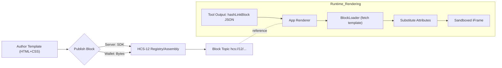
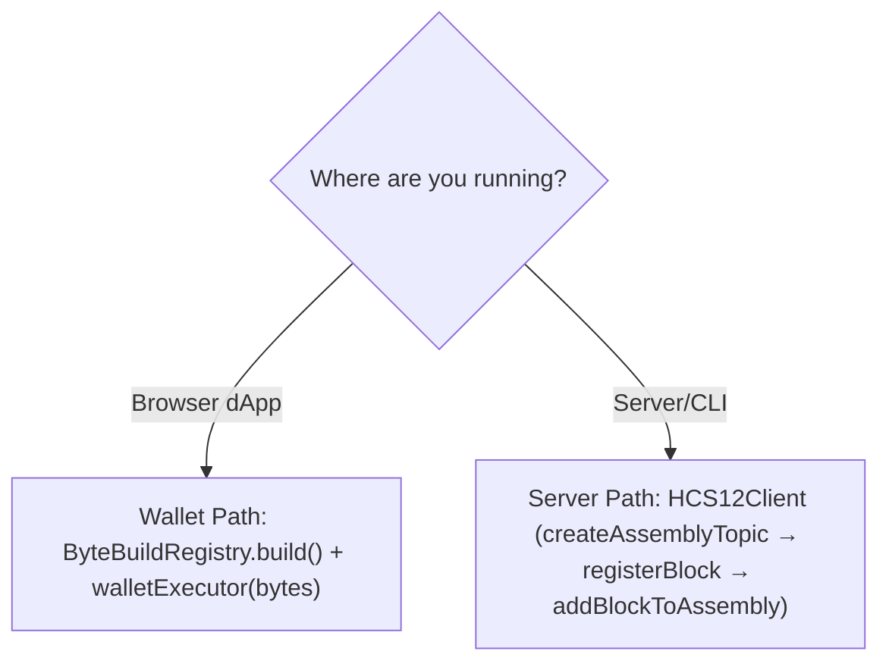

# HashLink Blocks: Authoring and Inscription

Learn how to create and publish HCS‑12 HashLink blocks (on‑chain HTML templates) so tools can return rich, renderable UI cards right inside your app.

- Server publishing: submit transactions directly with a private key
- Wallet publishing: build `transactionBytes` and submit via a wallet

Prerequisites
- Hedera account + key (server) or wallet (dApp)
- Standards SDK + Standards Agent Kit

## Mental Model

At a glance: your template is stored on‑chain once, and your tool returns a small descriptor that UIs render safely.



Key parts
- Block template: the on‑chain HTML/CSS you author
- hashLinkBlock JSON: small object with `blockId`, `template` (id or literal), and `attributes`
- Renderer: loads and renders the template (see Desktop HashLinkBlockRenderer)

## What is a HashLink block?

An HCS‑12 “block” stores a reusable HTML template on‑chain. At render time, a UI fills the template using an attributes object and displays it safely (often sandboxed). Blocks are referenced as `hcs://12/<topicId>` and are easy to preview (e.g., in HashScan) and cache.

## 1) Author a template

Keep it self‑contained (CSS inline or minimal) and use `{{var}}` placeholders for attributes your UI will pass.

```html
<!-- product-card.html -->
<div class="border rounded p-4 bg-white">
  <h3 class="text-lg font-semibold">{{name}}</h3>
  <p class="text-sm text-slate-600">by {{creator}}</p>
  <p class="mt-2">Topic: {{topicId}}</p>
  <a href="{{hrl}}" target="_blank" rel="noopener">View content</a>
  <p class="text-xs text-slate-500">Network: {{network}}</p>
  <!-- Add CSS/JS inline if needed; design for sandbox iframe rendering -->
</div>
```

## 2) Publish (server path)

Use the HCS‑12 client for day‑to‑day server execution (build*Tx helpers are mainly for wallet/returnBytes flows).

Source references
- HCS12Client: https://github.com/hashgraph-online/standards-sdk/blob/main/src/hcs-12/sdk.ts
- BlockBuilder: https://github.com/hashgraph-online/standards-sdk/blob/main/src/hcs-12/builders/block-builder.ts

```ts
import 'dotenv/config';
import { HCS12Client, type HCS12ClientConfig, BlockBuilder } from '@hashgraphonline/standards-sdk';
import * as fs from 'node:fs/promises';

const cfg: HCS12ClientConfig = {
  network: (process.env.HEDERA_NETWORK || 'testnet') as 'testnet' | 'mainnet',
  operatorId: process.env.HEDERA_ACCOUNT_ID!,
  operatorPrivateKey: process.env.HEDERA_PRIVATE_KEY!,
};
const hcs12 = new HCS12Client(cfg);

// 1) Create an assembly topic
const assemblyTopicId = await hcs12.createAssemblyTopic();

// 2) Register the assembly
await hcs12.registerAssemblyDirect(assemblyTopicId, {
  p: 'hcs-12',
  op: 'register',
  name: 'My Blocks',
  version: '1.0.0',
  description: 'Product cards, badges, etc.',
});

// 3) Register a block (inscribe template + definition)
const templateBuf = await fs.readFile('./product-card.html');
const block = new BlockBuilder()
  .setName('demo/product-card')
  .setTitle('Product Card')
  .setDescription('Simple product card')
  .setCategory('ui')
  .setTemplate(templateBuf);

await hcs12.registerBlock(block);
const blockTopicId = block.getTopicId();

// 4) Add the block to the assembly
await hcs12.addBlockToAssembly(assemblyTopicId, {
  p: 'hcs-12',
  op: 'add-block',
  block_t_id: blockTopicId,
  attributes: { name: 'Demo', topicId: '0.0.777', network: cfg.network },
});

// Reference in UIs: hcs://12/<assemblyTopicId>
```

Notes
- Prefer HCS12Client for normal server execution
- Use HCS‑12 docs (Rendering/Blocks/Assembly/Actions) for exact payloads
- Version blocks (e.g., `demo/product-card@v1`) rather than editing in place

## 3) Publish (wallet path)

Canonical, copy‑paste bytes example (from `@hashgraphonline/conversational-agent`). Build transaction bytes with the Agent Kit and pass them to your wallet.

Important
- `registerAssembly` uses HCS‑12 fields (`p`, `op`, `name`, `version`, …)
- `addBlock` links a previously registered block via `block_t_id` (no inline template)

Source references
- bytes example in conversational-agent: https://github.com/hashgraph-online/conversational-agent/blob/main/examples/bytes-hcs12-smoke.ts
- ByteBuildRegistry: https://github.com/hashgraph-online/standards-agent-kit/blob/main/src/signing/bytes-registry.ts
- Inscribe universal block script (to get a block id): https://github.com/hashgraph-online/standards-agent-kit/blob/main/scripts/inscribe-hashinal-blocks.ts

```ts
import 'dotenv/config'
import { ByteBuildRegistry } from '@hashgraphonline/standards-agent-kit'

function hederaKitFromEnv() {
  const network = (process.env.HEDERA_NETWORK || 'testnet') as 'mainnet' | 'testnet'
  const operatorId = process.env.OPERATOR_ID || process.env.HEDERA_OPERATOR_ID || process.env.ACCOUNT_ID
  if (!operatorId) throw new Error('Missing OPERATOR_ID/HEDERA_OPERATOR_ID/ACCOUNT_ID')
  return {
    client: { network: { toString: () => network } },
    signer: {
      getAccountId: () => ({ toString: () => operatorId }),
      getOperatorPrivateKey: () => undefined, // wallet flow (no server key)
    },
  } as any
}

async function main() {
  const kit = hederaKitFromEnv()

  // 1) Optional: create a registry topic for hashlinks
  const create = await ByteBuildRegistry.build('hcs12.createRegistry', kit, {
    options: { registry: 'hashlinks', ttl: 86400 },
  })
  // submit create.transactionBytes with your wallet SDK

  // 2) Register assembly (use an existing assembly topic id)
  const assemblyTopicId = process.env.HCS12_ASSEMBLY_TOPIC_ID || '0.0.<assemblyTopic>'
  const registration = { p: 'hcs-12', op: 'register', name: 'demo-assembly', version: '1.0.0' }
  const reg = await ByteBuildRegistry.build('hcs12.registerAssembly', kit, { assemblyTopicId, registration })
  // submit reg.transactionBytes with your wallet SDK

  // 3) Add a previously registered block by its topic id
  const blockTopicId = process.env.HCS12_BLOCK_TOPIC_ID || '0.0.<your_block_topic_id>'
  const addBlock = await ByteBuildRegistry.build('hcs12.addBlock', kit, {
    assemblyTopicId,
    operation: { p: 'hcs-12', op: 'add-block', block_t_id: blockTopicId },
  })
  // submit addBlock.transactionBytes with your wallet SDK
}

main().catch((e) => { console.error(e); process.exit(1) })
```

Run the example directly
- From `conversational-agent`: `pnpm exec tsx examples/bytes-hcs12-smoke.ts`
- From `standards-agent-kit`: run `scripts/inscribe-hashinal-blocks.ts` to produce a block id, then use it as `block_t_id` above.

UI rendering reference
- Desktop HashLink renderer component: https://github.com/hashgraph-online/desktop/blob/main/src/renderer/components/chat/HashLinkBlockRenderer.tsx

Notes
- Set `SignerProviderRegistry.setPreferWalletOnly(true)` to enforce wallet‑only dApp behavior
- For backend byte building, use `setStartHCSDelegate(op, request)` to obtain bytes from your API

Decision helper



## 4) Return a block from your tool

Have your tool include a `hashLinkBlock` object in its JSON result so frontends can render it immediately (see Desktop renderer).

```json
{
  "success": true,
  "hashLinkBlock": {
    "blockId": "0.0.6617393",
    "hashLink": "hcs://12/0.0.6617393",
    "template": "0.0.6617393", // or inline HTML template
    "attributes": {
      "name": "Demo",
      "creator": "0.0.123",
      "topicId": "0.0.777",
      "hrl": "hcs://1/0.0.777",
      "network": "testnet"
    }
  }
}
```

## Rendering reference

- Desktop app component: `desktop/src/renderer/components/chat/HashLinkBlockRenderer.tsx`
  - Sandboxed iframe rendering, host style injection, auto‑resize, accessibility affordances

## Troubleshooting and tips
- Verify on HashScan the assembly topic contains your block message
- Start simple: inline CSS, avoid external JS until your pipeline is green
- Design for sandbox iframes: no implicit globals; style within the template
- Validate payloads against Standards SDK HCS‑12 docs
- Version blocks (`id: product-card@v2`) instead of editing in place
