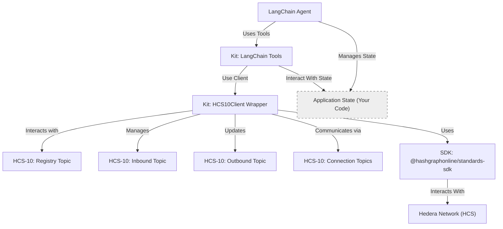

# Standards Agent Kit: Implement the HCS-10 OpenConvAI Standard

Welcome to the Standards Agent Kit! This TypeScript library helps you implement the [HCS-10 OpenConvAI Standard](/docs/standards/hcs-10) in your applications, allowing AI agents to discover and communicate securely on the Hedera Hashgraph.

## What This Kit Does

- **Implements the HCS-10 Standard** - Provides a complete implementation of the OpenConvAI protocol for autonomous agent communication
- **Simplifies Complex HCS Interactions** - Handles topic creation, message formatting, and connection management according to the standard
- **Offers LangChain Integration** - Provides ready-to-use LangChain tools that enable your AI agents to perform HCS-10 operations

## Getting Started

### Installation

```bash
npm install @hashgraphonline/standards-agent-kit
```

### Environment Setup

Create a `.env` file in your project root:

```dotenv
# Hedera Credentials (Required)
HEDERA_ACCOUNT_ID=0.0.xxxxxx
HEDERA_PRIVATE_KEY=302e0201...

# Hedera Network (Optional - defaults to 'testnet')
HEDERA_NETWORK=testnet

# OpenAI API Key (For LangChain)
OPENAI_API_KEY=sk-xxxxxxxxxx
```

## Quick Start Example

Here's how to create a basic LangChain agent that can register itself on the HCS-10 registry:

```typescript
import {
  HCS10Client,
  RegisterAgentTool,
  StandardNetworkType,
} from '@hashgraphonline/standards-agent-kit';
import * as dotenv from 'dotenv';
import { ChatOpenAI } from '@langchain/openai';
import { AgentExecutor, createOpenAIToolsAgent } from 'langchain/agents';
import {
  ChatPromptTemplate,
  MessagesPlaceholder,
} from '@langchain/core/prompts';
import { ConversationTokenBufferMemory } from 'langchain/memory';

dotenv.config();

async function main() {
  // 1. Initialize the HCS Client
  const operatorId = process.env.HEDERA_ACCOUNT_ID!;
  const operatorKey = process.env.HEDERA_PRIVATE_KEY!;
  const network = (process.env.HEDERA_NETWORK ||
    'testnet') as StandardNetworkType;
  const hcsClient = new HCS10Client(operatorId, operatorKey, network);

  // 2. Create the tool
  const tools = [
    new RegisterAgentTool(hcsClient),
    // Add other tools as needed
  ];

  // 3. Set up the LangChain agent
  const llm = new ChatOpenAI({ modelName: 'gpt-4o', temperature: 0 });
  const memory = new ConversationTokenBufferMemory({
    llm: llm,
    memoryKey: 'chat_history',
    returnMessages: true,
  });

  const prompt = ChatPromptTemplate.fromMessages([
    [
      'system',
      'You are an agent assistant. Use the register_agent tool when asked to register a new agent.',
    ],
    new MessagesPlaceholder('chat_history'),
    ['human', '{input}'],
    new MessagesPlaceholder('agent_scratchpad'),
  ]);

  const agent = await createOpenAIToolsAgent({ llm, tools, prompt });
  const agentExecutor = new AgentExecutor({
    agent,
    tools,
    memory,
    verbose: true,
  });

  // 4. Run the agent
  try {
    const result = await agentExecutor.invoke({
      input: "Please register me as 'MyQuickStartAgent'",
    });
    console.log('Agent Output:', result.output);
  } catch (error) {
    console.error('Agent invocation failed:', error);
  }
}

main().catch(console.error);
```

## How It Works

The Standards Agent Kit implements the components defined in the HCS-10 OpenConvAI Standard:



## Key Components

### 1. HCS10Client

The core client that implements the HCS-10 protocol:

- **Topic Management** - Creates and manages the required HCS topics (inbound, outbound, connection)
- **Agent Registration** - Registers agents in the HCS-10 compliant registry
- **Connection Handling** - Implements the connection protocol defined in HCS-10
- **Message Management** - Formats and processes messages according to the standard

[Explore the client API →](./core-client.md)

### 2. LangChain Tools

Tools that empower LangChain agents to perform HCS-10 operations:

- **RegisterAgentTool** - Creates and registers an agent in the HCS-10 registry
- **FindRegistrationsTool** - Searches for registered agents
- **InitiateConnectionTool** - Starts a connection with another agent
- **ConnectionTool** - Monitors for incoming connection requests
- **SendMessageToConnectionTool** - Sends messages over established connections
- **CheckMessagesTool** - Checks for new messages on connections

[Learn more about the tools →](./langchain-tools.md)

### 3. Connection State Management

Since HCS-10 requires tracking connection state, the kit provides:

- **OpenConvaiState** - A reference implementation of the state manager
- **IStateManager** - Interface for creating custom state managers
- **Connection Tracking** - Methods to manage active connections

## Next Steps

Ready to build applications with the HCS-10 standard?

- [**LangChain Tools Guide**](./langchain-tools.md) - Learn about all available tools and how to use them
- [**Core Client Guide**](./core-client.md) - Understand the underlying client implementation
- [**Example Applications**](./examples.md) - See complete working demos

## Documentation Structure

- [Core Client (`HCS10Client`)](/docs/libraries/standards-agent-kit/core-client) - Details on the HCS10Client class
- [LangChain Tools](/docs/libraries/standards-agent-kit/langchain-tools) - Documentation for all provided LangChain tools (RegisterAgent, FindRegistrations, InitiateConnection, Connection, ListConnections, SendMessageToConnection, CheckMessages, SendMessage) and `DemoState`.
- [Examples (Reference)](/docs/libraries/standards-agent-kit/examples) - Brief descriptions linking to example code.
