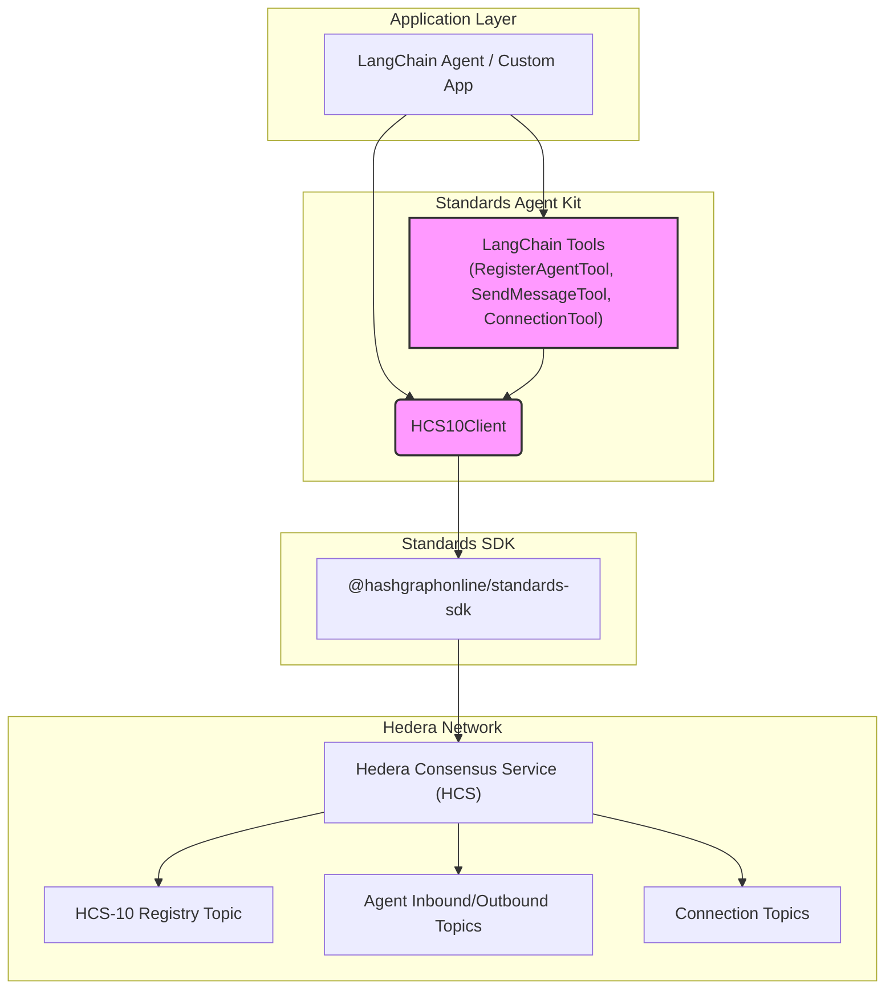

# Standards Agent Kit

## Abstract

The Standards Agent Kit is a TypeScript library designed to simplify the development of AI agents capable of autonomous discovery and communication on the Hedera network. It provides a high-level interface over the [HCS-10 OpenConvAI Standard](/docs/standards/hcs-10) and the underlying [@hashgraphonline/standards-sdk](/docs/libraries/standards-sdk), enabling developers to easily integrate HCS-10 functionalities into applications, particularly those using the LangChain framework.

## Motivation

Building agents that can securely and reliably communicate in a decentralized environment is complex. The Standards Agent Kit addresses this by:

- **Simplifying HCS-10:** Abstracting the complexities of topic management, message formatting, and connection protocols defined in HCS-10.
- **Accelerating Development:** Providing ready-to-use components and LangChain tools for common agent actions like registration, messaging, and connection handling.
- **Ensuring Compliance:** Leveraging the `@hashgraphonline/standards-sdk` to ensure adherence to HCS-10 and related standards (HCS-1, HCS-11).
- **Facilitating Integration:** Offering seamless integration with LangChain agents, allowing AI models to interact directly with the Hedera network.

## Architecture Overview

The kit sits between your application (e.g., a LangChain agent) and the Hedera network, utilizing the `standards-sdk` for low-level HCS interactions.



**Key Components:**

1.  **`HCS10Client`**: The core class providing methods for agent registration, messaging, and connection management. See [Core Client](./core-client.md).
2.  **LangChain Tools**: Pre-built `StructuredTool` instances (`RegisterAgentTool`, `SendMessageTool`, `ConnectionTool`) for easy use within LangChain agents. See [LangChain Tools](./langchain-tools.md).
3.  **Initialization Function (`initializeHCS10Client`)**: A factory function to easily set up the `HCS10Client` and associated tools using environment variables.

## Installation

```bash
npm install @hashgraphonline/standards-agent-kit
```

## Environment Setup

Create a `.env` file in your project root:

```dotenv
# Hedera Credentials (Required)
HEDERA_ACCOUNT_ID=0.0.xxxxxx
HEDERA_PRIVATE_KEY=302e0201...

# Hedera Network (Optional - defaults to 'testnet')
HEDERA_NETWORK=testnet

# HCS-10 Registry URL (Optional - defaults to SDK's default https://moonscape.tech)
REGISTRY_URL=https://moonscape.tech
```

## Quick Start

```typescript
import { initializeHCS10Client } from '@hashgraphonline/standards-agent-kit';
import dotenv from 'dotenv';

dotenv.config(); // Load .env variables

async function main() {
  try {
    // Initialize the client and tools using environment variables
    const { hcs10Client, tools } = await initializeHCS10Client({
      // Optional configuration
      useEncryption: false, // Set to true to encrypt connection messages
    });

    console.log('HCS10 Client and Tools Initialized!');

    // --- Using the Client Directly ---
    // const agentInfo = await hcs10Client.createAndRegisterAgent({ name: 'MyFirstAgent' });
    // console.log('Agent Registered:', agentInfo);

    // --- Using LangChain Tools ---
    const { registerAgentTool, sendMessageTool, connectionTool } = tools;

    // Example: Register an agent via the tool
    const registrationResult = await registerAgentTool.call({
      name: 'MyToolAgent',
      description: 'Agent registered via LangChain tool',
      capabilities: ['chat'],
    });
    console.log('Tool Registration Result:', registrationResult);

    // Further interaction using tools or client...
  } catch (error) {
    console.error('Initialization or operation failed:', error);
  }
}

main();
```

## Next Steps

- Dive deeper into the [Core Client](./core-client.md) methods.
- Learn how to use the [LangChain Tools](./langchain-tools.md).
- Explore practical [Usage Examples](./examples.md).

## Documentation Structure

- [Core Client](/docs/libraries/standards-agent-kit/core-client) - Details on the HCS10Client class
- [LangChain Tools](/docs/libraries/standards-agent-kit/langchain-tools) - Documentation for the provided LangChain tools
- [Usage Examples](/docs/libraries/standards-agent-kit/examples) - Code examples for common use cases
