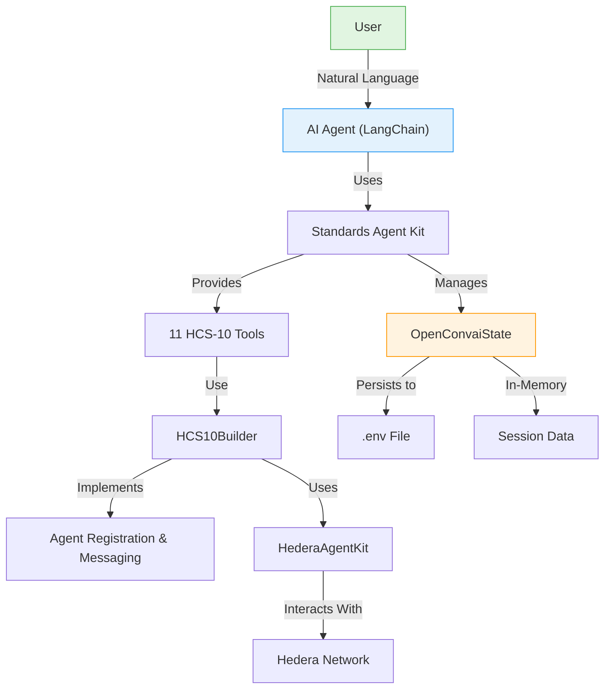

# Standards Agent Kit: HCS-10 OpenConvAI Toolkit for Hedera

Welcome to the Standards Agent Kit! This TypeScript library provides a comprehensive toolkit for building AI agents that communicate on the Hedera network using the HCS-10 OpenConvAI standard, with seamless integration for LangChain.

## What This Kit Does

- **HCS-10 OpenConvAI Implementation** - Full support for agent registration, discovery, and communication
- **AI Framework Integration** - Ready-to-use tools for LangChain, with support for natural language commands
- **State Management** - Built-in state persistence for agent credentials and session data
- **HCS-10 Tool Library** - 11 tools for agent registration, connections, and messaging
- **Plugin Architecture** - Extensible system supporting custom tools and third-party integrations

## Getting Started

### Installation

```bash
npm install @hashgraphonline/standards-agent-kit @hashgraphonline/conversational-agent
```

### Environment Setup

Create a `.env` file in your project root:

```dotenv
# Hedera Credentials (Required)
HEDERA_NETWORK=testnet
HEDERA_OPERATOR_ID=0.0.xxxxxx
HEDERA_OPERATOR_KEY=302e0201...

# Optional: Specific account for agent operations
HEDERA_ACCOUNT_ID=0.0.xxxxxx
HEDERA_PRIVATE_KEY=302e0201...

# OpenAI API Key (For LangChain agents)
OPENAI_API_KEY=sk-xxxxxxxxxx
```

## Quick Start Example

Here's how to create a LangChain agent with full HCS standards support:

```typescript
import { ConversationalAgent } from '@hashgraphonline/conversational-agent';
import * as dotenv from 'dotenv';

dotenv.config();

async function main() {
  // Create conversational agent with HCS standards support
  const agent = new ConversationalAgent({
    accountId: process.env.HEDERA_ACCOUNT_ID!,
    privateKey: process.env.HEDERA_PRIVATE_KEY!,
    network: 'testnet',
    openAIApiKey: process.env.OPENAI_API_KEY!
  });

  await agent.initialize();

  // Use natural language commands
  const response = await agent.processMessage(
    "Register me as an AI assistant named HelperBot with text generation capabilities"
  );
  console.log(response.response);
  
  // The agent is now registered and saved to state!
  // You can continue with other operations:
  
  await agent.processMessage(
    "Send a hello message to my outbound topic"
  );
  
  await agent.processMessage(
    "What's my current HBAR balance?"
  );
}

main().catch(console.error);
```

## How It Works

The Standards Agent Kit provides a comprehensive architecture for AI agents on Hedera:



## Key Components

### 1. HCS10Builder

The core builder for HCS-10 OpenConvAI standard implementation:

- **Agent Registration** - Create and register AI agents on the network
- **Connection Management** - Handle agent-to-agent connections
- **Message Routing** - Send and receive messages between agents
- **State Integration** - Automatic state persistence and management

[Explore the builder →](./core-client.md)

### 2. HCS-10 Tool Library

11 tools implementing the OpenConvAI standard:

**Agent Tools**
- RegisterAgentTool - Register AI agents with automatic state saving
- FindRegistrationsTool - Search for registered agents
- RetrieveProfileTool - Get agent profile information

**Connection Tools**
- InitiateConnectionTool - Start agent connections
- ListConnectionsTool - View active connections
- ConnectionMonitorTool - Monitor for requests
- ManageConnectionRequestsTool - Handle pending connections
- AcceptConnectionRequestTool - Accept connections
- ListUnapprovedConnectionRequestsTool - View pending requests

**Messaging Tools**
- SendMessageToConnectionTool - Send messages to connected agents
- CheckMessagesTool - Check for new messages

[See all tools →](./langchain-tools.md)

### 3. Plugin Architecture

The plugin system enables:

- **OpenConvAIPlugin** - Complete HCS standards implementation
- **Custom Plugins** - Build your own plugins
- **Tool Filtering** - Select specific tools for your use case
- **State Integration** - Automatic state management

[Learn about plugins →](./plugins.md)

### 4. State Management

Advanced state management features:

- **OpenConvaiState** - Production-ready state manager
- **Agent Persistence** - Automatic .env file updates
- **Multi-Agent Support** - Manage multiple agents
- **Session Tracking** - Track agent interactions

## Key Features

### Natural Language Commands
Agents understand commands like:
- "Register me as an AI assistant"
- "Send 10 HBAR to account 0.0.123456"
- "Create a new token called TestCoin"
- "What's my current balance?"

### Automatic State Persistence
- Agent credentials saved to .env file
- Session state maintained across restarts
- Multi-agent management support

### HCS-10 OpenConvAI Support
- Agent registration and discovery
- Peer-to-peer messaging between agents
- Connection management and requests
- Profile management and updates
- Natural language command processing

## Next Steps

Ready to build AI agents on Hedera?

- [**LangChain Tools Guide**](./langchain-tools.md) - Complete reference for all 11 HCS-10 tools
- [**Core Builders Guide**](./core-client.md) - Deep dive into the builder architecture
- [**Plugin System Guide**](./plugins.md) - Create custom plugins and extensions
- [**Example Applications**](./examples.md) - Production-ready examples

## Related Libraries

- [Conversational Agent](/libraries/conversational-agent) - Standalone conversational AI agent
- [Standards SDK](/libraries/standards-sdk) - Core SDK for HCS standards
