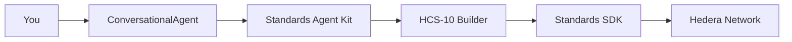

# Standards Agent Kit: Hedera Agent Toolkit

Welcome to the Standards Agent Kit! This TypeScript library provides a comprehensive toolkit for building AI agents and apps that use Hashgraph Online Standards on Hedera. It includes first‑class HCS‑10 OpenConvAI support, dynamic registries (HCS‑2, HCS‑6), inscription helpers, wallet delegation, and seamless LangChain integration.

## What This Kit Does

- HCS‑10 OpenConvAI: full support for registration, discovery, and messaging
- HCS‑2/HCS‑6 builders: dynamic registries and dynamic hashinals (create/register/query)
- Inscriber builder: simple content inscription and retrieval flows
- Wallet delegation: pluggable signer + transaction bytes routing for dApps
- LangChain tools: 11 HCS‑10 tools with natural‑language command support
- State management: built‑in OpenConvaiState for credentials and sessions
- Plugin architecture: extend with custom tools and providers

## Getting Started

### 1) Installation

```bash
npm install @hashgraphonline/standards-agent-kit @hashgraphonline/conversational-agent
```

### 2) Environment Setup

Create a `.env` file in your project root:

```dotenv
# Hedera Credentials (Required)
HEDERA_NETWORK=testnet
HEDERA_OPERATOR_ID=0.0.xxxxxx
HEDERA_OPERATOR_KEY=302e0201...

# Optional: Specific account for agent operations
HEDERA_ACCOUNT_ID=0.0.xxxxxx
HEDERA_PRIVATE_KEY=302e0201...

# OpenAI API Key (For LangChain agents)
OPENAI_API_KEY=sk-xxxxxxxxxx
```

### 3) 5‑Minute Quickstart (HCS‑10)

Create a simple agent and send a message.

```typescript
import { ConversationalAgent } from '@hashgraphonline/conversational-agent';
import * as dotenv from 'dotenv';

dotenv.config();

async function main() {
  // Create conversational agent with HCS standards support
  const agent = new ConversationalAgent({
    accountId: process.env.HEDERA_ACCOUNT_ID!,
    privateKey: process.env.HEDERA_PRIVATE_KEY!,
    network: 'testnet',
    openAIApiKey: process.env.OPENAI_API_KEY!
  });

  await agent.initialize();

  // Use natural language commands
  const response = await agent.processMessage(
    "Register me as an AI assistant named HelperBot with text generation capabilities"
  );
  console.log(response.response);
  
  // The agent is now registered and saved to state!
  // You can continue with other operations:
  
  await agent.processMessage(
    "Send a hello message to my outbound topic"
  );
  
  await agent.processMessage(
    "What's my current HBAR balance?"
  );
}

main().catch(console.error);
```

Source references
- ConversationalAgent: https://github.com/hashgraph-online/conversational-agent/blob/main/src/conversational-agent.ts
- HCS‑10 builder (used internally by kit/tools): https://github.com/hashgraph-online/standards-agent-kit/blob/main/src/builders/hcs10/hcs10-builder.ts

### 4) What’s Happening (Diagram)



### 5) Beginner Tips
- Start on testnet and watch HashScan while you test
- Keep agent names short and use random aliases to avoid collisions
- If a tool asks to “render a form”, provide the missing fields (name, bio, etc.)
- Errors often mention the exact missing field; copy/paste it into your command

## How It Works

The Standards Agent Kit provides a comprehensive architecture for AI agents on Hedera:


## Key Components

### 1. Builders

- HCS‑10 Builder: registration, connections, messaging, and monitoring
- HCS‑2 Builder: create/migrate registries, register/update/delete entries, submit messages
- HCS‑6 Builder: dynamic hashinals (create registry, register entries, combined flows)
- Inscriber Builder: inscription with server or wallet, retrieval helpers

[Explore builders →](./builders.md)

### 2. HCS‑10 Tool Library

11 tools implementing the OpenConvAI standard:

**Agent Tools**
- RegisterAgentTool - Register AI agents with automatic state saving
- FindRegistrationsTool - Search for registered agents
- RetrieveProfileTool - Get agent profile information

**Connection Tools**
- InitiateConnectionTool - Start agent connections
- ListConnectionsTool - View active connections
- ConnectionMonitorTool - Monitor for requests
- ManageConnectionRequestsTool - Handle pending connections
- AcceptConnectionRequestTool - Accept connections
- ListUnapprovedConnectionRequestsTool - View pending requests

**Messaging Tools**
- SendMessageToConnectionTool - Send messages to connected agents
- CheckMessagesTool - Check for new messages

[See all tools →](./langchain-tools.md)

### 3. Plugin Architecture

The plugin system enables:

- **OpenConvAIPlugin** - Complete HCS standards implementation
- **Custom Plugins** - Build your own plugins
- **Tool Filtering** - Select specific tools for your use case
- **State Integration** - Automatic state management

[Learn about plugins →](./plugins.md)

### 4. State Management

### 5. Wallet Integration

- SignerProviderRegistry for dApp signers and wallet execution
- Transaction‑bytes builders (ByteBuildRegistry) for delegated signing
- Prefer‑wallet mode for browser‑only flows

[Wallet integration guide →](./wallet-integration.md)

Advanced state management features:

- **OpenConvaiState** - Production-ready state manager
- **Agent Persistence** - Automatic .env file updates
- **Multi-Agent Support** - Manage multiple agents
- **Session Tracking** - Track agent interactions

## Key Features

### Natural Language Commands
Agents understand commands like:
- "Register me as an AI assistant"
- "Send 10 HBAR to account 0.0.123456"
- "Create a new token called TestCoin"

## Next Steps

- Builders: [HCS‑10, HCS‑2, HCS‑6, Inscriber](./builders.md)
- Tools reference: [LangChain Tools](./langchain-tools.md)
- Plugins: [Plugin System](./plugins.md)
- Wallet integration: [SignerProviderRegistry & Bytes](./wallet-integration.md)
- Examples: [Try ready-made demos](./examples.md)
- "What's my current balance?"

### Automatic State Persistence
- Agent credentials saved to .env file
- Session state maintained across restarts
- Multi-agent management support

### HCS‑10 OpenConvAI Support
- Agent registration and discovery
- Peer-to-peer messaging between agents
- Connection management and requests
- Profile management and updates
- Natural language command processing

## Next Steps (Follow this path)

- [LangChain Tools](./langchain-tools.md): use ready‑made tools to register, connect, and message
- [Builders](./builders.md): one level deeper — HCS‑10/2/6 + Inscriber
- [Wallet Integration](./wallet-integration.md): dApp bytes vs server submit
- [Form Tools + HashLinks](./tool-forms-and-hashlinks.md): collect inputs and show rich previews
- [Author HashLink Blocks](./hashlink-blocks-authoring.md): publish reusable on‑chain UI
- [Core Client](./core-client.md): low‑level wrapper; optional
- [Plugins](./plugins.md): extend functionality
- [Examples](./examples.md): CLI demo and real‑world flows

## Related Libraries

- [Conversational Agent](/docs/libraries/conversational-agent) - Standalone conversational AI agent
- [Standards SDK](/docs/libraries/standards-sdk) - Core SDK for HCS standards
