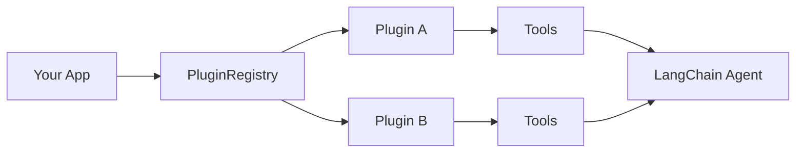

# Plugin System

The Standards Agent Kit includes a flexible plugin system that allows you to extend its functionality with custom tools and integrations. This guide explains how to create, load, and use plugins with the Standards Agent Kit.

## Diagram (How it fits)



## Overview

The plugin system enables you to:

- Add new LangChain tools to your agents
- Integrate with external APIs and services
- Organize related functionality into modular, reusable packages
- Load plugins from local directories or npm packages

## Core Components

The plugin system consists of several key components:

### PluginInterface

The `PluginInterface` defines the contract that all plugins must implement:

```typescript
export interface IPlugin {
  // Basic metadata
  id: string;
  name: string;
  description: string;
  version: string;
  author: string;
  
  // Lifecycle methods
  initialize(context: PluginContext): Promise<void>;
  cleanup?(): Promise<void>;
  
  // Functionality
  getTools(): StructuredTool[];
}

export interface PluginContext {
  logger: Logger;
  client: any;
  config: Record<string, any>;
}
```

### BasePlugin

The `BasePlugin` abstract class provides a foundation for creating plugins with common functionality:

```typescript
import { IPlugin, PluginContext } from './PluginInterface';
import { StructuredTool } from '@langchain/core/tools';

/**
 * Base class for plugins that provides common functionality
 */
export abstract class BasePlugin implements IPlugin {
  abstract id: string;
  abstract name: string;
  abstract description: string;
  abstract version: string;
  abstract author: string;
  
  protected context!: PluginContext;
  
  /**
   * Initialize the plugin with the provided context
   * @param context The plugin context
   */
  async initialize(context: PluginContext): Promise<void> {
    this.context = context;
  }
  
  /**
   * Get the tools provided by this plugin
   * @returns Array of LangChain tools
   */
  abstract getTools(): StructuredTool[];
}
```

### PluginRegistry

The `PluginRegistry` manages the lifecycle of plugins and provides access to their tools:

```typescript
import { IPlugin } from './PluginInterface';
import { StructuredTool } from '@langchain/core/tools';

/**
 * Registry for managing plugins
 */
export class PluginRegistry {
  private plugins: Map<string, IPlugin> = new Map();
  private logger: any;
  
  constructor(logger: any) {
    this.logger = logger;
  }
  
  /**
   * Register a plugin
   * @param plugin The plugin to register
   * @returns The registered plugin
   */
  registerPlugin(plugin: IPlugin): IPlugin {
    if (this.plugins.has(plugin.id)) {
      throw new Error(`Plugin with ID ${plugin.id} is already registered`);
    }
    
    this.plugins.set(plugin.id, plugin);
    this.logger.info(`Plugin registered: ${plugin.name} (${plugin.id})`);
    
    return plugin;
  }
  
  /**
   * Get a plugin by ID
   * @param id The ID of the plugin to get
   * @returns The plugin, or undefined if not found
   */
  getPlugin(id: string): IPlugin | undefined {
    return this.plugins.get(id);
  }
  
  /**
   * Get all registered plugins
   * @returns Array of all registered plugins
   */
  getAllPlugins(): IPlugin[] {
    return Array.from(this.plugins.values());
  }
  
  /**
   * Get all tools from all registered plugins
   * @returns Array of all tools from all plugins
   */
  getAllTools(): StructuredTool[] {
    return Array.from(this.plugins.values()).flatMap(plugin => plugin.getTools());
  }
  
  /**
   * Unregister a plugin
   * @param id The ID of the plugin to unregister
   * @returns true if the plugin was unregistered, false if it wasn't found
   */
  async unregisterPlugin(id: string): Promise<boolean> {
    const plugin = this.plugins.get(id);
    if (!plugin) {
      return false;
    }
    
    if (plugin.cleanup) {
      try {
        await plugin.cleanup();
      } catch (error) {
        this.logger.error(`Error during plugin cleanup: ${error}`);
      }
    }
    
    const result = this.plugins.delete(id);
    if (result) {
      this.logger.info(`Plugin unregistered: ${plugin.name} (${plugin.id})`);
    }
    
    return result;
  }
  
  /**
   * Unregister all plugins
   */
  async unregisterAllPlugins(): Promise<void> {
    const pluginIds = Array.from(this.plugins.keys());
    for (const id of pluginIds) {
      await this.unregisterPlugin(id);
    }
  }
}
```

### PluginLoader

The `PluginLoader` provides utilities for loading plugins from different sources:

```typescript
import { PluginContext } from './PluginInterface';
import * as fs from 'fs';
import * as path from 'path';
import { IPlugin } from './PluginInterface';

/**
 * Configuration for loading a plugin
 */
export interface PluginLoadOptions {
  /**
   * Whether to initialize the plugin after loading
   * @default true
   */
  initialize?: boolean;
}

/**
 * Utility for loading plugins from different sources
 */
export class PluginLoader {
  /**
   * Load a plugin from a directory
   * @param directory Path to the directory containing the plugin
   * @param context Context to provide to the plugin during initialization
   * @param options Options for loading the plugin
   * @returns The loaded plugin instance
   */
  static async loadFromDirectory(
    directory: string, 
    context: PluginContext, 
    options: PluginLoadOptions = { initialize: true }
  ): Promise<IPlugin> {
    // Implementation details...
  }
  
  /**
   * Load a plugin from an npm package
   * @param packageName Name of the npm package containing the plugin
   * @param context Context to provide to the plugin during initialization
   * @param options Options for loading the plugin
   * @returns The loaded plugin instance
   */
  static async loadFromPackage(
    packageName: string, 
    context: PluginContext, 
    options: PluginLoadOptions = { initialize: true }
  ): Promise<IPlugin> {
    // Implementation details...
  }
}
```

## Creating a Plugin

To create a plugin, you need to implement the `IPlugin` interface or extend the `BasePlugin` class. Here's a step-by-step guide:

### 1. Create a Plugin Class

```typescript
import { BasePlugin, PluginContext } from '@hashgraphonline/standards-agent-kit';
import { StructuredTool } from '@langchain/core/tools';
import { z } from 'zod';

// Create a custom tool
class MyCustomTool extends StructuredTool {
  name = 'my_custom_tool';
  description = 'Performs a custom operation';
  
  schema = z.object({
    input: z.string().describe('Input for the custom operation'),
  });
  
  constructor(private apiKey: string) {
    super();
  }
  
  async _call(input: z.infer<typeof this.schema>): Promise<string> {
    // Implement your tool's functionality here
    return `Processed: ${input.input}`;
  }
}

// Create the plugin class
export default class MyPlugin extends BasePlugin {
  id = 'my-custom-plugin';
  name = 'My Custom Plugin';
  description = 'Provides custom functionality';
  version = '1.0.0';
  author = 'Your Name';
  
  private apiKey: string = '';
  
  async initialize(context: PluginContext): Promise<void> {
    // Call the parent initialize method
    await super.initialize(context);
    
    // Get configuration from the context
    this.apiKey = context.config.myApiKey;
    
    if (!this.apiKey) {
      this.context.logger.warn('API key not provided. Tools may not function correctly.');
    }
  }
  
  getTools(): StructuredTool[] {
    return [
      new MyCustomTool(this.apiKey)
    ];
  }
  
  // Optional cleanup method
  async cleanup(): Promise<void> {
    // Perform any necessary cleanup
    this.context.logger.info('Cleaning up resources...');
  }
}
```

### 2. Create a Plugin Manifest

Create a `plugin.json` file in your plugin directory:

```json
{
  "id": "my-custom-plugin",
  "name": "My Custom Plugin",
  "description": "Provides custom functionality",
  "version": "1.0.0",
  "author": "Your Name",
  "main": "index.js"
}
```

### 3. Package Structure

Organize your plugin with the following structure:

```
my-custom-plugin/
├── plugin.json
├── index.js (or index.ts)
├── package.json
└── ... (other files)
```

## Loading and Using Plugins

### Loading from a Directory

```typescript
import { PluginLoader, PluginRegistry } from '@hashgraphonline/standards-agent-kit';
import { HCS10Client } from '@hashgraphonline/standards-agent-kit';
import { Logger } from 'winston';

// Create a logger
const logger = /* your logger instance */;

// Create the HCS10Client
const client = new HCS10Client(operatorId, operatorPrivateKey, network);

// Create a plugin registry
const registry = new PluginRegistry(logger);

// Create plugin context
const context = {
  logger,
  client,
  config: {
    myApiKey: process.env.MY_API_KEY
  }
};

// Load a plugin from a directory
const plugin = await PluginLoader.loadFromDirectory(
  './plugins/my-custom-plugin',
  context
);

// Register the plugin
registry.registerPlugin(plugin);

// Get all tools from all plugins
const tools = registry.getAllTools();

// Use the tools with LangChain
const agent = /* create your LangChain agent with tools */;
```

### Loading from an NPM Package

```typescript
import { PluginLoader, PluginRegistry } from '@hashgraphonline/standards-agent-kit';

// Create plugin context (as shown above)

// Load a plugin from an npm package
const plugin = await PluginLoader.loadFromPackage(
  'my-custom-plugin-package',
  context
);

// Register the plugin
registry.registerPlugin(plugin);
```

## Example Plugins

The Standards Agent Kit includes example plugins that demonstrate how to create and use plugins.

### Weather API Plugin

The Weather API plugin provides tools for getting current weather and forecasts:

```typescript
import { BasePlugin, PluginContext } from '../../../src/plugins';
import { StructuredTool } from '@langchain/core/tools';
import { z } from 'zod';
import axios from 'axios';

// Tool for getting current weather
class GetCurrentWeatherTool extends StructuredTool {
  name = 'get_current_weather';
  description = 'Get the current weather for a location';
  
  schema = z.object({
    location: z.string().describe('The city and state, e.g. San Francisco, CA'),
  });
  
  constructor(private apiKey: string) {
    super();
  }
  
  async _call(input: z.infer<typeof this.schema>): Promise<string> {
    // Implementation details...
  }
}

// Tool for getting weather forecast
class GetWeatherForecastTool extends StructuredTool {
  name = 'get_weather_forecast';
  description = 'Get the weather forecast for a location';
  
  schema = z.object({
    location: z.string().describe('The city and state, e.g. San Francisco, CA'),
    days: z.number().int().min(1).max(7).default(3).describe('Number of days for the forecast (1-7)'),
  });
  
  constructor(private apiKey: string) {
    super();
  }
  
  async _call(input: z.infer<typeof this.schema>): Promise<string> {
    // Implementation details...
  }
}

// Weather Plugin
export default class WeatherPlugin extends BasePlugin {
  id = 'weather-api';
  name = 'Weather API Plugin';
  description = 'Provides tools for getting weather information';
  version = '1.0.0';
  author = 'Hashgraph Online';
  
  private apiKey: string = '';
  
  async initialize(context: PluginContext): Promise<void> {
    await super.initialize(context);
    this.apiKey = context.config.weatherApiKey;
    
    if (!this.apiKey) {
      this.context.logger.warn('Weather API key not provided. Weather tools will not function correctly.');
    }
  }
  
  getTools(): StructuredTool[] {
    return [
      new GetCurrentWeatherTool(this.apiKey),
      new GetWeatherForecastTool(this.apiKey)
    ];
  }
}
```

### DeFi Integration Plugin

The DeFi Integration plugin provides tools for interacting with DeFi protocols on Hedera:

```typescript
import { BasePlugin, PluginContext } from '../../../src/plugins';
import { StructuredTool } from '@langchain/core/tools';
import { z } from 'zod';
import axios from 'axios';

// Tool for getting token price
class GetTokenPriceTool extends StructuredTool {
  name = 'get_token_price';
  description = 'Get the current price of a token on Hedera';
  
  schema = z.object({
    tokenId: z.string().describe('The Hedera token ID (e.g., 0.0.12345)'),
  });
  
  constructor(private client: any) {
    super();
  }
  
  async _call(input: z.infer<typeof this.schema>): Promise<string> {
    // Implementation details...
  }
}

// Tool for swapping tokens
class SwapTokensTool extends StructuredTool {
  name = 'swap_tokens';
  description = 'Swap one token for another on Hedera';
  
  schema = z.object({
    fromTokenId: z.string().describe('The ID of the token to swap from (e.g., 0.0.12345)'),
    toTokenId: z.string().describe('The ID of the token to swap to (e.g., 0.0.67890)'),
    amount: z.number().positive().describe('The amount of the source token to swap'),
  });
  
  constructor(private client: any) {
    super();
  }
  
  async _call(input: z.infer<typeof this.schema>): Promise<string> {
    // Implementation details...
  }
}

// Tool for checking token balance
class CheckTokenBalanceTool extends StructuredTool {
  name = 'check_token_balance';
  description = 'Check the balance of a token for an account on Hedera';
  
  schema = z.object({
    tokenId: z.string().describe('The Hedera token ID (e.g., 0.0.12345)'),
    accountId: z.string().optional().describe('The account ID to check (defaults to the operator account)'),
  });
  
  constructor(private client: any) {
    super();
  }
  
  async _call(input: z.infer<typeof this.schema>): Promise<string> {
    // Implementation details...
  }
}

// DeFi Plugin
export default class DeFiPlugin extends BasePlugin {
  id = 'defi-integration';
  name = 'DeFi Integration Plugin';
  description = 'Provides tools to interact with DeFi protocols on Hedera';
  version = '1.0.0';
  author = 'Hashgraph Online';
  
  getTools(): StructuredTool[] {
    return [
      new GetTokenPriceTool(this.context.client),
      new SwapTokensTool(this.context.client),
      new CheckTokenBalanceTool(this.context.client)
    ];
  }
}
```

## Integration Examples

### CLI Integration

```typescript
import { PluginLoader, PluginRegistry } from '@hashgraphonline/standards-agent-kit';
import { HCS10Client } from '@hashgraphonline/standards-agent-kit';
import * as dotenv from 'dotenv';

dotenv.config();

async function main() {
  // Initialize the HCS10Client
  const client = new HCS10Client(
    process.env.HEDERA_ACCOUNT_ID!,
    process.env.HEDERA_PRIVATE_KEY!,
    'testnet'
  );
  
  // Create a logger
  const logger = /* your logger instance */;
  
  // Create a plugin registry
  const registry = new PluginRegistry(logger);
  
  // Create plugin context
  const context = {
    logger,
    client,
    config: {
      weatherApiKey: process.env.WEATHER_API_KEY
    }
  };
  
  // Load plugins
  const weatherPlugin = await PluginLoader.loadFromDirectory(
    './plugins/weather',
    context
  );
  
  const defiPlugin = await PluginLoader.loadFromDirectory(
    './plugins/defi',
    context
  );
  
  // Register plugins
  registry.registerPlugin(weatherPlugin);
  registry.registerPlugin(defiPlugin);
  
  // Get all tools
  const tools = registry.getAllTools();
  
  console.log(`Loaded ${tools.length} tools from ${registry.getAllPlugins().length} plugins`);
  
  // Cleanup when done
  await registry.unregisterAllPlugins();
}

main().catch(console.error);
```

### LangChain Integration

```typescript
import { PluginLoader, PluginRegistry } from '@hashgraphonline/standards-agent-kit';
import { HCS10Client } from '@hashgraphonline/standards-agent-kit';
import { ChatOpenAI } from '@langchain/openai';
import { AgentExecutor, createOpenAIToolsAgent } from 'langchain/agents';
import { ChatPromptTemplate, MessagesPlaceholder } from '@langchain/core/prompts';
import { ConversationTokenBufferMemory } from 'langchain/memory';
import * as dotenv from 'dotenv';

dotenv.config();

async function main() {
  // Initialize the HCS10Client
  const client = new HCS10Client(
    process.env.HEDERA_ACCOUNT_ID!,
    process.env.HEDERA_PRIVATE_KEY!,
    'testnet'
  );
  
  // Create a logger
  const logger = /* your logger instance */;
  
  // Create a plugin registry
  const registry = new PluginRegistry(logger);
  
  // Create plugin context
  const context = {
    logger,
    client,
    config: {
      weatherApiKey: process.env.WEATHER_API_KEY
    }
  };
  
  // Load plugins
  const weatherPlugin = await PluginLoader.loadFromDirectory(
    './plugins/weather',
    context
  );
  
  // Register plugins
  registry.registerPlugin(weatherPlugin);
  
  // Get all tools
  const tools = registry.getAllTools();
  
  // Set up the LangChain agent
  const llm = new ChatOpenAI({ modelName: 'gpt-4o', temperature: 0 });
  const memory = new ConversationTokenBufferMemory({
    llm: llm,
    memoryKey: 'chat_history',
    returnMessages: true,
  });
  
  const prompt = ChatPromptTemplate.fromMessages([
    [
      'system',
      'You are an agent assistant with access to weather information. Use the available tools when appropriate.',
    ],
    new MessagesPlaceholder('chat_history'),
    ['human', '{input}'],
    new MessagesPlaceholder('agent_scratchpad'),
  ]);
  
  const agent = await createOpenAIToolsAgent({ llm, tools, prompt });
  const agentExecutor = new AgentExecutor({
    agent,
    tools,
    memory,
    verbose: true,
  });
  
  // Run the agent
  try {
    const result = await agentExecutor.invoke({
      input: "What's the weather like in New York today?",
    });
    console.log('Agent Output:', result.output);
  } catch (error) {
    console.error('Agent invocation failed:', error);
  }
  
  // Cleanup when done
  await registry.unregisterAllPlugins();
}

main().catch(console.error);
```

## Beginner checklist
- Keep plugin ids unique (e.g., `vendor-name/plugin-name`)
- Validate inputs with Zod in each tool; return clear messages
- Prefer small, focused plugins you can test in isolation

### Combining with Core Functionality

You can combine plugins with the core HCS-10 functionality:

```typescript
import { PluginLoader, PluginRegistry } from '@hashgraphonline/standards-agent-kit';
import { HCS10Client, RegisterAgentTool, FindRegistrationsTool } from '@hashgraphonline/standards-agent-kit';
import { ChatOpenAI } from '@langchain/openai';
import { AgentExecutor, createOpenAIToolsAgent } from 'langchain/agents';
import { ChatPromptTemplate, MessagesPlaceholder } from '@langchain/core/prompts';
import { ConversationTokenBufferMemory } from 'langchain/memory';
import * as dotenv from 'dotenv';

dotenv.config();

async function main() {
  // Initialize the HCS10Client
  const client = new HCS10Client(
    process.env.HEDERA_ACCOUNT_ID!,
    process.env.HEDERA_PRIVATE_KEY!,
    'testnet'
  );
  
  // Create a logger
  const logger = /* your logger instance */;
  
  // Create a plugin registry
  const registry = new PluginRegistry(logger);
  
  // Create plugin context
  const context = {
    logger,
    client,
    config: {
      weatherApiKey: process.env.WEATHER_API_KEY
    }
  };
  
  // Load plugins
  const weatherPlugin = await PluginLoader.loadFromDirectory(
    './plugins/weather',
    context
  );
  
  // Register plugins
  registry.registerPlugin(weatherPlugin);
  
  // Get plugin tools
  const pluginTools = registry.getAllTools();
  
  // Create core HCS-10 tools
  const coreTools = [
    new RegisterAgentTool(client),
    new FindRegistrationsTool(client)
  ];
  
  // Combine all tools
  const allTools = [...coreTools, ...pluginTools];
  
  // Set up the LangChain agent
  const llm = new ChatOpenAI({ modelName: 'gpt-4o', temperature: 0 });
  const memory = new ConversationTokenBufferMemory({
    llm: llm,
    memoryKey: 'chat_history',
    returnMessages: true,
  });
  
  const prompt = ChatPromptTemplate.fromMessages([
    [
      'system',
      'You are an agent assistant with access to HCS-10 functionality and weather information. Use the available tools when appropriate.',
    ],
    new MessagesPlaceholder('chat_history'),
    ['human', '{input}'],
    new MessagesPlaceholder('agent_scratchpad'),
  ]);
  
  const agent = await createOpenAIToolsAgent({ llm, tools: allTools, prompt });
  const agentExecutor = new AgentExecutor({
    agent,
    tools: allTools,
    memory,
    verbose: true,
  });
  
  // Run the agent
  try {
    const result = await agentExecutor.invoke({
      input: "Register me as 'WeatherAgent' and then tell me the weather in San Francisco.",
    });
    console.log('Agent Output:', result.output);
  } catch (error) {
    console.error('Agent invocation failed:', error);
  }
  
  // Cleanup when done
  await registry.unregisterAllPlugins();
}

main().catch(console.error);
```

## Plugin Design Considerations

When creating plugins for the Standards Agent Kit, consider these design principles:

- **Single Responsibility**: Focus each plugin on a specific domain or functionality
- **Clear Documentation**: Document your plugin's purpose, tools, and configuration requirements
- **Error Handling**: Implement robust error handling in your tools and plugin methods
- **Resource Management**: Use the `cleanup` method to release resources when your plugin is unregistered

For configuration management:

- Store sensitive information like API keys in environment variables
- Validate configuration during initialization and provide helpful error messages
- Implement fallbacks for missing configuration when possible

For testing:

- Write unit tests for your plugin and tools
- Test your plugin with the Standards Agent Kit to verify compatibility
- Use mocks for external services in tests to avoid dependencies

## Troubleshooting

Common issues when working with plugins:

- **Plugin Not Loading**: Ensure your plugin.json file is correctly formatted and the main file exists
- **Initialization Errors**: Check that your plugin's initialize method is handling the context correctly
- **Tool Execution Failures**: Verify that your tools have proper error handling and are receiving the expected inputs

For debugging:

- Use the logger provided in the plugin context to log debugging information
- Enable verbose mode in your LangChain agent to see detailed execution steps
- Test each component of your plugin separately to isolate issues
Source: https://github.com/hashgraph-online/standards-agent-kit/blob/main/src/plugins/PluginInterface.ts
Source: https://github.com/hashgraph-online/standards-agent-kit/blob/main/src/plugins/PluginRegistry.ts

## Next Steps

- Build core HCS workflows: [Builders](./builders.md)
- Add tool UIs and blocks: [Form-Driven Tools and HashLink Blocks](./tool-forms-and-hashlinks.md)
- Wire wallets: [Wallet Integration](./wallet-integration.md)
- Experiment quickly: [Examples](./examples.md)
