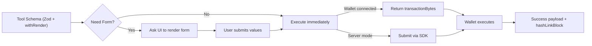

# Form-Driven Tools and HashLink Blocks

Design tools that collect the right inputs with forms, submit via wallet or server, and return a rich HashLink preview your UI can render.

What you’ll build
- Progressive forms from Zod (no hand‑built UI)
- Wallet‑aware tool execution (transaction bytes vs server)
- HashLink block previews for immediate visual feedback

Reference implementations
- Form patterns: InscribeHashinalTool (implements FormValidatable)
  - https://github.com/hashgraph-online/standards-agent-kit/blob/main/src/tools/inscriber/InscribeHashinalTool.ts
- Renderer: Desktop HashLinkBlockRenderer (sandboxed iframes, style injection)
  - https://github.com/hashgraph-online/desktop/blob/main/src/renderer/components/chat/HashLinkBlockRenderer.tsx

## Form-Driven Tools

The Agent Kit adds Zod form metadata and a FormValidatable interface so a tool can request a form when required inputs are missing or better collected via UI.

Mental model



Building blocks
- Zod render extensions: `extendZodSchema`, `withRender`, `renderConfigs`
  - https://github.com/hashgraph-online/standards-agent-kit/blob/main/src/lib/zod-render/schema-extension.ts
- FormValidatable interface: `shouldGenerateForm`, `getFormSchema`, `getEssentialFields`, `isFieldEmpty`
  - https://github.com/hashgraph-online/standards-agent-kit/blob/main/src/interfaces/FormValidatable.ts

Install
```ts
import { z } from 'zod';
import { StructuredTool } from '@langchain/core/tools';
import { extendZodSchema, renderConfigs } from '@hashgraphonline/standards-agent-kit/lib/zod-render';
import { FormValidatable } from '@hashgraphonline/standards-agent-kit/interfaces';
```

Example: a form-capable tool
```ts
class CreateProfileTool extends StructuredTool implements FormValidatable {
  name = 'create_profile';
  description = 'Create a profile with name and optional description';

  // Full input schema for programmatic calls
  schema = extendZodSchema(
    z.object({
      name: z.string().min(2).describe('Display name').withRender(renderConfigs.essential.text('Name', 'e.g., Alice')),
      description: z.string().max(280).optional().describe('Short bio').withRender(renderConfigs.textarea('Bio', 3)),
      renderForm: z.boolean().optional().default(true).describe('UI hint to render a form'),
    })
  ).withRender({ ui: { label: 'Create Profile' } });

  // Ask for a form when inputs are missing or user explicitly asked for UI
  shouldGenerateForm(input: unknown): boolean {
    const obj = (input ?? {}) as Record<string, unknown>;
    if ('renderForm' in obj && obj.renderForm === false) return false;
    return !obj || !obj['name'];
  }

  // Provide a focused schema for the UI (can differ from tool.schema)
  getFormSchema(): z.ZodSchema { return this.schema; }
  getEssentialFields(): string[] { return ['name']; }
  isFieldEmpty(_field: string, value: unknown): boolean { return !value || String(value).trim() === ''; }

  async _call(input: unknown): Promise<string> {
    const data = (input ?? {}) as { name?: string; description?: string };
    // ...perform creation. If wallet flows apply, return transactionBytes instead
    return JSON.stringify({ success: true, profile: { name: data.name, description: data.description } });
  }
}
```

Tips
- Use `withRender(renderConfigs.essential|advanced|expert.*)` to control field grouping.
- Implement `shouldGenerateForm()` to detect when to show the form (missing fields or explicit `renderForm: true`).
- For wallet flows, pair forms with the kit’s Wallet Integration to return `transactionBytes` when a wallet is present.

See also: Wallet Integration in this section for `SignerProviderRegistry` and `ByteBuildRegistry` patterns.

## Next Steps

- Wallet flows: [Wallet Integration](./wallet-integration.md)
- Tool catalog: [LangChain Tools](./langchain-tools.md)
- Try it live: [Examples](./examples.md)

## HashLink Blocks (HCS‑12)

Tools can return a HashLink block descriptor that a UI can render. InscribeHashinalTool returns:

```json
{
  "hashLinkBlock": {
    "blockId": "0.0.6617393",
    "hashLink": "hcs://12/0.0.6617393",
    "template": "0.0.6617393",
    "attributes": {
      "name": "Forever #1",
      "creator": "0.0.2659396",
      "topicId": "0.0.6715092",
      "hrl": "hcs://1/0.0.6715092",
      "network": "testnet"
    }
  }
}
```

- `blockId`: the HCS‑12 block topic with a template
- `template`: can be an on‑chain block id or literal HTML template
- `attributes`: substituted into the template (e.g., `{{name}}`, `{{hrl}}`)

Rendering in a UI
- Use `BlockLoader` from the Standards SDK to fetch a template by block id when `template` looks like a topic id, else treat `template` as HTML
- For safety, render in a sandboxed iframe; inject host styles if needed

Minimal renderer (BlockLoader)
```ts
import { BlockLoader, Logger } from '@hashgraphonline/standards-sdk'; // BlockLoader source: https://github.com/hashgraph-online/standards-sdk/blob/main/src/hcs-12/registries/block-loader.ts

async function renderBlock(block: { blockId: string; template: string; attributes: Record<string, unknown> }, network: 'mainnet'|'testnet') {
  const logger = new Logger({ module: 'HashLinkRenderer' });
  const loader = new BlockLoader(network, logger);
  let tpl = block.template;
  if (/^\d+\.\d+\.\d+$/.test(tpl)) {
    const data = await loader.loadBlock(tpl);
    tpl = data.template || '<div>Missing template</div>';
  }
  // naive substitution
  return Object.entries(block.attributes).reduce((html, [k, v]) => html.replaceAll(`{{${k}}}`, String(v ?? '')), tpl);
}
```

Production example
- Desktop app: `desktop/src/renderer/components/chat/HashLinkBlockRenderer.tsx`
  - Renders in a sandboxed iframe (default), or injects into host DOM
  - Copies host styles to the iframe for consistent look
  - Measures and auto‑resizes frame height, lazy‑loads images, provides UX controls (copy HRL, open hashscan, refresh)

## UX checklist

- Keep essential fields upfront; move rarer options to advanced/expert groups
- Validate content with clear, actionable messages (file size, MIME type, URL checks)
- Always return a concise success message plus a `hashLinkBlock` for visual confirmation
- Prefer sandbox iframe rendering for untrusted templates

## Developing HashLink Blocks

HashLink blocks are HCS‑12 “blocks” containing HTML templates rendered with runtime attributes.

Best practices
- Keep templates self‑contained (CSS + optional JS) and avoid external network calls where possible
- Use simple `{{var}}` placeholders for attributes you’ll substitute at render time
- Design for iframe sandboxing; avoid inline scripts that need elevated permissions
- Provide graceful fallbacks and accessible markup

Publish and iterate
- Use the Standards SDK HCS‑12 helpers to register blocks and manage assemblies
- See: Libraries → Standards SDK → HCS‑12 docs: Rendering, Blocks, Assembly, Actions

Linking from tools (example: InscribeHashinalTool)
- Provide a `hashLinkBlock` object alongside your primary result
- Include fields UI renderers expect: `blockId`, `template` (id or HTML), `hashLink`, `attributes`
- Consider adding `withHashLinkBlocks: true` tool option to toggle block output

## Wallet + Form UX together

- Start with a form (FormValidatable) to collect inputs
- Build `transactionBytes` via ByteBuildRegistry or a backend when a wallet is connected
- Return either `transactionBytes` for wallet execution or a server‑submitted result (with IDs/HRLs)
- After success, include a `hashLinkBlock` to give users a rich, interactive preview

References
- InscribeHashinalTool source: `standards-agent-kit/src/tools/inscriber/InscribeHashinalTool.ts`
- Desktop renderer: `desktop/src/renderer/components/chat/HashLinkBlockRenderer.tsx`
- Wallet Integration: this section’s “Wallet Integration” page
- HCS‑12 docs (Standards SDK): Rendering, Blocks, Assembly
