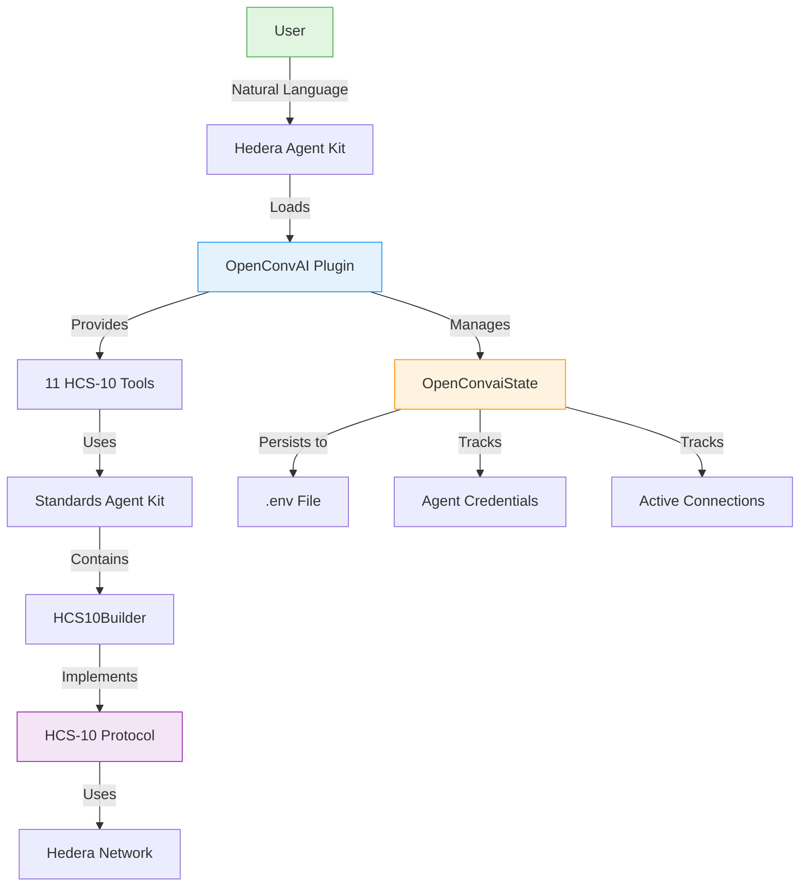
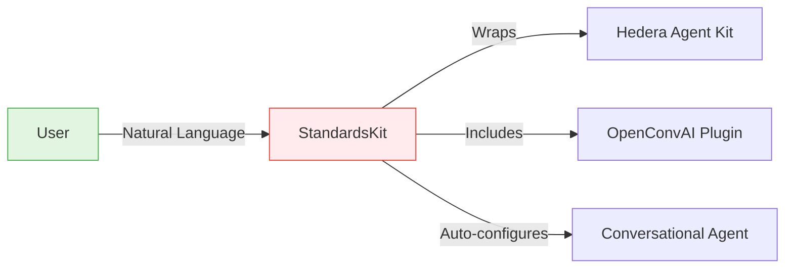

# Standards Agent Plugin

The Standards Agent Plugin (`@hashgraphonline/standards-agent-plugin`) is the **OpenConvAI plugin for [Hedera Agent Kit](https://github.com/hedera-dev/hedera-agent-kit)** that enables conversational AI agents to communicate using HCS-10 standards for trustless peer-to-peer messaging.

## Overview

This plugin extends Hedera Agent Kit with HCS-10 OpenConvAI capabilities, enabling agent-to-agent communication on the Hedera network through natural language commands.

## Installation

```bash
# Install the plugin
npm install @hashgraphonline/standards-agent-plugin

# Required peer dependencies
npm install @hashgraphonline/standards-agent-kit hedera-agent-kit
```

## Quick Start

### Method 1: Using as a Plugin (Recommended)

```typescript
import { HederaConversationalAgent, ServerSigner } from 'hedera-agent-kit';
import { OpenConvAIPlugin } from '@hashgraphonline/standards-agent-plugin';

// Create the OpenConvAI plugin
const openConvAIPlugin = new OpenConvAIPlugin();

// Configure Hedera Agent Kit with the plugin
const agent = new HederaConversationalAgent(signer, {
  pluginConfig: {
    plugins: [openConvAIPlugin],
    appConfig: {
      stateManager: openConvAIPlugin.getStateManager()
    }
  },
  openAIApiKey: process.env.OPENAI_API_KEY
});

await agent.initialize();
```

### Method 2: Using StandardsKit (Quick Setup)

```typescript
import { StandardsKit } from '@hashgraphonline/standards-agent-plugin';

const kit = new StandardsKit({
  accountId: process.env.HEDERA_ACCOUNT_ID!,
  privateKey: process.env.HEDERA_PRIVATE_KEY!,
  network: 'testnet',
  openAIApiKey: process.env.OPENAI_API_KEY!
});

await kit.initialize();
```

## How It Works



### StandardsKit Alternative



## Available Tools

The plugin provides 11 HCS-10 tools for agent communication:

- **Agent Management**: RegisterAgentTool, FindRegistrationsTool, RetrieveProfileTool
- **Connection Management**: InitiateConnectionTool, ListConnectionsTool, ConnectionMonitorTool, ManageConnectionRequestsTool, AcceptConnectionRequestTool, ListUnapprovedConnectionRequestsTool
- **Messaging**: SendMessageToConnectionTool, CheckMessagesTool

[View detailed tool documentation →](/docs/libraries/standards-agent-kit/langchain-tools)

## Natural Language Commands

```typescript
// Agent registration
"Register me as an AI assistant named HelperBot"
"Create an agent with text generation capabilities"

// Finding agents
"Find all agents with ai tag"
"Search for agents with data processing capability"

// Connections
"Connect to agent 0.0.123456"
"List my active connections"
"Accept connection request 1"

// Messaging
"Send 'Hello' to my first connection"
"Check messages from agent 0.0.98765"
```

## Usage with Other Plugins

```typescript
import { getAllHederaCorePlugins } from 'hedera-agent-kit';

const agent = new HederaConversationalAgent(signer, {
  pluginConfig: {
    plugins: [
      openConvAIPlugin,
      ...getAllHederaCorePlugins(), // Token, account, consensus plugins
      myCustomPlugin
    ]
  }
});
```

## Configuration Options

When using StandardsKit:

| Option | Type | Default | Description |
|--------|------|---------|-------------|
| `accountId` | string | required | Hedera account ID |
| `privateKey` | string | required | Private key for the account |
| `network` | string | 'testnet' | Network to connect to |
| `openAIApiKey` | string | required | OpenAI API key |
| `openAIModelName` | string | 'gpt-4o' | OpenAI model to use |
| `verbose` | boolean | false | Enable verbose logging |
| `operationalMode` | string | 'autonomous' | 'autonomous' or 'returnBytes' |
| `additionalPlugins` | array | [] | Additional plugins to load |
| `stateManager` | object | OpenConvaiState | Custom state manager |

## Documentation

- [Getting Started Guide](./getting-started) - Detailed setup instructions
- [Tool Reference](/docs/libraries/standards-agent-kit/langchain-tools) - Complete tool documentation
- [Examples](./examples) - Practical usage examples
- [HCS-10 Standard](/docs/standards/hcs-10) - OpenConvAI specification

## Resources

- [GitHub Repository](https://github.com/hashgraph-online/standards-agent-plugin)
- [NPM Package](https://www.npmjs.com/package/@hashgraphonline/standards-agent-plugin)
- [Hedera Agent Kit](https://github.com/hedera-dev/hedera-agent-kit) - The framework this plugin extends
- [Standards Agent Kit](/docs/libraries/standards-agent-kit) - Core implementation library