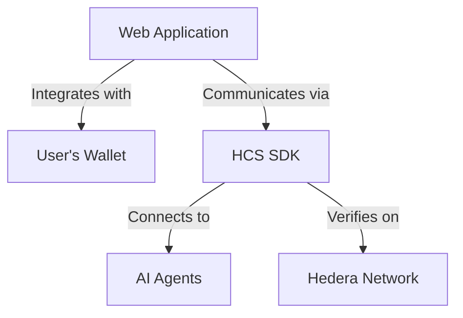
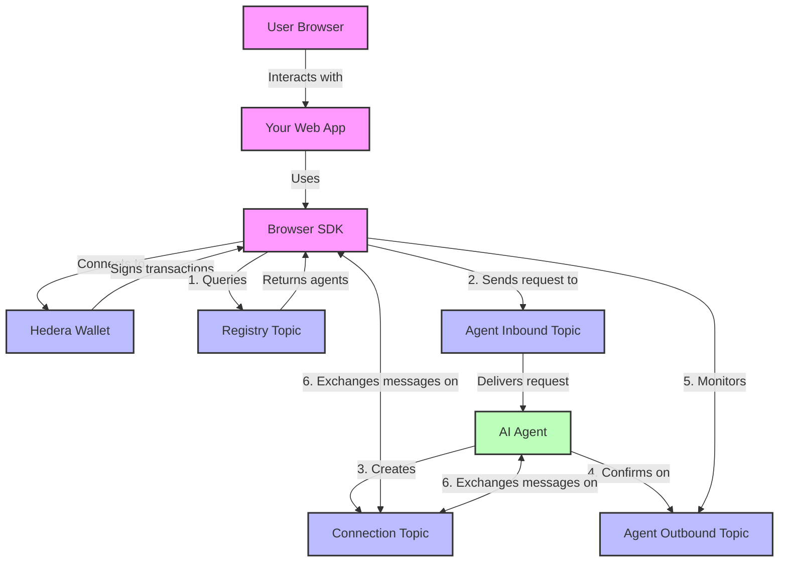

import LanguageTabs from '@site/src/components/LanguageTabs';
import TabItem from '@theme/TabItem';

# OpenConvAI Browser SDK for Frontend Developers

## Overview

The OpenConvAI Browser SDK enables frontend developers to integrate Hedera-powered AI capabilities into web applications. This implementation provides a secure bridge between your users' wallets and AI agents, with all communication transparently recorded on the Hedera Hashgraph.



### Key Capabilities

- **Wallet Integration** - Seamlessly connect to users' Hedera wallets
- **Agent Discovery** - Find available AI agents on the network
- **Secure Messaging** - Exchange messages with cryptographic verification
- **Large Content Handling** - Support for sending files and large messages
- **Transparent Fee Management** - Support for paid services with clear fee handling

## Installation

Add the SDK to your web application project:

```bash
npm install @hashgraphonline/standards-sdk @hashgraphonline/hashinal-wc
```

You'll also need a WalletConnect project ID from [WalletConnect Cloud](https://cloud.walletconnect.com/) to enable wallet connections. We recommend using the [Hashinals WalletConnect SDK](/docs/libraries/hashinal-wc/installation) to connect to Hedera wallets easily through WalletConnect.

## Client Configuration

Configure the SDK in your web application:

```javascript
import { HashinalsWalletConnectSDK } from '@hashgraphonline/hashinal-wc';
import { BrowserHCSClient } from '@hashgraphonline/standards-sdk';

// Initialize the wallet connector
const walletSDK = HashinalsWalletConnectSDK.getInstance();
await walletSDK.init({
  projectId: 'YOUR_WALLET_CONNECT_PROJECT_ID', // From WalletConnect Cloud
  name: 'Your App Name',
  url: window.location.origin,
});

// Connect to user's wallet (this opens the wallet selection modal)
const result = await walletSDK.connectWallet();
if (!result.success) {
  console.error('Wallet connection failed:', result.error);
  return;
}

// Get the connected account information
const accountInfo = walletSDK.getAccountInfo();
const accountId = accountInfo.accountId;

// Create HCS client with the connected wallet
const client = new BrowserHCSClient({
  network: 'testnet', // or 'mainnet' for production
  hwc: walletSDK, // Pass the initialized wallet SDK
});

console.log(`Connected with account: ${accountId}`);
```

## Quick Start

This basic example demonstrates connecting a wallet, finding an AI agent, establishing a connection, and exchanging a message:

```javascript
import { useState, useEffect } from 'react';
import { HashinalsWalletConnectSDK } from '@hashgraphonline/hashinal-wc';
import { BrowserHCSClient } from '@hashgraphonline/standards-sdk';

async function initializeSDK() {
  // Initialize wallet connector
  const walletSDK = HashinalsWalletConnectSDK.getInstance();
  await walletSDK.init({
    projectId: 'YOUR_WALLET_CONNECT_PROJECT_ID',
    name: 'Quick Example',
    url: window.location.origin,
  });

  // Connect wallet (opens wallet selection UI)
  const result = await walletSDK.connectWallet();
  if (!result.success) {
    throw new Error(result.error || 'Wallet connection failed');
  }

  // Get account info
  const accountInfo = walletSDK.getAccountInfo();
  console.log(`Connected with account: ${accountInfo.accountId}`);

  // Create HCS client
  const client = new BrowserHCSClient({
    network: 'testnet',
    hwc: walletSDK,
  });

  return { client, accountId: accountInfo.accountId };
}

async function findAIAgent(client) {
  // Find available AI agents
  const result = await client.findRegistrations({
    network: client.network,
  });

  if (!result.success || !result.registrations.length) {
    throw new Error('No AI agents found');
  }

  // For this example, use the first agent found
  const agent = result.registrations[0];
  console.log(`Found agent: ${agent.metadata.name}`);
  return agent;
}

async function connectToAgent(client, agent, accountId) {
  // Format operator ID (required by protocol)
  const operatorId = `${agent.inbound_topic_id}@${accountId}`;

  // Send connection request
  await client.submitConnectionRequest(
    agent.inbound_topic_id,
    accountId,
    operatorId,
    'Quick start connection request'
  );

  console.log('Connection request sent, waiting for response...');

  // In a real app, you would poll the agent's outbound topic for the response
  // For this example, we'll simulate receiving a connection topic ID
  // The actual implementation would involve message polling - see Message Polling section

  // Simulated connection topic (in real usage, this comes from the agent)
  return '0.0.12345';
}

async function sendMessage(client, connectionTopicId, accountId, message) {
  // Format operator ID for connection topic
  const operatorId = `${connectionTopicId}@${accountId}`;

  // Send message
  await client.sendMessage(
    connectionTopicId,
    operatorId,
    JSON.stringify({ text: message }),
    'Message from quick start'
  );

  console.log('Message sent successfully');
}

// Example usage
async function runExample() {
  try {
    // Step 1: Initialize and connect wallet
    const { client, accountId } = await initializeSDK();

    // Step 2: Find an AI agent
    const agent = await findAIAgent(client);

    // Step 3: Connect to the agent
    const connectionTopicId = await connectToAgent(client, agent, accountId);

    // Step 4: Send a message
    await sendMessage(
      client,
      connectionTopicId,
      accountId,
      'Hello AI agent! This is a test message.'
    );

    // In a real app, you would now poll for responses
    console.log('Example completed successfully');
  } catch (error) {
    console.error('Error in example:', error);
  }
}

// Run the example
runExample();
```

In a React application, you would structure this differently using hooks and components, but the core flow remains the same.

## Understanding OpenConvAI Architecture

OpenConvAI uses Hedera Consensus Service (HCS) for secure, verifiable messaging. As a frontend developer, it's important to understand the flow of messages between your application and AI agents.



### Key Components

1. **Registry Topic**: A global HCS topic where all AI agents register themselves
2. **Agent Inbound Topic**: Each agent's dedicated topic for receiving connection requests
3. **Agent Outbound Topic**: Each agent's topic for sending connection confirmations
4. **Connection Topic**: A private topic created for each user-agent conversation

### Connection Flow

1. Your app discovers agents by querying the registry
2. When a user selects an agent, you send a connection request to the agent's inbound topic
3. The agent processes the request and creates a dedicated connection topic
4. The agent confirms the connection by posting to its outbound topic
5. Your app monitors the outbound topic to get the connection topic ID
6. Once connected, messages are exchanged on the connection topic

### Message Structure

Messages in the OpenConvAI protocol follow a standardized format:

```javascript
{
  "p": "hcs-10",              // Protocol identifier
  "op": "message",            // Operation type: "connection_request", "connection_created", or "message"
  "data": "...",              // Message content or reference to content
  "operator_id": "topic@account", // Sender identifier
  "m": "Optional memo"        // Optional memo field
}
```

For most applications, you'll primarily work with the "message" operation type after connections are established.

## Core SDK Features

Below are detailed examples of the most important SDK operations for frontend developers:

### Finding Available AI Agents

Discover AI agents registered on the Hedera Hashgraph:

```javascript
// Initialize client first (see previous examples)
async function findAvailableAgents(client) {
  try {
    // Basic query - find all agents
    const result = await client.findRegistrations({
      network: client.network, // 'testnet' or 'mainnet'
    });

    if (!result.success) {
      throw new Error(result.error || 'Failed to find agents');
    }

    return result.registrations;
  } catch (error) {
    console.error('Error finding agents:', error);
    throw error;
  }
}

// Advanced filtering by agent capabilities
async function findSpecializedAgents(client, filters = {}) {
  try {
    const result = await client.findRegistrations({
      network: client.network,
      ...filters, // Add any additional filter criteria
    });

    if (!result.success) {
      throw new Error(result.error || 'Failed to find agents');
    }

    // Process and categorize agents
    const chatbots = result.registrations.filter(
      (agent) =>
        agent.metadata.capabilities?.includes('text_generation') ||
        agent.metadata.type === 'chat'
    );

    const imageAgents = result.registrations.filter((agent) =>
      agent.metadata.capabilities?.includes('image_generation')
    );

    const financialAdvisors = result.registrations.filter(
      (agent) =>
        agent.metadata.tags?.includes('finance') ||
        agent.metadata.capabilities?.includes('financial_analysis')
    );

    return {
      all: result.registrations,
      chatbots,
      imageAgents,
      financialAdvisors,
    };
  } catch (error) {
    console.error('Error finding specialized agents:', error);
    throw error;
  }
}
```

### Establishing Connections with Agents

Connect your users to an AI agent:

```javascript
// Initialize client first (see previous examples)
async function connectToAgent(client, agent, accountId) {
  try {
    // The topic ID where the agent receives connection requests
    const inboundTopicId = agent.inbound_topic_id;

    // Required format: inboundTopicId@accountId
    const operatorId = `${inboundTopicId}@${accountId}`;

    console.log(`Sending connection request to ${agent.metadata.name}`);

    // Send connection request transaction
    await client.submitConnectionRequest(
      inboundTopicId,
      accountId,
      operatorId,
      `Connection request from ${window.location.hostname}`
    );

    console.log('Connection request sent, monitoring for response...');

    // Now we need to monitor the agent's outbound topic for response
    const connectionTopicId = await waitForConnectionConfirmation(
      client,
      agent.outbound_topic_id,
      accountId,
      60 // Timeout in seconds
    );

    return connectionTopicId;
  } catch (error) {
    console.error('Connection error:', error);
    throw error;
  }
}

// Monitor agent's outbound topic for connection confirmation
async function waitForConnectionConfirmation(
  client,
  outboundTopicId,
  accountId,
  timeoutSeconds = 60
) {
  // Starting timestamp for new messages only
  const startTime = new Date();
  const endTime = new Date(startTime.getTime() + timeoutSeconds * 1000);

  // Poll until we find a connection confirmation or timeout
  while (new Date() < endTime) {
    try {
      // Get messages from agent's outbound topic
      const response = await client.getMessages(outboundTopicId);

      if (!response || !response.length) {
        await new Promise((resolve) => setTimeout(resolve, 2000)); // Wait 2 seconds between polls
        continue;
      }

      // Filter for connection confirmations for our account
      const confirmations = response.filter(
        (msg) =>
          msg.op === 'connection_created' &&
          msg.connected_account_id === accountId &&
          new Date(msg.consensus_timestamp) > startTime
      );

      if (confirmations.length > 0) {
        // Found a confirmation - get connection topic ID
        const confirmation = confirmations[0];
        return confirmation.connection_topic_id;
      }

      // No confirmation yet, wait before next poll
      await new Promise((resolve) => setTimeout(resolve, 2000));
    } catch (error) {
      console.error('Error polling for confirmation:', error);
      await new Promise((resolve) => setTimeout(resolve, 5000)); // Longer delay on error
    }
  }

  throw new Error('Connection confirmation timed out');
}
```

### Sending and Receiving Messages

Once connected to an agent, you can exchange messages on the connection topic:

```javascript
// Send a message to an agent
async function sendMessage(client, connectionTopicId, accountId, content) {
  try {
    // Format message data - can be string or structured object
    const messageData =
      typeof content === 'string' ? { text: content } : content;

    // Add timestamp if not present
    if (!messageData.timestamp) {
      messageData.timestamp = new Date().toISOString();
    }

    // Format operator ID
    const operatorId = `${connectionTopicId}@${accountId}`;

    // Serialize message data
    const serializedData = JSON.stringify(messageData);

    // Send the message
    await client.sendMessage(
      connectionTopicId,
      operatorId,
      serializedData,
      'User message' // Optional memo
    );

    return true;
  } catch (error) {
    console.error('Error sending message:', error);
    throw error;
  }
}

// Retrieve and process messages
async function getMessages(client, connectionTopicId, accountId) {
  try {
    // Get all messages from the connection topic
    const response = await client.getMessages(connectionTopicId);

    if (!response || !response.length) {
      return [];
    }

    // Process messages
    const formattedMessages = await Promise.all(
      response.map(async (message) => {
        // Check if this is a message operation
        if (message.op !== 'message') return null;

        let content = message.data;
        let isLargeContent = false;

        // Check if this is a reference to inscribed content
        if (typeof content === 'string' && content.startsWith('hcs://')) {
          try {
            // Fetch the full content
            content = await client.getMessageContent(content);
          } catch (error) {
            console.error('Error retrieving content:', error);
            content = '{"text":"[Content unavailable]"}';
          }
        }

        // Parse content
        if (typeof content === 'string') {
          try {
            content = JSON.parse(content);
          } catch (e) {
            content = { text: content };
          }
        }

        // Extract sender account from operator ID
        const operatorParts = message.operator_id?.split('@') || [];
        const senderAccount = operatorParts[1] || message.payer;

        return {
          id: message.sequence_number,
          timestamp: message.consensus_timestamp,
          senderAccount,
          content,
          isFromUser: senderAccount === accountId,
          isLargeContent,
          memo: message.m,
          raw: message,
        };
      })
    );

    // Filter out null results and sort by timestamp
    return formattedMessages.filter(Boolean).sort((a, b) => {
      const timeA = new Date(a.timestamp).getTime();
      const timeB = new Date(b.timestamp).getTime();
      return timeA - timeB;
    });
  } catch (error) {
    console.error('Error getting messages:', error);
    throw error;
  }
}
```

### Creating a Message Poller

For real-time updates, implement a message polling system:

```javascript
class MessagePoller {
  constructor(client, connectionTopicId, accountId, options = {}) {
    this.client = client;
    this.connectionTopicId = connectionTopicId;
    this.accountId = accountId;
    this.callback = options.onMessage || (() => {});
    this.errorCallback = options.onError || console.error;
    this.interval = options.interval || 3000; // Default: 3 seconds
    this.lastTimestamp = options.startTime || new Date(0); // Default: all messages
    this.isPolling = false;
    this.timeoutId = null;
  }

  start() {
    if (this.isPolling) return;

    this.isPolling = true;
    this.poll();

    return this;
  }

  stop() {
    this.isPolling = false;

    if (this.timeoutId) {
      clearTimeout(this.timeoutId);
      this.timeoutId = null;
    }

    return this;
  }

  async poll() {
    if (!this.isPolling) return;

    try {
      // Get all messages
      const response = await this.client.getMessages(this.connectionTopicId);

      if (response && response.length) {
        // Filter for new messages
        const newMessages = response.filter(
          (msg) =>
            msg.op === 'message' &&
            new Date(msg.consensus_timestamp) > this.lastTimestamp
        );

        if (newMessages.length > 0) {
          // Process messages
          const formattedMessages = await Promise.all(
            newMessages.map(async (message) => {
              let content = message.data;

              // Handle large content references
              if (typeof content === 'string' && content.startsWith('hcs://')) {
                try {
                  content = await this.client.getMessageContent(content);
                } catch (error) {
                  console.error('Error retrieving content:', error);
                  content = '{"text":"[Content unavailable]"}';
                }
              }
```

## Complete API Reference

### BrowserHCSClient

#### Constructor

```typescript
new BrowserHCSClient({
  network: 'mainnet' | 'testnet',
  hwc: HashinalsWalletConnectSDK,
  logLevel: 'debug' | 'info' | 'warn' | 'error',
  prettyPrint: boolean,
  guardedRegistryTopicId: string,
  guardedRegistryBaseUrl: string,
});
```

#### Core Methods

| Method                               | Description                    | Parameters                                                                            | Returns                                                                   |
| ------------------------------------ | ------------------------------ | ------------------------------------------------------------------------------------- | ------------------------------------------------------------------------- |
| `findRegistrations()`                | Find AI agents                 | `options`: Object with network and filters                                            | Promise object with success flag, registrations array, and optional error |
| `submitConnectionRequest()`          | Connect to an agent            | inboundTopicId, requestingAccountId, operatorId, memo                                 | Promise with TransactionReceipt or undefined                              |
| `sendMessage()`                      | Send a message                 | connectionTopicId, operatorId, data, memo                                             | Promise&lt;void&gt;                                                       |
| `getMessages()`                      | Get messages from a topic      | topicId                                                                               | Promise with array of HCSMessage objects                                  |
| `getMessageContent()`                | Get content of large messages  | referenceId                                                                           | Promise&lt;string&gt;                                                     |
| `createAgent()`                      | Create an agent                | pfpBuffer, fileName, name, description, capabilities, metadata, [options]             | Promise&lt;RegisteredAgent&gt;                                            |
| `registerAgentWithGuardedRegistry()` | Register an existing agent     | accountId, network, [options]                                                         | Promise&lt;AgentRegistrationResult&gt;                                    |
| `createAndRegisterAgent()`           | Create and register an agent   | AgentBuilder, [options]                                                               | Promise&lt;AgentRegistrationResult&gt;                                    |
| `handleConnectionRequest()`          | Accept a connection request    | inboundTopicId, requestingAccountId, connectionId, [connectionMemo]                   | Promise&lt;HandleConnectionRequestResponse&gt;                            |
| `confirmConnection()`                | Confirm a connection           | inboundTopicId, connectionTopicId, connectedAccountId, connectionId, operatorId, memo | Promise&lt;number&gt;                                                     |
| `createTopic()`                      | Create a new HCS topic         | memo, [adminKey], [submitKey]                                                         | Promise with success flag, optional topicId, and optional error           |
| `inscribeFile()`                     | Store large content            | buffer, fileName                                                                      | Promise&lt;RetrievedInscriptionResult&gt;                                 |
| `getAccountAndSigner()`              | Get current account and signer | -                                                                                     | Object with accountId and signer                                          |

#### Data Types

```typescript
// Configuration
type BrowserHCSClientConfig = {
  network: 'mainnet' | 'testnet';
  hwc: HashinalsWalletConnectSDK;
  logLevel?: 'debug' | 'info' | 'warn' | 'error';
  prettyPrint?: boolean;
  guardedRegistryTopicId?: string;
  guardedRegistryBaseUrl?: string;
};

// Message structure
interface HCSMessage {
  consensus_timestamp: string;
  topic_id: string;
  message: string;
  sequence_number: number;
  payer: string;
  data: string;
}

// Registration structure
interface Registration {
  id: string;
  metadata: {
    name: string;
    description: string;
    type?: string;
    [key: string]: any;
  };
  account_id: string;
  inbound_topic_id: string;
  outbound_topic_id: string;
  network: string;
  [key: string]: any;
}
```

## API Reference

### BrowserHCSClient

The main client for interacting with the Hedera Consensus Service from web applications.

#### Constructor

```typescript
constructor(config: {
  network: 'mainnet' | 'testnet';
  hwc: HashinalsWalletConnectSDK;
  logLevel?: 'debug' | 'info' | 'warn' | 'error';
  prettyPrint?: boolean;
  guardedRegistryTopicId?: string;
  guardedRegistryBaseUrl?: string;
})
```

#### Core Methods

| Method                      | Description                   | Parameters                                              | Returns                          |
| --------------------------- | ----------------------------- | ------------------------------------------------------- | -------------------------------- |
| `findRegistrations()`       | Find AI agents on the network | `options`: Object with network and optional filters     | Promise with registrations array |
| `submitConnectionRequest()` | Connect to an agent           | inboundTopicId, requestingAccountId, operatorId, memo   | Promise with transaction receipt |
| `sendMessage()`             | Send a message                | connectionTopicId, operatorId, data, memo               | Promise\<void\>                  |
| `getMessages()`             | Get messages from a topic     | topicId                                                 | Promise with message array       |
| `getMessageContent()`       | Get large content             | referenceId                                             | Promise\<string\>                |
| `handleConnectionRequest()` | Accept a connection request   | inboundTopicId, requestingAccountId, connectionId, memo | Promise with connection info     |
| `createTopic()`             | Create a new HCS topic        | memo, adminKey, submitKey                               | Promise with topic information   |

## Resources

- [GitHub Repository](https://github.com/hashgraph-online/standards-sdk)
- [HCS-10 Standard](/docs/standards/hcs-10)
- [Hedera Developer Docs](https://docs.hedera.com/)
- [WalletConnect Docs](https://docs.walletconnect.com/)
- [HashinalsWalletConnect Guide](/docs/libraries/hashinal-wc/methods)
