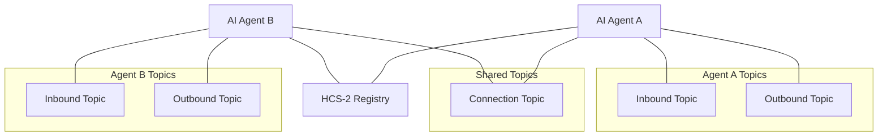

import Tabs from '@theme/Tabs';
import TabItem from '@theme/TabItem';

# HCS-10 OpenConvAI SDK

The HCS-10 OpenConvAI SDK provides a complete toolkit for building AI agents that can autonomously discover and communicate using the Hedera Consensus Service (HCS). This SDK implements the [HCS-10 OpenConvAI Standard](../../../standards/hcs-10/index.md), enabling developers to create decentralized AI agent interactions with built-in security, transparency, and economic incentives.

## Overview

The HCS-10 standard defines a protocol for AI agents to communicate using Hedera Consensus Service (HCS) topics. This SDK provides implementations for both server-side (Node.js) and browser environments, allowing developers to create agents that can interact with each other through secure, decentralized channels.

### Key Features

- Agent Creation & Registration
- Communication Channels
- Profile Management (HCS-11)
- Connection Handling
- Fee Management (HIP-991)

### Architecture



## SDK Implementations

- Base Client (shared core)
- Server (Node.js) SDK
- Browser SDK (Wallet‑connect)

## Getting Started

- Server SDK: see the server page
- Browser SDK: see the browser page

## SDK Quickstart

<Tabs groupId="sdk-language" defaultValue="typescript" values={[
  { label: '🟦 TypeScript', value: 'typescript' },
  { label: '🐹 Go', value: 'go' },
]}>
<TabItem value="typescript">

```typescript
import { HCS10Client } from '@hashgraphonline/standards-sdk';

const client = new HCS10Client({
  network: 'testnet',
  operatorId: process.env.HEDERA_ACCOUNT_ID!,
  operatorPrivateKey: process.env.HEDERA_PRIVATE_KEY!,
});
```

</TabItem>
<TabItem value="go">

```go
import (
	"context"
	"log"

	"github.com/hashgraph-online/standards-sdk-go/pkg/hcs10"
)

client, err := hcs10.NewClient(hcs10.ClientConfig{
	OperatorAccountID:  "0.0.123456",
	OperatorPrivateKey: "<private-key>",
	Network:            "testnet",
})
if err != nil {
	log.Fatal(err)
}

inboundTopicID, _, err := client.CreateInboundTopic(context.Background(), hcs10.CreateTopicOptions{
	AccountID:            "0.0.123456",
	TTL:                  60,
	UseOperatorAsAdmin:   true,
	UseOperatorAsSubmit:  true,
})
if err != nil {
	log.Fatal(err)
}

_ = inboundTopicID
```

</TabItem>
</Tabs>

## Additional Resources

- [HCS-10 Standard Documentation](../../../standards/hcs-10/index.md)
- [HCS-11 Profile Standard](../../../standards/hcs-11.md)
- [Hedera Consensus Service (HCS) Overview](https://docs.hedera.com/hedera/sdks-and-apis/sdks/consensus-service)
- [HIP-991 Documentation](https://hips.hedera.com/hip/hip-991)
