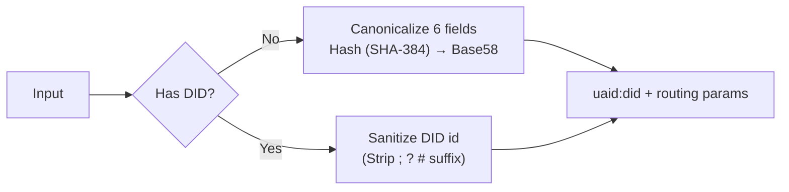
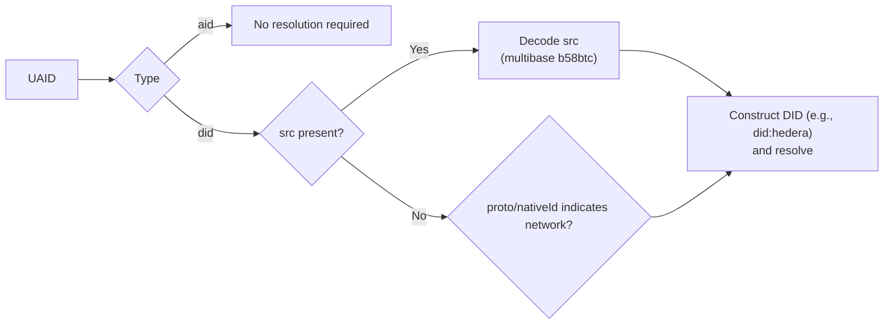

# HCS‑14: Universal Agent Identifier (UAID)

HCS‑14 gives agents a single, portable identifier that works across Web2 and Web3. The SDK is network‑agnostic by default, with optional Hedera integrations.

- AID target (`uaid:aid:`) – deterministic from canonical agent data
- DID target (`uaid:did:`) – wraps an existing W3C DID and adds routing

> Note
> You do not need a Hedera account. UAID creation for Web2/EVM and wrapping existing DIDs are fully offline. Hedera is only needed if you choose to issue/resolve `did:hedera`.

## TL;DR Quickstart

Generate a UAID in three common situations.

```ts
import { HCS14Client } from '@hashgraphonline/standards-sdk';
const hcs14 = new HCS14Client();

// 1) No DID yet (Web2/EVM)
const uaidAid = await hcs14.createUaid(
  {
    registry: 'acme',
    name: 'Support',
    version: '1.0.0',
    protocol: 'a2a',
    nativeId: 'acme.example',
    skills: [0, 17],
  },
  { uid: 'support' },
);

// 2) Already have a DID
const uaidDid = hcs14.createUaid('did:web:agent.example', {
  uid: 'bot',
  proto: 'a2a',
  nativeId: 'agent.example',
});

// 3) (Optional) Issue Hedera DID and generate UAID
// requires a configured Hedera client
const did = await hcs14.createDid({ method: 'hedera', client });
const { uaid } = await hcs14.createDidWithUaid({ issue: { method: 'hedera', client }, proto: 'hcs-10' });
```

## Visual Overview

UAID generation



UAID resolution



## Next Steps

- UAID generation details: routing parameters and canonical schema
- Adapters: issuers and resolvers
- Hedera (optional): issue and resolve `did:hedera`
- Recipes: copy‑paste examples for Web2, EVM, and HCS‑11
- API reference and troubleshooting
