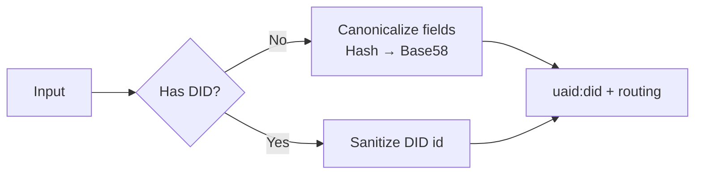

# HCS‑14: Universal Agent Identifier (UAID)

HCS‑14 gives agents a single, portable identifier that works across Web2 and Web3. The SDK is network‑agnostic by default, with optional Hedera integrations.

- AID target (`uaid:aid:`) – deterministic from canonical agent data
- DID target (`uaid:did:`) – wraps an existing W3C DID and adds routing

> You do not need a Hedera account. UAID creation for Web2/EVM and wrapping existing DIDs are fully offline. Hedera is only needed if you choose to issue/resolve `did:hedera`.

## Quickstart

Generate a UAID in three common situations.

```ts
import { HCS14Client } from '@hashgraphonline/standards-sdk';
const hcs14 = new HCS14Client();

// AID: no DID yet
const uaidAid = await hcs14.createUaid(
  { registry: 'acme', name: 'Support', version: '1.0.0', protocol: 'a2a', nativeId: 'acme.example', skills: [0,17] },
  { uid: 'support' },
);
```

## Visual Overview

UAID generation


