import Tabs from '@theme/Tabs';
import TabItem from '@theme/TabItem';


# HCS‑14: Universal Agent Identifier (UAID)

HCS‑14 gives agents a single, portable identifier that works across Web2 and Web3. The SDK is network‑agnostic by default, with optional Hedera integrations.

- AID target (`uaid:aid:`) – deterministic from canonical agent data
- DID target (`uaid:did:`) – wraps an existing W3C DID and adds routing

> You do not need a Hedera account. UAID creation for Web2/EVM and wrapping existing DIDs are fully offline. Hedera is only needed if you choose to issue/resolve `did:hedera`.

## Quickstart

Generate a UAID in three common situations.

```ts
import { HCS14Client } from '@hashgraphonline/standards-sdk';
const hcs14 = new HCS14Client();

// AID: no DID yet
const uaidAid = await hcs14.createUaid(
  { registry: 'acme', name: 'Support', version: '1.0.0', protocol: 'a2a', nativeId: 'acme.example', skills: [0,17] },
  { uid: 'support' },
);
```

## Visual Overview

UAID generation

```mermaid
flowchart LR
  A[Input] --> B{"Has DID?"}
  B -->|No| C["Canonicalize fields\nHash → Base58"]
  C --> D["uaid:aid + routing"]
  B -->|Yes| E["Sanitize DID id"]
  E --> D["uaid:did + routing"]
```



## Go SDK

The Go SDK provides equivalent functionality for this standard.

### Installation

```bash
go get github.com/hashgraph-online/standards-sdk-go@latest
```

### Go Quickstart

<Tabs groupId="sdk-language" defaultValue="go" values={[
  { label: '🐹 Go', value: 'go' },
]}>
<TabItem value="go">

```go
import (
	"context"
	"fmt"
	"log"
	"github.com/hashgraph-online/standards-sdk-go/pkg/hcs14"
)

client := hcs14.NewClient(hcs14.ClientOptions{})

// Resolve a UAID
result, err := client.Resolve(context.Background(), "uaid:did:example:123")
if err != nil {
	log.Fatal(err)
}
fmt.Printf("Resolved: %v, Profile: %s\n", result.Metadata.Resolved, result.Metadata.Profile)

// Resolve via specific profile
dnsResult, err := client.ResolveUAIDDNSWeb(context.Background(), "uaid:did:example:123")
if err != nil {
	log.Fatal(err)
}
fmt.Printf("DNS Web: %v\n", dnsResult)
```

</TabItem>
</Tabs>

:::tip
See the [Go SDK Overview](/docs/libraries/go-sdk/overview) for environment setup, supported packages, and testing instructions.
:::
