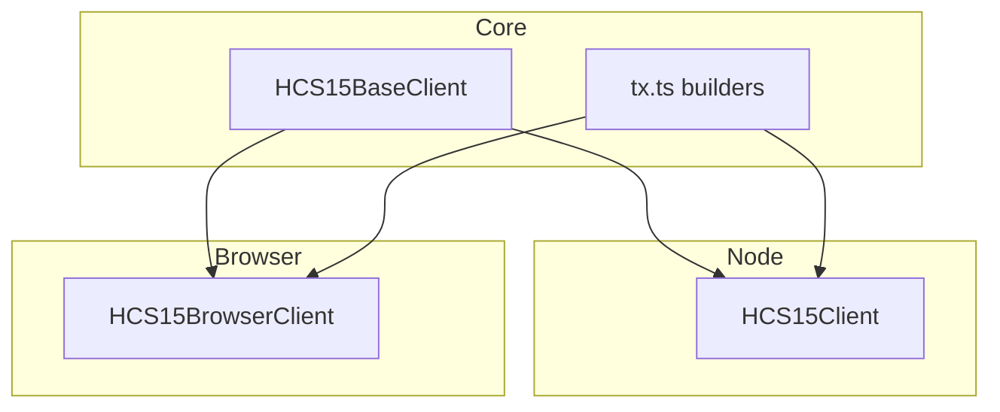

import Tabs from '@theme/Tabs';
import TabItem from '@theme/TabItem';


HCS‑15 introduces Petal accounts: lightweight sub‑accounts that share the same private key as a user’s base account. Petals let you isolate identity, balances, and app state per experience while keeping a single signing key.

## What HCS‑15 Enables

- Multiple on‑chain personas under one key (e.g., per‑app profiles)
- Isolated balances and escrows per Petal
- Consistent signing and authorization via a single private key

## Who Is This For?

- Apps that want separate “personas” (gaming, finance, social) under one wallet
- Teams that need clean accounting per experience without multiple seed phrases
- Users who want isolation without additional key management

## Architecture



- Base client exposes verification and shared utilities.
- Environment‑specific clients handle signing and submission:
  - `HCS15Client` (Node) uses operator credentials
  - `HCS15BrowserClient` (Browser) uses a connected wallet (`DAppSigner`)
- All transactions are assembled by `tx.ts` builders (no JSON assembly in clients).

## When To Use (and Not Use)

- Use when you need separate account ids for isolation or quotas under one owner
- Don’t use if each persona needs a different signing key (use fully separate accounts instead)

## Costs and Limits

- Creating accounts costs HBAR (initial balance + fees)
- Petals reuse the base key, so no extra key custody required

## Quickstart (Copy/Paste)

```ts
import { HCS15Client } from '@hashgraphonline/standards-sdk';
const c = new HCS15Client({ network: 'testnet', operatorId, operatorKey });
const base = await c.createBaseAccount({ initialBalance: 10 });
await c.createPetalAccount({ basePrivateKey: base.privateKey });
```

## FAQ

- Is a Petal truly independent? It has its own account id and balance but shares the same signing key.
- Can I revoke a Petal? Move funds out and stop using it; key custody is shared, so revocation is social/operational.

## Where to Next

1. Node SDK: [/docs/libraries/standards-sdk/hcs-15/server](/docs/libraries/standards-sdk/hcs-15/server)
2. Browser SDK: [/docs/libraries/standards-sdk/hcs-15/browser](/docs/libraries/standards-sdk/hcs-15/browser)
3. Transactions: [/docs/libraries/standards-sdk/hcs-15/tx](/docs/libraries/standards-sdk/hcs-15/tx)
4. API Reference: [/docs/libraries/standards-sdk/hcs-15/api](/docs/libraries/standards-sdk/hcs-15/api)

## Go SDK

The Go SDK provides equivalent functionality for this standard.

### Installation

```bash
go get github.com/hashgraph-online/standards-sdk-go@latest
```

### Go Quickstart

<Tabs groupId="sdk-language" defaultValue="go" values={[
  { label: '🐹 Go', value: 'go' },
]}>
<TabItem value="go">

```go
import (
	"context"
	"fmt"
	"github.com/hashgraph-online/standards-sdk-go/pkg/hcs15"
)

client, err := hcs15.NewClient(hcs15.ClientConfig{
	OperatorAccountID:  "0.0.123456",
	OperatorPrivateKey: "<private-key>",
	Network:            "testnet",
})
if err != nil {
	panic(err)
}

// Create a base account
base, err := client.CreateBaseAccount(context.Background(), hcs15.BaseAccountCreateOptions{
	InitialBalanceHbar: 10,
})
if err != nil {
	panic(err)
}
fmt.Printf("Base Account: %s\n", base.AccountID)

// Create a petal account from the base key
petal, err := client.CreatePetalAccount(context.Background(), hcs15.PetalAccountCreateOptions{
	BasePrivateKey: base.PrivateKeyRaw,
})
if err != nil {
	panic(err)
}
fmt.Printf("Petal Account: %s\n", petal.AccountID)

// Verify petal belongs to base
valid, _ := client.VerifyPetalAccount(context.Background(), petal.AccountID, base.AccountID)
fmt.Printf("Verified: %v\n", valid)
```

</TabItem>
</Tabs>

:::tip
See the [Go SDK Overview](/docs/libraries/go-sdk/overview) for environment setup, supported packages, and testing instructions.
:::
