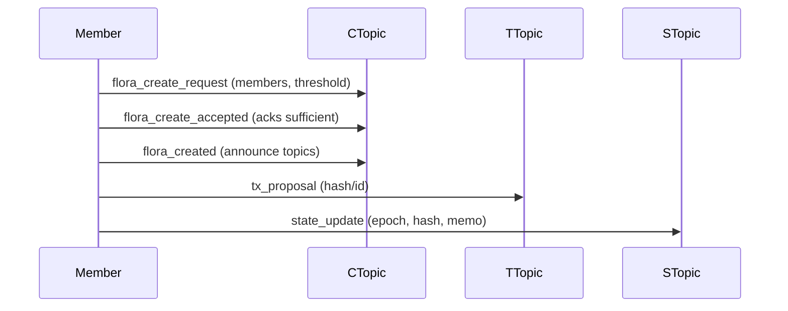

import LanguageTabs from '@site/src/components/LanguageTabs';
import TabItem from '@theme/TabItem';


HCS‑16 defines coordination primitives for Flora accounts: multi‑member accounts built out of HCS‑15 Petals. Each Flora runs on three dedicated topics and exchanges a small set of standardized messages to initialize membership, coordinate transactions, and publish state.

This page explains the “why” and “how” before you touch code.

## What HCS‑16 Solves

- Creates a predictable skeleton for multi‑member accounts on Hedera
- Separates concerns across three topics so readers/indexers stay simple
- Uses explicit, typed operations so flows are auditable and replayable

## The Three Topics

- Communication Topic (CTopic): human/agent coordination and lifecycle messages
- Transaction Topic (TTopic): transaction intents and proposals
- State Topic (STopic): compact state updates (often paired with HCS‑17 hashes)

All topics use numeric‑enum memos per spec for consistent discovery by indexers.

## Core Operations

- flora_create_request → flora_create_accepted → flora_created
- tx_proposal (proposal for a scheduled tx or batched actions)
- state_update (compact state change; often includes/aligns with HCS‑17)
- flora_join_request → flora_join_vote → flora_join_accepted

## Typical Lifecycle



## SDK Design

- Environment‑specific clients (Node/Browser) wrap the same base logic
- All transactions are assembled in `tx.ts` (no JSON assembly in clients)
- Browser flows use wallet signing (`freezeWithSigner`/`executeWithSigner`)

Continue with the Node or Browser guides for step‑by‑step flows.

## Go SDK

The Go SDK provides equivalent functionality for this standard.

### Installation

```bash
go get github.com/hashgraph-online/standards-sdk-go@latest
```

### Go Quickstart

<LanguageTabs>
<TabItem value="go">

```go
import (
	"context"
	"fmt"
	"log"
	"github.com/hashgraph-online/standards-sdk-go/pkg/hcs16"
)

client, err := hcs16.NewClient(hcs16.ClientConfig{
	OperatorAccountID:  "0.0.123456",
	OperatorPrivateKey: "<private-key>",
	Network:            "testnet",
})
if err != nil {
	log.Fatal(err)
}

// Create a Flora account with all three topics
result, err := client.CreateFloraAccountWithTopics(
	context.Background(),
	hcs16.CreateFloraAccountWithTopicsOptions{
		Members:   []string{"0.0.111", "0.0.222"},
		Threshold: 2,
	},
)
if err != nil {
	log.Fatal(err)
}
fmt.Printf("Flora Account: %s\n", result.FloraAccountID)
fmt.Printf("CTopic: %s, TTopic: %s, STopic: %s\n",
	result.Topics.Communication, result.Topics.Transaction, result.Topics.State)
```

</TabItem>
</LanguageTabs>

:::tip
See the [Go SDK Overview](/docs/libraries/go-sdk/overview) for environment setup, supported packages, and testing instructions.
:::
