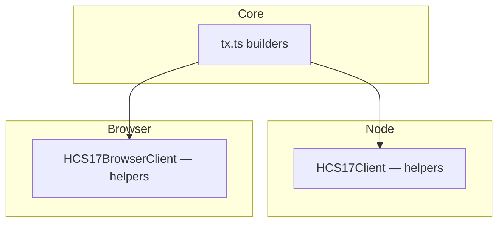

import LanguageTabs from '@site/src/components/LanguageTabs';
import TabItem from '@theme/TabItem';


HCS‑17 standardizes how applications publish compact, verifiable state updates. Each message carries a state hash, the producing account, and references to the topics that define the state boundary.

Use HCS‑17 when you want a simple, canonical feed of “what changed” that anyone can verify independently.

## Who Is This For?

- Teams who need a trustworthy “snapshot” of state without exposing all raw data
- Projects coordinating many accounts or topics (guilds, formations, DAOs, apps)
- Auditors and indexers that must verify integrity quickly

If you just need to publish raw events, use your domain standard directly. If you need a concise fingerprint that proves the current state, add HCS‑17.

## What HCS‑17 Provides

- Canonical memo for state topics so indexers can discover them
- A fixed message envelope (`p/op/state_hash/account_id/timestamp/m`)
- Simple builders for topic creation and message submission

## Architecture



- Builders assemble the exact JSON payload and Hedera transactions.
- Environment‑specific helpers wrap execution (operator client vs. wallet signer).

## Plain‑Language Data Model

- State hash: a “fingerprint” of what matters now
- Topic list: which data sources were included (by topicId)
- Account id: who claims this state
- Timestamp: when the claim was made

Anyone can re‑compute the hash from the same ingredients and confirm it matches.

## Message Shape

```json
{
  "p": "hcs-17",
  "op": "state_hash",
  "state_hash": "...",
  "topics": ["0.0.600", "0.0.601"],
  "account_id": "0.0.123",
  "timestamp": "ISO-8601",
  "m": "optional memo"
}
```

## When To Use (and Not Use)

- Use when you need a compact proof of state that others can verify
- Use alongside domain events (e.g., HCS‑16 state_update) to give indexers confidence
- Don’t use as a replacement for raw data; hashes can’t reveal the content they summarize

## Costs, Limits, and Trust

- Costs: HCS message/fractional fees to publish; mirror reads are free
- Limits: keep topic lists reasonable; more topics → slightly more compute to verify
- Trust: verifiers independently compute the same SHA‑384 hash over the same inputs

## Quickstart (Copy/Paste)

<LanguageTabs>
<TabItem value="typescript">

```ts
import { HCS17Client } from '@hashgraphonline/standards-sdk';

const c = new HCS17Client({ network: 'testnet', operatorId, operatorKey });
const stateTopicId = await c.createStateTopic({ ttl: 86400 });
const { stateHash } = await c.computeAndPublish({
  accountId: operatorId,
  accountPublicKey: '…',
  topics: ['0.0.2001','0.0.2002'],
  publishTopicId: stateTopicId,
});
```

</TabItem>
<TabItem value="go">

```go
import (
	"context"
	"fmt"
	"github.com/hashgraph-online/standards-sdk-go/pkg/hcs17"
)

client, _ := hcs17.NewClient(hcs17.ClientConfig{
	OperatorAccountID:  "0.0.123456",
	OperatorPrivateKey: "<private-key>",
	Network:            "testnet",
})

topicID, _ := client.CreateStateTopic(context.Background(), hcs17.CreateTopicOptions{TTL: 86400})

result, _ := client.ComputeAndPublish(context.Background(), hcs17.ComputeAndPublishOptions{
	AccountID:      "0.0.123456",
	Topics:         []string{"0.0.2001", "0.0.2002"},
	PublishTopicID: topicID,
	Memo:           "state snapshot",
})
fmt.Printf("State Hash: %s\n", result.StateHash)
```

</TabItem>
</LanguageTabs>

## FAQ

- What if a topic goes missing? Remove it from the list and recompute; consumers will see a different hash and topic list.
- Can I include off‑chain data? Hash it into a dedicated HCS topic first, then include that topic’s running hash.

## Where to Next

- Transactions: /docs/libraries/standards-sdk/hcs-17/tx
- Server (Node): /docs/libraries/standards-sdk/hcs-17/server
- Browser: /docs/libraries/standards-sdk/hcs-17/browser
- Base Client: /docs/libraries/standards-sdk/hcs-17/base-client
- API Reference: /docs/libraries/standards-sdk/hcs-17/api

