import Tabs from '@theme/Tabs';
import TabItem from '@theme/TabItem';

HCS‑18 is the open discovery layer for Petal accounts. Petals announce themselves, propose a Flora, respond, complete, or withdraw — all on a single discovery topic — then hand off to HCS‑16 to actually create the Flora and initialize topics.

## Why HCS‑18?

- Permissionless, shared airwaves for Petal discovery
- Minimal, typed messages that are easy to index
- A clean hand‑off to HCS‑16 for creation and coordination

## Who Is This For?

- Developers who want “find and form” behavior for multi‑party accounts
- Wallets/dApps that help users join group accounts without bespoke servers
- Indexers that need a single, public feed of discovery activity

## Architecture

```mermaid
graph TD
  subgraph Core
    B[HCS18BaseClient]
    T[tx.ts builders]
  end
  subgraph Node
    N[HCS18Client]
    H16[HCS‑16 / Flora manager]
  end
  subgraph Browser
    W[HCS18BrowserClient]
  end
  B --> N
  B --> W
  T --> N
  T --> W
  N -->|announce/propose/respond/complete/withdraw| D[(Discovery Topic)]
  W -->|announce/propose/respond/complete/withdraw| D
  N -->|create Flora| H16
```



## The Discovery Memo

Discovery topics embed a protocol tag and optional TTL hint:

```
hcs-18:0[:ttl]
```

Treat TTL as a freshness hint for UIs/services; it doesn’t prune network history.

## A Day in the Life

1. Petals announce: name, priority, capabilities, optional `valid_for`
2. One Petal proposes: members, threshold, purpose
3. Members respond: accept/reject (optional reason)
4. Proposer creates the Flora via HCS‑16 and emits `complete` with account + topics

You decide what “enough acceptance” means (e.g., non‑proposers accepted ≥ threshold − 1).

## Message Cheat‑Sheet

- announce: who I am, capabilities, optional expiry
- propose: intended members and threshold
- respond: accept or reject
- complete: the new Flora’s account and topics
- withdraw: step back from a pending proposal

## Design Notes

- Ordering: rely on HCS sequence; persist last seen and resume
- Timing: mirror reads are eventually consistent; poll with backoff
- Identity: announcements are assertions; tie into HCS‑11 profiles or HCS‑14 UAIDs if you need stronger provenance
- UX: show counts and freshness; highlight stale announcements

## Costs, Limits, and Trust

- Costs: each message is an HCS publish; reuse a common public discovery topic
- Limits: keep payloads small (ids + simple fields)
- Trust: proposals are assertions; verify identities via HCS‑11 profiles or HCS‑14 UAIDs if needed

## Quickstart (Copy/Paste)

```ts
import { HCS18Client } from '@hashgraphonline/standards-sdk';
const d = new HCS18Client({ network: 'testnet', operatorId, operatorKey });
const topicId = (await d.createDiscoveryTopic({ ttlSeconds: 300 })).topicId!;
await d.announce({ discoveryTopicId: topicId, data: { account: operatorId, petal: { name: 'A', priority: 700 }, capabilities: { protocols: ['hcs-16','hcs-18'] } } });
```

<Tabs groupId="sdk-language" defaultValue="typescript" values={[
  { label: '🟦 TypeScript', value: 'typescript' },
  { label: '🐹 Go', value: 'go' },
]}>
<TabItem value="typescript">

```typescript
import { HCS18Client } from '@hashgraphonline/standards-sdk';
const client = new HCS18Client({ network: 'testnet', operatorId, operatorKey });
```

</TabItem>
<TabItem value="go">

```go
import (
	"context"
	"log"

	"github.com/hashgraph-online/standards-sdk-go/pkg/hcs18"
)

client, err := hcs18.NewClient(hcs18.ClientConfig{
	OperatorAccountID:  "0.0.123456",
	OperatorPrivateKey: "<private-key>",
	Network:            "testnet",
})
if err != nil {
	log.Fatal(err)
}

topicID, _, err := client.CreateDiscoveryTopic(context.Background(), hcs18.CreateDiscoveryTopicOptions{
	TTLSeconds:         300,
	UseOperatorAsAdmin: true,
	UseOperatorAsSubmit: true,
})
if err != nil {
	log.Fatal(err)
}

_ = topicID
```

</TabItem>
</Tabs>

## FAQ

- Can anyone post? Yes, it’s meant to be permissionless (use TTL and profiles to filter).
- How do we prevent spam? UIs can filter by reputation/profile and show freshness/acceptance.

## Where to Next

- Server (Node): /docs/libraries/standards-sdk/hcs-18/server
- Browser: /docs/libraries/standards-sdk/hcs-18/browser
- Base Client: /docs/libraries/standards-sdk/hcs-18/base-client
- Transactions: /docs/libraries/standards-sdk/hcs-18/tx
- API Reference: /docs/libraries/standards-sdk/hcs-18/api
