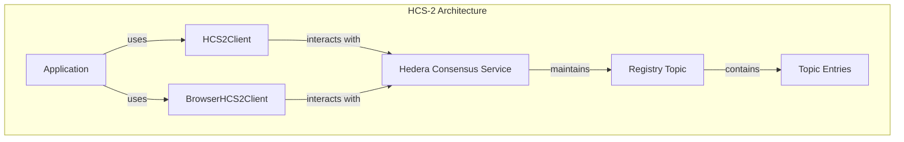
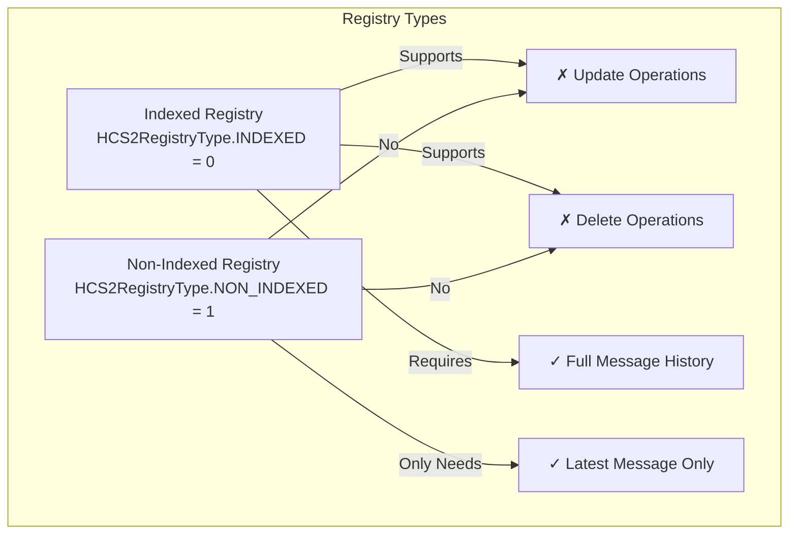
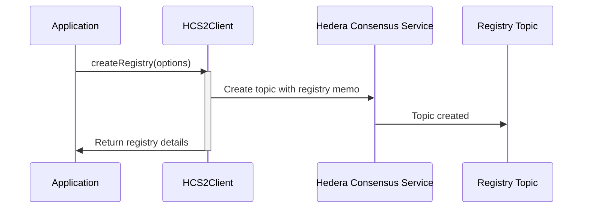
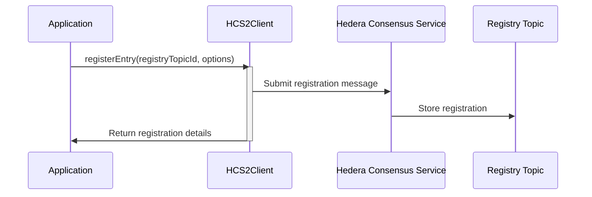
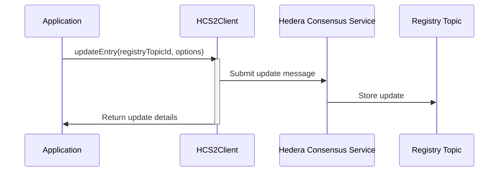
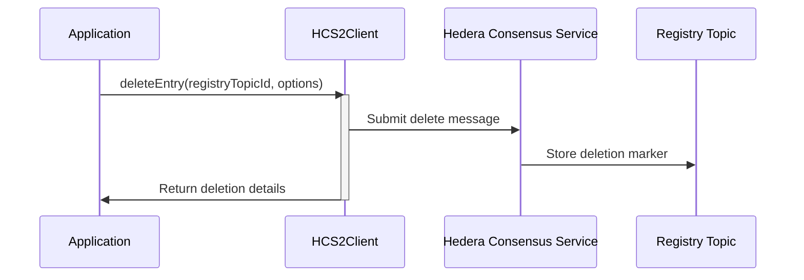
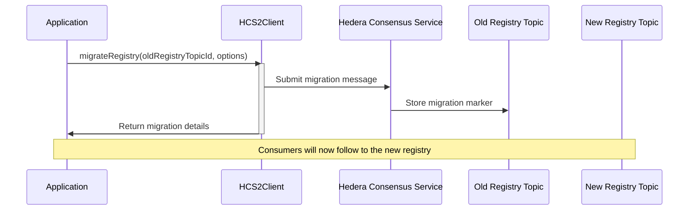
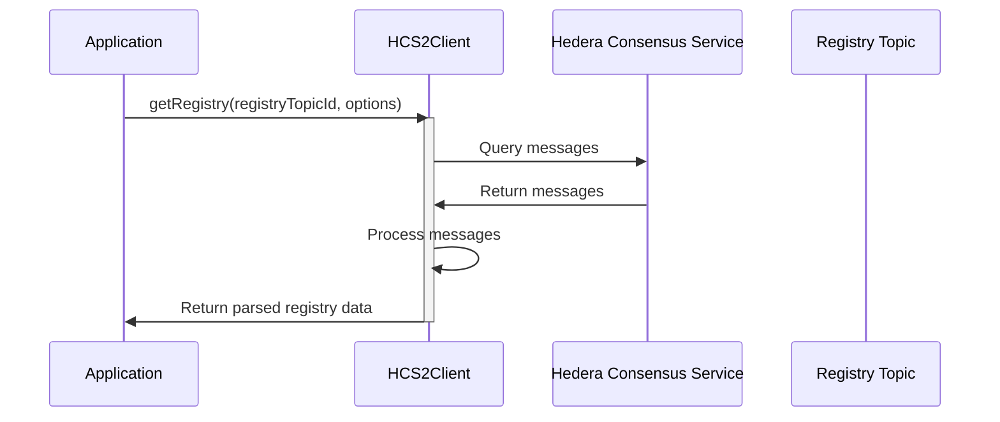
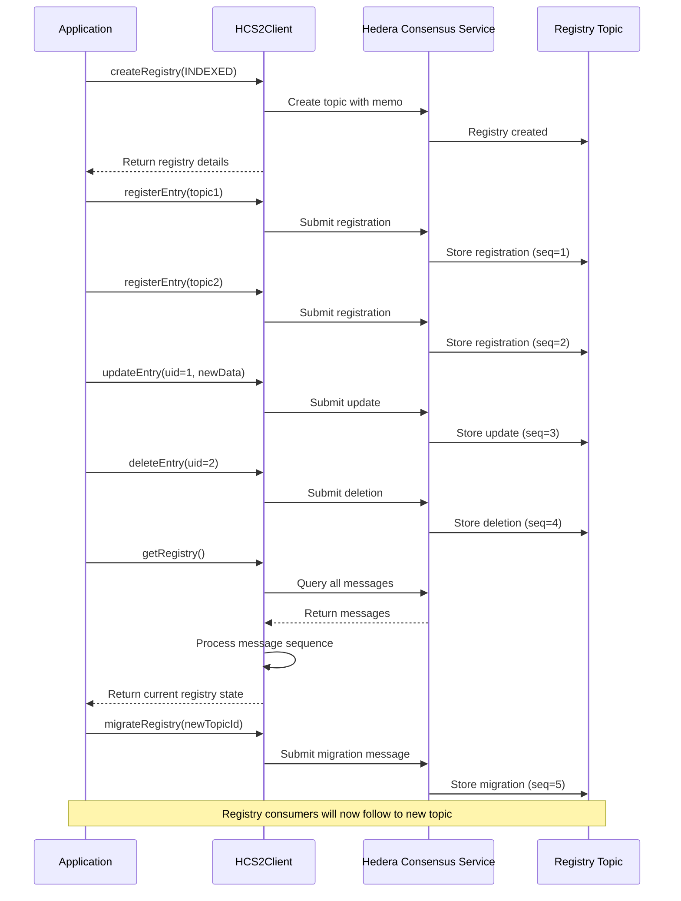
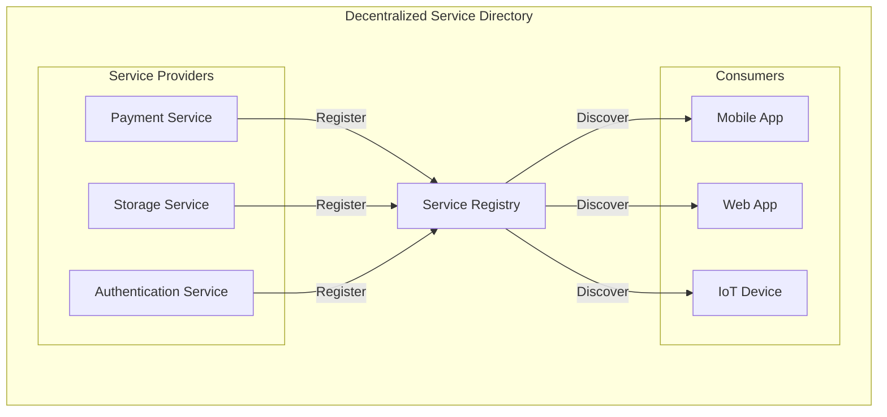

# HCS-2: Decentralized Topic Registry

The HCS-2 module provides a decentralized registry for Hedera Consensus Service (HCS) topics. It allows for the discovery and management of topics in a standardized way, supporting both indexed and non-indexed registries.

## What HCS-2 Does

- **Creates Registries** - Establishes new HCS topics to act as registries.
- **Manages Entries** - Supports registering, updating, deleting, and migrating topic entries.
- **Standardized Memos** - Uses a specific memo format for identifying HCS-2 registries.
- **Flexible Queries** - Allows for fetching and parsing registry entries.

## Architecture Overview

HCS-2 provides a standardized way to manage topic registries using Hedera Consensus Service:



## Registry Types: Indexed vs. Non-Indexed

The HCS-2 standard defines two types of registry topics, each with different behaviors and use cases:



### Key Differences

| Feature | Indexed Registry | Non-Indexed Registry |
|---------|-----------------|---------------------|
| Registry type enum | `HCS2RegistryType.INDEXED` (0) | `HCS2RegistryType.NON_INDEXED` (1) |
| Update operations | ✓ Supported | ✗ Not supported |
| Delete operations | ✓ Supported | ✗ Not supported |
| Message history | Maintains full history | Only cares about latest message |
| Memory/storage | Higher requirements | Lower requirements |
| Performance | May be slower for large registries | Faster, only processes latest state |
| Use case | Full audit history needed | Only current state matters |
| Memo format | `hcs-2:0:ttl` | `hcs-2:1:ttl` |

### When to Use Each Type

- **Use Indexed Registries** when:
  - You need to maintain a history of all entries
  - Entries need to be updated or deleted over time
  - Audit trails are important for your application
  - Example: Service registries that need change tracking, governance systems

- **Use Non-Indexed Registries** when:
  - Only the latest state matters for your application
  - Storage efficiency is important
  - You have high-volume, simple registrations
  - Example: Status indicators, availability registries, lightweight discovery services

### SDK Implementation

The SDK validates operations based on registry type:

- **Update and Delete operations** will throw an error if attempted on a non-indexed registry
- **GetRegistry operation** for non-indexed registries returns only the latest entry per topic
- **Creation** allows you to specify which type you need (defaults to indexed):

```typescript
// Create an indexed registry (default)
const indexedRegistry = await client.createRegistry();

// Create a non-indexed registry
const nonIndexedRegistry = await client.createRegistry({
  registryType: HCS2RegistryType.NON_INDEXED
});
```

## Getting Started

### Installation

```bash
npm install @hashgraphonline/standards-sdk
```

### Basic Setup (Node.js)

For server-side applications, use `HCS2Client`.

```typescript
import { HCS2Client, HCS2RegistryType } from '@hashgraphonline/standards-sdk';

// Initialize the HCS-2 client
const client = new HCS2Client({
  network: 'testnet',
  operatorId: 'your-operator-id',
  operatorKey: 'your-operator-private-key',
  logLevel: 'info',
});
```

### Basic Setup (Browser)

For client-side applications, use `BrowserHCS2Client` with a wallet connection.

```typescript
import { BrowserHCS2Client, HCS2RegistryType } from '@hashgraphonline/standards-sdk';
import { HashinalsWalletConnectSDK } from '@hashgraphonline/hashinal-wc';

// Initialize Hashinals WalletConnect
const hwc = new HashinalsWalletConnectSDK();
await hwc.init(/** wallet connect options */);
await hwc.connect(/** connection options */);

// Initialize the HCS-2 browser client
const browserClient = new BrowserHCS2Client({
  network: 'testnet',
  hwc: hwc,
  logLevel: 'info',
});
```

## Implementation Workflow

### 1. Creating a Registry

First, you need to create a topic that will serve as your registry:



Example code:

```typescript
// Create an indexed registry (default)
const response = await client.createRegistry({
  registryType: HCS2RegistryType.INDEXED,
  ttl: 3600, // Time-to-live in seconds
  memo: 'My Indexed Registry',
  adminKey: true, // Use operator key as admin key
});

if (response.success) {
  console.log(`Registry created with topic ID: ${response.topicId}`);
} else {
  console.error(`Error: ${response.error}`);
}

// Create a non-indexed registry
const nonIndexedResponse = await client.createRegistry({
  registryType: HCS2RegistryType.NON_INDEXED,
  ttl: 3600,
  memo: 'My Non-Indexed Registry',
});
```

### 2. Registering Entries

Once you have a registry, you can register entries (topics) in it:



Example code:

```typescript
const registryTopicId = '0.0.12345'; // Your registry topic ID

const registerResponse = await client.registerEntry(registryTopicId, {
  targetTopicId: '0.0.67890', // The topic to register
  metadata: 'https://example.com/metadata.json',
  memo: 'Initial registration',
});

if (registerResponse.success) {
  console.log(`Entry registered. Sequence number: ${registerResponse.sequenceNumber}`);
} else {
  console.error(`Error: ${registerResponse.error}`);
}
```

### 3. Updating Entries

In indexed registries, you can update existing entries:



Example code:

```typescript
// This only works with indexed registries
const updateResponse = await client.updateEntry(registryTopicId, {
  uid: '1', // The sequence number of the message to update
  targetTopicId: '0.0.98765', // New target topic
  metadata: 'https://example.com/new-metadata.json',
  memo: 'Updated registration',
});

if (updateResponse.success) {
  console.log(`Entry updated. New sequence number: ${updateResponse.sequenceNumber}`);
} else {
  console.error(`Error: ${updateResponse.error}`);
}
```

### 4. Deleting Entries

Remove entries from an indexed registry:



Example code:

```typescript
// This only works with indexed registries
const deleteResponse = await client.deleteEntry(registryTopicId, {
  uid: '1', // The sequence number of the message to delete
  memo: 'Entry deleted',
});

if (deleteResponse.success) {
  console.log(`Entry deleted. Sequence number: ${deleteResponse.sequenceNumber}`);
} else {
  console.error(`Error: ${deleteResponse.error}`);
}
```

### 5. Migrating a Registry

Point an entire registry to a new topic for versioning or upgrades:



Example code:

```typescript
const migrateResponse = await client.migrateRegistry(registryTopicId, {
  targetTopicId: '0.0.54321', // The new registry topic
  memo: 'Migrating to new registry',
});

if (migrateResponse.success) {
  console.log(`Registry migrated. Sequence number: ${migrateResponse.sequenceNumber}`);
} else {
  console.error(`Error: ${migrateResponse.error}`);
}
```

### 6. Querying a Registry

Fetch and process entries from a registry:



Example code:

```typescript
const registryData = await client.getRegistry(registryTopicId, {
  limit: 100,
  order: 'asc',
});

console.log(`Registry Type: ${registryData.registryType === 0 ? 'Indexed' : 'Non-indexed'}`);
console.log(`TTL: ${registryData.ttl}`);

// For indexed registries, this will have the full history
// For non-indexed registries, this will only have the latest entry
for (const entry of registryData.entries) {
  console.log(`- Sequence: ${entry.sequence}`);
  console.log(`  Timestamp: ${entry.timestamp}`);
  console.log(`  Payer: ${entry.payer}`);
  console.log(`  Message:`, entry.message);
}

// Both registry types provide the latestEntry for convenience
if (registryData.latestEntry) {
    console.log(`Latest entry: `, registryData.latestEntry.message);
}
```

## Complete HCS-2 Registry Workflow

This diagram illustrates a complete lifecycle of an HCS-2 Registry:



## Use Case: Building a Decentralized Service Directory

One common use case for HCS-2 is building a service directory where different applications can register their APIs or services:



Implementation steps:

1. Create an indexed registry topic
2. Services register their endpoints with metadata
3. Applications query the registry to discover available services
4. When services update their APIs, they can update their registry entries
5. If a service is deprecated, it can delete its entry

## API Reference

### HCS2Client / BrowserHCS2Client

The API is consistent between the Node.js and Browser clients.

#### `createRegistry(options: CreateRegistryOptions): Promise<TopicRegistrationResponse>`
Creates a new HCS-2 registry topic.

#### `registerEntry(registryTopicId: string, options: RegisterEntryOptions): Promise<RegistryOperationResponse>`
Registers a new topic in the registry.

#### `updateEntry(registryTopicId: string, options: UpdateEntryOptions): Promise<RegistryOperationResponse>`
Updates an existing entry in an indexed registry.

#### `deleteEntry(registryTopicId: string, options: DeleteEntryOptions): Promise<RegistryOperationResponse>`
Deletes an entry from an indexed registry.

#### `migrateRegistry(registryTopicId: string, options: MigrateTopicOptions): Promise<RegistryOperationResponse>`
Submits a migration message to a registry topic.

#### `getRegistry(topicId: string, options?: QueryRegistryOptions): Promise<TopicRegistry>`
Retrieves and parses all entries from a registry topic.

### Types

```typescript
enum HCS2RegistryType {
  INDEXED = 0,
  NON_INDEXED = 1
}

interface CreateRegistryOptions {
  memo?: string;
  ttl?: number;
  adminKey?: boolean | string | PrivateKey;
  submitKey?: boolean | string | PrivateKey;
  registryType?: HCS2RegistryType;
}

interface RegisterEntryOptions {
  targetTopicId: string;
  metadata?: string;
  memo?: string;
}

interface UpdateEntryOptions {
  targetTopicId: string;
  uid: string;
  metadata?: string;
  memo?: string;
}

interface DeleteEntryOptions {
  uid: string;
  memo?: string;
}

interface MigrateTopicOptions {
  targetTopicId: string;
  metadata?: string;
  memo?: string;
}

interface QueryRegistryOptions {
  limit?: number;
  order?: 'asc' | 'desc';
  skip?: number;
}
```

