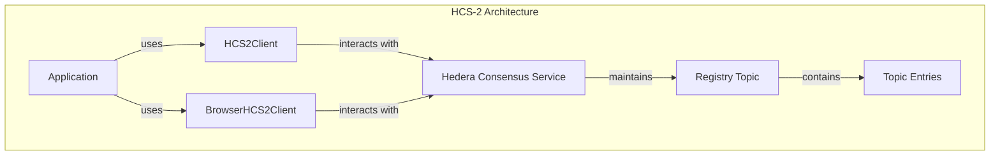
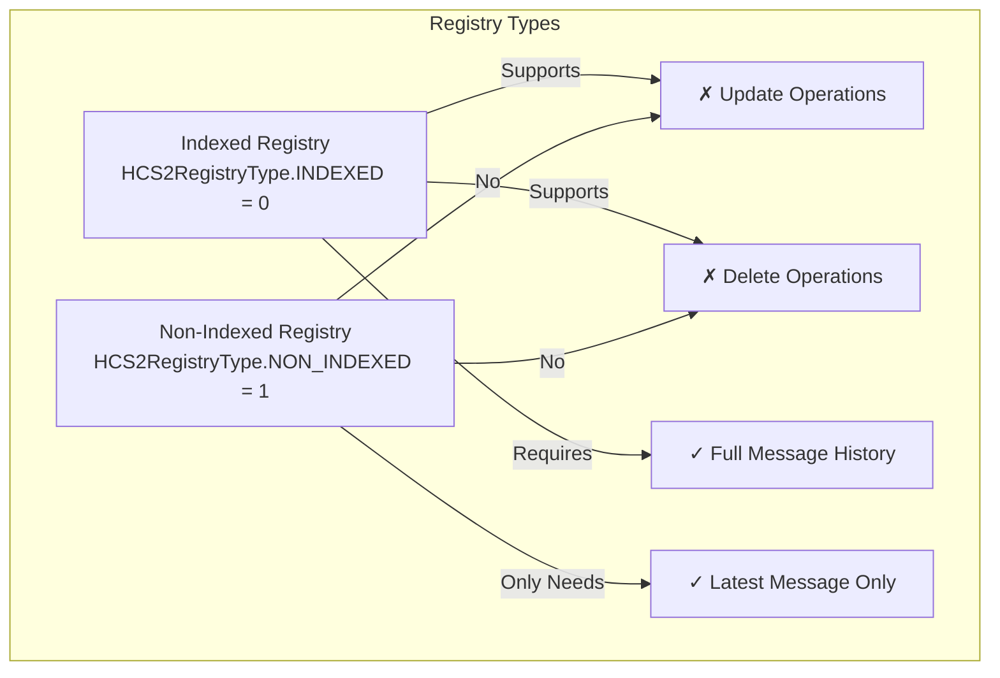
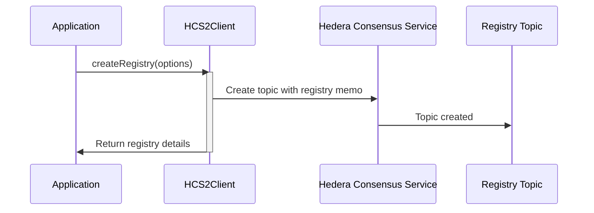
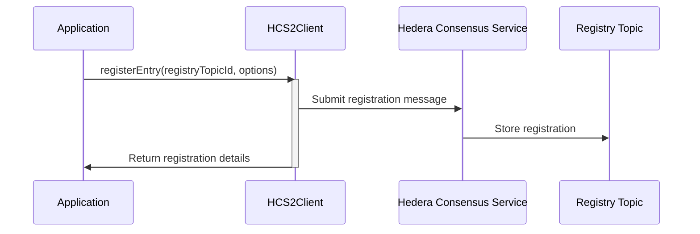
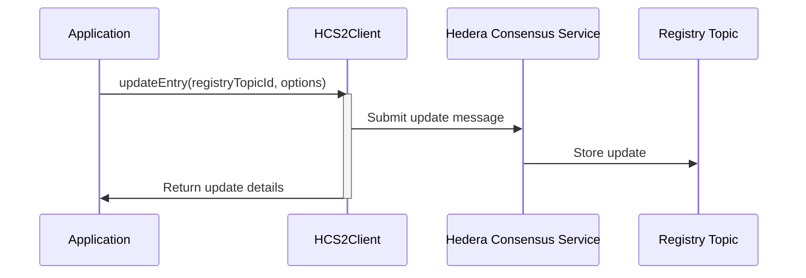
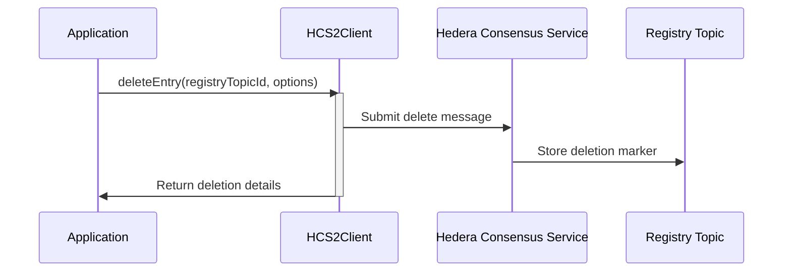
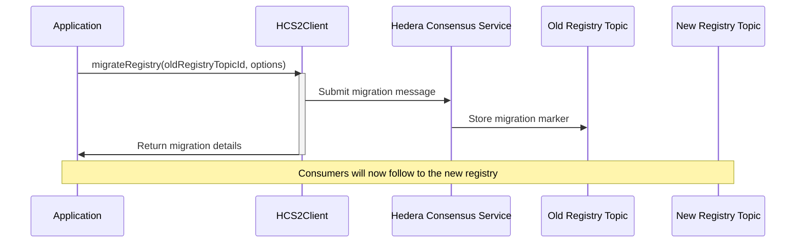
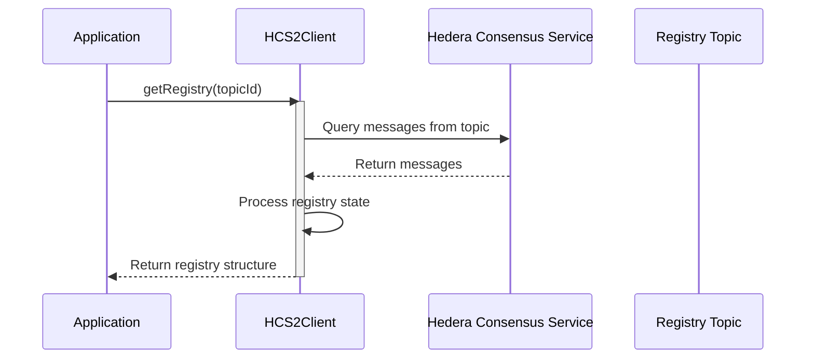
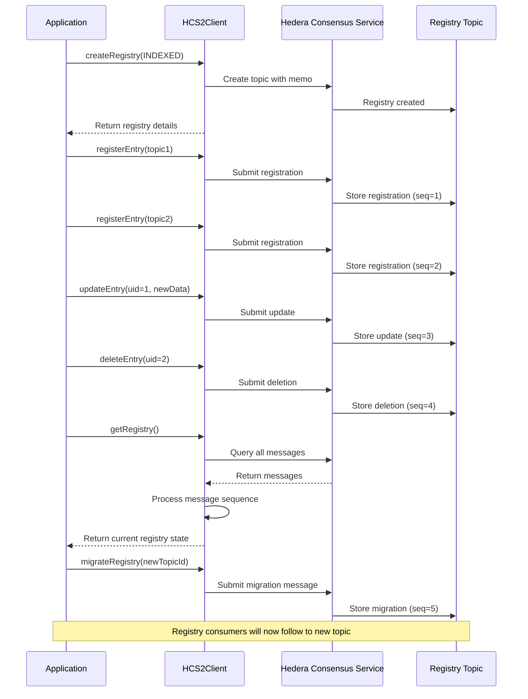
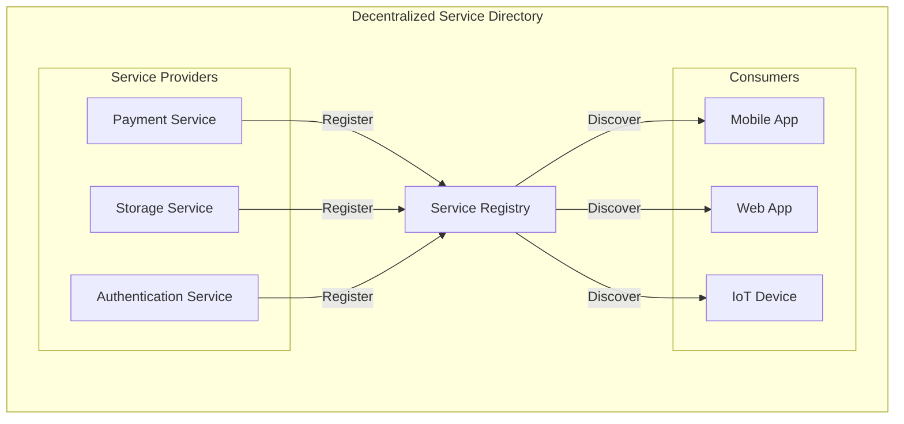

import LanguageTabs from '@site/src/components/LanguageTabs';
import TabItem from '@theme/TabItem';

# HCS-2: Decentralized Topic Registry

The HCS-2 module provides a decentralized registry for Hedera Consensus Service (HCS) topics. It allows for the discovery and management of topics in a standardized way, supporting both indexed and non-indexed registries.

## What HCS-2 Does

- Creates Registries - Establishes new HCS topics to act as registries.
- Manages Entries - Supports registering, updating, deleting, and migrating topic entries.
- Standardized Memos - Uses a specific memo format for identifying HCS-2 registries.
- Flexible Queries - Allows for fetching and parsing registry entries.

## Architecture Overview

HCS-2 provides a standardized way to manage topic registries using Hedera Consensus Service:



## Registry Types: Indexed vs. Non-Indexed

The HCS-2 standard defines two types of registry topics, each with different behaviors and use cases:



### Key Differences

| Feature | Indexed Registry | Non-Indexed Registry |
|---------|-----------------|---------------------|
| Registry type enum | `HCS2RegistryType.INDEXED` (0) | `HCS2RegistryType.NON_INDEXED` (1) |
| Update operations | ✓ Supported | ✗ Not supported |
| Delete operations | ✓ Supported | ✗ Not supported |
| Message history | Maintains full history | Only cares about latest message |
| Memory/storage | Higher requirements | Lower requirements |
| Performance | May be slower for large registries | Faster, only processes latest state |
| Use case | Full audit history needed | Only current state matters |
| Memo format | `hcs-2:0:ttl` | `hcs-2:1:ttl` |

### When to Use Each Type

- Use Indexed Registries when:
  - You need to maintain a history of all entries
  - Entries need to be updated or deleted over time
  - Audit trails are important for your application
  - Example: Service registries that need change tracking, governance systems

- Use Non-Indexed Registries when:
  - Only the latest state matters for your application
  - Storage efficiency is important
  - You have high-volume, simple registrations
  - Example: Status indicators, availability registries, lightweight discovery services

### SDK Implementation

The SDK validates operations based on registry type:

- Update and Delete operations will throw an error if attempted on a non-indexed registry
- GetRegistry operation for non-indexed registries returns only the latest entry per topic
- Creation allows you to specify which type you need (defaults to indexed):

<LanguageTabs>
<TabItem value="typescript">

```typescript
// Create an indexed registry (default)
const indexedRegistry = await client.createRegistry();

// Create a non-indexed registry
const nonIndexedRegistry = await client.createRegistry({
  registryType: HCS2RegistryType.NON_INDEXED
});
```

</TabItem>
<TabItem value="go">

```go
// import "log"

// Create an indexed registry (default)
indexedResult, err := client.CreateRegistry(ctx, hcs2.CreateRegistryOptions{
	RegistryType: hcs2.RegistryTypeIndexed,
	TTL:          86400,
})
if err != nil {
	log.Fatal(err)
}

// Create a non-indexed registry
nonIndexedResult, err := client.CreateRegistry(ctx, hcs2.CreateRegistryOptions{
	RegistryType: hcs2.RegistryTypeNonIndexed,
	TTL:          86400,
})
if err != nil {
	log.Fatal(err)
}
```

</TabItem>
</LanguageTabs>

## Getting Started

### Installation

<LanguageTabs>
<TabItem value="typescript">

```bash
npm install @hashgraphonline/standards-sdk
```

</TabItem>
<TabItem value="go">

```bash
go get github.com/hashgraph-online/standards-sdk-go@latest
```

</TabItem>
</LanguageTabs>

### Basic Setup

<LanguageTabs>
<TabItem value="typescript">

**Node.js** — For server-side applications, use `HCS2Client`.

```typescript
import { HCS2Client, HCS2RegistryType } from '@hashgraphonline/standards-sdk';

// Initialize the HCS-2 client
const client = new HCS2Client({
  network: 'testnet',
  operatorId: 'your-operator-id',
  operatorKey: 'your-operator-private-key',
  logLevel: 'info',
});
```

**Browser** — For client-side applications, use `BrowserHCS2Client` with a wallet connection.

```typescript
import { BrowserHCS2Client, HCS2RegistryType } from '@hashgraphonline/standards-sdk';
import { HashinalsWalletConnectSDK } from '@hashgraphonline/hashinal-wc';

// Initialize Hashinals WalletConnect
const hwc = new HashinalsWalletConnectSDK();
await hwc.init(/** wallet connect options */);
await hwc.connect(/** connection options */);

// Initialize the HCS-2 browser client
const browserClient = new BrowserHCS2Client({
  network: 'testnet',
  hwc: hwc,
  logLevel: 'info',
});
```

</TabItem>
<TabItem value="go">

```go
import (
	"log"
	"github.com/hashgraph-online/standards-sdk-go/pkg/hcs2"
)

client, err := hcs2.NewClient(hcs2.ClientConfig{
	OperatorAccountID:  "0.0.1234",
	OperatorPrivateKey: "<private-key>",
	Network:            "testnet",
})
if err != nil {
	log.Fatal(err)
}
```

:::tip
The Go SDK also supports environment variable auto-loading. Set `HEDERA_ACCOUNT_ID`, `HEDERA_PRIVATE_KEY`, and `HEDERA_NETWORK` in a `.env` file and the SDK will pick them up automatically.
:::

</TabItem>
</LanguageTabs>

## Implementation Workflow

### 1. Creating a Registry

First, you need to create a topic that will serve as your registry:



<LanguageTabs>
<TabItem value="typescript">

```typescript
// Create an indexed registry (default)
const response = await client.createRegistry({
  registryType: HCS2RegistryType.INDEXED,
  ttl: 3600, // Time-to-live in seconds
  adminKey: true, // Use operator key as admin key
});

if (response.success) {
  console.log(`Registry created with topic ID: ${response.topicId}`);
} else {
  console.error(`Error: ${response.error}`);
}

// Create a non-indexed registry
const nonIndexedResponse = await client.createRegistry({
  registryType: HCS2RegistryType.NON_INDEXED,
  ttl: 3600,
});
```

</TabItem>
<TabItem value="go">

```go
result, err := client.CreateRegistry(context.Background(), hcs2.CreateRegistryOptions{
	RegistryType:        hcs2.RegistryTypeIndexed,
	TTL:                 3600,
	UseOperatorAsAdmin:  true,
	UseOperatorAsSubmit: true,
})
if err != nil {
	log.Fatalf("failed to create registry: %v", err)
}

fmt.Printf("Registry created with topic ID: %s\n", result.TopicID)

// Create a non-indexed registry
nonIndexedResult, err := client.CreateRegistry(context.Background(), hcs2.CreateRegistryOptions{
	RegistryType: hcs2.RegistryTypeNonIndexed,
	TTL:          3600,
})
```

</TabItem>
</LanguageTabs>

### 2. Registering Entries

Once you have a registry, you can register entries (topics) in it:



<LanguageTabs>
<TabItem value="typescript">

```typescript
const registryTopicId = '0.0.12345'; // Your registry topic ID

const registerResponse = await client.registerEntry(registryTopicId, {
  targetTopicId: '0.0.67890', // The topic to register
  metadata: 'https://example.com/metadata.json',
  memo: 'Initial registration',
});

if (registerResponse.success) {
  console.log(`Entry registered. Sequence number: ${registerResponse.sequenceNumber}`);
} else {
  console.error(`Error: ${registerResponse.error}`);
}
```

</TabItem>
<TabItem value="go">

```go
registryTopicID := "0.0.12345"

registerResult, err := client.RegisterEntry(ctx, registryTopicID, hcs2.RegisterEntryOptions{
	TargetTopicID: "0.0.67890",
	Metadata:      "https://example.com/metadata.json",
	Memo:          "Initial registration",
}, "")
if err != nil {
	log.Fatalf("failed to register entry: %v", err)
}

fmt.Printf("Entry registered. Sequence number: %d\n", registerResult.SequenceNumber)
```

</TabItem>
</LanguageTabs>

### 3. Updating Entries

In indexed registries, you can update existing entries:



<LanguageTabs>
<TabItem value="typescript">

```typescript
// This only works with indexed registries
const updateResponse = await client.updateEntry(registryTopicId, {
  uid: '1', // The sequence number of the message to update
  targetTopicId: '0.0.98765', // New target topic
  metadata: 'https://example.com/new-metadata.json',
  memo: 'Updated registration',
});

if (updateResponse.success) {
  console.log(`Entry updated. New sequence number: ${updateResponse.sequenceNumber}`);
} else {
  console.error(`Error: ${updateResponse.error}`);
}
```

</TabItem>
<TabItem value="go">

```go
// This only works with indexed registries
updateResult, err := client.UpdateEntry(ctx, registryTopicID, hcs2.UpdateEntryOptions{
	UID:           "1",
	TargetTopicID: "0.0.98765",
	Metadata:      "https://example.com/new-metadata.json",
	Memo:          "Updated registration",
})
if err != nil {
	log.Fatalf("failed to update entry: %v", err)
}

fmt.Printf("Entry updated. New sequence number: %d\n", updateResult.SequenceNumber)
```

</TabItem>
</LanguageTabs>

### 4. Deleting Entries

Remove entries from an indexed registry:



<LanguageTabs>
<TabItem value="typescript">

```typescript
// This only works with indexed registries
const deleteResponse = await client.deleteEntry(registryTopicId, {
  uid: '1', // The sequence number of the message to delete
  memo: 'Entry deleted',
});

if (deleteResponse.success) {
  console.log(`Entry deleted. Sequence number: ${deleteResponse.sequenceNumber}`);
} else {
  console.error(`Error: ${deleteResponse.error}`);
}
```

</TabItem>
<TabItem value="go">

```go
// This only works with indexed registries
deleteResult, err := client.DeleteEntry(ctx, registryTopicID, hcs2.DeleteEntryOptions{
	UID:  "1",
	Memo: "Entry deleted",
})
if err != nil {
	log.Fatalf("failed to delete entry: %v", err)
}

fmt.Printf("Entry deleted. Sequence number: %d\n", deleteResult.SequenceNumber)
```

</TabItem>
</LanguageTabs>

### 5. Migrating a Registry

Point an entire registry to a new topic for versioning or upgrades:



<LanguageTabs>
<TabItem value="typescript">

```typescript
const oldRegistryTopicId = '0.0.12345';
const newRegistryTopicId = '0.0.67890';

const migrateResponse = await client.migrateRegistry(oldRegistryTopicId, {
  newTopicId: newRegistryTopicId,
  memo: 'Migrating to new registry topic',
});

if (migrateResponse.success) {
  console.log(`Registry migrated to: ${newRegistryTopicId}`);
} else {
  console.error(`Error: ${migrateResponse.error}`);
}
```

</TabItem>
<TabItem value="go">

```go
oldRegistryTopicID := "0.0.12345"
newRegistryTopicID := "0.0.67890"

migrateResult, err := client.MigrateRegistry(ctx, oldRegistryTopicID, hcs2.MigrateRegistryOptions{
	TargetTopicID: newRegistryTopicID,
	Memo:          "Migrating to new registry topic",
})
if err != nil {
	log.Fatalf("failed to migrate registry: %v", err)
}

fmt.Printf("Registry migrated to: %s\n", newRegistryTopicID)
```

</TabItem>
</LanguageTabs>

## Querying Registries

Retrieve entries from a registry and process them:



<LanguageTabs>
<TabItem value="typescript">

```typescript
const registry = await client.getRegistry(registryTopicId);
console.log('Registry entries:', registry.entries);
```

For non-indexed registries, only the latest entry per topic is returned.

</TabItem>
<TabItem value="go">

```go
registry, err := client.GetRegistry(ctx, registryTopicID, hcs2.QueryRegistryOptions{})
if err != nil {
	log.Fatalf("failed to get registry: %v", err)
}

fmt.Printf("Registry type: %d, entries: %d\n", registry.RegistryType, len(registry.Entries))
for _, entry := range registry.Entries {
	fmt.Printf("  Topic: %s, Seq: %d\n", entry.Message.TopicID, entry.Sequence)
}
```

For non-indexed registries, only the latest entry per topic is returned.

</TabItem>
</LanguageTabs>

## Full Lifecycle Example



## Use Case: Building a Decentralized Service Directory

One common use case for HCS-2 is building a service directory where different applications can register their APIs or services:



Implementation steps:

1. Create an indexed registry topic
2. Services register their endpoints with metadata
3. Applications query the registry to discover available services
4. When services update their APIs, they can update their registry entries
5. If a service is deprecated, it can delete its entry

## API Reference

### TypeScript: HCS2Client / BrowserHCS2Client

The API is consistent between the Node.js and Browser clients.

#### `createRegistry(options: CreateRegistryOptions): Promise<TopicRegistrationResponse>`
Creates a new HCS-2 registry topic.

#### `registerEntry(registryTopicId: string, options: RegisterEntryOptions): Promise<RegistryOperationResponse>`
Registers a new topic in the registry.

#### `updateEntry(registryTopicId: string, options: UpdateEntryOptions): Promise<RegistryOperationResponse>`
Updates an existing entry in an indexed registry.

#### `deleteEntry(registryTopicId: string, options: DeleteEntryOptions): Promise<RegistryOperationResponse>`
Deletes an entry from an indexed registry.

#### `migrateRegistry(registryTopicId: string, options: MigrateTopicOptions): Promise<RegistryOperationResponse>`
Submits a migration message to a registry topic.

#### `getRegistry(topicId: string, options?: QueryRegistryOptions): Promise<TopicRegistry>`
Retrieves and parses all entries from a registry topic.

### Go: hcs2.Client

#### `NewClient(config ClientConfig) (*Client, error)`
Creates a new HCS-2 client.

#### `CreateRegistry(ctx context.Context, options CreateRegistryOptions) (CreateRegistryResult, error)`
Creates a new HCS-2 registry topic.

#### `RegisterEntry(ctx context.Context, registryTopicID string, options RegisterEntryOptions, protocol string) (OperationResult, error)`
Registers a new topic in the registry.

#### `UpdateEntry(ctx context.Context, registryTopicID string, options UpdateEntryOptions) (OperationResult, error)`
Updates an existing entry in an indexed registry.

#### `DeleteEntry(ctx context.Context, registryTopicID string, options DeleteEntryOptions) (OperationResult, error)`
Deletes an entry from an indexed registry.

#### `MigrateRegistry(ctx context.Context, registryTopicID string, options MigrateRegistryOptions) (OperationResult, error)`
Submits a migration message to a registry topic.

#### `GetRegistry(ctx context.Context, topicID string, options QueryRegistryOptions) (TopicRegistry, error)`
Retrieves and parses all entries from a registry topic.

### Types

<LanguageTabs>
<TabItem value="typescript">

```typescript
enum HCS2RegistryType {
  INDEXED = 0,
  NON_INDEXED = 1
}

interface CreateRegistryOptions {
  memo?: string;
  ttl?: number;
  adminKey?: boolean | string | PrivateKey;
  submitKey?: boolean | string | PrivateKey;
  registryType?: HCS2RegistryType;
}

interface RegisterEntryOptions {
  targetTopicId: string;
  metadata?: string;
  memo?: string;
}

interface UpdateEntryOptions {
  targetTopicId: string;
  uid: string;
}

interface DeleteEntryOptions {
  uid: string;
  memo?: string;
}

interface MigrateTopicOptions {
  newTopicId: string;
  memo?: string;
}
```

</TabItem>
<TabItem value="go">

```go
type RegistryType int

const (
	RegistryTypeIndexed    RegistryType = 0
	RegistryTypeNonIndexed RegistryType = 1
)

type CreateRegistryOptions struct {
	RegistryType        RegistryType
	TTL                 int64
	UseOperatorAsAdmin  bool
	UseOperatorAsSubmit bool
	AdminKey            string
	SubmitKey           string
}

type RegisterEntryOptions struct {
	TargetTopicID string
	Metadata      string
	Memo          string
}

type UpdateEntryOptions struct {
	TargetTopicID string
	UID           string
	Metadata      string
	Memo          string
}

type DeleteEntryOptions struct {
	UID  string
	Memo string
}

type MigrateRegistryOptions struct {
	TargetTopicID string
	Metadata      string
	Memo          string
}

type ClientConfig struct {
	OperatorAccountID  string
	OperatorPrivateKey string
	Network            string
	MirrorBaseURL      string
	MirrorAPIKey       string
}
```

</TabItem>
</LanguageTabs>
