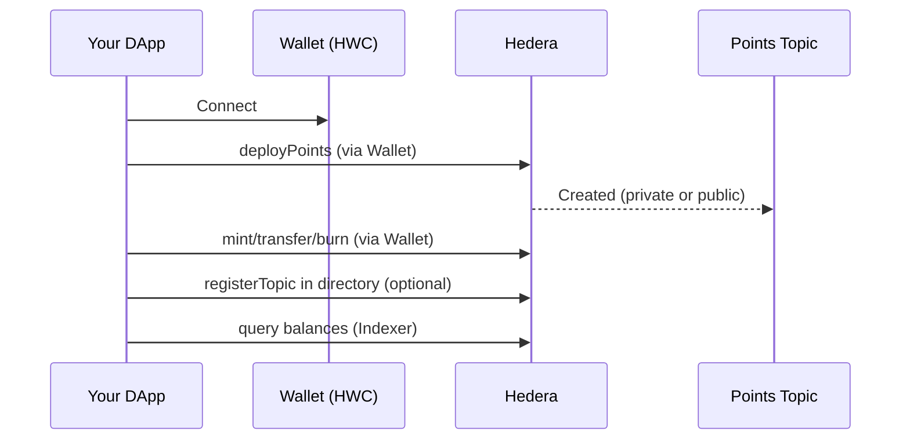

This guide shows how to wire up a wallet and run common HCS‑20 operations entirely in the browser.

## Quick Flow



## Setup

```ts
import { HCS20BrowserClient } from '@hashgraphonline/standards-sdk';
import { HashinalsWalletConnectSDK } from '@hashgraphonline/hashinal-wc';

const hwc = new HashinalsWalletConnectSDK();
await hwc.init();
await hwc.connect();

const client = new HCS20BrowserClient({
  network: 'testnet',
  hwc,
  // Optional: configure a known public topic or registry directory
  publicTopicId: '0.0.6124611',     // shared, permissionless topic for public points
  registryTopicId: '0.0.6124612',   // optional directory of points
});
```

Tip
- Use a shared “public topic” to deploy public points (no topic creation).
- For private points, set `usePrivateTopic: true` in `deployPoints` to create a new topic where only your wallet can submit.

## Deploy Points (private vs public)

Private topic (created and owned by the connected wallet):

```ts
const points = await client.deployPoints({
  name: 'MyRewardPoints',
  tick: 'MRP',
  maxSupply: '1000000',
  limitPerMint: '1000',
  metadata: 'https://example.com/meta',
  usePrivateTopic: true,
  progressCallback: p => console.log(`${p.stage}: ${p.percentage}%`),
});
console.log(points.topicId);
```

Public topic (reuses a known, shared topic configured on the client):

```ts
const points = await client.deployPoints({
  name: 'PublicPoints',
  tick: 'pub',
  maxSupply: '5000000',
  limitPerMint: '2000',
  usePrivateTopic: false,
});
```

Notes
- Private topics: the browser client creates a registry topic using your wallet’s public key as both admin and submit key.
- Public topics: no new topic is created; operations are posted to the configured `publicTopicId`.

## Register in a Directory (optional)

```ts
await client.registerTopic({
  name: 'MyRewardPoints',
  topicId: points.topicId,
  isPrivate: true, // or false for public points
  metadata: 'https://example.com/meta',
  progressCallback: p => console.log(`${p.stage}: ${p.percentage}%`),
});
```

Registering helps wallets and explorers discover points by name; pass your directory’s `registryTopicId` in the client config.

## Mint / Transfer / Burn

All methods accept an optional `progressCallback` for simple UI updates.

```ts
await client.mintPoints({
  tick: 'mrp',
  amount: '50',
  to: '0.0.12345',
  memo: 'bonus',
  progressCallback: p => console.log(p.stage),
});

await client.transferPoints({
  tick: 'mrp',
  amount: '10',
  from: '0.0.12345',
  to: '0.0.67890',
});

await client.burnPoints({
  tick: 'mrp',
  amount: '1',
  from: '0.0.67890',
});
```

## Query Balances (Indexer)

Use the optional indexer to aggregate balances from a topic’s message history.

```ts
import { HCS20PointsIndexer } from '@hashgraphonline/standards-sdk';

const indexer = new HCS20PointsIndexer();
const state = await indexer.query(points.topicId);
console.log(state.balances);
```

## UX Tips

- Wallet approvals: each action prompts the user; hook `progressCallback` to show stages
- Tickers: `tick` is normalized to lowercase; stay consistent in UI
- Directories: display a “verified” badge for directory‑registered points
- Errors: show wallet error messages verbatim; retry transient network failures

## Advanced (builders + signer)

If you need raw transactions (custom signing or batching), build them and execute with the signer:

```ts
import { buildHcs20MintTx } from '@hashgraphonline/standards-sdk';

const tx = buildHcs20MintTx({ topicId: points.topicId, tick: 'mrp', amt: '5', to: '0.0.123' });
const signer = hwc.dAppConnector.signers[0];
const frozen = await (tx as any).freezeWithSigner(signer);
const res = await frozen.executeWithSigner(signer);
await res.getReceiptWithSigner(signer);
```

## Notes
- All wallet operations require explicit user approval via the connected signer.
- Public topics may enforce fee settings; the client sets a max transaction fee when needed.
