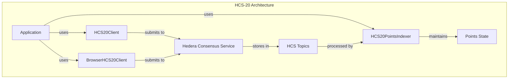
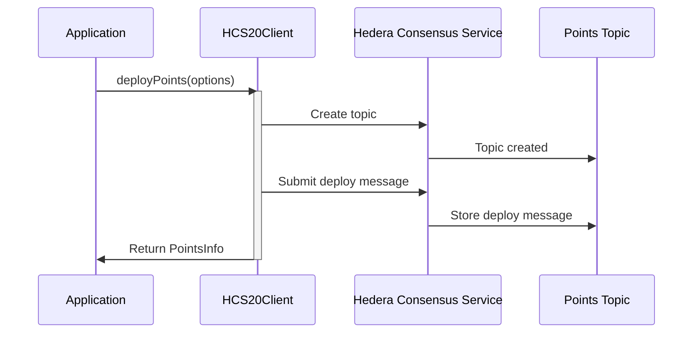
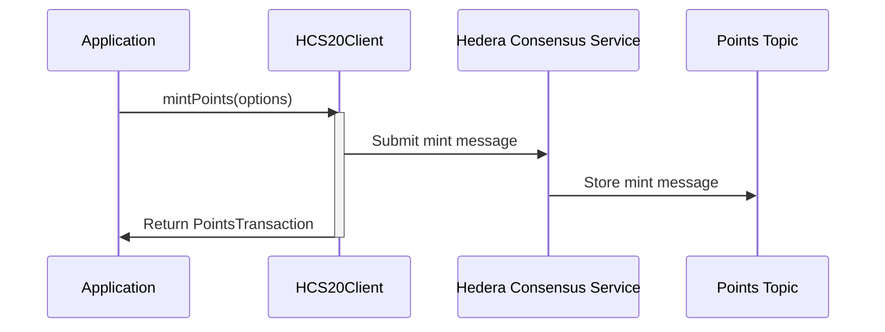
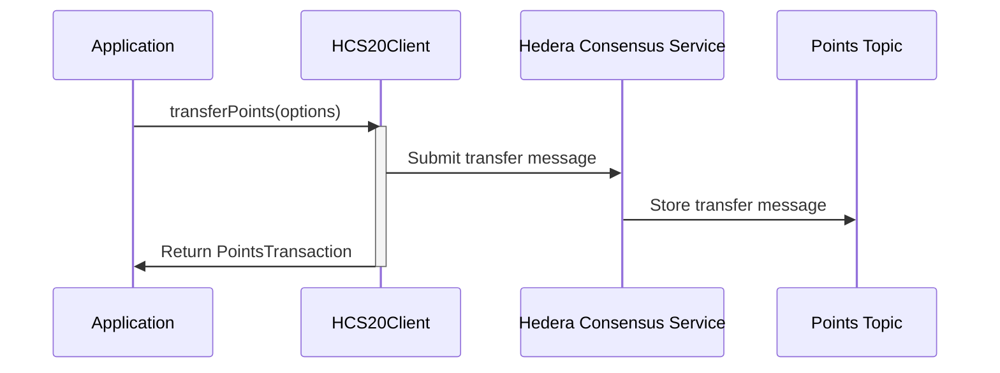
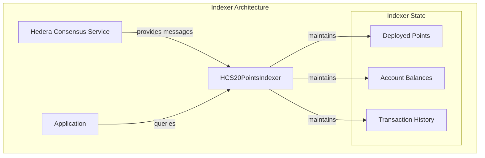
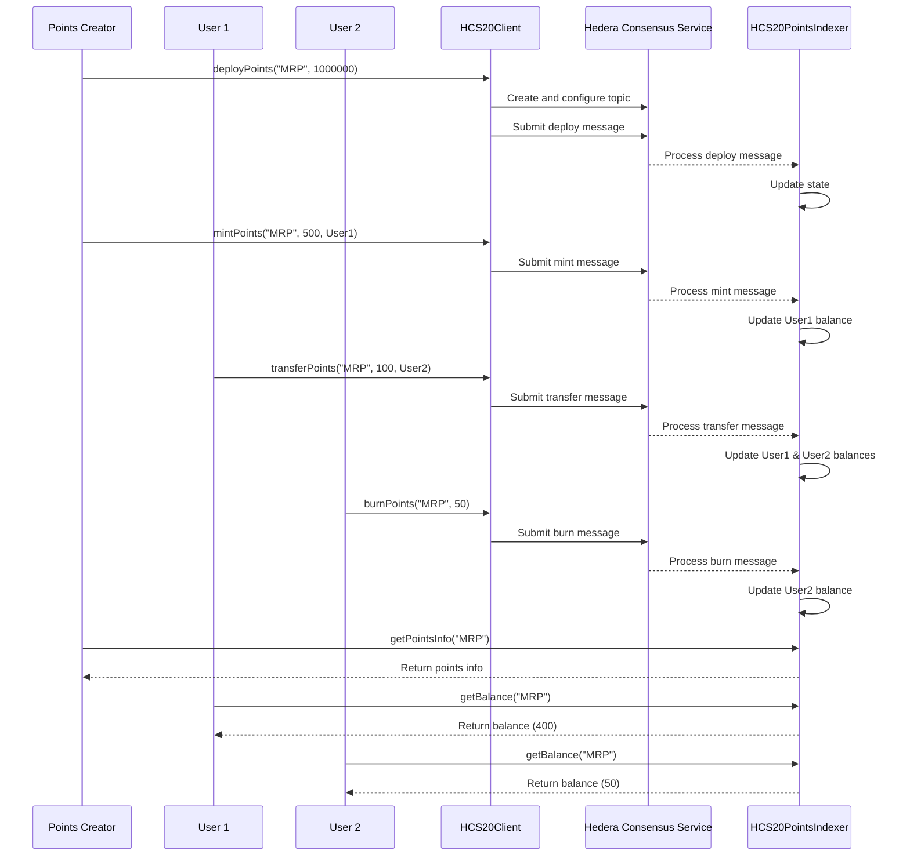

# HCS-20: Auditable Points Standard

The HCS-20 module provides a standard for creating and managing auditable points (like loyalty points or in-game currencies) on the Hedera Consensus Service. It includes clients for both server-side (Node.js) and client-side (browser) environments, along with an indexer for tracking the state of points.

## What HCS-20 Does

- **Defines a Standard** - A clear message schema for deploying, minting, transferring, and burning points.
- **Provides SDK Clients** - `HCS20Client` for Node.js and `BrowserHCS20Client` for browsers to interact with the HCS-20 standard.
- **Includes an Indexer** - `HCS20PointsIndexer` to process topic messages and maintain the state of points.
- **Supports Public and Private Topics** - Deploy points on a public topic or on your own private, permissioned topic.

## Architecture Overview

The HCS-20 standard is built on top of the Hedera Consensus Service (HCS) and provides a standardized way to handle point systems:



## Where to Next

- Node SDK (server): /docs/libraries/standards-sdk/hcs-20/server
- Browser SDK: /docs/libraries/standards-sdk/hcs-20/browser
- Transactions: /docs/libraries/standards-sdk/hcs-20/tx
- API Reference: /docs/libraries/standards-sdk/hcs-20/api

## Go SDK

The Go SDK provides equivalent HCS-20 functionality for deployment and points operations.

### Installation

```bash
go get github.com/hashgraph-online/standards-sdk-go@latest
```

### Go Quickstart

```go
import (
	"context"
	"fmt"
	"log"

	"github.com/hashgraph-online/standards-sdk-go/pkg/hcs20"
)

client, err := hcs20.NewClient(hcs20.ClientConfig{
	OperatorAccountID:  "0.0.123456",
	OperatorPrivateKey: "<private-key>",
	Network:            "testnet",
})
if err != nil {
	log.Fatal(err)
}

pointsInfo, err := client.DeployPoints(context.Background(), hcs20.DeployPointsOptions{
	Name:         "Loyalty Points",
	Tick:         "LOYAL",
	Max:          "1000000",
	LimitPerMint: "1000",
	Metadata:     "https://example.com/points/loyal",
})
if err != nil {
	log.Fatal(err)
}

mintResult, err := client.MintPoints(context.Background(), hcs20.MintPointsOptions{
	Tick:   "LOYAL",
	Amount: "250",
	To:     "0.0.98765",
})
if err != nil {
	log.Fatal(err)
}

fmt.Printf("Points topic: %s\n", pointsInfo.TopicID)
fmt.Printf("Mint tx: %s\n", mintResult.TransactionID)
```

:::tip
See the [Go SDK Overview](/docs/libraries/go-sdk/overview) for package coverage, configuration, and integration testing.
:::

## Implementation Workflow

### 1. Deploy Points

The first step is to deploy a new points system:



Example code:

```typescript
const deployOptions = {
  name: 'MyRewardPoints',
  tick: 'MRP',
  maxSupply: '1000000',
  limitPerMint: '1000',
  metadata: 'https://my-reward-points.com/meta',
  usePrivateTopic: false, // Set to true to create a new private topic
  progressCallback: (data) => {
    console.log(`${data.stage}: ${data.percentage}%`);
  }
};

const pointsInfo = await client.deployPoints(deployOptions);
console.log('Points deployed:', pointsInfo);
```

### 2. Mint Points

After deployment, you can mint points to assign them to accounts:



Example code:

```typescript
const mintOptions = {
  tick: 'MRP',
  amount: '500',
  to: '0.0.98765', // Recipient account ID
  memo: 'Initial points for new user',
  progressCallback: (data) => {
    console.log(`${data.stage}: ${data.percentage}%`);
  }
};

const mintTransaction = await client.mintPoints(mintOptions);
console.log('Mint transaction:', mintTransaction);
```

### 3. Transfer Points

Move points between accounts:



Example code:

```typescript
const transferOptions = {
  tick: 'MRP',
  amount: '100',
  from: '0.0.12345', // Sender account ID
  to: '0.0.98765',   // Recipient account ID
  progressCallback: (data) => {
    console.log(`${data.stage}: ${data.percentage}%`);
  }
};

const transferTransaction = await client.transferPoints(transferOptions);
console.log('Transfer transaction:', transferTransaction);
```

### 4. Burn Points

Remove points from circulation:


Example code:

```typescript
const burnOptions = {
  tick: 'MRP',
  amount: '50',
  from: '0.0.98765', // Account to burn from
  progressCallback: (data) => {
    console.log(`${data.stage}: ${data.percentage}%`);
  }
};

const burnTransaction = await client.burnPoints(burnOptions);
console.log('Burn transaction:', burnTransaction);
```

### 5. Using the Points Indexer

The indexer maintains the state of all points by processing HCS topic messages:



Example code:

```typescript
import { HCS20PointsIndexer } from '@hashgraphonline/standards-sdk';
// or import from specific path
// import { HCS20PointsIndexer } from '@hashgraphonline/standards-sdk';

const indexer = new HCS20PointsIndexer('testnet');

// Start indexing in the background
indexer.startIndexing({
  // Optional: add private topics to watch
  // privateTopics: ['0.0.112233']
});

// To fetch the state at any time:
const currentState = indexer.getState();
console.log('All deployed points:', currentState.deployedPoints);
console.log('All balances:', currentState.balances);

// Get info for a specific point
const mrpInfo = indexer.getPointsInfo('MRP');
console.log('MRP Info:', mrpInfo);

// Get a specific balance
const balance = indexer.getBalance('MRP', '0.0.98765');
console.log('Balance for 0.0.98765:', balance);

// Stop indexing
// indexer.stopIndexing();
```

## Complete Implementation Flow

This diagram shows the complete lifecycle of points in the HCS-20 system:



## API Reference

### HCS20Client / BrowserHCS20Client

#### `deployPoints(options: DeployPointsOptions): Promise<PointsInfo>`
Deploys a new set of points.

#### `mintPoints(options: MintPointsOptions): Promise<PointsTransaction>`
Mints new points.

#### `transferPoints(options: TransferPointsOptions): Promise<PointsTransaction>`
Transfers points between accounts.

#### `burnPoints(options: BurnPointsOptions): Promise<PointsTransaction>`
Burns points.

#### `registerTopic(options: RegisterTopicOptions): Promise<void>`
Registers a topic in the HCS-20 registry.

### HCS20PointsIndexer

#### `startIndexing(options?)`
Starts the indexing process.

#### `stopIndexing()`
Stops the indexing process.

#### `getState(): PointsState`
Returns a snapshot of the current points state.

#### `getPointsInfo(tick: string): PointsInfo | undefined`
Gets information about a specific point type.

#### `getBalance(tick: string, accountId: string): string`
Gets the balance of a specific point for an account.

### Types

```typescript
interface PointsInfo {
  name: string;
  tick: string;
  maxSupply: string;
  limitPerMint?: string;
  metadata?: string;
  topicId: string;
  deployerAccountId: string;
  currentSupply: string;
  deploymentTimestamp: string;
  isPrivate: boolean;
}

interface PointsTransaction {
  id: string;
  operation: 'deploy' | 'mint' | 'transfer' | 'burn' | 'register';
  tick: string;
  amount?: string;
  from?: string;
  to?: string;
  timestamp: string;
  sequenceNumber: number;
  topicId: string;
  transactionId: string;
  memo?: string;
}

interface PointsState {
  deployedPoints: Map<string, PointsInfo>;
  balances: Map<string, Map<string, PointsBalance>>;
  transactions: PointsTransaction[];
  lastProcessedSequence: number;
  lastProcessedTimestamp: string;
}
```
