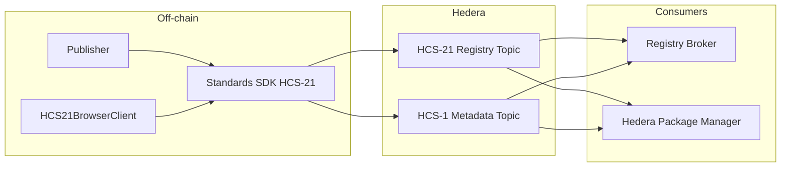

# HCS-21: Package Declaration Registry

The HCS-21 module in the Standards SDK lets you publish package declarations (npm, PyPI, OCI, Composer, CLI plugins, etc.) straight to Hedera Consensus Service. Every declaration pairs a registry namespace with the package’s HCS-2 topic ID (`t_id`) plus a short human summary (`n`, `d`, `a`, `tags`). Optional HCS-1 metadata pointers let downstream systems (Registry Broker, HPM, compliance scanners) hydrate richer manifests without trusting centralized APIs.

## What’s Included

- **`HCS21Client`** (Node.js) — creates registry topics, inscribes metadata, publishes declarations, and streams them back using mirror nodes.
- **`HCS21BrowserClient`** (WalletConnect) — enables dApps to publish declarations directly from a user’s wallet without sharing private keys.
- **Transaction helpers** — `buildHcs21CreateRegistryTx` and `buildHcs21MessageTx` let you embed HCS-21 flows into custom transaction managers.
- **Typed schemas** — `PackageDeclaration`, `PackageMetadataRecord`, and validation helpers keep payloads inside the 1 KB limit and aligned with HCS-21.

## Key Capabilities

- Multi-registry namespace support (`npm`, `pypi`, `oci`, `composer`, `cargo`, etc.).
- Strict metadata pointers (`hcs://1/<topic>/<sequence>`) with optional `t_id` for HPM-style version feeds.
- Mirror-node streaming helpers that automatically filter `hcs-21` payloads.
- Works with submit keys, HIP-991 fee gates, or public topics.

## Where to Next

- [Server SDK](./server.md) — instantiate `HCS21Client`, inscribe metadata, and publish declarations from Node.js services.
- [Browser SDK](./browser.md) — wire HCS-21 into wallet-connected front-ends.
- [Transaction Helpers](./tx.md) — build custom workflows using low-level builders.
- [API Reference](./api.md) — quick lookup for available types and classes.
