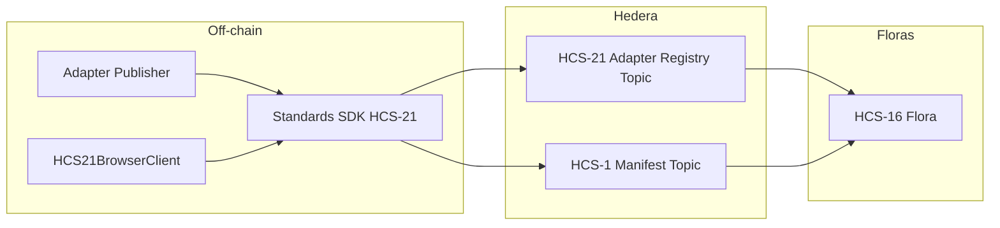

# HCS-21: Adapter Registry

The HCS-21 module in the Standards SDK publishes **adapter declarations** for appnets (including Floras). Each declaration links an adapter ID to its HCS-1 manifest, package fingerprint, appnet context (ctopic/ttopic/stopic), and state model identifier so every participant executes the same deterministic adapter code.

## What’s Included

- **`HCS21Client`** (Node.js) — creates registry topics, inscribes manifests or registry metadata (HCS-1), publishes adapter declarations, and streams them back via mirror nodes.
- **`HCS21BrowserClient`** (WalletConnect) — lets dApps publish adapter declarations from a user wallet while reusing the same validation logic.
- **Transaction helpers** — `buildHcs21CreateRegistryTx` and `buildHcs21MessageTx` generate compliant memos and message payloads for custom pipelines.
- **Typed schemas** — `AdapterDeclaration`, `AdapterManifest`, `RegistryMetadataRecord`, and validation helpers keep payloads inside the 1 KB limit and aligned with the updated HCS-21 standard.

## Key Capabilities

- Adapter declarations include `adapter_id`, `entity`, `package` integrity, manifest pointer (`hcs://1/<topic>`), optional `manifest_sequence` to pin a specific message, appnet/Flora thresholds/topics, and `state_model`.
- Manifest and registry metadata helpers enforce the HCS-1 pointer format (`hcs://1/<topic>`).
- Memo builder supports adapter registries and registry-of-registries topics (`hcs-21:<indexed>:<ttl>:<type>:<meta>`).
- Mirror-node streaming filters only `hcs-21` payloads while preserving payer, sequence, and consensus timestamp.

## Where to Next

- [Server SDK](./server.md) — instantiate `HCS21Client`, inscribe manifests, and publish declarations from Node.js services.
- [Browser SDK](./browser.md) — wire HCS-21 into wallet-connected front-ends.
- [Transaction Helpers](./tx.md) — build custom workflows using low-level builders.
- [API Reference](./api.md) — quick lookup for available types and classes.
