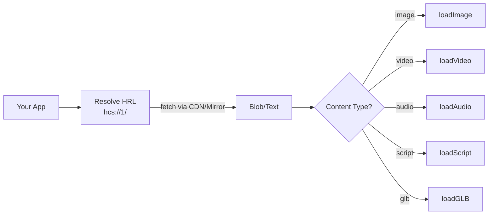

# HCS-3: Resource Recursion

The HCS-3 module enables applications to reference and load resources directly from the Hedera Hashgraph. It provides a seamless way to work with inscribed content through URI references, creating powerful composable applications.

## What HCS-3 Does

- **Resolves Resource References** - Loads content directly from `hcs://` URIs
- **Handles Recursive Content** - Automatically processes nested references
- **Simplifies Media Integration** - Specialized functions for different content types

## Visual Overview



## Getting Started

### Installation

```bash
npm install @hashgraphonline/standards-sdk
```

### Basic Setup

```typescript
import { HCS } from '@hashgraphonline/standards-sdk';

// Initialize the HCS-3 client
const hcs = new HCS();
hcs.config = {
  ...hcs.config,
  cdnUrl: 'https://kiloscribe.com/api/inscription-cdn/',
  network: 'mainnet',
  retryAttempts: 3,
  retryBackoff: 300,
  debug: false,
};
```

## Loading Content

### Images

Load images directly from inscriptions:

```typescript
// Get an image reference
const imageElement = document.getElementById('myImage') as HTMLImageElement;
imageElement.setAttribute('data-src', 'hcs://1/0.0.123456');

// Load the image from an inscription
await hcs.loadImage(imageElement);
```

### Scripts

Execute JavaScript files from inscriptions:

```typescript
const scriptElement = document.createElement('script');
scriptElement.setAttribute('data-src', 'hcs://1/0.0.123456');
scriptElement.setAttribute('data-script-id', 'my-script');

await hcs.loadScript(scriptElement);

// Now any functions or variables defined in that script are available
myInscribedFunction();
```

### Media Files

Easily work with various media types:

```typescript
// Load a video
const videoElement = document.getElementById('myVideo') as HTMLVideoElement;
videoElement.setAttribute('data-src', 'hcs://1/0.0.123456');
await hcs.loadMedia(videoElement, 'video');

// Load audio
const audioElement = document.getElementById('myAudio') as HTMLAudioElement;
audioElement.setAttribute('data-src', 'hcs://1/0.0.123456');
await hcs.loadMedia(audioElement, 'audio');

// Load a 3D model (GLB format)
const modelElement = document.getElementById('myModel') as HTMLElement;
modelElement.setAttribute('data-src', 'hcs://1/0.0.123456');
await hcs.loadGLB(modelElement);
```

## Advanced Features

### Queue-Based Loading

Queue resources with explicit ordering when your app has dependency sequencing:

```typescript
const scriptElement = document.createElement('script');
scriptElement.setAttribute('data-src', 'hcs://1/0.0.111111');
scriptElement.setAttribute('data-script-id', 'bootstrap');

const imageElement = document.getElementById('heroImage') as HTMLImageElement;
imageElement.setAttribute('data-src', 'hcs://1/0.0.222222');

await Promise.all([
  hcs.loadResource(scriptElement, 'script', 1),
  hcs.loadResource(imageElement, 'image', 2),
]);
```

### Content Fetching

Prefetch raw inscription payloads before rendering:

```typescript
await Promise.all([
  hcs.retrieveHCS1Data('0.0.123456'),
  hcs.retrieveHCS1Data('0.0.789012'),
  hcs.retrieveHCS1Data('0.0.345678'),
]);
```

### Error Handling

Implement robust error handling:

```typescript
try {
  imageElement.setAttribute('data-src', 'hcs://1/0.0.123456');
  await hcs.loadImage(imageElement);
} catch (error) {
  console.error('Failed to load image:', error);

  // Display fallback content
  imageElement.src = 'fallback-image.png';
  imageElement.alt = 'Content unavailable';
}
```

## API Reference

### HCS Class Configuration

```typescript
type HCSConfig = {
  cdnUrl: string;
  network: 'mainnet' | 'testnet';
  retryAttempts?: number;
  retryBackoff?: number;
  debug?: boolean;
  showLoadingIndicator?: boolean;
  loadingCallbackName?: string | null;
};
```

### Core Methods

| Method               | Description                                   | Parameters                                    |
| -------------------- | --------------------------------------------- | --------------------------------------------- |
| `loadScript`         | Loads and executes a JavaScript resource      | `element: HTMLElement`                        |
| `loadStylesheet`     | Loads and inlines CSS from an inscription     | `element: HTMLElement`                        |
| `loadImage`          | Loads image data into an element              | `element: HTMLElement`                        |
| `loadMedia`          | Loads video/audio data into an element        | `element: HTMLElement, mediaType: 'video' \| 'audio'` |
| `loadGLB`            | Loads a GLB model into a `<model-viewer>`     | `element: HTMLElement`                        |
| `loadResource`       | Queues a resource with a load order           | `element: HTMLElement, type: LoadType, order: number` |
| `processQueue`       | Processes queued resources                    | none                                          |
| `retrieveHCS1Data`   | Fetches raw inscription data                  | `topicId: string, cdnUrl?: string, network?: string` |

## Example Application

Here's how to build a complete web application using HCS-3 resources:

```typescript
import { HCS } from '@hashgraphonline/standards-sdk';

// Initialize HCS-3
const hcs = new HCS();
hcs.config = { ...hcs.config, network: 'mainnet' };

// Application initialization
async function initApp() {
  try {
    const banner = document.getElementById('banner') as HTMLImageElement;
    banner.setAttribute('data-src', 'hcs://1/0.0.123456');

    const styles = document.createElement('link');
    styles.setAttribute('data-src', 'hcs://1/0.0.234567');
    styles.setAttribute('data-script-id', 'app-style');

    const model = document.getElementById('productModel') as HTMLElement;
    model.setAttribute('data-src', 'hcs://1/0.0.456789');

    const appScript = document.createElement('script');
    appScript.setAttribute('data-src', 'hcs://1/0.0.345678');
    appScript.setAttribute('data-script-id', 'app-logic');

    await Promise.all([
      hcs.loadImage(banner),
      hcs.loadStylesheet(styles),
      hcs.loadGLB(model),
    ]);

    await hcs.loadScript(appScript);

    console.log('Application ready!');
    showUserInterface();
  } catch (error) {
    console.error('Failed to initialize:', error);
    showErrorScreen();
  }
}

// Start the application
initApp();
```

## Browser Support

The HCS-3 module works in all modern browsers:

- Chrome 80+
- Firefox 75+
- Safari 13.1+
- Edge 80+

For older browsers, consider using polyfills for Promise and Fetch API support.
