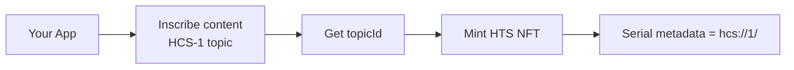

import Tabs from '@theme/Tabs';
import TabItem from '@theme/TabItem';


# HCS‑5: Hashinals (Tokenized HCS‑1)

HCS‑5 is the simplest way to create a “fully on‑graph” NFT on Hedera. You inscribe content to HCS‑1 (a topic), then mint an HTS NFT whose metadata is an HRL that points to that topic.

In plain English: “Put my image/text on HCS‑1, then mint an NFT that permanently points to it.”

## TL;DR Quickstart

```ts
import { HCS5Client } from '@hashgraphonline/standards-sdk';

const client = new HCS5Client({
  network: 'testnet',
  operatorId: process.env.HEDERA_ACCOUNT_ID!,
  operatorKey: process.env.HEDERA_PRIVATE_KEY!,
});

// One‑shot: inscribe an SVG and mint
const svg = Buffer.from(
  '<?xml version="1.0"?><svg xmlns="http://www.w3.org/2000/svg" width="512" height="512"><rect width="512" height="512" fill="#0d9488"/><text x="50%" y="56%" text-anchor="middle" dominant-baseline="middle" font-size="320" font-weight="700" fill="#fff">S</text></svg>'
);

const minted = await client.createHashinal({
  tokenId: '0.0.123456',
  inscriptionInput: { type: 'buffer', buffer: svg, fileName: 'hashinal.svg', mimeType: 'image/svg+xml' },
  inscriptionOptions: {
    waitForConfirmation: true,
    metadata: {
      name: 'Demo Hashinal',
      description: 'Minted with standards‑sdk',
      type: 'image/svg+xml',
      attributes: [{ trait_type: 'Letter', value: 'S' }],
    },
  },
  // supplyKey: '...' // optional if the token requires an extra signature
});

console.log(minted.metadata); // hcs://1/<topicId>
```

## Visual Overview

Hashinal lifecycle



What this gives you

- The NFT’s metadata points to an immutable HCS‑1 inscription
- No dependency on off‑chain storage
- HIP‑412 compatible metadata (name, description, type, attributes)

## How it Works

1. Inscribe your content to HCS‑1 with the Inscriber helpers
2. Take the returned `topicId`
3. Mint an HTS NFT whose metadata is `hcs://1/<topicId>`

The SDK does steps 1–3 for you in one call (`createHashinal`).

## Node Usage

Mint from an existing HCS‑1 topic:

```ts
await client.mint({
  tokenId: '0.0.123456',
  metadataTopicId: '0.0.654321',
  // supplyKey: '...' // optional
});
```

Or inscribe and mint in one step (recommended):

```ts
await client.createHashinal({
  tokenId: '0.0.123456',
  inscriptionInput: { type: 'buffer', buffer: svg, fileName: 'hashinal.svg', mimeType: 'image/svg+xml' },
  inscriptionOptions: {
    waitForConfirmation: true,
    metadata: {
      name: 'Demo Hashinal',
      description: 'Minted with standards‑sdk',
      type: 'image/svg+xml',
      attributes: [{ trait_type: 'Letter', value: 'S' }],
    },
  },
});
```

### Key Handling (No Guesswork)

- Operator key type (ECDSA vs ED25519) is resolved via Mirror Node (account `key._type`)
- If you pass a `supplyKey` string, the client fetches token info (token `supply_key._type`) and parses the key accordingly

## Browser Usage

```ts
import { HCS5BrowserClient } from '@hashgraphonline/standards-sdk';
import { HashinalsWalletConnectSDK } from '@hashgraphonline/hashinal-wc';

const hwc = HashinalsWalletConnectSDK.getInstance();
const client = new HCS5BrowserClient({ network: 'testnet', hwc });

const res = await client.createHashinal({
  tokenId: '0.0.123456',
  inscriptionInput: { type: 'buffer', buffer: svg, fileName: 'hashinal.svg', mimeType: 'image/svg+xml' },
  inscriptionOptions: {
    waitForConfirmation: true,
    metadata: {
      name: 'Browser Hashinal',
      description: 'Minted in the browser',
      type: 'image/svg+xml',
      attributes: [{ trait_type: 'Source', value: 'Browser' }],
    },
  },
});
```

> Tip
> The SDK forces `hashinal` mode internally. You do not need to set a mode.
> In the browser the wallet must be able to sign TokenMint (and supplyKey if required by the token).

## Demo (Node)

From the `standards-sdk` package root:

```bash
pnpm run demo:hcs-5
```

Environment variables in `standards-sdk/.env`:

- HEDERA_NETWORK (testnet | mainnet)
- HEDERA_ACCOUNT_ID, HEDERA_PRIVATE_KEY
- HCS5_TOKEN_ID (optional; if omitted, the demo creates a token)
- Optional image overrides: HCS5_IMAGE_PATH or HCS5_IMAGE_URL
- Optional SVG customization: HCS5_LETTER, HCS5_BG, HCS5_FG

The demo inscribes an SVG (HIP‑412 attributes included), mints an NFT, and prints the HRL (`hcs://1/<topicId>`).

## Troubleshooting

- “Failed to inscribe content” → Increase `waitMaxAttempts`/`waitIntervalMs` in `inscriptionOptions`
- “No topic ID from inscription” → Ensure Inscriber returns `topic_id` or `jsonTopicId`
- “Supply key required” → Provide `supplyKey` with the correct key matching token `supply_key._type`

## Who Is This For?

- Creators who want fully on‑chain NFTs with no off‑chain storage
- Platforms that need deterministic, permanent references to content
- Indexers who prefer HRL pointers over mutable URLs

## When To Use (and Not Use)

- Use when permanence and verifiability of metadata matters
- Don’t use if your content must remain private (HCS‑1 inscriptions are public)

## Costs and Limits

- Costs: inscription (HCS) + mint (HTS) fees; image size impacts inscription fees
- Limits: prefer small/efficient media; large files → higher fees and slower confirmation

## FAQ

- Can I update the content? Not for HCS‑5; inscribed content is immutable. For updatable content, see HCS‑6.
- Do wallets resolve HRLs? Many indexers and tools do; you can fetch by topic id using an HRL resolver.

## Reference

- Standard: [HCS‑5: Hashinals](/docs/standards/hcs-5)
- SDK Source: [src/hcs-5](https://github.com/hashgraph-online/standards-sdk/tree/main/src/hcs-5)
- Inscriber helpers: [src/inscribe](https://github.com/hashgraph-online/standards-sdk/tree/main/src/inscribe)

## Go SDK

The Go SDK provides equivalent functionality for this standard.

### Installation

```bash
go get github.com/hashgraph-online/standards-sdk-go@latest
```

### Go Quickstart

<Tabs groupId="sdk-language" defaultValue="go" values={[
  { label: '🐹 Go', value: 'go' },
]}>
<TabItem value="go">

```go
import (
	"context"
	"fmt"
	"log"
	"github.com/hashgraph-online/standards-sdk-go/pkg/hcs5"
)

client, err := hcs5.NewClient(hcs5.ClientConfig{
	OperatorAccountID:  "0.0.123456",
	OperatorPrivateKey: "<private-key>",
	Network:            "testnet",
})
if err != nil {
	log.Fatal(err)
}

// Mint from an existing HCS-1 topic
result, err := client.Mint(context.Background(), hcs5.MintOptions{
	TokenID:         "0.0.123456",
	MetadataTopicID: "0.0.654321",
})
if err != nil {
	log.Fatal(err)
}
fmt.Printf("Serial: %d, Metadata: %s\n", result.SerialNumber, result.Metadata)
```

</TabItem>
</Tabs>

:::tip
See the [Go SDK Overview](/docs/libraries/go-sdk/overview) for environment setup, supported packages, and testing instructions.
:::
