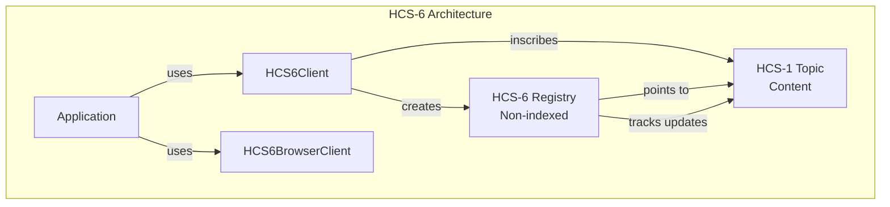
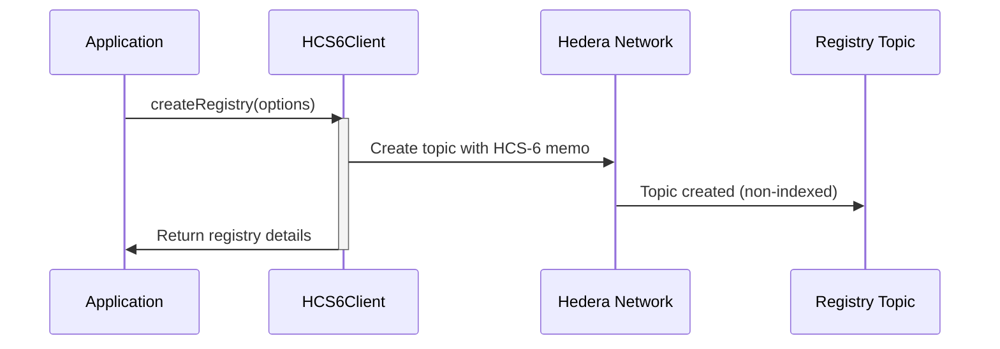
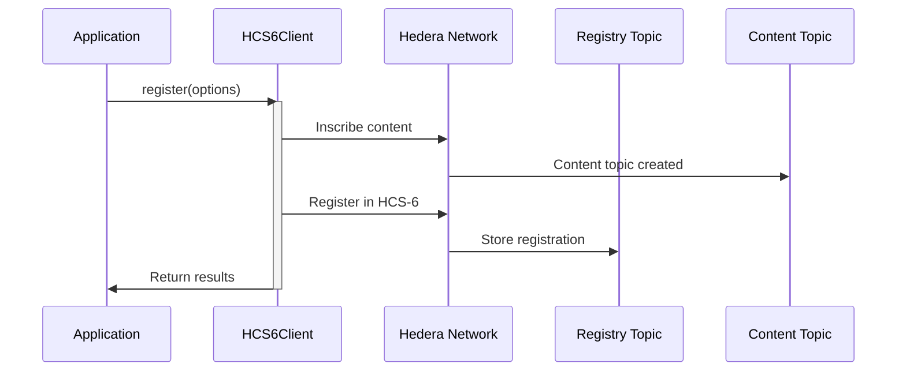
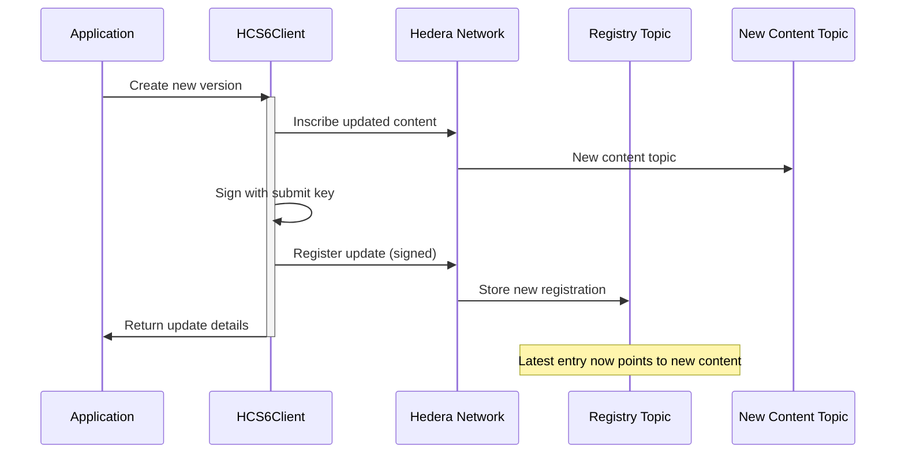
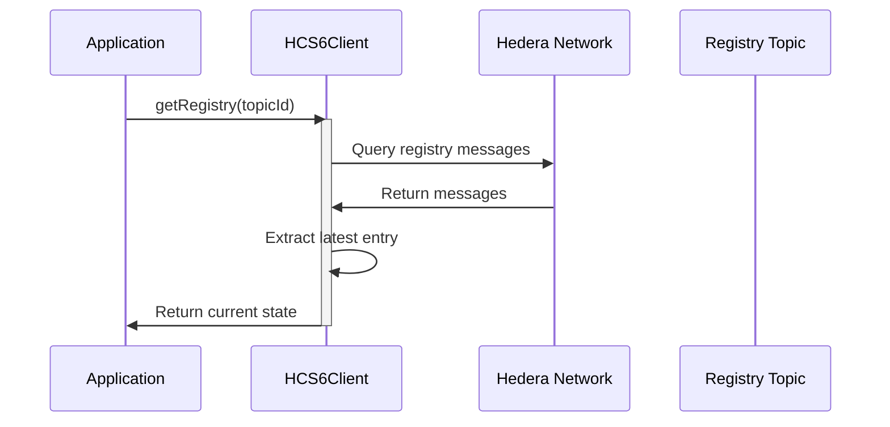
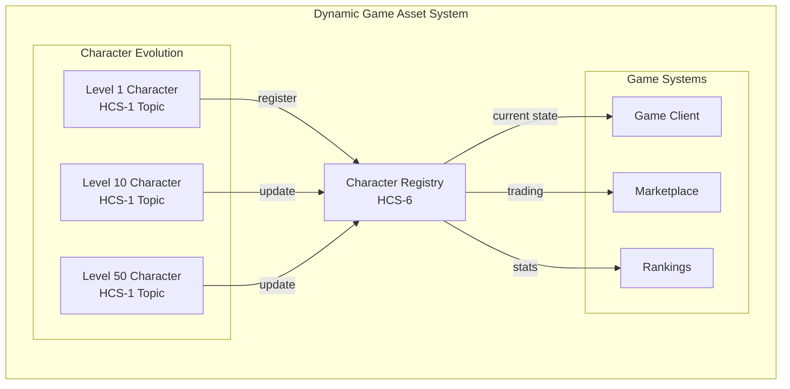

# HCS-6: Dynamic Hashinals

The HCS-6 module provides support for dynamic hashinals - inscriptions that can be updated over time. It extends the HCS-2 registry standard with specific constraints for managing evolving content on the Hedera network.

## What HCS-6 Does

- **Creates Dynamic Registries** - Establishes non-indexed HCS topics for dynamic content management
- **Manages Dynamic Updates** - Registers and tracks updates to hashinal content
- **Simplifies Inscription Updates** - Combines inscription and registry operations
- **Latest-State Focus** - Optimized for applications that only need current state

## Architecture Overview

HCS-6 builds upon HCS-2 registries with specific constraints for dynamic hashinals:



## Key Differences from HCS-2

HCS-6 is a specialized implementation of HCS-2 designed specifically for dynamic hashinals:

| Feature | HCS-2 | HCS-6 |
|---------|-------|-------|
| Registry Type | Indexed or Non-indexed | Always Non-indexed (type 1) |
| Operations | register, update, delete, migrate | Only register |
| Use Case | General registry | Dynamic hashinal updates |
| TTL Requirement | Optional | Minimum 3600 seconds (1 hour) |
| Memo Format | `hcs-2:type:ttl` | `hcs-6:1:ttl` |
| Focus | Full history or latest state | Always latest state only |

## Getting Started

### Installation

```bash
npm install @hashgraphonline/standards-sdk
```

### Basic Setup (Node.js)

For server-side applications, use `HCS6Client`:

```typescript
import { HCS6Client } from '@hashgraphonline/standards-sdk';

// Initialize the HCS-6 client
const client = new HCS6Client({
  network: 'testnet',
  operatorId: 'your-operator-id',
  operatorKey: 'your-operator-private-key',
  logLevel: 'info',
});
```

### Basic Setup (Browser)

For client-side applications, use `HCS6BrowserClient`:

```typescript
import { HCS6BrowserClient } from '@hashgraphonline/standards-sdk';

// Initialize the HCS-6 browser client
const browserClient = new HCS6BrowserClient({
  network: 'testnet',
  logLevel: 'info',
});

// Note: Browser client requires wallet integration for write operations
```

## Implementation Workflow

### 1. Creating a Dynamic Registry

First, create a non-indexed registry specifically for dynamic hashinals:



Example code:

```typescript
// Create a dynamic hashinal registry
const response = await client.createRegistry({
  ttl: 86400, // 24 hours - must be at least 3600 seconds
  adminKey: true, // Use operator key as admin
  submitKey: true, // Use operator key for submissions
});

if (response.success) {
  console.log(`Dynamic registry created: ${response.topicId}`);
  // Registry memo will be: hcs-6:1:86400
} else {
  console.error(`Error: ${response.error}`);
}
```

### 2. Creating and Registering a Dynamic Hashinal

The complete flow for creating updateable content:



Example code:

```typescript
// Create and register a dynamic hashinal in one operation
const result = await client.register({
  metadata: {
    name: 'Dynamic NFT',
    description: 'This content can be updated',
    image: 'ipfs://...',
    attributes: [
      { trait_type: 'Level', value: 1 },
      { trait_type: 'Experience', value: 0 }
    ]
  },
  data: {
    base64: 'base64-encoded-image-data',
    mimeType: 'image/png'
  },
  memo: 'Initial version',
  ttl: 86400,
  registryTopicId: response.topicId, // Use existing registry
});

if (result.success) {
  console.log(`Dynamic hashinal created:`);
  console.log(`  Registry: ${result.registryTopicId}`);
  console.log(`  Content: ${result.inscriptionTopicId}`);
}
```

### 3. Updating a Dynamic Hashinal

To update the content, create a new inscription and register it. If the registry has a submit key, you must provide it:



Example code:

```typescript
// Store the submit key when creating the registry
const submitKey = PrivateKey.generate();
const registry = await client.createRegistry({
  ttl: 86400,
  adminKey: true,
  submitKey: submitKey, // Save this key for updates!
});

// Update the dynamic hashinal with new content
const updateResult = await client.register({
  metadata: {
    name: 'Dynamic NFT',
    description: 'Updated version',
    image: 'ipfs://...',
    attributes: [
      { trait_type: 'Level', value: 5 },      // Updated
      { trait_type: 'Experience', value: 2500 } // Updated
    ]
  },
  data: {
    base64: 'new-base64-encoded-image-data',
    mimeType: 'image/png'
  },
  memo: 'Level up update',
  registryTopicId: registry.topicId,
  submitKey: submitKey, // Required if registry has submit key!
});

console.log(`Updated to: ${updateResult.inscriptionTopicId}`);
```

### 4. Querying Dynamic Hashinal State

Retrieve the current state of a dynamic hashinal:



Example code:

```typescript
// Get the current state of a dynamic hashinal
const registry = await client.getRegistry(registryTopicId);

if (registry.latestEntry) {
  const currentContent = registry.latestEntry.message.t_id;
  console.log(`Current content topic: ${currentContent}`);
  console.log(`Last updated: ${registry.latestEntry.timestamp}`);
  console.log(`Update memo: ${registry.latestEntry.message.m}`);
  
  // Fetch the actual content from the inscription topic
  // This would typically be done through an inscription CDN
  const contentUrl = `https://kiloscribe.com/api/inscription-cdn/${currentContent}?network=testnet`;
}
```

## Advanced Features

### Separate Inscription and Registration

For more control, you can separate the inscription and registration steps:

```typescript
// Step 1: Create the registry (if not exists)
const registry = await client.createRegistry({ ttl: 86400 });

// Step 2: Create the inscription separately
const inscription = await client.createHashinal({
  metadata: { /* your metadata */ },
  ttl: 86400,
  registryTopicId: registry.topicId,
});

// Step 3: Register manually if needed
const registration = await client.registerEntry(
  registry.topicId,
  {
    targetTopicId: inscription.inscriptionTopicId,
    memo: 'Manual registration'
  }
);
```

### Topic Validation

Verify that a topic is a valid HCS-6 registry:

```typescript
// Validate before using a registry
const topicId = '0.0.123456';
const topicInfo = await client.getTopicInfo(topicId);

// Check the memo format
if (topicInfo.memo.startsWith('hcs-6:1:')) {
  const ttl = parseInt(topicInfo.memo.split(':')[2]);
  console.log(`Valid HCS-6 registry with TTL: ${ttl} seconds`);
} else {
  console.log('Not an HCS-6 registry');
}
```

## Use Case: Evolving Game Assets

A common use case for HCS-6 is managing game assets that change over time:



Implementation example:

```typescript
// Initialize character
const character = await client.register({
  metadata: {
    name: 'Hero #1234',
    class: 'Warrior',
    level: 1,
    stats: { strength: 10, defense: 8, magic: 5 }
  },
  registryTopicId: characterRegistry,
});

// After gaining experience
const levelUp = await client.register({
  metadata: {
    name: 'Hero #1234',
    class: 'Warrior',
    level: 10,
    stats: { strength: 25, defense: 20, magic: 12 }
  },
  registryTopicId: characterRegistry,
});

// Query current state
const current = await client.getRegistry(characterRegistry);
// current.latestEntry points to the level 10 version
```

## API Reference

### HCS6Client / HCS6BrowserClient

#### `createRegistry(options?: HCS6CreateRegistryOptions): Promise<HCS6TopicRegistrationResponse>`
Creates a new HCS-6 registry topic (always non-indexed).

#### `register(options: HCS6RegisterOptions): Promise<HCS6CreateHashinalResponse>`
Creates and registers a dynamic hashinal in one operation.

#### `registerEntry(registryTopicId: string, options: HCS6RegisterEntryOptions): Promise<HCS6RegistryOperationResponse>`
Registers an existing inscription in a registry.

#### `createHashinal(options: HCS6CreateHashinalOptions): Promise<HCS6CreateHashinalResponse>`
Creates a hashinal with optional auto-registration.

#### `getRegistry(topicId: string, options?: HCS6QueryRegistryOptions): Promise<HCS6TopicRegistry>`
Retrieves the current state of a registry.

#### `getTopicInfo(topicId: string): Promise<TopicInfo>`
Gets basic information about a topic.

### Types

```typescript
interface HCS6CreateRegistryOptions {
  ttl?: number; // Min 3600 seconds, default 86400
  adminKey?: boolean | string | PrivateKey;
  submitKey?: boolean | string | PrivateKey;
}

interface HCS6RegisterOptions {
  metadata: Record<string, unknown>;
  data?: {
    base64?: string;
    url?: string;
    mimeType?: string;
  };
  memo?: string;
  ttl?: number;
  registryTopicId?: string;
  submitKey?: string | PrivateKey;
}

interface HCS6RegisterEntryOptions {
  targetTopicId: string;
  memo?: string;
}

interface HCS6QueryRegistryOptions {
  limit?: number;
  order?: 'asc' | 'desc';
  skip?: number;
}

enum HCS6Operation {
  REGISTER = 'register'
}

enum HCS6RegistryType {
  NON_INDEXED = 1
}
```

## Best Practices

1. **Submit Key Management**: 
   - Always use a submit key when creating registries to control who can update
   - Store submit keys securely - they're required for all future updates
   - Consider using different submit keys for different registries
   - For shared/team updates, use a shared key management solution

2. **TTL Management**: Choose appropriate TTL values based on update frequency
   - High-frequency updates: 3600-7200 seconds (1-2 hours)
   - Daily updates: 86400 seconds (24 hours)
   - Infrequent updates: 604800 seconds (7 days)

3. **Version Tracking**: Include version information in metadata or memos

4. **State Validation**: Always verify the latest state before updates

5. **Error Handling**: Implement retry logic for network failures

6. **Content Optimization**: Keep metadata concise for efficient updates