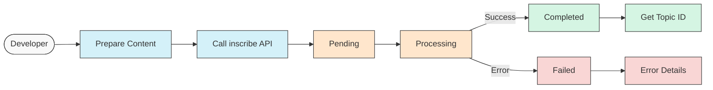

# Inscribe: File Inscription Utilities

The Inscribe module provides a comprehensive set of tools for inscribing various types of content onto the Hedera Hashgraph. It enables permanent, on-chain storage of files, data, and metadata using the Hedera Consensus Service (HCS), making content accessible and verifiable through unique topic IDs.

## Key Concepts

The Inscribe module introduces several important concepts:

- **Inscription**: The process of permanently storing content on the Hedera Hashgraph
- **Content Types**: Different formats of content that can be inscribed (text, files, URLs, buffers)
- **Inscription Options**: Configuration settings for controlling how content is inscribed
- **Topic IDs**: Unique identifiers for accessing inscribed content
- **Hashinals**: NFT-like digital artifacts with on-chain metadata
- **Progress Tracking**: Real-time monitoring of inscription status and progress

## Inscription Process

The following diagram illustrates the complete inscription workflow from a developer implementation perspective:



This diagram illustrates the core inscription flow:

1. The developer prepares content (text, file, URL, or buffer)
2. They call the inscribe API
3. The inscription enters the "pending" state while being submitted
4. It transitions to "processing" as the network handles the request
5. Finally, it either completes successfully (returning a Topic ID) or fails with an error

The progress callback reports the current state throughout this process, allowing applications to provide appropriate feedback to users.

## Getting Started

### Installation

The Inscribe module is included in the Standards SDK:

```bash
npm install @hashgraphonline/standards-sdk
```

### Basic Usage

Import the inscribe function from the Standards SDK:

```typescript
import { inscribe } from '@hashgraphonline/standards-sdk';

// Configure Hedera client
const clientConfig = {
  accountId: '0.0.123456',
  privateKey: 'your-private-key',
  network: 'testnet',
};

// Configure inscription options
const options = {
  mode: 'file',
  waitForConfirmation: true,
  metadata: {
    name: 'My Document',
    description: 'An important document',
    creator: 'Jane Doe',
  },
  tags: ['document', 'important', 'example'],
};
```

## Inscription Types

The Inscribe module supports several different types of content inscriptions:

### Text Inscription

Inscribe text content directly:

```typescript
// Inscribe text content
const textResult = await inscribe(
  {
    type: 'text',
    content: 'Hello, Hedera! This is permanently stored on the hashgraph.',
    fileName: 'greeting.txt',
  },
  clientConfig,
  options
);

console.log('Text inscription successful!');
console.log('Topic ID:', textResult.inscription.topic_id);
console.log('Transaction ID:', textResult.result.transactionId);
```

### File Inscription

Inscribe a file from the local filesystem:

```typescript
// Inscribe a file from disk
const fileResult = await inscribe(
  {
    type: 'file',
    path: './path/to/document.pdf',
  },
  clientConfig,
  options
);

console.log('File inscription successful!');
console.log('Topic ID:', fileResult.inscription.topic_id);
```

### URL Inscription

Inscribe content from a URL:

```typescript
// Inscribe content from a URL
const urlResult = await inscribe(
  {
    type: 'url',
    url: 'https://example.com/image.jpg',
  },
  clientConfig,
  {
    ...options,
    maxFileSize: 10 * 1024 * 1024, // 10MB limit
  }
);

console.log('URL inscription successful!');
console.log('Topic ID:', urlResult.inscription.topic_id);
```

### Buffer Inscription

Inscribe content from a buffer (useful for programmatically generated content):

```typescript
// Create a buffer with content
const content = 'Binary content example';
const buffer = Buffer.from(content);

// Inscribe content from buffer
const bufferResult = await inscribe(
  {
    type: 'buffer',
    buffer: buffer,
    fileName: 'buffer-content.txt',
    mimeType: 'text/plain',
  },
  clientConfig,
  options
);

console.log('Buffer inscription successful!');
console.log('Topic ID:', bufferResult.inscription.topic_id);
```

## Progress Tracking

The Inscribe module now supports real-time progress tracking during the inscription process, which is particularly useful for large files and user interfaces:

```typescript
// Track inscription progress
const result = await inscribe(
  {
    type: 'file',
    path: './path/to/large-document.pdf',
  },
  clientConfig,
  {
    ...options,
    waitForConfirmation: true,
    progressCallback: (progressData) => {
      // progressData contains information about the inscription process
      const { stage, message, progressPercent, details } = progressData;

      console.log(`[${stage}] ${message} - ${progressPercent.toFixed(1)}%`);

      // Update UI with progress information
      updateProgressBar(progressPercent);
      updateStatusText(message);

      // Handle different stages
      switch (stage) {
        case 'pending':
          // Initial submission and waiting phase
          console.log('Inscription has been submitted and is pending');
          break;
        case 'processing':
          // Network is processing the inscription
          console.log('Network is processing the inscription');
          break;
        case 'completed':
          // Inscription is complete
          console.log('Inscription completed successfully');
          break;
        case 'failed':
          // Inscription failed
          console.log('Inscription failed:', details?.error);
          break;
      }
    },
  }
);
```

The progress callback provides the following information:

- **stage**: Current stage of the inscription process ('pending', 'processing', 'completed', or 'failed')
- **message**: Human-readable description of the current status
- **progressPercent**: Overall progress as a percentage (0-100)
- **details**: Additional information such as error messages or technical details

## Inscription Options

The inscribe function supports a variety of options to control the inscription process:

```typescript
const advancedOptions = {
  // Inscription mode ('file', 'upload', 'hashinal', 'hashinal-collection')
  mode: 'file',

  // Network selection
  network: 'testnet',

  // Optional API key (if using API-based authentication)
  apiKey: 'your-api-key',

  // CDN base URL for retrieving inscriptions
  baseUrl: 'https://custom-cdn.example.com',

  // Retry settings
  maxRetries: 5,
  retryDelay: 3000,

  // Confirmation settings
  waitForConfirmation: true,
  waitMaxAttempts: 30,
  waitIntervalMs: 5000,

  // Progress tracking
  progressCallback: (progressData) => {
    console.log(
      `Progress: ${progressData.progressPercent}% - ${progressData.message}`
    );
  },

  // Logging options
  logging: {
    level: 'debug',
    timestamps: true,
  },

  // Metadata for the inscription
  metadata: {
    name: 'Sample Document',
    description: 'A sample document for demonstration',
    creator: 'Example User',
    custom: {
      department: 'Engineering',
      documentId: 'DOC-123',
    },
  },

  // Tags for categorization
  tags: ['sample', 'documentation', 'example'],

  // Chunking for large files
  chunkSize: 1024 * 256, // 256KB chunks
};
```

## Hashinal NFTs

Create Hashinal NFTs with fully on-chain metadata:

```typescript
// Create a Hashinal NFT
const hashinalResult = await inscribe(
  {
    type: 'url',
    url: 'https://example.com/artwork.png',
  },
  clientConfig,
  {
    mode: 'hashinal',
    metadata: {
      name: 'Digital Masterpiece',
      creator: '0.0.123456',
      description: 'A beautiful digital artwork stored permanently on Hedera',
      type: 'image/png',
      attributes: [
        { trait_type: 'Background', value: 'Blue' },
        { trait_type: 'Style', value: 'Abstract' },
        { trait_type: 'Color Scheme', value: 'Vibrant' },
      ],
      properties: {
        edition: 1,
        maxEdition: 10,
        created: new Date().toISOString(),
      },
    },
    waitForConfirmation: true,
    progressCallback: (progressData) => {
      console.log(
        `Hashinal creation: ${progressData.progressPercent}% - ${progressData.message}`
      );
    },
  }
);

console.log('Hashinal created successfully!');
console.log('Topic ID:', hashinalResult.inscription.topic_id);
```

## Wallet Integration

Inscribe content using a connected wallet (browser environments):

```typescript
import { inscribeWithSigner } from '@hashgraphonline/standards-sdk';

// Assuming you have a connected wallet/signer available
async function inscribeWithWallet(signer, content) {
  const result = await inscribeWithSigner(
    {
      type: 'text',
      content: content,
      fileName: 'wallet-inscription.txt',
    },
    signer,
    {
      mode: 'file',
      waitForConfirmation: true,
      metadata: {
        name: 'Wallet-Created Inscription',
        description: 'Created using a connected wallet',
      },
      progressCallback: (progressData) => {
        updateUserInterface(progressData);
      },
    }
  );

  return result;
}

// In a browser application
document
  .getElementById('inscribe-button')
  .addEventListener('click', async () => {
    const content = document.getElementById('content-input').value;
    const progressBar = document.getElementById('progress-bar');
    const statusText = document.getElementById('status-text');

    function updateUserInterface(progressData) {
      // Update progress bar
      progressBar.value = progressData.progressPercent;
      progressBar.max = 100;

      // Update status text
      statusText.textContent = `${progressData.message} (${Math.round(
        progressData.progressPercent
      )}%)`;

      // Update status class based on stage
      statusText.className = `status-${progressData.stage}`;
    }

    try {
      // Show progress elements
      progressBar.style.display = 'block';
      statusText.style.display = 'block';

      // Get signer from your wallet connection
      const signer = await yourWalletProvider.getSigner();

      // Inscribe the content
      const result = await inscribeWithWallet(signer, content);

      // Display the result
      document.getElementById(
        'result'
      ).textContent = `Inscription successful! Topic ID: ${result.inscription.topic_id}`;
    } catch (error) {
      console.error('Inscription failed:', error);
      document.getElementById(
        'result'
      ).textContent = `Inscription failed: ${error.message}`;

      statusText.textContent = `Error: ${error.message}`;
      statusText.className = 'status-failed';
    }
  });
```

## Retrieving Inscriptions

Retrieve previously inscribed content:

```typescript
import { retrieveInscription } from '@hashgraphonline/standards-sdk';

// Retrieve an inscription by transaction ID
async function getInscription(transactionId) {
  const result = await retrieveInscription(transactionId, {
    network: 'mainnet',
    apiKey: 'your-api-key', // Optional
  });

  console.log('Retrieved inscription:');
  console.log('Topic ID:', result.topic_id);
  console.log('Sequence Number:', result.sequence_number);
  console.log('Content Type:', result.content_type);

  // For text content, the content will be available
  if (result.content) {
    console.log('Content:', result.content);
  }

  // For binary content, a URL will be available
  if (result.url) {
    console.log('Content URL:', result.url);
  }

  // Metadata if present
  if (result.metadata) {
    console.log('Metadata:', result.metadata);
  }

  return result;
}
```

## API Reference

### Inscription Functions

```typescript
function inscribe(
  input: InscriptionInput,
  clientConfig: HederaClientConfig,
  options: InscriptionOptions,
  existingSDK?: InscriptionSDK
): Promise<InscriptionResponse>;

function inscribeWithSigner(
  input: InscriptionInput,
  signer: DAppSigner,
  options: InscriptionOptions,
  existingSDK?: InscriptionSDK
): Promise<InscriptionResponse>;

function retrieveInscription(
  transactionId: string,
  options: InscriptionOptions & { accountId?: string; privateKey?: string }
): Promise<RetrievedInscriptionResult>;
```

### Input Types

```typescript
type InscriptionInput =
  | { type: 'url'; url: string }
  | { type: 'file'; path: string }
  | {
      type: 'buffer';
      buffer: ArrayBuffer | Buffer;
      fileName: string;
      mimeType?: string;
    };
```

### Configuration Types

```typescript
interface HederaClientConfig {
  accountId: string;
  privateKey: string;
  network?: 'mainnet' | 'testnet';
}

interface InscriptionOptions {
  network?: 'mainnet' | 'testnet';
  apiKey?: string;
  baseUrl?: string;
  maxRetries?: number;
  retryDelay?: number;
  waitForConfirmation?: boolean;
  waitMaxAttempts?: number;
  waitIntervalMs?: number;
  progressCallback?: (progressData: ProgressData) => void;
  logging?: LoggerOptions;
  metadata?: Record<string, unknown>;
  tags?: string[];
  chunkSize?: number;
  mode?: 'file' | 'upload' | 'hashinal' | 'hashinal-collection';
  jsonFileURL?: string;
}

interface ProgressData {
  stage: 'pending' | 'processing' | 'completed' | 'failed';
  message: string;
  progressPercent: number;
  details?: Record<string, any>;
}

interface HashinalInscriptionOptions extends InscriptionOptions {
  metadata: {
    name: string;
    creator: string;
    description: string;
    image?: string;
    type: string;
    attributes?: Array<{
      trait_type: string;
      value: string | number;
    }>;
    properties?: Record<string, unknown>;
    tags?: string[];
    [key: string]: unknown;
  };
}
```

### Response Types

```typescript
type InscriptionResponse =
  | { confirmed: false; result: InscriptionResult; sdk: InscriptionSDK }
  | {
      confirmed: true;
      result: InscriptionResult;
      inscription: RetrievedInscriptionResult;
      sdk: InscriptionSDK;
    };

interface InscriptionResult {
  transactionId: string;
  jobId: string;
}

interface RetrievedInscriptionResult {
  topic_id: string;
  sequence_number: number;
  content_type: string;
  content?: string;
  url?: string;
  metadata?: Record<string, unknown>;
}
```

## Integration Examples

### Progress Tracking UI

Here's a complete example of a React component that uses progress tracking:

```tsx
import React, { useState, useRef } from 'react';
import { inscribeWithSigner } from '@hashgraphonline/standards-sdk';

const FileUploader = ({ signer }) => {
  const [file, setFile] = useState(null);
  const [status, setStatus] = useState('idle');
  const [progress, setProgress] = useState(0);
  const [message, setMessage] = useState('');
  const [result, setResult] = useState(null);
  const fileInputRef = useRef(null);

  const handleFileChange = (e) => {
    if (e.target.files && e.target.files[0]) {
      setFile(e.target.files[0]);
      setStatus('ready');
      setProgress(0);
      setMessage('File selected');
      setResult(null);
    }
  };

  const handleUpload = async () => {
    if (!file) return;

    try {
      setStatus('uploading');
      setProgress(0);
      setMessage('Starting inscription...');

      const reader = new FileReader();

      reader.onload = async (e) => {
        try {
          const result = await inscribeWithSigner(
            {
              type: 'buffer',
              buffer: e.target.result,
              fileName: file.name,
              mimeType: file.type,
            },
            signer,
            {
              mode: 'file',
              waitForConfirmation: true,
              metadata: {
                name: file.name,
                description: 'Uploaded file',
                fileSize: file.size,
                fileType: file.type,
              },
              progressCallback: (progressData) => {
                setProgress(progressData.progressPercent);
                setMessage(progressData.message);
                setStatus(progressData.stage);
              },
            }
          );

          setResult(result);
          setStatus('completed');

          // Reset file selection
          if (fileInputRef.current) {
            fileInputRef.current.value = '';
          }
        } catch (error) {
          setStatus('failed');
          setMessage(`Error: ${error.message}`);
          console.error('Inscription failed:', error);
        }
      };

      reader.onerror = () => {
        setStatus('failed');
        setMessage('Error reading file');
      };

      reader.readAsArrayBuffer(file);
    } catch (error) {
      setStatus('failed');
      setMessage(`Error: ${error.message}`);
      console.error('Upload process failed:', error);
    }
  };

  const getStatusColor = () => {
    switch (status) {
      case 'completed':
        return 'green';
      case 'failed':
        return 'red';
      case 'pending':
      case 'processing':
        return 'blue';
      default:
        return 'gray';
    }
  };

  return (
    <div className='file-uploader'>
      <h2>File Uploader</h2>

      <div className='input-group'>
        <input
          ref={fileInputRef}
          type='file'
          onChange={handleFileChange}
          disabled={status === 'uploading'}
        />
        <button
          onClick={handleUpload}
          disabled={!file || status === 'uploading'}
        >
          Inscribe File
        </button>
      </div>

      {file && (
        <div className='file-info'>
          <p>
            Selected file: {file.name} ({Math.round(file.size / 1024)} KB)
          </p>
        </div>
      )}

      {status !== 'idle' && status !== 'ready' && (
        <div className='progress-container'>
          <div className='progress-bar-container'>
            <div
              className='progress-bar'
              style={{
                width: `${progress}%`,
                backgroundColor: getStatusColor(),
              }}
            />
          </div>
          <p className='status-message' style={{ color: getStatusColor() }}>
            {message}{' '}
            {status !== 'completed' &&
              status !== 'failed' &&
              `(${Math.round(progress)}%)`}
          </p>
        </div>
      )}

      {result && (
        <div className='result'>
          <h3>Inscription Successful!</h3>
          <p>Topic ID: {result.inscription.topic_id}</p>
          <p>Transaction ID: {result.result.transactionId}</p>
        </div>
      )}
    </div>
  );
};

export default FileUploader;
```

This component provides:

- File selection and validation
- Visual progress indication
- Stage-based status updates
- Success/failure handling
- Result display
