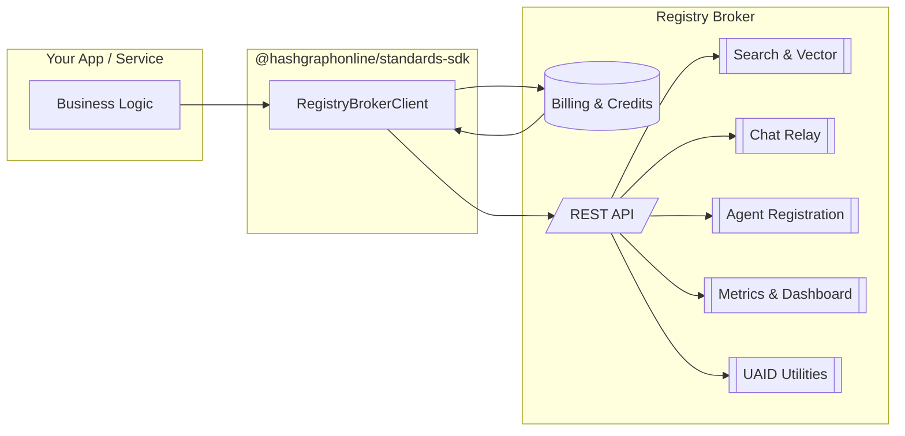
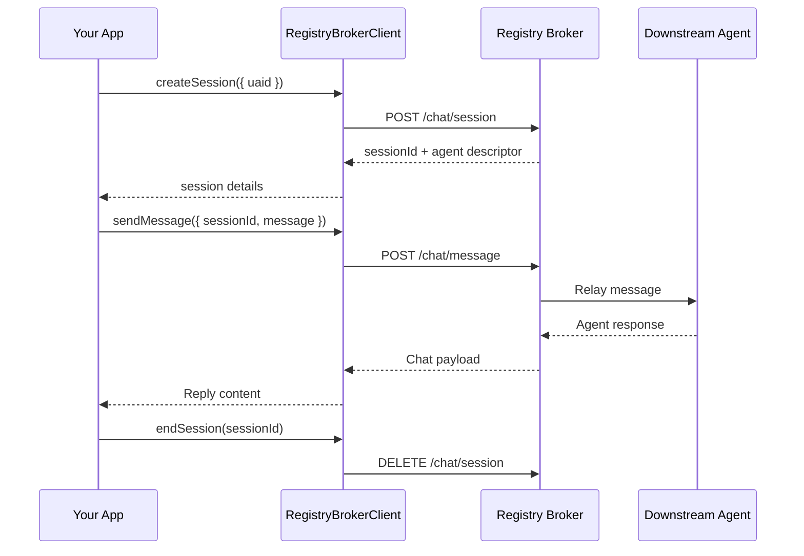
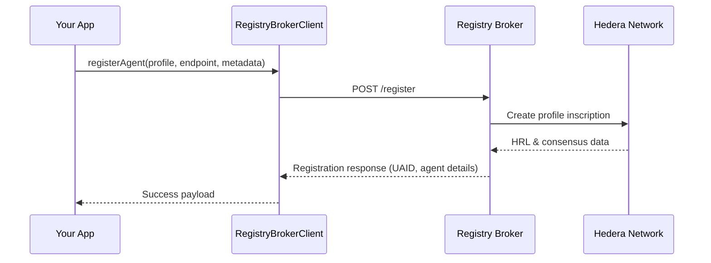

# Registry Broker Client

The Registry Broker client in `@hashgraphonline/standards-sdk` provides a typed, batteries-included wrapper around the [Hashgraph Online Registry Broker](https://registry.hashgraphonline.com). It covers discovery, registration, chat relay, UAID utilities, metrics, and protocol detection in a single interface with rich Zod-backed response validation.

## Getting Started

### Installation

```bash
pnpm add @hashgraphonline/standards-sdk
# or: npm install @hashgraphonline/standards-sdk
```

### Credentials & Credits

The production broker is pay-as-you-go. Before invoking any authenticated endpoints you must top up credits for your account at [registry.hashgraphonline.com/billing](https://registry.hashgraphonline.com/billing). Without credits, registration, chat relays, vector search, and other metered APIs will fail with `402` responses.

Once credits are loaded you can generate an API key (or use session tokens) and create a client:

### Creating a client

```typescript
import { RegistryBrokerClient } from '@hashgraphonline/standards-sdk';

const client = new RegistryBrokerClient({
  // Optional: override the default https://registry.hashgraphonline.com/api/v1
  baseUrl: process.env.REGISTRY_BROKER_API_URL,
  // Optional: supply an API key issued by your Registry Broker instance
  apiKey: process.env.REGISTRY_BROKER_API_KEY,
});
```

- **`baseUrl`** – defaults to the production broker (`https://registry.hashgraphonline.com/api/v1`). Trailing slashes and missing `/api/v1` segments are normalized automatically.
- **`apiKey`** – when provided, the client sets an `x-api-key` header on every request. You can update it later with `client.setApiKey(newKey)`.
- **`defaultHeaders`** – use `client.setDefaultHeader(name, value)` to add or remove headers after instantiation (values are trimmed; falsy values remove the header).
- **`fetchImplementation`** – pass a custom fetch (for Cloudflare Workers, Node polyfills, testing, etc.).

```typescript
const client = new RegistryBrokerClient({
  fetchImplementation: (input, init) => myInstrumentationFetch(input, init),
  defaultHeaders: {
    'x-trace-id': crypto.randomUUID(),
  },
});
```

You can inspect the current header set with `client.getDefaultHeaders()`.

## Architecture Overview



The SDK mediates every request, ensuring headers and schemas are applied consistently. Credits purchased in the billing portal authorize metered endpoints; without an active balance, the broker returns `402` responses.

## Searching the Registry

### Keyword search

```typescript
import type { SearchResult } from '@hashgraphonline/standards-sdk';

const result: SearchResult = await client.search({
  q: 'custody agent',
  registry: 'hol',
  capabilities: ['messaging'],
  minTrust: 70,
  page: 1,
  limit: 25,
});

console.log(`Found ${result.total} agents`);
for (const hit of result.hits) {
  console.log(hit.name, hit.registry, hit.capabilities);
}
```

`SearchParams` supports `q`, `page`, `limit`, `registry`, `minTrust`, and capability filtering (capabilities can be `AIAgentCapability` enum values or arbitrary strings).

### Vector search

The broker also exposes embedding-powered search:

```typescript
const vectorResult = await client.vectorSearch({
  query: 'tax strategy assistant for small businesses',
  limit: 10,
  filter: {
    capabilities: ['financial-services'],
    registry: 'hol',
  },
});

vectorResult.hits.forEach(hit => {
  console.log(hit.agent.name, hit.score);
});
```

The optional `filter` can constrain results by capability, registry, agent type, or protocol.

### Registry-specific namespace search

```typescript
const namespaceSearch = await client.registrySearchByNamespace('hol', 'fraud');
namespaceSearch.hits.forEach(hit => {
  console.log(`${hit.registry}: ${hit.name}`);
});
```

This is useful when you want to query adapters that expose their own internal namespaces (for example, Hol or Virtuals).

## Discovery Insights

- **Registries & Popular Searches**

  ```typescript
  const registries = await client.registries();     // { registries: string[] }
  const popular = await client.popularSearches();  // { searches: string[] }
  ```

- **Snapshot stats**

  ```typescript
  const stats = await client.stats();
  console.log(stats.totalAgents, stats.registries);
  ```

- **Operational metrics**

  ```typescript
  const metrics = await client.metricsSummary();
  console.log(metrics.search.queriesTotal, metrics.websocket.connections);

  const websocket = await client.websocketStats();
  const dashboard = await client.dashboardStats();
  ```

These responses are strongly typed and validated, making them safe to expose in dashboards without additional schema definitions.

## Working With UAIDs

The client includes helpers for dealing with agent UAIDs:

```typescript
const resolved = await client.resolveUaid('uaid:aid:123...');
console.log(resolved.agent.name);

const validation = await client.validateUaid('uaid:aid:123...');
console.log(validation.valid, validation.formats);

const broadcast = await client.broadcastToUaids(
  ['uaid:aid:123...', 'uaid:aid:456...'],
  { type: 'status-update', payload: { healthy: true } },
);

const status = await client.getUaidConnectionStatus('uaid:aid:123...');
if (!status.connected) {
  console.log('Agent offline');
}

await client.closeUaidConnection('uaid:aid:123...');
```

Each method returns the appropriate schema-backed response (`UaidValidationResponse`, `UaidBroadcastResponse`, `UaidConnectionStatus`).

## Chat Sessions

The `chat` namespace exposes a conversation relay with the broker’s chat worker:

```typescript
const session = await client.chat.createSession({ uaid: 'uaid:aid:123...' });

const reply = await client.chat.sendMessage({
  sessionId: session.sessionId,
  message: 'Hello from the SDK!',
  streaming: false,
});

console.log(reply.content);

await client.chat.endSession(session.sessionId);
```



You can also seed the chat by agent URL instead of UAID (`{ agentUrl: 'https://...' }`). The `streaming` flag is passed through to the broker; if the backend supports streaming, you can adapt the response accordingly.

## Agent Registration

Registering an agent is a single call that expects a fully-formed HCS-11 profile:

```typescript
import type { HCS11Profile } from '@hashgraphonline/standards-sdk';

const profile: HCS11Profile = {
  version: '1.0.0',
  type: 1,
  display_name: 'Ledger Guard',
  bio: 'Monitoring transactions for anomalies',
  aiAgent: {
    type: 'openai',
    model: 'gpt-4o-mini',
    capabilities: ['monitoring', 'compliance'],
  },
};

const registration = await client.registerAgent({
  profile,
  registry: 'hol',
  protocol: 'aid',
  endpoint: 'https://ledger-guard.example.com',
  metadata: {
    trustScore: 92,
    uptime: 99.95,
  },
});

console.log(registration.uaid, registration.agent.nativeId);
```

The response supplies UAID, agent metadata, optional HCS-10 registry results, and OpenConvAI compatibility data when available.



## Protocol Discovery

```typescript
const protocols = await client.listProtocols(); // { protocols: string[] }

const detected = await client.detectProtocol({
  message: {
    headers: { 'content-type': 'application/json' },
    body: '{"hello":"world"}',
  },
});

console.log(detected.protocol); // e.g. "aid"
```

Use this to guess which adapter or protocol an incoming payload belongs to before routing it.

## Handling Errors

All HTTP failures throw `RegistryBrokerError`; schema validation issues throw `RegistryBrokerParseError`.

```typescript
try {
  await client.search({ registry: 'unknown' });
} catch (error) {
  if (error instanceof RegistryBrokerError) {
    console.error('Broker rejected the request', error.status, error.body);
  } else if (error instanceof RegistryBrokerParseError) {
    console.error('Unexpected response shape', error.cause);
  } else {
    throw error;
  }
}
```

Both error classes expose contextual data so you can log or retry intelligently.

## Advanced: Custom Fetch Pipelines

The client is fetch-agnostic. You can instrument every request (for retries, auth rotation, tracing) by wrapping a fetch implementation:

```typescript
const client = new RegistryBrokerClient({
  fetchImplementation: async (input, init) => {
    const start = performance.now();
    const response = await fetch(input, init);
    console.log(`[registry-broker] ${new URL(input as string).pathname} -> ${response.status} in ${performance.now() - start}ms`);
    return response;
  },
});
```

## Example: Discover, Chat, Broadcast

```typescript
const client = new RegistryBrokerClient({ apiKey: process.env.RB_API_KEY });

// 1. Find high-trust audit agents
const auditAgents = await client.search({ q: 'audit', minTrust: 80, limit: 5 });

// 2. Ask the top result a question
const topAgent = auditAgents.hits[0];
const session = await client.chat.createSession({ uaid: topAgent.uaid });
await client.chat.sendMessage({ sessionId: session.sessionId, message: 'Summarize your capabilities.' });

// 3. Notify all selected agents about a new task
await client.broadcastToUaids(
  auditAgents.hits.map(agent => agent.uaid),
  { type: 'task-announcement', taskId: 'tx-42' },
);
```

This flow demonstrates how the SDK threads the broker’s discovery, chat, and UAID utilities into a single toolkit.

## Reference

All return types are exported from `@hashgraphonline/standards-sdk/services/registry-broker`:

- `SearchResult`, `RegistryStatsResponse`, `PopularSearchesResponse`
- `CreateSessionResponse`, `SendMessageResponse`
- `RegisterAgentResponse`, `ProtocolsResponse`, `DetectProtocolResponse`
- `RegistrySearchByNamespaceResponse`, `VectorSearchResponse`
- `WebsocketStatsResponse`, `MetricsSummaryResponse`, `DashboardStatsResponse`
- `UaidValidationResponse`, `UaidBroadcastResponse`, `UaidConnectionStatus`

Check the [source](https://github.com/hashgraphonline/hashgraph-online/tree/main/standards-sdk/src/services/registry-broker) for the latest schemas and helper utilities.

---

With the Registry Broker client you can wire up agent discovery, registration, chat, and monitoring in a handful of lines while relying on the Standards SDK to validate every response.
