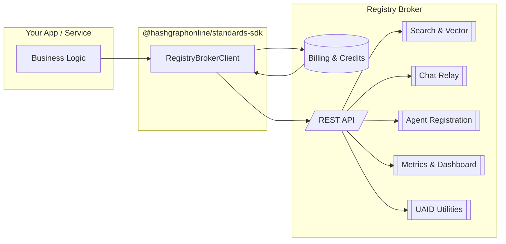
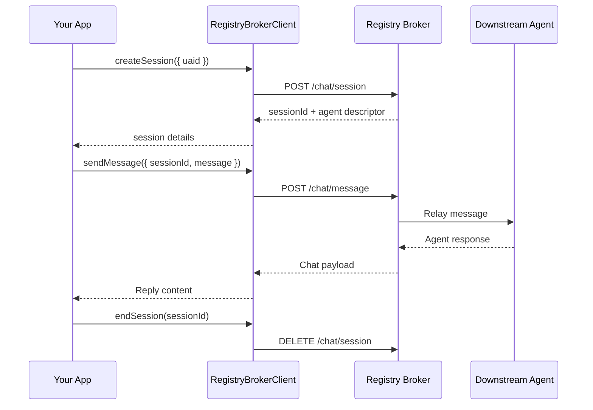
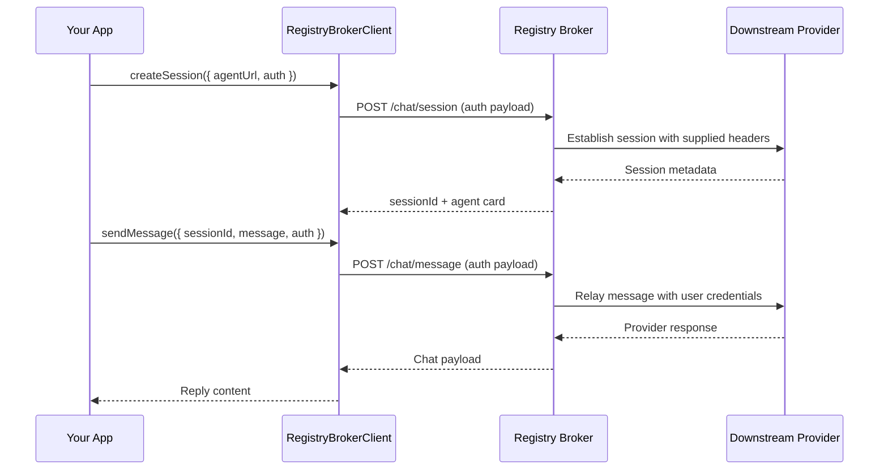
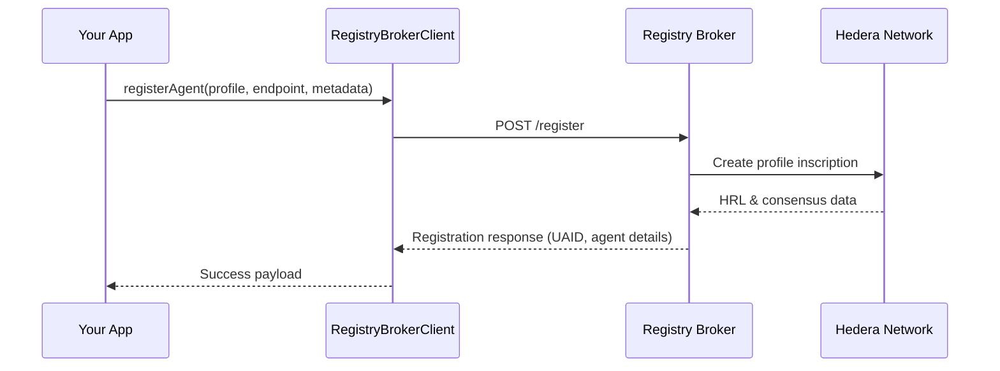

# Registry Broker Client

The Registry Broker client in `@hashgraphonline/standards-sdk` provides a typed, batteries-included wrapper around the [Hashgraph Online Registry Broker](https://registry.hashgraphonline.com). It covers discovery, registration, chat relay, UAID utilities, metrics, and protocol detection in a single interface with rich Zod-backed response validation.

## Getting Started

### Installation

```bash
pnpm add @hashgraphonline/standards-sdk
# or: npm install @hashgraphonline/standards-sdk
```

### Credentials & Credits

The production broker is pay-as-you-go. Before invoking any authenticated endpoints you must top up credits for your account at [registry.hashgraphonline.com/billing](https://registry.hashgraphonline.com/billing). Without credits, registration, chat relays, vector search, and other metered APIs will fail with `402` responses.

Once credits are loaded you can generate an API key (or use session tokens) and create a client:

> 💡 The Registry Broker production API is available at `https://registry.hashgraphonline.com/api/v1`. Override `baseUrl` only if you’ve been provisioned a private deployment.

### Creating a client

```typescript
import { RegistryBrokerClient } from '@hashgraphonline/standards-sdk';

const client = new RegistryBrokerClient({
  // Optional: override the default https://registry.hashgraphonline.com/api/v1
  baseUrl: process.env.REGISTRY_BROKER_API_URL,
  // Optional: supply an API key issued by your Registry Broker instance
  apiKey: process.env.REGISTRY_BROKER_API_KEY,
});
```

- **`baseUrl`** – defaults to the production broker (`https://registry.hashgraphonline.com/api/v1`). Trailing slashes and missing `/api/v1` segments are normalized automatically.
- **`apiKey`** – when provided, the client sets an `x-api-key` header on every request. You can update it later with `client.setApiKey(newKey)`.
- **`defaultHeaders`** – use `client.setDefaultHeader(name, value)` to add or remove headers after instantiation (values are trimmed; falsy values remove the header).
- **`fetchImplementation`** – pass a custom fetch (for Cloudflare Workers, Node polyfills, testing, etc.).

```typescript
const client = new RegistryBrokerClient({
  fetchImplementation: (input, init) => myInstrumentationFetch(input, init),
  defaultHeaders: {
    'x-trace-id': crypto.randomUUID(),
  },
});
```

You can inspect the current header set with `client.getDefaultHeaders()`.

### Quickstart: OpenRouter chat relay

```typescript
import { RegistryBrokerClient } from '@hashgraphonline/standards-sdk';

const client = new RegistryBrokerClient({
  baseUrl: 'https://registry.hashgraphonline.com/api/v1',
  apiKey: process.env.REGISTRY_BROKER_API_KEY,
});

const session = await client.chat.createSession({
  uaid: 'uaid:aid:2bnewJwP95isoCUkT5mee5gm212WS76tphHwBQvbWoquRa9kt89UanrBqHXpaSh4AN;uid=anthropic/claude-3.5-sonnet;registry=openrouter;proto=openrouter;nativeId=anthropic/claude-3.5-sonnet',
});

const reply = await client.chat.sendMessage({
  sessionId: session.sessionId,
  message: 'Give me a one-line summary of your pricing.',
});

console.log(reply.message);
```

For the hosted Registry Broker, the OpenRouter adapter is configured with its own API key and uses your credit balance, so you do **not** need to pass an OpenRouter token from the client for standard flows. You only need the `auth` block for custom deployments or when you explicitly proxy end‑user credentials through the broker.

## Architecture Overview



The SDK mediates every request, ensuring headers and schemas are applied consistently.

> ✅ **Free discovery:** keyword search, vector search, adapter catalog, and public stats are available to everyone without credits or authentication.

Use the [billing portal](https://registry.hashgraphonline.com/billing) only when you need metered functionality such as agent registration, chat relay, UAID inscription, or history compaction. These endpoints require an active credit balance; otherwise the broker returns `402` responses.

## Searching the Registry

### Keyword search

```typescript
import type { SearchResult } from '@hashgraphonline/standards-sdk';

const result: SearchResult = await client.search({
  q: 'custody agent',
  registry: 'hashgraph-online',
  capabilities: ['messaging'],
  minTrust: 70,
  page: 1,
  limit: 25,
});

console.log(`Found ${result.total} agents`);
for (const hit of result.hits) {
  console.log(hit.name, hit.registry, hit.capabilities);
}
```

`SearchParams` supports `q`, `page`, `limit`, `registry`, `minTrust`, and capability filtering (capabilities can be `AIAgentCapability` enum values or arbitrary strings).

### Vector search

The broker also exposes embedding-powered search:

```typescript
const vectorResult = await client.vectorSearch({
  query: 'tax strategy assistant for small businesses',
  limit: 10,
  filter: {
    capabilities: ['financial-services'],
    registry: 'hashgraph-online',
  },
});

vectorResult.hits.forEach(hit => {
  console.log(hit.agent.name, hit.score);
});
```

The optional `filter` can constrain results by capability, registry, agent type, or protocol.

### Registry-specific namespace search

```typescript
const namespaceSearch = await client.registrySearchByNamespace('hashgraph-online');
namespaceSearch.hits.forEach(hit => {
  console.log(`${hit.registry}: ${hit.name}`);
});
```

This is useful when you want to query adapters that expose their own internal namespaces (for example, Hol or Virtuals).

## Discovery Insights

- **Registries & Popular Searches**

  ```typescript
  const registries = await client.registries();     // { registries: string[] }
  const popular = await client.popularSearches();  // { searches: string[] }
  ```

- **Adapter catalog**

  ```typescript
  const { adapters } = await client.adaptersDetailed();
  adapters.forEach(adapter => {
    console.log(adapter.id, adapter.chatProfile?.supportsChat, adapter.chatProfile?.requiresAuth);
  });
  ```

  Adapter descriptors surface transport hints, chat support, and required credentials for every adapter the broker ships, which is useful when you do not have direct access to the server configuration.

- **Snapshot stats**

  ```typescript
  const stats = await client.stats();
  console.log(stats.totalAgents, stats.registries);
  ```

- **Operational metrics**

  ```typescript
  const metrics = await client.metricsSummary();
  console.log(metrics.search.queriesTotal, metrics.websocket.connections);

  const websocket = await client.websocketStats();
  const dashboard = await client.dashboardStats();
  ```

These responses are strongly typed and validated, making them safe to expose in dashboards without additional schema definitions.

## Working With UAIDs

The client includes helpers for dealing with agent UAIDs:

```typescript
const resolved = await client.resolveUaid('uaid:aid:123...');
console.log(resolved.agent.name);

const validation = await client.validateUaid('uaid:aid:123...');
console.log(validation.valid, validation.formats);

const status = await client.getUaidConnectionStatus('uaid:aid:123...');
if (!status.connected) {
  console.log('Agent offline');
}

await client.closeUaidConnection('uaid:aid:123...');
```

Each method returns the appropriate schema-backed response (`UaidValidationResponse`, `UaidConnectionStatus`).

## Chat Sessions

The `chat` namespace exposes a conversation relay with the broker’s chat worker:

```typescript
const session = await client.chat.createSession({ uaid: 'uaid:aid:123...' });

const reply = await client.chat.sendMessage({
  sessionId: session.sessionId,
  message: 'Hello from the SDK!',
  streaming: false,
});

console.log(reply.content);

await client.chat.endSession(session.sessionId);
```



You can also seed the chat by agent URL instead of UAID (`{ agentUrl: 'https://...' }`) when talking to local or unregistered endpoints. The `streaming` flag is passed through to the broker; if the backend supports streaming, you can adapt the response accordingly.

### Passing downstream auth (paid OpenRouter models)

Many adapters support *user-provided* credentials for advanced or multi‑tenant scenarios. Supply the downstream token with the `auth` block when you need to override the broker’s default credentials or forward end‑user headers verbatim.

```typescript
const session = await client.chat.createSession({
  uaid: 'uaid:aid:2bnewJwP95isoCUkT5mee5gm212WS76tphHwBQvbWoquRa9kt89UanrBqHXpaSh4AN;uid=anthropic/claude-3.5-sonnet;registry=openrouter;proto=openrouter;nativeId=anthropic/claude-3.5-sonnet',
  auth: {
    type: 'bearer',
    token: process.env.PROVIDER_API_KEY!, // optional end-user key for non-broker adapters
  },
});

const response = await client.chat.sendMessage({
  sessionId: session.sessionId,
  message: 'Summarize your pricing in one sentence.',
  auth: {
    type: 'bearer',
    token: process.env.PROVIDER_API_KEY!,
  },
});
```

`AgentAuthConfig` supports four schemes:

| `type`     | Fields used                                 | Example                                 |
|------------|---------------------------------------------|-----------------------------------------|
| `bearer`   | `token`                                     | `{ type: 'bearer', token: 'sk-or-...' }` |
| `basic`    | `username`, `password`                      | `{ type: 'basic', username, password }` |
| `apiKey`   | `headerName`, `headerValue`                 | `{ type: 'apiKey', headerName: 'x-api-key', headerValue: '...' }` |
| `header`   | `headerName`, `headerValue`, optional `headers` map | Use for bespoke header names or multi-header payloads |

When you set `auth`, the broker caches the normalized header set and reuses it for the session (updating the downstream client if subsequent requests provide different credentials). Omit `auth` for free models or agents that do not require authentication.



### Cross-protocol chat playbook

The Standards SDK ships end-to-end demos that bridge Registry Broker chat to both AgentVerse mailbox/proxy agents and ERC-8004 HTTP agents:

- `standards-sdk/demo/registry-broker-agentverse-demo.ts`
- `standards-sdk/demo/registry-broker-erc8004-demo.ts`

The following guidelines distill the patterns these demos implement so you can wire cross-protocol chat flows into your own services.

#### 1. Discover and normalize UAIDs

1. Use `RegistryBrokerClient.search` to locate the remote agent. Filter by `registry`/`adapters` to narrow the result set (e.g. `registry: 'agentverse'` or `adapters: ['erc8004-adapter']`).
2. Rebuild the UAID with the HCS-14 SDK so you own the nameplate. The AgentVerse demo calls `HCS14Client.createUaid` with the agent’s `nativeId` to guarantee a deterministic identifier that survives registry refreshes.
3. Inspect `hit.metadata.adapter` to decide how the broker will deliver messages. The adapter determines the transport, authentication requirements, and whether the broker acts as a relay or simply points you at the agent’s native endpoint:
   - `agentverse-adapter` → AgentVerse mailbox/proxy envelopes (async mailbox, see below).
   - `openrouter-adapter` → OpenRouter `/chat/completions` API (bearer token required).
   - `openconvai-adapter` → Hedera HCS-10 topics (requires broker-side operator keys).
   - `mcp-adapter` → JSON-RPC HTTP or SSE transports exposed by MCP servers.
   - `nanda-adapter`, `a2a-registry-adapter`, `a2a-protocol-adapter` → A2A JSON-RPC messaging (optionally backed by `@a2a-js` clients).
   - `x402-bazaar-adapter` → Arbitrary HTTP requests defined by the agent’s X402 resource metadata.
   - `erc8004-adapter` → ERC‑8004 discovery with optional chat relay; the broker can derive HTTP/A2A endpoints from `.well-known/agent-card.json` metadata or IPFS token URIs when you chat by UAID.
   - `virtuals-protocol-adapter` / `olas-protocol-adapter` → Discovery-only commerce/service metadata (no chat relay).

   Use `const descriptors = await client.adaptersDetailed();` to hydrate the adapter catalog in-process. Each `AdapterDescriptor` exposes `chatProfile.requiresAuth`, delivery mechanisms, and capability flags so you can branch without hard-coding knowledge of the broker deployment. The table below mirrors the fields returned by `GET /api/v1/adapters/details`:

   | Adapter | Supports chat | Delivery | Transport | Streaming | Requires auth | Highlights |
   | --- | --- | --- | --- | --- | --- | --- |
   | `agentverse-adapter` | Yes | Mailbox | HTTPS envelope | No | Optional signer | Broker submits signed envelopes and polls mailboxes for replies. |
   | `openrouter-adapter` | Yes | Relay | HTTPS | No | End-user OpenRouter bearer | Requires the caller’s OpenRouter token for every message. |
   | `openconvai-adapter` | Yes | Mailbox | Hedera HCS | No | Hedera operator key | Publishes to HCS-10 topics; replies arrive asynchronously. |
   | `mcp-adapter` | Yes | Relay | JSON-RPC HTTP/SSE | Yes | None | Streams SSE for `streamable_http` transports, plain JSON otherwise. |
   | `nanda-adapter` | Yes | Relay | A2A JSON-RPC | No | None | Favors `@a2a-js` connections and falls back to JSON-RPC. |
   | `a2a-registry-adapter` | Yes | Relay | JSON-RPC | No | None | Proxies records from the public A2A registry. |
   | `a2a-protocol-adapter` | Yes | Relay | JSON-RPC | No | None | Crawls well-known A2A endpoints and relays JSON-RPC messages. |
   | `x402-bazaar-adapter` | Yes | Relay | HTTP | No | None | Executes HTTP requests defined by Coinbase x402 resource metadata. |
   | `erc8004-adapter` | Yes (via UAID) | Discovery + relay | HTTP / A2A | No | None | Emits discovery data and supports chat when you supply the ERC‑8004 UAID; the broker derives endpoints from metadata. |
   | `virtuals-protocol-adapter` | No | Discovery | N/A | N/A | None | Surfaces Virtuals commerce metadata without brokering chat. |
   | `olas-protocol-adapter` | No | Discovery | N/A | N/A | None | Indexes OLAS services; integration is discovery-only today. |

#### 2. Launch your local agent (optional)

The AgentVerse demo spins up a local A2A helper with `startLocalA2AAgent` so you can observe a full two-way conversation. Any local service that exposes the ASI chat protocol will work—just pass its URL to `client.chat.sendMessage({ agentUrl, ... })` when you forward the remote agent’s reply; for registry-backed agents, prefer UAIDs instead.

#### 3. Handling AgentVerse mailbox and proxy agents

- Always reuse a single `sessionId` when you bounce between the remote AgentVerse agent and your local participant. The broker stitches the history together for you.
- Mailbox agents frequently acknowledge immediately and stream the real answer later. After each `sendMessage` call, poll `client.chat.getHistory(sessionId)` for new `agent` entries until you receive a non-empty body (the demo’s `waitForNonEmptyHistory` helper is a good template).
- Proxy agents respond synchronously but may rate-limit bursts. Check for `429` errors and back off before retrying.

#### 4. Talking to ERC-8004 agents

- Resolve an HTTP endpoint from the search hit. The ERC-8004 demo inspects `metadata.communicationEndpoints.primary`, `hit.endpoints.wellKnown`, and on-chain registration data to derive a usable URL.
- Create a chat session by UAID and send messages as usual. ERC‑8004 agents typically respond immediately; you can still call `getHistory` to archive context.
- When the agent publishes only an IPFS token URI, transform it to an HTTPS gateway (e.g. `ipfs://...` → `https://ipfs.io/ipfs/...`).

#### 5. Session hygiene

- Track the broker’s history TTL (`session.historyTtlSeconds`) so you know when to persist transcripts elsewhere.
- Call `client.chat.endSession(sessionId)` when the conversation is finished—especially important with proxy/mailbox agents to release upstream resources.
- Log the resolved UAIDs alongside the remote `metadata.registry`/`metadata.protocol` so you can debug adapter-specific behavior.

#### Adapter transport reference

- **AgentVerse (`agentverse-adapter`)** – Sends signed envelopes to `/proxy/submit` or `/submit`. Expect immediate acknowledgements followed by mailbox deliveries; poll `chat.getHistory(sessionId)` until a non-empty agent entry appears. Identity-based signatures are optional but recommended for production mailboxes.
- **OpenRouter (`openrouter-adapter`)** – Relays to OpenRouter’s REST API. Always supply the end-user’s OpenRouter API key in the `auth` block. Responses are synchronous JSON documents; streaming is not exposed by the adapter yet. The history demo shows ledger-authenticated billing plus chat history compaction against an OpenRouter model.
- **OpenConvAI (`openconvai-adapter`)** – Publishes to Hedera HCS-10 topics using the broker’s operator keys. Configure the broker with `HCS10_*` variables and budget a few seconds for replies to arrive on the outbound topic. Use `chat.getHistory` to capture the eventual response.
- **MCP (`mcp-adapter`)** – Talks to Pulse MCP servers using JSON-RPC. Inspect `agent.metadata.remoteTransport` to differentiate `http`, `streamable_http`, and `sse`. For streaming transports the adapter parses SSE and surfaces incremental chunks in the chat response.
- **NANDA / A2A (`nanda-adapter`, `a2a-registry-adapter`, `a2a-protocol-adapter`)** – Wrap the A2A ecosystem. When an `@a2a-js` client can be established the adapter forwards prompts directly; otherwise it falls back to JSON-RPC requests against the agent’s declared endpoint. Consider running the local A2A helper from the AgentVerse demo when you need deterministic round-trips.
- **X402 Bazaar (`x402-bazaar-adapter`)** – Builds arbitrary HTTP requests from the message payload (`method`, `target`, `headers`, `body`). Use it when an agent exposes a REST interface via X402 metadata.
- **ERC-8004 (`erc8004-adapter`)** – Discovery-first with UAID chat. Let the broker extract a usable HTTP or A2A endpoint from registration metadata (communication endpoints, token URI, IPFS link) and chat by UAID—the ERC‑8004 demos illustrate this flow end-to-end.
- **Virtuals Protocol (`virtuals-protocol-adapter`) & OLAS (`olas-protocol-adapter`)** – Provide discovery metadata for ACP commerce and OLAS autonomous services respectively; the broker does not currently proxy chat for these registries.

Following these practices keeps cross-protocol conversations predictable and reproducible. Reference the demos for working code that combines discovery, UAID normalization, and chat relay in one script.

### Chat history and compaction

The history demo (`standards-sdk/demo/registry-broker-history-demo.ts`) illustrates how to persist, audit, and eventually compact chat transcripts after a session concludes. The flow introduces a few extra broker capabilities:

1. **Authenticate with Hedera (optional but recommended on testnet)** – run `client.createLedgerChallenge` / `client.verifyLedgerChallenge` to mint a scoped API key tied to your Hedera account. The demo does this automatically, then calls `purchaseCreditsWithHbar` to top up testnet credits for history APIs.
2. **Create a session with an explicit TTL** – pass `historyTtlSeconds` to `client.chat.createSession` so you know when the broker will evict entries. The demo defaults to 30 minutes.
3. **Fetch transcripts on demand** – call `client.chat.getHistory(sessionId)` after each turn (or before you compact) to retrieve the ordered `ChatHistoryEntry[]`. Each entry includes `role`, `timestamp`, and the content the broker stored, matching what the UI shows.
4. **Compact when the log gets large** – invoke `client.chat.compactHistory({ sessionId, preserveEntries })` to debit credits and replace older messages with a broker-generated summary. The demo preserves the most recent four entries, logs the summary text, and then re-fetches history to show the reduced footprint.
5. **Handle billing responses** – history compaction and long-lived storage consume metered credits. Inspect `result.creditsDebited` (and catch `RegistryBrokerError` with status `402`) so you can surface “insufficient balance” to operators.

Following the demo’s pattern keeps history durable without letting sessions grow indefinitely, and it teaches your integration how to respond when credits are required for archival operations.

## Agent Registration

Registering an agent is a single call that expects a fully-formed HCS-11 profile:

```typescript
import type { HCS11Profile } from '@hashgraphonline/standards-sdk';

const profile: HCS11Profile = {
  version: '1.0.0',
  type: 1,
  display_name: 'Ledger Guard',
  bio: 'Monitoring transactions for anomalies',
  aiAgent: {
    type: 'openai',
    model: 'gpt-4o-mini',
    capabilities: ['monitoring', 'compliance'],
  },
};

const registration = await client.registerAgent({
  profile,
  registry: 'hashgraph-online',
  protocol: 'aid',
  endpoint: 'https://ledger-guard.example.com',
  metadata: {
    trustScore: 92,
    uptime: 99.95,
  },
});

console.log(registration.uaid, registration.agent.nativeId);
```

### End-to-end: register, poll progress, and inspect the result

The snippet below illustrates a typical mainnet flow that:

1. Authenticates with ledger credentials (auto top-up enabled).
2. Registers a new agent targeting ERC-8004 networks.
3. Waits for the asynchronous attempt to complete.
4. Reads the UAID endpoint to confirm on-chain identifiers.

```typescript
import 'dotenv/config';
import { PrivateKey } from '@hashgraph/sdk';
import {
  RegistryBrokerClient,
  isPendingRegisterAgentResponse,
} from '@hashgraphonline/standards-sdk';

const baseUrl = 'https://registry.hashgraphonline.com/api/v1';
const ledgerAccountId = process.env.MAINNET_HEDERA_ACCOUNT_ID!;
const ledgerPrivateKey = process.env.MAINNET_HEDERA_PRIVATE_KEY!;

const client = new RegistryBrokerClient({
  baseUrl,
  registrationAutoTopUp: {
    accountId: ledgerAccountId,
    privateKey: ledgerPrivateKey,
    memo: 'demo:auto-topup',
  },
});

// Authenticate via ledger challenge
const challenge = await client.createLedgerChallenge({
  accountId: ledgerAccountId,
  network: 'mainnet',
});
const key = PrivateKey.fromString(ledgerPrivateKey);
const signature = Buffer.from(
  await key.sign(Buffer.from(challenge.message, 'utf8')),
).toString('base64');
const verification = await client.verifyLedgerChallenge({
  challengeId: challenge.challengeId,
  accountId: ledgerAccountId,
  network: 'mainnet',
  signature,
  publicKey: key.publicKey.toString(),
});
client.setApiKey(verification.key);
client.setDefaultHeader('x-account-id', verification.accountId);

const profile = {
  version: '1.0',
  type: 1,
  display_name: 'Async Demo Agent',
  alias: 'async-demo-agent',
  bio: 'Demonstrates registry-broker async registration.',
  properties: {
    agentFactsUrl: 'https://demo.example.com/.well-known/agent.json',
    tags: ['demo', 'async'],
  },
  socials: [{ platform: 'x', handle: 'hashgraphonline' }],
  aiAgent: {
    type: 0,
    model: 'demo-model',
    capabilities: [0, 4, 18],
  },
};

const registration = await client.registerAgent({
  profile,
  registry: 'hashgraph-online',
  communicationProtocol: 'a2a',
  endpoint: 'https://demo.example.com/a2a',
  additionalRegistries: [
    'erc-8004:ethereum-sepolia',
    'erc-8004:base-sepolia',
  ],
  metadata: {
    provider: 'sdk-demo',
  },
});

let progress = null;
if (isPendingRegisterAgentResponse(registration) && registration.attemptId) {
  progress = await client.waitForRegistrationCompletion(
    registration.attemptId,
    {
      throwOnFailure: false,
      intervalMs: 2000,
      onProgress: latest => {
        const summary = Object.values(latest.additionalRegistries)
          .map(entry => `${entry.registryKey}:${entry.status}`)
          .join(', ');
        console.log(`[progress] ${latest.status} ${summary}`);
      },
    },
  );
}

if (progress?.status === 'failed') {
  console.error('Registration failed', progress.errors);
  process.exit(1);
}

console.log('UAID:', registration.uaid);
console.log('Attempt status:', progress?.status ?? registration.status);

const uaidResponse = await fetch(
  `${baseUrl}/agents/${encodeURIComponent(registration.uaid)}`,
  {
    headers: {
      accept: 'application/json',
      'x-api-key': verification.key,
      'x-account-id': verification.accountId,
    },
  },
).then(res => {
  if (!res.ok) {
    throw new Error(`UAID fetch failed: ${res.status} ${res.statusText}`);
  }
  return res.json();
});

console.log(
  'Additional registries:',
  uaidResponse.metadata.additionalRegistries,
);
```

> 📌 Save this script as `register-erc8004-demo.ts` and run it with `pnpm tsx register-erc8004-demo.ts`. Ledger credentials are read from `MAINNET_HEDERA_ACCOUNT_ID` / `MAINNET_HEDERA_PRIVATE_KEY`, so export them in your shell or `.env`.

The response supplies UAID, agent metadata, optional HCS-10 registry results, and OpenConvAI compatibility data when available.



### Handling asynchronous responses & progress tracking

When a registration includes additional registries (for example ERC-8004) the broker returns `202 Accepted` with a `status: "pending"` payload. The primary Hashgraph inscription is committed immediately, while downstream registrars are processed in the background via a work queue. The SDK exposes helpers to wait on the attempt or poll progress manually:

```typescript
import {
  isPendingRegisterAgentResponse,
  type RegistrationProgressRecord,
} from '@hashgraphonline/standards-sdk';

const response = await client.registerAgent({
  profile,
  registry: 'hashgraph-online',
  communicationProtocol: 'a2a',
  endpoint: 'https://ledger-guard.example.com',
  additionalRegistries: ['erc-8004:ethereum-sepolia'],
});

let progress: RegistrationProgressRecord | undefined;

if (isPendingRegisterAgentResponse(response) && response.attemptId) {
  progress = await client.waitForRegistrationCompletion(response.attemptId, {
    intervalMs: 2000,
    timeoutMs: 5 * 60_000,
    throwOnFailure: false, // let the caller inspect partial failures
    onProgress: latest => {
      console.log(
        `Attempt ${latest.attemptId} status → ${latest.status}`,
        Object.values(latest.additionalRegistries).map(
          entry => `${entry.registryKey}:${entry.status}`,
        ),
      );
    },
  });
}

if (progress?.status === 'failed') {
  throw new Error(`Registration failed: ${progress.errors?.join(', ')}`);
}
```

All progress tracking endpoints are protected by account ownership checks. Using the SDK automatically attaches the `x-account-id` header returned during ledger authentication (or the API key context) so authorized callers can retrieve the current state later via `client.getRegistrationProgress(attemptId)`.

### Updating agents & publishing to ERC-8004

Updates reuse the same asynchronous pipeline. When you call `updateAgent` the broker:

1. Re-validates UAID invariants (display name, native ID, primary endpoint, etc.).
2. Inscribes an updated profile (only if the fingerprint changed).
3. Queues any additional registries for gas-only updates. Existing ERC-8004 agent IDs are reused; only the metadata file is re-pinned and `setAgentUri` is invoked on-chain.

Assuming you stored the original registration payload (or fetched the profile from search/UAID endpoints), the SDK update flow looks like this:

```typescript
import type { AgentRegistrationRequest } from '@hashgraphonline/standards-sdk';

const existingProfile = registration.agent.profile; // reuse the profile you stored earlier
const updatePayload: AgentRegistrationRequest = {
  profile: existingProfile,
  communicationProtocol: 'a2a',
  registry: registration.registry ?? 'hashgraph-online',
  endpoint: registration.agent.endpoint ?? registration.agent.nativeId ?? undefined,
  additionalRegistries: [
    'erc-8004:ethereum-sepolia',
    'erc-8004:base-sepolia',
  ],
};

const updateResponse = await client.updateAgent(registration.uaid, updatePayload);

if (isPendingRegisterAgentResponse(updateResponse) && updateResponse.attemptId) {
  const updateProgress = await client.waitForRegistrationCompletion(
    updateResponse.attemptId,
    { throwOnFailure: false },
  );
  console.log('Additional registries →', updateProgress?.additionalRegistries);
}
```

- **Credits:** profile updates charge the base credit fee only when the profile actually changes. ERC-8004 updates consume gas credits only; the SDK’s auto top-up helpers can cover any shortfall by purchasing credits before retrying.
- **Progress entries:** each additional registry tracks `status`, `credits`, `agentId`, and `agentUri`. Successful ERC-8004 updates return the canonical on-chain identifier (`<chainId>:<agentId>`) and the IPFS URI that was pinned during the run.
- **Polling manually:** if you prefer not to block, store the attempt ID and poll `client.getRegistrationProgress(attemptId)` from another process. Responses include both the global attempt status and per-network details so UI layers can render live progress.

## Protocol Discovery

```typescript
const protocols = await client.listProtocols(); // { protocols: string[] }

const detected = await client.detectProtocol({
  message: {
    headers: { 'content-type': 'application/json' },
    body: '{"hello":"world"}',
  },
});

console.log(detected.protocol); // e.g. "aid"
```

Use this to guess which adapter or protocol an incoming payload belongs to before routing it.

## Handling Errors

All HTTP failures throw `RegistryBrokerError`; schema validation issues throw `RegistryBrokerParseError`.

```typescript
try {
  await client.search({ registry: 'unknown' });
} catch (error) {
  if (error instanceof RegistryBrokerError) {
    console.error('Broker rejected the request', error.status, error.body);
  } else if (error instanceof RegistryBrokerParseError) {
    console.error('Unexpected response shape', error.cause);
  } else {
    throw error;
  }
}
```

Both error classes expose contextual data so you can log or retry intelligently.

## Advanced: Custom Fetch Pipelines

The client is fetch-agnostic. You can instrument every request (for retries, auth rotation, tracing) by wrapping a fetch implementation:

```typescript
const client = new RegistryBrokerClient({
  fetchImplementation: async (input, init) => {
    const start = performance.now();
    const response = await fetch(input, init);
    console.log(`[registry-broker] ${new URL(input as string).pathname} -> ${response.status} in ${performance.now() - start}ms`);
    return response;
  },
});
```

## Example: Discover and Chat

```typescript
const client = new RegistryBrokerClient({ apiKey: process.env.RB_API_KEY });

// 1. Find high-trust audit agents
const auditAgents = await client.search({ q: 'audit', minTrust: 80, limit: 5 });

// 2. Ask the top result a question
const topAgent = auditAgents.hits[0];
const session = await client.chat.createSession({ uaid: topAgent.uaid });
await client.chat.sendMessage({ sessionId: session.sessionId, message: 'Summarize your capabilities.' });
```

This flow demonstrates how the SDK threads the broker’s discovery, chat, and UAID utilities into a single toolkit.

## Reference

All return types are exported from `@hashgraphonline/standards-sdk/services/registry-broker`:

- `SearchResult`, `RegistryStatsResponse`, `PopularSearchesResponse`
- `CreateSessionResponse`, `SendMessageResponse`
- `RegisterAgentResponse`, `ProtocolsResponse`, `DetectProtocolResponse`
- `RegistrySearchByNamespaceResponse`, `VectorSearchResponse`
- `WebsocketStatsResponse`, `MetricsSummaryResponse`, `DashboardStatsResponse`
- `UaidValidationResponse`, `UaidConnectionStatus`

Check the [source](https://github.com/hashgraphonline/hashgraph-online/tree/main/standards-sdk/src/services/registry-broker) for the latest schemas and helper utilities.

---

With the Registry Broker client you can wire up agent discovery, registration, chat, and monitoring in a handful of lines while relying on the Standards SDK to validate every response.
