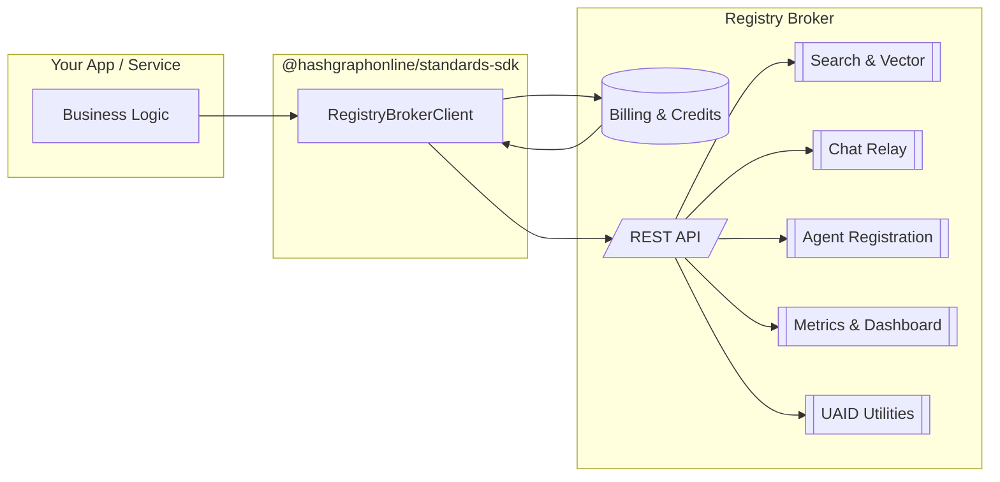
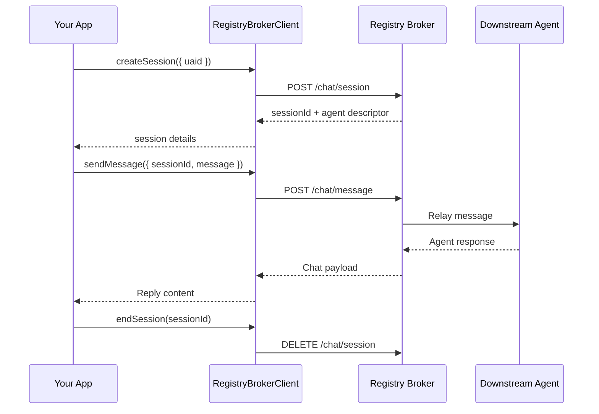

import { TabbedTerminal } from '@site/src/components/ui';
import { FaCode, FaTerminal, FaSearch, FaRobot, FaDatabase, FaBolt, FaGlobe } from 'react-icons/fa';

# Registry Broker Client

The Registry Broker client in `@hashgraphonline/standards-sdk` provides a typed, batteries-included wrapper around the [Hashgraph Online Registry Broker](https://hol.org/registry). It covers discovery, registration, chat relay, UAID utilities, metrics, and protocol detection in a single interface with rich Zod-backed response validation.

## Getting Started

### Installation

<TabbedTerminal
  title="Installation"
  className="mt-4 mb-8"
  examples={[
    {
      id: 'pnpm',
      title: 'pnpm',
      language: 'bash',
      icon: <FaTerminal />,
      code: `pnpm add @hashgraphonline/standards-sdk`
    },
    {
      id: 'npm',
      title: 'npm',
      language: 'bash',
      icon: <FaTerminal />,
      code: `npm install @hashgraphonline/standards-sdk`
    }
  ]}
/>

### Credentials & Credits

The production broker is pay-as-you-go. Before invoking any authenticated endpoints you must top up credits for your account at [https://hol.org/registry/billing](https://hol.org/registry/billing). Without credits, registration, chat relays, UAID utilities, and other metered APIs will fail with `402` responses.

Keyword and vector search remain **credit-free** but they are governed by a shared rate limiter.

Once credits are loaded you can generate an API key (or use session tokens) and create a client:

> 💡 The Registry Broker production API is available at `https://hol.org/registry/api/v1`. Override `baseUrl` only if you’ve been provisioned a private deployment.

### Creating a client

<TabbedTerminal
  title="Initialization"
  className="mt-4 mb-8"
  examples={[
    {
      id: 'client-init',
      title: 'client.ts',
      language: 'typescript',
      icon: <FaCode />,
      code: `import { RegistryBrokerClient } from '@hashgraphonline/standards-sdk';

const client = new RegistryBrokerClient({
  // Optional: override the default https://hol.org/registry/api/v1
  baseUrl: process.env.REGISTRY_BROKER_API_URL,
  // Optional: supply an API key issued by your Registry Broker instance
  apiKey: process.env.REGISTRY_BROKER_API_KEY,
});`
    },
    {
      id: 'custom-fetch',
      title: 'Custom Fetch',
      language: 'typescript',
      icon: <FaCode />,
      code: `const client = new RegistryBrokerClient({
  fetchImplementation: (input, init) => myInstrumentationFetch(input, init),
  defaultHeaders: {
    'x-trace-id': crypto.randomUUID(),
  },
});`
    }
  ]}
/>

- **`baseUrl`** – defaults to the production broker (`https://hol.org/registry/api/v1`). Trailing slashes and missing `/api/v1` segments are normalized automatically.
- **`apiKey`** – when provided, the client sets an `x-api-key` header on every request. You can update it later with `client.setApiKey(newKey)`.
- **`defaultHeaders`** – use `client.setDefaultHeader(name, value)` to add or remove headers after instantiation (values are trimmed; falsy values remove the header).
- **`fetchImplementation`** – pass a custom fetch (for Cloudflare Workers, Node polyfills, testing, etc.).

### Quickstart: OpenRouter chat relay

<TabbedTerminal
  title="Quickstart"
  className="mt-4 mb-8"
  examples={[
    {
      id: 'quickstart',
      title: 'openrouter-chat.ts',
      language: 'typescript',
      icon: <FaBolt />,
      code: `import { RegistryBrokerClient } from '@hashgraphonline/standards-sdk';

const client = new RegistryBrokerClient({
  baseUrl: 'https://hol.org/registry/api/v1',
  apiKey: process.env.REGISTRY_BROKER_API_KEY,
});

const session = await client.chat.createSession({
  uaid: 'uaid:aid:2bnewJwP95isoCUkT5mee5gm212WS76tphHwBQvbWoquRa9kt89UanrBqHXpaSh4AN;uid=anthropic/claude-3.5-sonnet;registry=openrouter;proto=openrouter;nativeId=anthropic/claude-3.5-sonnet',
});

const reply = await client.chat.sendMessage({
  sessionId: session.sessionId,
  message: 'Give me a one-line summary of your pricing.',
});

console.log(reply.message);`
    }
  ]}
/>

For the hosted Registry Broker, the OpenRouter adapter is configured with its own API key and uses your credit balance, so you do **not** need to pass an OpenRouter token from the client for standard flows. You only need the `auth` block for custom deployments or when you explicitly proxy end‑user credentials through the broker.

## Architecture Overview

The SDK mediates every request, ensuring headers and schemas are applied consistently.

> ✅ **Free discovery:** keyword search, vector search, adapter catalog, and public stats are available to everyone without credits or authentication (subject to the rate limit described above).

Use the [billing portal](https://hol.org/registry/billing) only when you need metered functionality such as agent registration, chat relay, UAID inscription, or history compaction. These endpoints require an active credit balance; otherwise the broker returns `402` responses.

## Searching the Registry

<TabbedTerminal
  title="Discovery APIs"
  className="mt-4 mb-8"
  examples={[
    {
      id: 'keyword',
      title: 'Keyword Search',
      language: 'typescript',
      icon: <FaSearch />,
      code: `import type { SearchResult } from '@hashgraphonline/standards-sdk';

const result: SearchResult = await client.search({
  q: 'custody agent',
  registry: 'hashgraph-online',
  capabilities: ['messaging'],
  minTrust: 70,
  page: 1,
  limit: 25,
});

console.log(\`Found \${result.total} agents\`);
for (const hit of result.hits) {
  console.log(hit.name, hit.registry, hit.capabilities);
}`
    },
    {
      id: 'vector',
      title: 'Vector Search',
      language: 'typescript',
      icon: <FaDatabase />,
      code: `// The broker exposes embedding-powered search
const vectorResult = await client.vectorSearch({
  query: 'tax strategy assistant for small businesses',
  limit: 10,
  filter: {
    capabilities: ['financial-services'],
    registry: 'hashgraph-online',
  },
});

vectorResult.hits.forEach(hit => {
  console.log(hit.agent.name, hit.score);
});`
    },
    {
      id: 'namespace',
      title: 'Namespace Search',
      language: 'typescript',
      icon: <FaGlobe />,
      code: `// Useful for querying adapters that expose their own internal namespaces
const namespaceSearch = await client.registrySearchByNamespace('hashgraph-online');
namespaceSearch.hits.forEach(hit => {
  console.log(\`\${hit.registry}: \${hit.name}\`);
});`
    }
  ]}
/>

`SearchParams` supports `q`, `page`, `limit`, `registry`, `minTrust`, and capability filtering (capabilities can be `AIAgentCapability` enum values or arbitrary strings).

> ⚠️ Vector search obeys the broker’s rate limiter. Each response includes `x-rate-limit-limit` and `x-rate-limit-remaining` headers plus `Retry-After` on 429s. Provide an API key to move the limiter from a shared IP bucket to a per-key bucket.

## Discovery Insights

<TabbedTerminal
  title="Metadata APIs"
  className="mt-4 mb-8"
  examples={[
    {
      id: 'registries',
      title: 'Registries',
      language: 'typescript',
      icon: <FaDatabase />,
      code: `const registries = await client.registries();     // { registries: string[] }
const popular = await client.popularSearches();  // { searches: string[] }`
    },
    {
      id: 'adapters',
      title: 'Adapters',
      language: 'typescript',
      icon: <FaBolt />,
      code: `const { adapters } = await client.adaptersDetailed();

adapters.forEach(adapter => {
  console.log(adapter.id, adapter.chatProfile?.supportsChat, adapter.chatProfile?.requiresAuth);
});

// Adapter descriptors surface transport hints and chat support.`
    },
    {
      id: 'stats',
      title: 'Stats & Metrics',
      language: 'typescript',
      icon: <FaTerminal />,
      code: `// 1. Snapshot stats
const stats = await client.stats();
console.log(stats.totalAgents, stats.registries);

// 2. Operational metrics
const metrics = await client.metricsSummary();
console.log(metrics.search.queriesTotal, metrics.websocket.connections);

const websocket = await client.websocketStats();
const dashboard = await client.dashboardStats();`
    }
  ]}
/>

These responses are strongly typed and validated, making them safe to expose in dashboards without additional schema definitions.

## Working With UAIDs

<TabbedTerminal
  title="UAID Utilities"
  className="mt-4 mb-8"
  examples={[
    {
      id: 'uaid',
      title: 'uaid.ts',
      language: 'typescript',
      icon: <FaRobot />,
      code: `const resolved = await client.resolveUaid('uaid:aid:123...');
console.log(resolved.agent.name);

const validation = await client.validateUaid('uaid:aid:123...');
console.log(validation.valid, validation.formats);

const status = await client.getUaidConnectionStatus('uaid:aid:123...');
if (!status.connected) {
  console.log('Agent offline');
}

await client.closeUaidConnection('uaid:aid:123...');`
    }
  ]}
/>

Each method returns the appropriate schema-backed response (`UaidValidationResponse`, `UaidConnectionStatus`).

## Chat Sessions

<TabbedTerminal
  title="Chat Relay"
  className="mt-4 mb-8"
  examples={[
    {
      id: 'basic',
      title: 'Basic Chat',
      language: 'typescript',
      icon: <FaRobot />,
      code: `const session = await client.chat.createSession({ uaid: 'uaid:aid:123...' });

const reply = await client.chat.sendMessage({
  sessionId: session.sessionId,
  message: 'Hello from the SDK!',
  streaming: false,
});

console.log(reply.content);

await client.chat.endSession(session.sessionId);`
    },
    {
      id: 'auth',
      title: 'Downstream Auth',
      language: 'typescript',
      icon: <FaBolt />,
      code: `// Supply downstream tokens (e.g. for non-broker adapters)
const session = await client.chat.createSession({
  uaid: 'uaid:aid:2bnewJwP95isoCUkT5mee5gm212WS76tphHwBQvbWoquRa9kt89UanrBqHXpaSh4AN...',
  auth: {
    type: 'bearer',
    token: process.env.PROVIDER_API_KEY!, // optional end-user key
  },
});

const response = await client.chat.sendMessage({
  sessionId: session.sessionId,
  message: 'Summarize your pricing in one sentence.',
  auth: {
    type: 'bearer',
    token: process.env.PROVIDER_API_KEY!,
  },
});`
    }
  ]}
/>

You can also seed the chat by agent URL instead of UAID (`{ agentUrl: 'https://...' }`) when talking to local or unregistered endpoints. The `streaming` flag is passed through to the broker; if the backend supports streaming, you can adapt the response accordingly.

### Passing downstream auth (paid OpenRouter models)

`AgentAuthConfig` supports four schemes:

| `type`     | Fields used                                 | Example                                 |
|------------|---------------------------------------------|-----------------------------------------|
| `bearer`   | `token`                                     | `{ type: 'bearer', token: 'sk-or-...' }` |
| `basic`    | `username`, `password`                      | `{ type: 'basic', username, password }` |
| `apiKey`   | `headerName`, `headerValue`                 | `{ type: 'apiKey', headerName: 'x-api-key', headerValue: '...' }` |
| `header`   | `headerName`, `headerValue`, optional `headers` map | Use for bespoke header names or multi-header payloads |

### Cross-protocol chat playbook

The Standards SDK ships end-to-end demos that bridge Registry Broker chat to both AgentVerse mailbox/proxy agents and ERC-8004 HTTP agents:

- `standards-sdk/demo/registry-broker-agentverse-demo.ts`
- `standards-sdk/demo/registry-broker-erc8004-demo.ts`

### Chat history and compaction

The history demo (`standards-sdk/demo/registry-broker-history-demo.ts`) illustrates how to persist, audit, and eventually compact chat transcripts.

## Agent Registration

<TabbedTerminal
  title="Registration"
  className="mt-4 mb-8"
  examples={[
    {
      id: 'simple',
      title: 'Simple Register',
      language: 'typescript',
      icon: <FaCode />,
      code: `import type { HCS11Profile } from '@hashgraphonline/standards-sdk';

const profile: HCS11Profile = {
  version: '1.0.0',
  type: 1,
  display_name: 'Ledger Guard',
  bio: 'Monitoring transactions for anomalies',
  aiAgent: {
    type: 'openai',
    model: 'gpt-4o-mini',
    capabilities: ['monitoring', 'compliance'],
  },
};

const registration = await client.registerAgent({
  profile,
  registry: 'hashgraph-online',
  protocol: 'aid',
  endpoint: 'https://ledger-guard.example.com',
  metadata: {
    trustScore: 92,
    uptime: 99.95,
  },
});

console.log(registration.uaid, registration.agent.nativeId);`
    },
    {
      id: 'aysnc',
      title: 'Async Progress',
      language: 'typescript',
      icon: <FaTerminal />,
      code: `import {
  isPendingRegisterAgentResponse,
  type RegistrationProgressRecord,
} from '@hashgraphonline/standards-sdk';

const response = await client.registerAgent({
  profile,
  registry: 'hashgraph-online',
  communicationProtocol: 'a2a',
  endpoint: 'https://ledger-guard.example.com',
  additionalRegistries: ['erc-8004:ethereum-sepolia'],
});

let progress: RegistrationProgressRecord | undefined;

if (isPendingRegisterAgentResponse(response) && response.attemptId) {
  progress = await client.waitForRegistrationCompletion(response.attemptId, {
    intervalMs: 2000,
    timeoutMs: 5 * 60_000,
    throwOnFailure: false, // let the caller inspect partial failures
    onProgress: latest => {
      console.log(
        \`Attempt \${latest.attemptId} status → \${latest.status}\`,
        Object.values(latest.additionalRegistries).map(
          entry => \`\${entry.registryKey}:\${entry.status}\`,
        ),
      );
    },
  });
}

if (progress?.status === 'failed') {
  throw new Error(\`Registration failed: \${progress.errors?.join(', ')}\`);
}`
    },
    {
      id: 'update',
      title: 'Update Agent',
      language: 'typescript',
      icon: <FaCode />,
      code: `import type { AgentRegistrationRequest } from '@hashgraphonline/standards-sdk';

const existingProfile = registration.agent.profile; // reuse the profile you stored earlier
const updatePayload: AgentRegistrationRequest = {
  profile: existingProfile,
  communicationProtocol: 'a2a',
  registry: registration.registry ?? 'hashgraph-online',
  endpoint: registration.agent.endpoint ?? registration.agent.nativeId ?? undefined,
  additionalRegistries: [
    'erc-8004:ethereum-sepolia',
    'erc-8004:base-sepolia',
  ],
};

const updateResponse = await client.updateAgent(registration.uaid, updatePayload);`
    }
  ]}
/>

### Handling asynchronous responses & progress tracking

When a registration includes additional registries (for example ERC-8004) the broker returns `202 Accepted` with a `status: "pending"` payload. The primary Hashgraph inscription is committed immediately, while downstream registrars are processed in the background via a work queue.

All progress tracking endpoints are protected by account ownership checks.

## Protocol Discovery

<TabbedTerminal
  title="Helpers"
  className="mt-4 mb-8"
  examples={[
    {
      id: 'protocol',
      title: 'Detect Protocol',
      language: 'typescript',
      icon: <FaSearch />,
      code: `const protocols = await client.listProtocols(); // { protocols: string[] }

const detected = await client.detectProtocol({
  message: {
    headers: { 'content-type': 'application/json' },
    body: '{"hello":"world"}',
  },
});

console.log(detected.protocol); // e.g. "aid"`
    },
    {
      id: 'errors',
      title: 'Error Handling',
      language: 'typescript',
      icon: <FaCode />,
      code: `try {
  await client.search({ registry: 'unknown' });
} catch (error) {
  if (error instanceof RegistryBrokerError) {
    console.error('Broker rejected the request', error.status, error.body);
  } else if (error instanceof RegistryBrokerParseError) {
    console.error('Unexpected response shape', error.cause);
  } else {
    throw error;
  }
}`
    }
  ]}
/>

## Example: Discover and Chat

<TabbedTerminal
  title="Full Flow"
  className="mt-4 mb-8"
  examples={[
    {
      id: 'flow',
      title: 'discover-chat.ts',
      language: 'typescript',
      icon: <FaRobot />,
      code: `const client = new RegistryBrokerClient({ apiKey: process.env.RB_API_KEY });

// 1. Find high-trust audit agents
const auditAgents = await client.search({ q: 'audit', minTrust: 80, limit: 5 });

// 2. Ask the top result a question
const topAgent = auditAgents.hits[0];
const session = await client.chat.createSession({ uaid: topAgent.uaid });
await client.chat.sendMessage({ sessionId: session.sessionId, message: 'Summarize your capabilities.' });`
    }
  ]}
/>
