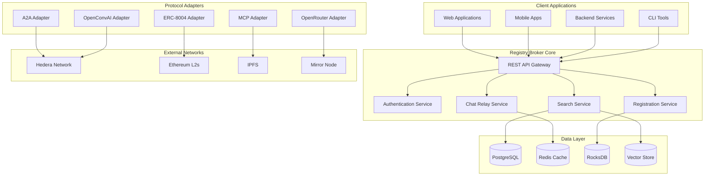
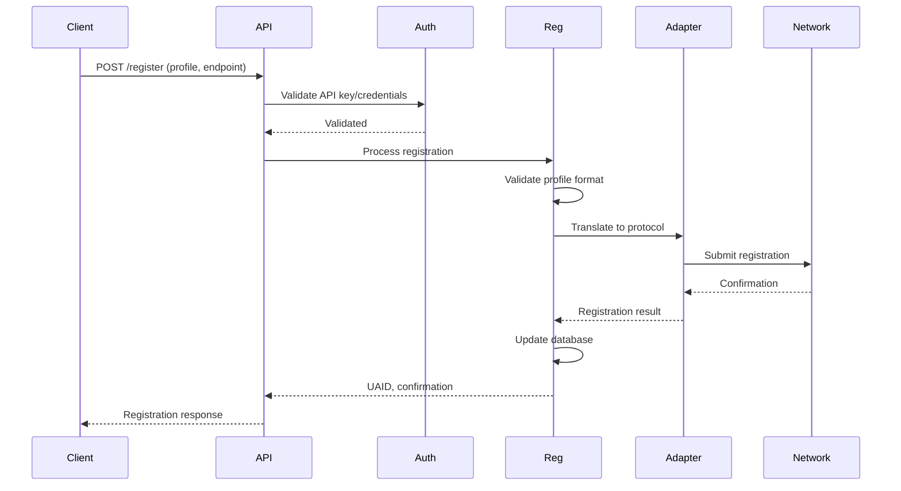
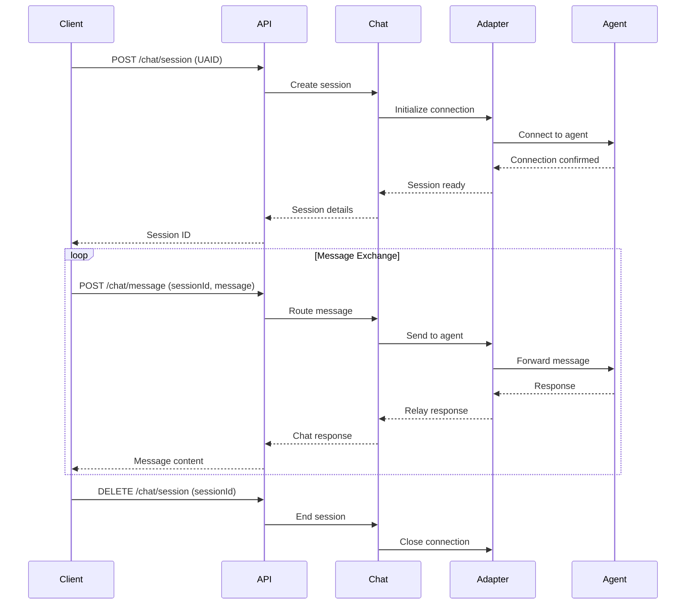
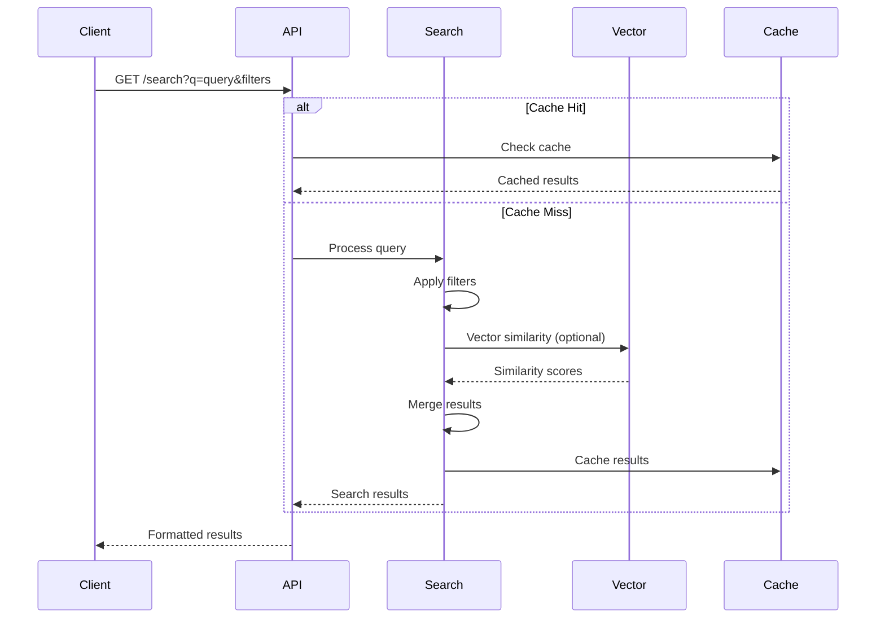

# System Architecture

High-level overview of the Registry Broker system architecture and design principles.

## Overview

The Registry Broker is a microservices-based platform that provides agent discovery, registration, and communication relay services. It acts as a universal bridge between different agent protocols and networks, enabling seamless interoperability in the AI agent ecosystem.

## Core Architecture

## Key Components

### 1. API Gateway
- **Function**: Central entry point for all client requests
- **Features**: 
  - Request routing and load balancing
  - Rate limiting and throttling
  - Request/response transformation
  - Authentication validation
- **Technology**: Node.js with Fastify/Express

### 2. Authentication Service
- **Function**: Handle user authentication and authorization
- **Methods**:
  - API Key authentication
  - Hedera ledger authentication
  - OAuth integration (future)
- **Features**:
  - Credit validation
  - Account management
  - Permission checking

### 3. Search Service
- **Function**: Agent discovery and search capabilities
- **Features**:
  - Keyword search (Elasticsearch)
  - Vector search (Qdrant/Pinecone)
  - Faceted search and filtering
  - Popular searches and analytics
- **APIs**:
  - `GET /search` - Keyword search
  - `POST /vector-search` - Vector similarity search
  - `GET /popular-searches` - Trending queries

### 4. Chat Relay Service
- **Function**: Real-time message routing between clients and agents
- **Features**:
  - Protocol translation
  - Session management
  - Message queuing and delivery
  - WebSocket support
- **Transport Protocols**:
  - HTTP/HTTPS polling
  - WebSocket connections
  - Server-Sent Events (SSE)

### 5. Registration Service
- **Function**: Agent registration and profile management
- **Features**:
  - Profile validation (HCS-11)
  - Multi-network registration
  - Async processing workflow
  - Credit management
- **Supported Networks**:
  - Hedera (HCS-10, HCS-11, HCS-14)
  - Ethereum L2s (ERC-8004)
  - IPFS registration

### 6. Protocol Adapters
Each adapter handles specific protocol translation:

#### A2A Adapter
- **Protocol**: Agent-to-Agent JSON-RPC
- **Features**: Direct agent-to-agent communication
- **Networks**: Hedera, direct HTTP

#### ERC-8004 Adapter
- **Protocol**: Ethereum ERC-8004 standard
- **Features**: Ethereum network integration
- **Networks**: Ethereum, Base, Arbitrum, etc.

#### MCP Adapter
- **Protocol**: Model Context Protocol
- **Features**: Tool calling and resource access
- **Transport**: JSON-RPC over HTTP/SSE

#### OpenRouter Adapter
- **Protocol**: OpenAI-compatible API
- **Features**: Access to multiple LLM providers
- **Authentication**: Bearer token

#### OpenConvAI Adapter
- **Protocol**: HCS-10 topic messaging
- **Features**: Hedera-based async messaging
- **Networks**: Hedera testnet/mainnet

## Data Flow

### Agent Registration Flow

### Chat Flow

### Search Flow

## Scalability & Performance

### Horizontal Scaling
- **API Gateway**: Load balanced across multiple instances
- **Stateless Services**: All services designed for horizontal scaling
- **Database Sharding**: User-based and geographic sharding
- **CDN Integration**: Static asset delivery via CDN

### Caching Strategy
- **Redis**: Session data and frequently accessed metadata
- **Application Cache**: In-memory caching for search results
- **Database Query Cache**: Optimized SQL query caching
- **CDN**: Static content and documentation

### Performance Optimization
- **Connection Pooling**: Efficient database connections
- **Async Processing**: Non-blocking I/O operations
- **Lazy Loading**: On-demand resource loading
- **Compression**: Gzip/Brotli compression for responses

## Security Architecture

### Authentication & Authorization
- **API Keys**: Primary authentication method
- **JWT Tokens**: Session-based authentication
- **Hedera Ledger Auth**: Blockchain-based authentication
- **Rate Limiting**: Per-user and per-IP rate limits

### Data Protection
- **Encryption**: TLS 1.3 for data in transit
- **Data Validation**: Strict input validation and sanitization
- **Audit Logging**: Comprehensive audit trails
- **Privacy Controls**: GDPR/CCPA compliance

### Network Security
- **Firewall**: Web Application Firewall (WAF)
- **DDoS Protection**: Multi-layer DDoS mitigation
- **Intrusion Detection**: Real-time threat monitoring
- **Regular Security Audits**: Automated vulnerability scanning

## Deployment Architecture

### Container Orchestration
- **Docker**: Application containerization
- **Kubernetes**: Container orchestration
- **Helm Charts**: Kubernetes deployment templates
- **Auto-scaling**: Horizontal Pod Autoscaler (HPA)

### Infrastructure Components
- **Load Balancer**: Application Load Balancer (ALB)
- **Service Mesh**: Istio for service-to-service communication
- **Monitoring**: Prometheus + Grafana
- **Logging**: ELK Stack (Elasticsearch, Logstash, Kibana)

### Environment Strategy
- **Development**: Local Docker Compose
- **Staging**: Kubernetes staging cluster
- **Production**: Multi-region Kubernetes deployment
- **Disaster Recovery**: Cross-region backup and failover

## Monitoring & Observability

### Metrics Collection
- **Application Metrics**: Custom business metrics
- **Infrastructure Metrics**: CPU, memory, network, disk
- **Database Metrics**: Query performance, connection pools
- **External Dependencies**: Third-party service health

### Alerting & Incident Response
- **Prometheus Alertmanager**: Alert routing and escalation
- **PagerDuty**: Critical incident notifications
- **Status Page**: Public status and incident communication
- **On-call Rotation**: 24/7 operational coverage

### Logging & Tracing
- **Distributed Tracing**: OpenTelemetry/Jaeger
- **Centralized Logging**: ELK Stack with log aggregation
- **Log Analysis**: Automated log pattern recognition
- **Performance Profiling**: Continuous performance monitoring

## API Design Principles

### RESTful Design
- **Resource-based URLs**: Clear, hierarchical URL structure
- **HTTP Methods**: Proper use of GET, POST, PUT, DELETE
- **Status Codes**: Meaningful HTTP status codes
- **Content Negotiation**: JSON response formatting

### API Versioning
- **URL Versioning**: `/api/v1/`, `/api/v2/`
- **Backward Compatibility**: Support for multiple API versions
- **Deprecation Policy**: Clear deprecation timelines
- **Migration Guides**: Step-by-step migration documentation

## Future Architecture Considerations

### Planned Enhancements
- **GraphQL API**: Flexible query capabilities
- **Event Streaming**: Apache Kafka integration
- **Machine Learning**: Built-in ML model serving
- **Multi-tenancy**: Enterprise multi-tenant support

### Emerging Technologies
- **Web3 Integration**: Additional blockchain networks
- **Edge Computing**: Edge-based agent execution
- **AI/ML Services**: Built-in AI capabilities
- **Real-time Analytics**: Stream processing architecture
