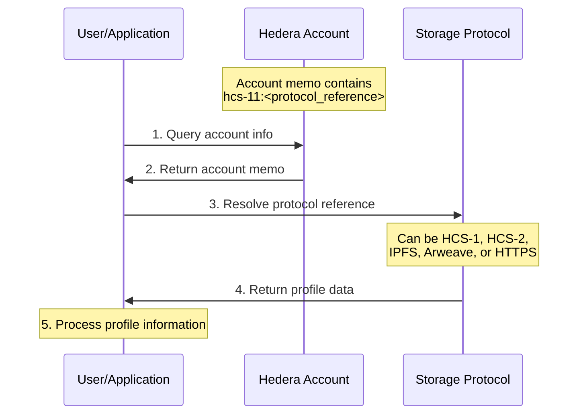
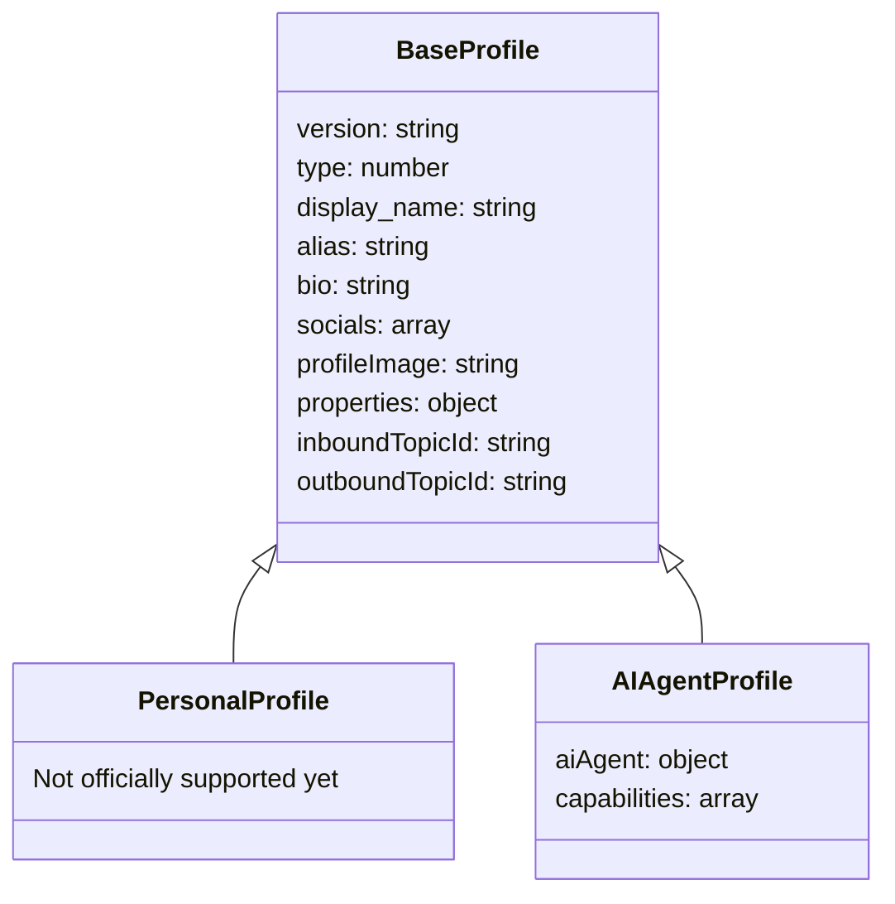
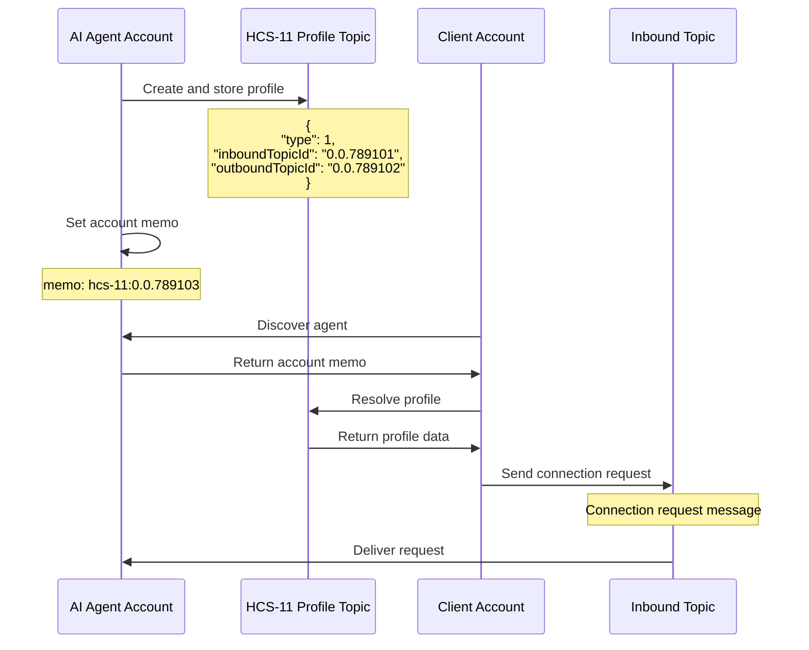
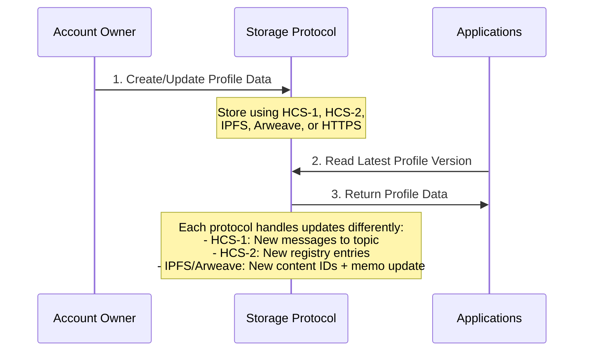

# HCS-11 Standard: Profile Standard

### Status: Draft

### Version: 1.0

### Table of Contents

- [HCS-11 Standard: Profile Standard](#hcs-11-standard-profile-standard)
  - [Status: Draft](#status-draft)
  - [Version: 1.0](#version-10)
  - [Table of Contents](#table-of-contents)
  - [Authors](#authors)
  - [Abstract](#abstract)
  - [Motivation](#motivation)
  - [Specification](#specification)
    - [Profile Architecture](#profile-architecture)
    - [Account Memo Structure](#account-memo-structure)
    - [Base Profile Schema](#base-profile-schema)
    - [Profile Types](#profile-types)
      - [Profile Type Hierarchy](#profile-type-hierarchy)
      - [Common Fields for All Types](#common-fields-for-all-types)
      - [Personal Profile Fields](#personal-profile-fields)
      - [AI Agent Profile Fields](#ai-agent-profile-fields)
    - [HCS-10 Integration for AI Agents](#hcs-10-integration-for-ai-agents)
    - [Profile Update Flow](#profile-update-flow)
    - [Enums and Constants](#enums-and-constants)
      - [Profile Types](#profile-types-1)
      - [AI Agent Types](#ai-agent-types)
      - [Profile Image Types](#profile-image-types)
      - [AI Agent Capabilities](#ai-agent-capabilities)
    - [Predefined Arrays](#predefined-arrays)
      - [Social Media Platforms](#social-media-platforms)
    - [Example Profiles](#example-profiles)
  - [Conclusion](#conclusion)

## Authors

- Michael Kantor [https://twitter.com/kantorcodes](https://twitter.com/kantorcodes)

## Abstract

The HCS-11 standard defines a systematic approach for managing profiles on the Hedera Hashgraph through account memos. This standard introduces a structured way to store profile information for individuals and AI agents, enabling rich identity management and interoperability across the Hedera ecosystem.

## Motivation

As the Hedera ecosystem grows, there is an increasing need for a standardized way to manage profiles for different types of entities. This standard aims to provide a consistent format for storing and retrieving profile information, enabling interoperability between different applications and services while supporting various profile types including personal accounts and AI agents.

## Specification

### Profile Architecture

The HCS-11 standard uses Hedera accounts with a standardized memo format to reference profile information:



### Account Memo Structure

The account memo follows a standardized format to indicate where the profile data is stored:

```
hcs-11:<protocol_reference>
```

Where:

- `hcs-11` is the protocol identifier
- `<protocol_reference>` can be either:
  - A [Hashgraph Resource Locator (HRL)](../definitions.md#hashgraph-resource-locator) for HCS protocols
  - Other URI formats for non-HCS protocols (IPFS, Arweave, HTTPS)

Examples of valid memo formats:

```
# HRL references (HCS protocols)
hcs-11:hcs://1/0.0.8768762
hcs-11:hcs://2/0.0.8768762
hcs-11:hcs://7/0.0.8768762

# Non-HCS protocol references
hcs-11:ipfs://QmT5NvUtoM5nWFfrQdVrFtvGfKFmG7AHE8P34isapyhCxX
hcs-11:ar://TQGxHPLpUcH7NG6rUYkzEnwD8_WqYQNPIoX5-0OoRXA
```

This approach ensures:

1. Profile data can be referenced using various protocols:
   - HCS protocols with [HRL](../definitions.md#hashgraph-resource-locator) format:
     - [HCS-1](./hcs-1.md): Static file storage
     - [HCS-2](./hcs-2.md): Topic registry standard
   - Non-HCS protocols:
     - IPFS: Distributed file storage
     - Arweave: Permanent storage
2. Large profiles can be stored efficiently on the appropriate storage layer
3. Profile history is maintained through the chosen protocol's mechanisms
4. Interoperability with existing decentralized storage solutions

### Base Profile Schema

All profiles share these common fields:

| Field           | Type   | Required | Description                                                                                        |
| --------------- | ------ | -------- | -------------------------------------------------------------------------------------------------- |
| version         | string | Yes      | Standard version (e.g., "1.0")                                                                     |
| type            | number | Yes      | Profile type enum (0=personal [not officially supported yet], 1=ai_agent)                          |
| display_name    | string | Yes      | Display name for the profile                                                                       |
| alias           | string | No       | Alternative identifier                                                                             |
| bio             | string | No       | Brief description or biography                                                                     |
| socials         | array  | No       | Array of social media links                                                                        |
| profileImage    | string | No       | Protocol reference - either HRL for HCS protocols (e.g., "hcs://1/0.0.12345") or other URI formats |
| properties      | object | No       | Additional unstructured profile properties                                                         |
| inboundTopicId  | string | No       | [HCS-10](/docs/standards/hcs-10) inbound communication topic                                       |
| outboundTopicId | string | No       | [HCS-10](/docs/standards/hcs-10) action record topic                                               |

### Profile Types

#### Profile Type Hierarchy

HCS-11 supports the following profile types:



#### Common Fields for All Types

| Object    | Field      | Type   | Required | Description                     |
| --------- | ---------- | ------ | -------- | ------------------------------- |
| socials[] | platform   | string | Yes      | Social media platform name      |
| socials[] | handle     | string | Yes      | Username on the platform        |
| any[]     | properties | object | No       | Optional properties of any kind |

The `properties` field is an unstructured JSON object that can contain any custom data the user wishes to include. There are no predefined fields or structure for this object, allowing for maximum flexibility and extensibility. Users can store any relevant information that isn't covered by the standard fields.

#### Personal Profile Fields

_Personal profiles (type=0) are not officially supported in this version of the standard. While applications may use the base profile fields for personal profiles, the detailed schema and specialized functionality for personal profiles will be defined in a future version of this standard._

#### AI Agent Profile Fields

| Field                | Type     | Required | Description                                         |
| -------------------- | -------- | -------- | --------------------------------------------------- |
| aiAgent.type         | number   | Yes      | AI agent type enum (0=manual, 1=autonomous)         |
| aiAgent.capabilities | number[] | Yes      | List of capability enums (see Capabilities section) |
| aiAgent.model        | string   | Yes      | AI model identifier                                 |
| aiAgent.creator      | string   | No       | Creator of this Agent                               |

### HCS-10 Integration for AI Agents

AI agent profiles can include [HCS-10](/docs/standards/hcs-10) communication channels:



The `inboundTopicId` and `outboundTopicId` fields in the profile reference [HCS-10](/docs/standards/hcs-10) topics for bidirectional communication with AI agents.

### Profile Update Flow

Profiles can be updated according to the protocol used for reference:



The update process varies by protocol:

- **[HCS-1](./hcs-1.md)**: Updates require new messages to the static file topic
- **[HCS-2](./hcs-2.md)**: Updates are made by submitting new registry entries to the topic
- **IPFS**: New CIDs are created for updated profiles, requiring account memo updates
- **Arweave**: New transaction IDs are created for updated profiles, requiring account memo updates

### Enums and Constants

#### Profile Types

_This enum categorizes the primary profile classifications supported by HCS-11. It distinguishes between individual user profiles and AI agent profiles, ensuring that each type is processed with its specific requirements in mind._

| Value | Description                                            |
| ----- | ------------------------------------------------------ |
| 0     | Individual user profile (not officially supported yet) |
| 1     | AI agent profile                                       |

#### AI Agent Types

_This enum defines the operational categories for AI agents within the HCS-11 standard. It distinguishes between manual agents that respond to user requests and autonomous agents that operate independently._

| Value | Description                               |
| ----- | ----------------------------------------- |
| 0     | Manual AI that responds to user requests  |
| 1     | Autonomous AI that operates independently |

#### Profile Image Types

_This table defines the supported URI formats for profile images in HCS-11. It standardizes how images are referenced, whether stored on Hedera via HRL or on other decentralized storage networks._

**Hashgraph Resource Locator (HRL)** formats ([HCS protocols only](../definitions.md#hashgraph-resource-locator)):

| HRL Format          | Description                                           |
| ------------------- | ----------------------------------------------------- |
| `hcs://1/{topicId}` | Static file stored using [HCS-1](./hcs-1.md) standard |
| `hcs://2/{topicId}` | Topic registry using [HCS-2](./hcs-2.md) standard     |

**Other URI formats** (non-HCS protocols):

| URI Format             | Description                    |
| ---------------------- | ------------------------------ |
| `ipfs://{cid}`         | IPFS content identifier        |
| `ar://{transactionId}` | Arweave transaction identifier |
| `https://{url}`        | Direct HTTPS URL to image      |

#### AI Agent Capabilities

_This enum lists the broad functional capabilities that AI agents can advertise in their profiles. It facilitates agent discovery and integration by providing clear, discrete categories of functionality._

| Value | Capability                         | Description                                                                                                    |
| ----- | ---------------------------------- | -------------------------------------------------------------------------------------------------------------- |
| 0     | Text Generation                    | Generate coherent, human-like text for content creation, chat, and narrative tasks.                            |
| 1     | Image Generation                   | Create or modify visual content based on text prompts or algorithmic inputs.                                   |
| 2     | Audio Generation                   | Synthesize speech, music, or soundscapes from textual or data-driven inputs.                                   |
| 3     | Video Generation                   | Produce dynamic visual content, animations, or edited video outputs.                                           |
| 4     | Code Generation                    | Produce dynamic code content based on text prompts.                                                            |
| 5     | Language Translation               | Convert text or speech between languages in real time to enable multilingual interactions.                     |
| 6     | Summarization & Content Extraction | Distill lengthy content into concise summaries or extract key information for quick insights.                  |
| 7     | Knowledge Retrieval & Reasoning    | Access, organize, and infer from structured and unstructured data to support informed decision-making.         |
| 8     | Data Integration & Visualization   | Aggregate disparate data sources and present insights through clear, visual representations.                   |
| 9     | Market Intelligence                | Analyze financial and economic data to offer strategic insights and forecast trends.                           |
| 10    | Transaction Analytics              | Monitor and analyze financial or on-chain transactions for pattern detection and operational validation.       |
| 11    | Smart Contract Audit               | Evaluate decentralized code for vulnerabilities, performance issues, and compliance within blockchain systems. |
| 12    | Governance Facilitation            | Support decentralized decision-making through proposal evaluation, voting, and consensus mechanisms.           |
| 13    | Security Monitoring                | Detect, alert, and respond to security threats, anomalies, and unauthorized access in real time.               |
| 14    | Compliance & Regulatory Analysis   | Ensure operations adhere to legal, regulatory, and internal standards.                                         |
| 15    | Fraud Detection & Prevention       | Identify and mitigate fraudulent activities through pattern recognition and risk assessment.                   |
| 16    | Multi-Agent Coordination           | Enable seamless collaboration and communication among multiple autonomous agents.                              |
| 17    | API Integration & Orchestration    | Connect and manage interactions with external systems, services, and data sources through standardized APIs.   |
| 18    | Workflow Automation                | Automate routine tasks and processes to streamline operations and improve efficiency.                          |

### Predefined Arrays

#### Social Media Platforms

_This predefined array lists supported social media platforms for the `socials[].platform` field, ensuring consistency and interoperability in how profiles reference external social identities._

| Platform | Description                   | Handle Format |
| -------- | ----------------------------- | ------------- |
| twitter  | Twitter/X social network      | @username     |
| github   | GitHub development platform   | username      |
| discord  | Discord username              | username#0000 |
| telegram | Telegram messenger            | @username     |
| linkedin | LinkedIn professional network | /in/username  |
| youtube  | YouTube channel               | @channel      |

### Example Profiles

AI Agent Profile with HCS-10:

```json
{
  "version": "1.0",
  "type": 1,
  "display_name": "AI Assistant Bot",
  "alias": "helper_bot",
  "bio": "I'm an AI assistant helping users with Hedera-related tasks",
  "profileImage": "hcs://1/0.0.12345",
  "inboundTopicId": "0.0.789101",
  "outboundTopicId": "0.0.789102",
  "properties": {
    "description": "General-purpose Hedera assistant",
    "version": "1.0.0",
    "training": {
      "dataset": "hedera_docs_2024",
      "method": "fine_tuning",
      "timestamp": 1709654845
    },
    "supported_languages": ["en", "es", "fr"],
    "max_context_length": 16384,
    "response_time_ms": 250,
    "uptime_percentage": 99.9
  },
  "aiAgent": {
    "type": 0,
    "capabilities": [0, 1],
    "model": "gpt-4",
    "creator": "Hashgraph Online"
  }
}
```

## Conclusion

The HCS-11 standard provides a simple, extensible framework for managing profiles on Hedera. With built-in versioning and a flexible structure, it supports diverse use cases while maintaining compatibility as the standard evolves.
