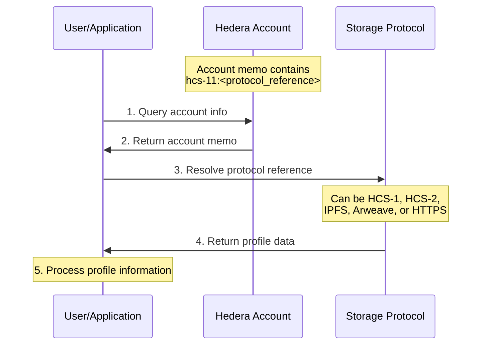
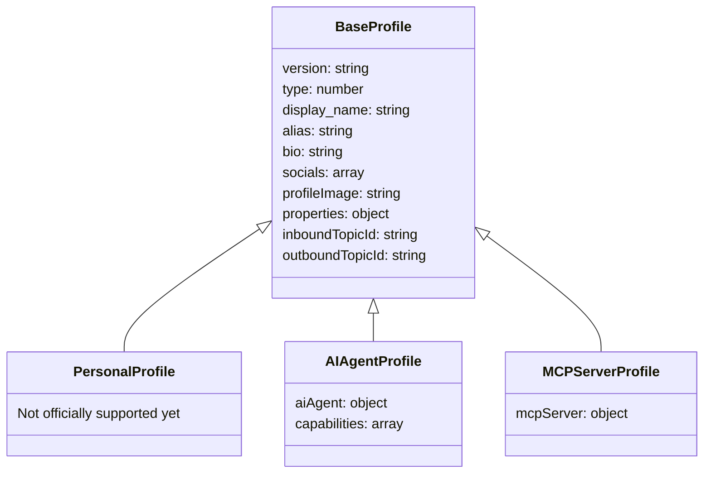
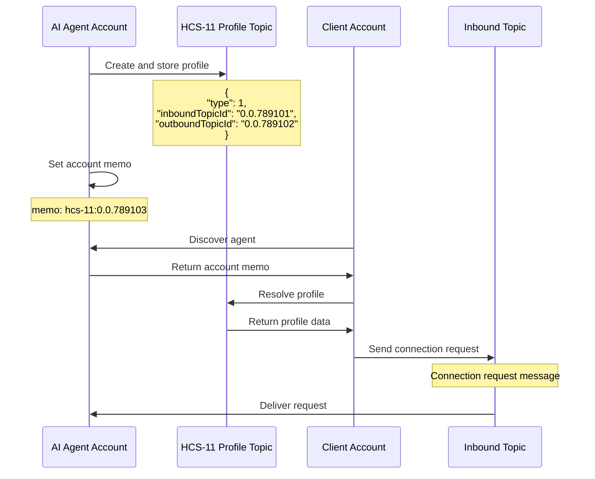
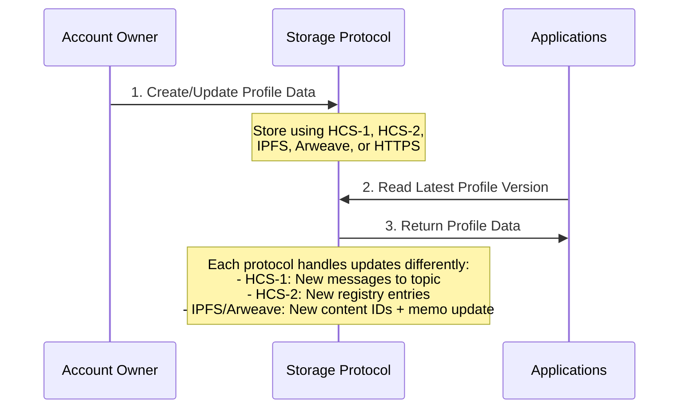

# HCS-11 Standard: Profile Standard

### Status: Draft

### Version: 1.0

### Table of Contents

- [HCS-11 Standard: Profile Standard](#hcs-11-standard-profile-standard)
    - [Status: Draft](#status-draft)
    - [Version: 1.0](#version-10)
    - [Table of Contents](#table-of-contents)
  - [Authors](#authors)
  - [Abstract](#abstract)
  - [Motivation](#motivation)
  - [Specification](#specification)
    - [Profile Architecture](#profile-architecture)
    - [Account Memo Structure](#account-memo-structure)
    - [Base Profile Schema](#base-profile-schema)
    - [Profile Types](#profile-types)
      - [Profile Type Hierarchy](#profile-type-hierarchy)
      - [Common Fields for All Types](#common-fields-for-all-types)
      - [Personal Profile Fields](#personal-profile-fields)
      - [AI Agent Profile Fields](#ai-agent-profile-fields)
      - [MCP Server Profile Fields](#mcp-server-profile-fields)
      - [MCP Server Verification Process](#mcp-server-verification-process)
        - [DNS Verification](#dns-verification)
        - [Signature Verification](#signature-verification)
        - [Challenge Verification](#challenge-verification)
        - [Complete Verification Example](#complete-verification-example)
        - [Complete Client Verification Implementation](#complete-client-verification-implementation)
    - [HCS-10 Integration for AI Agents](#hcs-10-integration-for-ai-agents)
    - [Profile Update Flow](#profile-update-flow)
    - [Enums and Constants](#enums-and-constants)
      - [Profile Types](#profile-types-1)
      - [AI Agent Types](#ai-agent-types)
      - [Profile Image Types](#profile-image-types)
      - [AI Agent Capabilities](#ai-agent-capabilities)
      - [MCP Server Capabilities](#mcp-server-capabilities)
    - [Predefined Arrays](#predefined-arrays)
      - [Social Media Platforms](#social-media-platforms)
    - [Example Profiles](#example-profiles)
  - [Conclusion](#conclusion)

## Authors

- Michael Kantor [https://twitter.com/kantorcodes](https://twitter.com/kantorcodes)

## Abstract

The HCS-11 standard defines a systematic approach for managing profiles on the Hedera Hashgraph through account memos. This standard introduces a structured way to store profile information for individuals and AI agents, enabling rich identity management and interoperability across the Hedera ecosystem.

## Motivation

As the Hedera ecosystem grows, there is an increasing need for a standardized way to manage profiles for different types of entities. This standard aims to provide a consistent format for storing and retrieving profile information, enabling interoperability between different applications and services while supporting various profile types including personal accounts and AI agents.

## Specification

### Profile Architecture

The HCS-11 standard uses Hedera accounts with a standardized memo format to reference profile information:



### Account Memo Structure

The account memo follows a standardized format to indicate where the profile data is stored:

```
hcs-11:<protocol_reference>
```

Where:

- `hcs-11` is the protocol identifier
- `<protocol_reference>` can be either:
  - A [Hashgraph Resource Locator (HRL)](../definitions.md#hashgraph-resource-locator) for HCS protocols
  - Other URI formats for non-HCS protocols (IPFS, Arweave, HTTPS)

Examples of valid memo formats:

```
# HRL references (HCS protocols)
hcs-11:hcs://1/0.0.8768762
hcs-11:hcs://2/0.0.8768762
hcs-11:hcs://7/0.0.8768762

# Non-HCS protocol references
hcs-11:ipfs://QmT5NvUtoM5nWFfrQdVrFtvGfKFmG7AHE8P34isapyhCxX
hcs-11:ar://TQGxHPLpUcH7NG6rUYkzEnwD8_WqYQNPIoX5-0OoRXA
```

This approach ensures:

1. Profile data can be referenced using various protocols:
   - HCS protocols with [HRL](../definitions.md#hashgraph-resource-locator) format:
     - [HCS-1](./hcs-1.md): Static file storage
     - [HCS-2](./hcs-2.md): Topic registry standard
   - Non-HCS protocols:
     - IPFS: Distributed file storage
     - Arweave: Permanent storage
2. Large profiles can be stored efficiently on the appropriate storage layer
3. Profile history is maintained through the chosen protocol's mechanisms
4. Interoperability with existing decentralized storage solutions

### Base Profile Schema

All profiles share these common fields:

| Field           | Type   | Required | Description                                                                                          |
| --------------- | ------ | -------- | ---------------------------------------------------------------------------------------------------- |
| version         | string | Yes      | Standard version (e.g., "1.0")                                                                       |
| type            | number | Yes      | Profile type enum (0=personal [not officially supported yet], 1=ai_agent, 2=mcp_server)              |
| display_name    | string | Yes      | Display name for the profile                                                                         |
| did             | string | Yes      | W3C DID for the subject. did:uaid is recommended; other DIDs may also be linked via `alsoKnownAs`.   |
| alias           | string | No       | Alternative identifier                                                                               |
| bio             | string | No       | Brief description or biography                                                                       |
| socials         | array  | No       | Array of social media links                                                                          |
| profileImage    | string | No       | Protocol reference - either HRL for HCS protocols (e.g., "hcs://1/0.0.12345") or other URI formats   |
| properties      | object | No       | Additional unstructured profile properties                                                           |
| inboundTopicId  | string | No       | [HCS-10](/docs/standards/hcs-10) inbound communication topic                                         |
| outboundTopicId | string | No       | [HCS-10](/docs/standards/hcs-10) action record topic                                                 |

### Profile Types

#### Profile Type Hierarchy

HCS-11 supports the following profile types:



#### Common Fields for All Types

| Object    | Field      | Type   | Required | Description                     |
| --------- | ---------- | ------ | -------- | ------------------------------- |
| socials[] | platform   | string | Yes      | Social media platform name      |
| socials[] | handle     | string | Yes      | Username on the platform        |
| any[]     | properties | object | No       | Optional properties of any kind |

The `properties` field is an unstructured JSON object that can contain any custom data the user wishes to include. There are no predefined fields or structure for this object, allowing for maximum flexibility and extensibility. Users can store any relevant information that isn't covered by the standard fields.

#### Personal Profile Fields

_Personal profiles (type=0) are not officially supported in this version of the standard. While applications may use the base profile fields for personal profiles, the detailed schema and specialized functionality for personal profiles will be defined in a future version of this standard._

#### AI Agent Profile Fields

| Field                | Type     | Required | Description                                         |
| -------------------- | -------- | -------- | --------------------------------------------------- |
| aiAgent.type         | number   | Yes      | AI agent type enum (0=manual, 1=autonomous)         |
| aiAgent.capabilities | number[] | Yes      | List of capability enums (see Capabilities section) |
| aiAgent.model        | string   | Yes      | AI model identifier                                 |
| aiAgent.creator      | string   | No       | Creator of this Agent                               |

#### MCP Server Profile Fields

| Field                        | Type     | Required | Description                                         |
| ---------------------------- | -------- | -------- | --------------------------------------------------- |
| mcpServer.version            | string   | Yes      | MCP server version (e.g., "2025-03-26")            |
| mcpServer.connectionInfo     | object   | Yes      | Connection details for the MCP server              |
| mcpServer.connectionInfo.url | string   | Yes      | Base URL for SSE connection or local path          |
| mcpServer.connectionInfo.transport | string | Yes  | Transport type ("stdio" or "sse")                  |
| mcpServer.services           | number[] | Yes      | List of service types offered (see MCP Services)   |
| mcpServer.description        | string   | Yes      | Detailed description of server functionality       |
| mcpServer.verification       | object   | No       | Verification proof of endpoint ownership           |
| mcpServer.verification.type  | string   | Yes*     | Verification type: "dns", "signature", or "challenge" |
| mcpServer.verification.value | string   | Yes*     | Verification value based on type                   |
| mcpServer.verification.dns_field | string | No     | Custom DNS TXT record name (default: "hedera")     |
| mcpServer.verification.challenge_path | string | No | Custom challenge endpoint path (default: "hedera-verification") |
| mcpServer.host               | object   | No       | Compatible host requirements                        |
| mcpServer.host.minVersion    | string   | No       | Minimum host version required                       |
| mcpServer.capabilities       | array    | No       | MCP capabilities supported by the server           |
| mcpServer.resources          | array    | No       | Resources the server exposes                        |
| mcpServer.tools              | array    | No       | Tools the server provides to clients               |
| mcpServer.maintainer         | string   | No       | Organization maintaining this MCP server           |
| mcpServer.repository         | string   | No       | URL to source code repository                       |
| mcpServer.docs               | string   | No       | URL to server documentation                         |

#### MCP Server Verification Process

The verification field in MCP server profiles enables trustless ownership verification without relying on centralized authorities. The `verification` object contains these fields:

- `type`: Specifies the verification method to use ("dns", "signature", or "challenge")
- `value`: Contains the verification data appropriate for the selected type
- `dns_field`: (Optional) Customizes the DNS TXT record name for DNS verification
- `challenge_path`: (Optional) Customizes the challenge endpoint path for challenge verification

Each verification method is designed to address common use cases while providing flexible implementation options:

##### DNS Verification
For `type: "dns"`, the verification process follows these specific steps:

1. **Record Format**: MCP server owner shall add a DNS TXT record to their domain with:
   - Name: By default, `hedera` or a custom name specified in `dns_field` (prefixed with `_` automatically)
   - Value: Equal to their Hedera account ID (e.g., `0.0.12345678`)

2. **Profile Format**: The verification object in the profile shall be structured as:
   ```json
   "verification": {
     "type": "dns",
     "value": "example.com",
     "dns_field": "hedera"  // Optional, defaults to "hedera"
   }
   ```
   Where:
   - `value` is the fully qualified domain name to check
   - `dns_field` optionally specifies a custom DNS TXT record name

3. **Verification Procedure**:
   - Client extracts the domain from the `value` field
   - Client extracts the DNS field name from `dns_field` (default: "hedera")
   - Client performs a DNS TXT lookup for record named `_{dns_field}` at that domain
   - Client compares the TXT record value with the Hedera account ID of the profile owner
   - Verification passes only if values match exactly (case-sensitive)

4. **Real-world Example**:
   ```
   # Actual DNS record to add (using Route 53, Cloudflare, etc.)
   Name: _hedera.example.com
   Type: TXT
   Value: "0.0.12345678"
   TTL: 3600

   # Sample dig command and response
   $ dig TXT _hedera.example.com

   ;; ANSWER SECTION:
   _hedera.example.com. 3600 IN TXT "0.0.12345678"
   ```

5. **Common Providers Setup**:
   - **AWS Route 53**: Create a TXT record with name `_hedera` (or your custom prefix) and value equal to your account ID
   - **Cloudflare**: Add TXT record with name `_hedera.yourdomain.com` and content equal to your account ID
   - **GoDaddy**: Add TXT record with host `_hedera` and value equal to your account ID

##### Signature Verification
For `type: "signature"`, the verification process follows these specific steps:

1. **Message Format**: The message to be signed shall be the server URL exactly as it appears in the `mcpServer.connectionInfo.url` field, with no additional characters or formatting.

2. **Signature Format**: The signature shall be:
   - Created using the ED25519 key associated with the Hedera account
   - Encoded as a hexadecimal string with no `0x` prefix
   - No additional formatting (no spaces, newlines, etc.)

3. **Profile Format**: The verification object in the profile shall be structured as:
   ```json
   "verification": {
     "type": "signature",
     "value": "a1b2c3d4e5f6..."  // Hex-encoded signature
   }
   ```

4. **Verification Procedure**:
   - Client extracts the URL from `mcpServer.connectionInfo.url`
   - Client extracts the signature from `verification.value`
   - Client retrieves the public key of the Hedera account owner from the Hedera network
   - Client verifies the signature against the UTF-8 encoded URL string using ED25519 verification
   - Verification passes only if the signature is valid

5. **Real-world Example**:
   ```javascript
   // Example of creating a signature (Node.js)
   const { Ed25519PrivateKey } = require("@hashgraph/sdk");

   // Get your private key (securely stored)
   const privateKey = Ed25519PrivateKey.fromString("302e020100300506032b657004220420YOUR_PRIVATE_KEY");

   // URL to sign (shall match exactly what's in your profile)
   const url = "https://mcp.example.com";

   // Sign the URL (UTF-8 encoded)
   const signature = privateKey.sign(Buffer.from(url, "utf8"));

   // Convert to hex string for the verification.value field
   const signatureHex = signature.toString("hex");
   console.log(signatureHex);
   // Output: "a1b2c3d4e5f6..." (this is what goes in verification.value)
   ```

##### Challenge Verification
For `type: "challenge"`, the verification process follows these specific steps:

1. **Endpoint Format**:
   - The MCP server shall expose an endpoint that responds to HTTP GET requests
   - Default path: `/hedera-verification` relative to the server URL
   - Custom path can be specified in `challenge_path`

2. **Challenge-Response Protocol**:
   - Client sends HTTP GET request to `{mcpServer.connectionInfo.url}/{challenge_path}`
   - Server shall respond with a JSON object containing:
     ```json
     {
       "accountId": "0.0.12345678",
       "timestamp": 1620000000000,
       "signature": "a1b2c3d4e5f6..."
     }
     ```
   - The `signature` shall be an ED25519 signature (hex-encoded) of the UTF-8 encoded string `{accountId}:{timestamp}` using the account's private key

3. **Profile Format**: The verification object in the profile shall be structured as:
   ```json
   "verification": {
     "type": "challenge",
     "value": null,  // Can be null for challenge verification
     "challenge_path": "verify"  // Optional, defaults to "hedera-verification"
   }
   ```

4. **Verification Procedure**:
   - Client determines the challenge endpoint URL by:
     - Taking the base URL from `mcpServer.connectionInfo.url`
     - Appending `/{challenge_path}` (or `/hedera-verification` if not specified)
   - Client makes HTTP GET request to this endpoint
   - Client validates that the returned `accountId` matches the profile owner's account ID
   - Client checks that `timestamp` is within acceptable time window (typically 24 hours)
   - Client verifies signature using the account owner's public key
   - Verification passes only if all checks pass

5. **Real-world Example**:
   ```javascript
   // Example server implementation (Express.js)
   const express = require('express');
   const { Ed25519PrivateKey } = require('@hashgraph/sdk');
   const app = express();

   // Verification endpoint
   app.get('/hedera-verification', (req, res) => {
     const accountId = '0.0.12345678'; // Your Hedera account ID
     const timestamp = Date.now();
     const message = `${accountId}:${timestamp}`;

     // Get your private key (securely stored)
     const privateKey = Ed25519PrivateKey.fromString("302e020100300506032b657004220420YOUR_PRIVATE_KEY");

     // Sign the message
     const signature = privateKey.sign(Buffer.from(message, 'utf8')).toString('hex');

     // Return the verification object
     res.json({
       accountId,
       timestamp,
       signature
     });
   });

   app.listen(3000, () => console.log('Server running'));
   ```

##### Complete Verification Example

Here's a comprehensive example showing an MCP server profile with verification:

```json
{
  "version": "1.0",
  "type": 2,
  "display_name": "Hedera Consensus MCP",
  "alias": "hedera_consensus",
  "bio": "MCP server for interacting with Hedera Consensus Service (HCS)",
  "profileImage": "hcs://1/0.0.54321",
  "inboundTopicId": "0.0.789103",
  "outboundTopicId": "0.0.789104",
  "properties": {
    "description": "Enhances AI capabilities with direct access to Hedera Consensus Service",
    "supportEmail": "support@hederaconsensus.com",
    "compatibility": ["Claude", "GPT-4", "Gemini"]
  },
  "mcpServer": {
    "version": "2025-03-26",
    "connectionInfo": {
      "url": "https://mcp.hederaconsensus.com",
      "transport": "sse"
    },
    "services": [0, 1, 5, 11, 14],
    "description": "Provides AI models with the ability to read from and submit messages to Hedera Consensus Service topics",
    "verification": {
      "type": "dns",
      "value": "hederaconsensus.com",
      "dns_field": "mcp-verify"
    },
    "host": {
      "minVersion": "2024-11-05"
    },
    "capabilities": [
      "resources.get",
      "resources.list",
      "resources.subscribe",
      "tools.invoke"
    ],
    "maintainer": "Hedera Consensus Team",
    "repository": "https://github.com/hedera-consensus/mcp-server",
    "docs": "https://docs.hederaconsensus.com/mcp-integration"
  }
}
```

The corresponding DNS record for this profile:
```
_mcp-verify.hederaconsensus.com. 3600 IN TXT "0.0.12345678"
```

##### Complete Client Verification Implementation

This client implementation covers all verification methods:

```javascript
/**
 * Verifies an MCP server profile's ownership
 *
 * @param {string} accountId - The Hedera account ID that owns the profile
 * @param {object} profile - The complete HCS-11 profile object
 * @returns {Promise<boolean>} True if verification passes, false otherwise
 */
async function verifyMCPServer(accountId, profile) {
  if (!profile?.mcpServer?.verification?.type) {
    return false;
  }

  const verification = profile.mcpServer.verification;

  try {
    switch (verification.type) {
      case "dns":
        return await verifyDNS(accountId, profile);

      case "signature":
        return await verifySignature(accountId, profile);

      case "challenge":
        return await verifyChallenge(accountId, profile);

      default:
        console.error(`Unknown verification type: ${verification.type}`);
        return false;
    }
  } catch (error) {
    console.error(`Verification error: ${error.message}`);
    return false;
  }
}

/**
 * DNS verification method
 */
async function verifyDNS(accountId, profile) {
  const domain = profile.mcpServer.verification.value;
  if (!domain) {
    throw new Error("Missing domain in verification value");
  }

  const dnsField = profile.mcpServer.verification.dns_field || "hedera";
  const recordName = `_${dnsField}.${domain}`;

  // Fetch TXT records (implementation varies by platform)
  const txtRecords = await dns.resolveTxt(recordName);

  // Check if any record matches the account ID
  return txtRecords.some(record =>
    Array.isArray(record) && record[0] === accountId
  );
}

/**
 * Signature verification method
 */
async function verifySignature(accountId, profile) {
  const url = profile.mcpServer.connectionInfo.url;
  if (!url) {
    throw new Error("Missing URL in connectionInfo");
  }

  const signature = profile.mcpServer.verification.value;
  if (!signature) {
    throw new Error("Missing signature in verification value");
  }

  // Get the public key from Hedera (implementation varies)
  const publicKey = await fetchAccountPublicKey(accountId);

  // Verify the signature (using ED25519 verification)
  return ed25519Verify(
    Buffer.from(url, 'utf8'),
    Buffer.from(signature, 'hex'),
    publicKey
  );
}

/**
 * Challenge verification method
 */
async function verifyChallenge(accountId, profile) {
  const baseUrl = profile.mcpServer.connectionInfo.url;
  if (!baseUrl) {
    throw new Error("Missing URL in connectionInfo");
  }

  const challengePath = profile.mcpServer.verification.challenge_path || "hedera-verification";
  const endpoint = `${baseUrl}/${challengePath}`;

  // Make the HTTP request
  const response = await fetch(endpoint);

  if (!response.ok) {
    throw new Error(`Challenge endpoint returned ${response.status}`);
  }

  const data = await response.json();

  // Validate accountId
  if (data.accountId !== accountId) {
    return false;
  }

  // Validate timestamp (within 24 hours)
  const timestamp = BigInt(data.timestamp);
  const currentTime = BigInt(Date.now());
  if (currentTime - timestamp > 86400000n) {
    return false;
  }

  // Get the public key from Hedera
  const publicKey = await fetchAccountPublicKey(accountId);

  // Create the message that was signed
  const message = `${data.accountId}:${data.timestamp}`;

  // Verify the signature
  return ed25519Verify(
    Buffer.from(message, 'utf8'),
    Buffer.from(data.signature, 'hex'),
    publicKey
  );
}
```

### HCS-10 Integration for AI Agents

AI agent profiles can include [HCS-10](/docs/standards/hcs-10) communication channels:



The `inboundTopicId` and `outboundTopicId` fields in the profile reference [HCS-10](/docs/standards/hcs-10) topics for bidirectional communication with AI agents.

### DID Field

Profiles shall include a top‑level `did` field containing a W3C DID for the subject. For agents and servers, `did:uaid` is recommended to enable cross‑protocol routing and correlation. Other DIDs (e.g., `did:pkh`, `did:ethr`, `did:web`) may be referenced from the DID Document using `alsoKnownAs`.

### Profile Update Flow

Profiles can be updated according to the protocol used for reference:



The update process varies by protocol:

- **[HCS-1](./hcs-1.md)**: Updates require new messages to the static file topic
- **[HCS-2](./hcs-2.md)**: Updates are made by submitting new registry entries to the topic
- **IPFS**: New CIDs are created for updated profiles, requiring account memo updates
- **Arweave**: New transaction IDs are created for updated profiles, requiring account memo updates

### Enums and Constants

#### Profile Types

_This enum categorizes the primary profile classifications supported by HCS-11. It distinguishes between individual user profiles, AI agent profiles, and MCP server profiles, ensuring that each type is processed with its specific requirements in mind._

| Value | Description                                            |
| ----- | ------------------------------------------------------ |
| 0     | Individual user profile (not officially supported yet) |
| 1     | AI agent profile                                       |
| 2     | MCP server profile                                     |

#### AI Agent Types

_This enum defines the operational categories for AI agents within the HCS-11 standard. It distinguishes between manual agents that respond to user requests and autonomous agents that operate independently._

| Value | Description                               |
| ----- | ----------------------------------------- |
| 0     | Manual AI that responds to user requests  |
| 1     | Autonomous AI that operates independently |

#### Profile Image Types

_This table defines the supported URI formats for profile images in HCS-11. It standardizes how images are referenced, whether stored on Hedera via HRL or on other decentralized storage networks._

**Hashgraph Resource Locator (HRL)** formats ([HCS protocols only](../definitions.md#hashgraph-resource-locator)):

| HRL Format          | Description                                           |
| ------------------- | ----------------------------------------------------- |
| `hcs://1/{topicId}` | Static file stored using [HCS-1](./hcs-1.md) standard |
| `hcs://2/{topicId}` | Topic registry using [HCS-2](./hcs-2.md) standard     |

**Other URI formats** (non-HCS protocols):

| URI Format             | Description                    |
| ---------------------- | ------------------------------ |
| `ipfs://{cid}`         | IPFS content identifier        |
| `ar://{transactionId}` | Arweave transaction identifier |
| `https://{url}`        | Direct HTTPS URL to image      |

#### AI Agent Capabilities

_This enum lists the broad functional capabilities that AI agents can advertise in their profiles. It facilitates agent discovery and integration by providing clear, discrete categories of functionality._

| Value | Capability                         | Description                                                                                                    |
| ----- | ---------------------------------- | -------------------------------------------------------------------------------------------------------------- |
| 0     | Text Generation                    | Generate coherent, human-like text for content creation, chat, and narrative tasks.                            |
| 1     | Image Generation                   | Create or modify visual content based on text prompts or algorithmic inputs.                                   |
| 2     | Audio Generation                   | Synthesize speech, music, or soundscapes from textual or data-driven inputs.                                   |
| 3     | Video Generation                   | Produce dynamic visual content, animations, or edited video outputs.                                           |
| 4     | Code Generation                    | Produce dynamic code content based on text prompts.                                                            |
| 5     | Language Translation               | Convert text or speech between languages in real time to enable multilingual interactions.                     |
| 6     | Summarization & Content Extraction | Distill lengthy content into concise summaries or extract key information for quick insights.                  |
| 7     | Knowledge Retrieval & Reasoning    | Access, organize, and infer from structured and unstructured data to support informed decision-making.         |
| 8     | Data Integration & Visualization   | Aggregate disparate data sources and present insights through clear, visual representations.                   |
| 9     | Market Intelligence                | Analyze financial and economic data to offer strategic insights and forecast trends.                           |
| 10    | Transaction Analytics              | Monitor and analyze financial or on-chain transactions for pattern detection and operational validation.       |
| 11    | Smart Contract Audit               | Evaluate decentralized code for vulnerabilities, performance issues, and compliance within blockchain systems. |
| 12    | Governance Facilitation            | Support decentralized decision-making through proposal evaluation, voting, and consensus mechanisms.           |
| 13    | Security Monitoring                | Detect, alert, and respond to security threats, anomalies, and unauthorized access in real time.               |
| 14    | Compliance & Regulatory Analysis   | Ensure operations adhere to legal, regulatory, and internal standards.                                         |
| 15    | Fraud Detection & Prevention       | Identify and mitigate fraudulent activities through pattern recognition and risk assessment.                   |
| 16    | Multi-Agent Coordination           | Enable seamless collaboration and communication among multiple autonomous agents.                              |
| 17    | API Integration & Orchestration    | Connect and manage interactions with external systems, services, and data sources through standardized APIs.   |
| 18    | Workflow Automation                | Automate routine tasks and processes to streamline operations and improve efficiency.                          |

#### MCP Server Capabilities

_This enum lists the service types that MCP servers can offer, based on the actual Model Context Protocol specification._

| Value | Service Type               | Description                                                                              |
| ----- | -------------------------- | ---------------------------------------------------------------------------------------- |
| 0     | Resource Provider          | Exposes data resources like files, databases, or structured content                      |
| 1     | Tool Provider              | Provides executable tools that can perform actions on behalf of the AI                   |
| 2     | Prompt Template Provider   | Offers reusable prompt templates to guide AI responses                                   |
| 3     | Local File Access          | Provides access to files on the local filesystem with permission controls                |
| 4     | Database Integration       | Connects to databases and provides query capabilities                                    |
| 5     | API Integration            | Connects to third-party APIs and exposes their functionality                             |
| 6     | Web Access                 | Provides web browsing, search, or web page analysis capabilities                         |
| 7     | Knowledge Base             | Serves as a specialized knowledge repository with search and retrieval                   |
| 8     | Memory/Persistence         | Offers persistent storage between sessions for remembering context                       |
| 9     | Code Analysis              | Provides code understanding, manipulation, and execution capabilities                    |
| 10    | Content Generation         | Allows for creating and editing of content like text, images, or code                    |
| 11    | Communication              | Enables sending/receiving messages via email, chat, or messaging platforms               |
| 12    | Document Processing        | Processes and extracts information from documents in various formats                     |
| 13    | Calendar/Schedule          | Provides access to calendar events, scheduling, and time management                      |
| 14    | Search                     | Offers specialized search capabilities across various data sources                       |
| 15    | Assistant Orchestration    | Manages interactions between multiple AI assistants or services                          |

### Predefined Arrays

#### Social Media Platforms

_This predefined array lists supported social media platforms for the `socials[].platform` field, ensuring consistency and interoperability in how profiles reference external social identities._

| Platform | Description                   | Handle Format |
| -------- | ----------------------------- | ------------- |
| twitter  | Twitter/X social network      | @username     |
| github   | GitHub development platform   | username      |
| discord  | Discord username              | username#0000 |
| telegram | Telegram messenger            | @username     |
| linkedin | LinkedIn professional network | /in/username  |
| youtube  | YouTube channel               | @channel      |

### Example Profiles
&
  "did": "did:uaid:QmX4fB9XpS3yKqP8MHTbcQW7R6wN4PrGHz;registry=hol;nativeId=0.0.2656337;uid=helper-bot",

  "version": "1.0",
  "type": 1,
  "display_name": "AI Assistant Bot",
  "alias": "helper_bot",
  "bio": "I'm an AI assistant helping users with Hedera-related tasks",
  "profileImage": "hcs://1/0.0.12345",
  "inboundTopicId": "0.0.789101",
  "outboundTopicId": "0.0.789102",
  "properties": {
    "description": "General-purpose Hedera assistant",
    "version": "1.0.0",
    "training": {
      "dataset": "hedera_docs_2024",
      "method": "fine_tuning",
      "timestamp": 1709654845
    },
    "supported_languages": ["en", "es", "fr"],
    "max_context_length": 16384,
    "response_time_ms": 250,
    "uptime_percentage": 99.9
  },
  "aiAgent": {
    "type": 0,
    "capabilities": [0, 1],
    "model": "gpt-4",
    "creator": "Hashgraph Online"
  }
}
```
&
  "did": "did:uaid:QmZ8kL4mN6vP2wQ9xR3tY7hB5jC1sA9eD;registry=olas;nativeId=eip155:1:0x742d35Cc6634C0532925a3b844Bc9e7595f41Bd;uid=hcs-mcp",

  "version": "1.0",
  "type": 2,
  "display_name": "Hedera Consensus MCP",
  "alias": "hedera_consensus",
  "bio": "MCP server for interacting with Hedera Consensus Service (HCS)",
  "profileImage": "hcs://1/0.0.54321",
  "inboundTopicId": "0.0.789103",
  "outboundTopicId": "0.0.789104",
  "properties": {
    "description": "Enhances AI capabilities with direct access to Hedera Consensus Service",
    "supportEmail": "support@hederaconsensus.com",
    "compatibility": ["Claude", "GPT-4", "Gemini"],
    "releaseNotes": "https://hederaconsensus.com/releases"
  },
  "mcpServer": {
    "version": "2025-03-26",
    "connectionInfo": {
      "url": "https://hederaconsensus.com/mcp",
      "transport": "sse"
    },
    "services": [0, 1, 5, 11, 14],
    "description": "Provides AI models with the ability to read from and submit messages to Hedera Consensus Service topics",
    "verification": {
      "type": "dns",
      "value": "hederaconsensus.com/hedera=0.0.12345678"
    },
    "host": {
      "minVersion": "2024-11-05"
    },
    "capabilities": [
      "resources.get",
      "resources.list",
      "resources.subscribe",
      "tools.invoke"
    ],
    "resources": [
      {
        "name": "hcs_topics",
        "description": "Access message streams from Hedera Consensus Service topics"
      },
      {
        "name": "hcs_messages",
        "description": "Browse historical messages from consensus topics"
      }
    ],
    "tools": [
      {
        "name": "topic_submit",
        "description": "Submit new messages to Hedera Consensus Service topics"
      },
      {
        "name": "topic_subscribe",
        "description": "Subscribe to real-time messages from HCS topics"
      },
      {
        "name": "topic_search",
        "description": "Search for messages in HCS topics by content or timestamp"
      }
    ],
    "maintainer": "Hedera Consensus Team",
    "repository": "https://github.com/hedera-consensus/mcp-server",
    "docs": "https://docs.hederaconsensus.com/mcp-integration"
  }
}
```

## Conclusion

The HCS-11 standard provides a simple, extensible framework for managing profiles on Hedera. With built-in versioning and a flexible structure, it supports diverse use cases while maintaining compatibility as the standard evolves.
