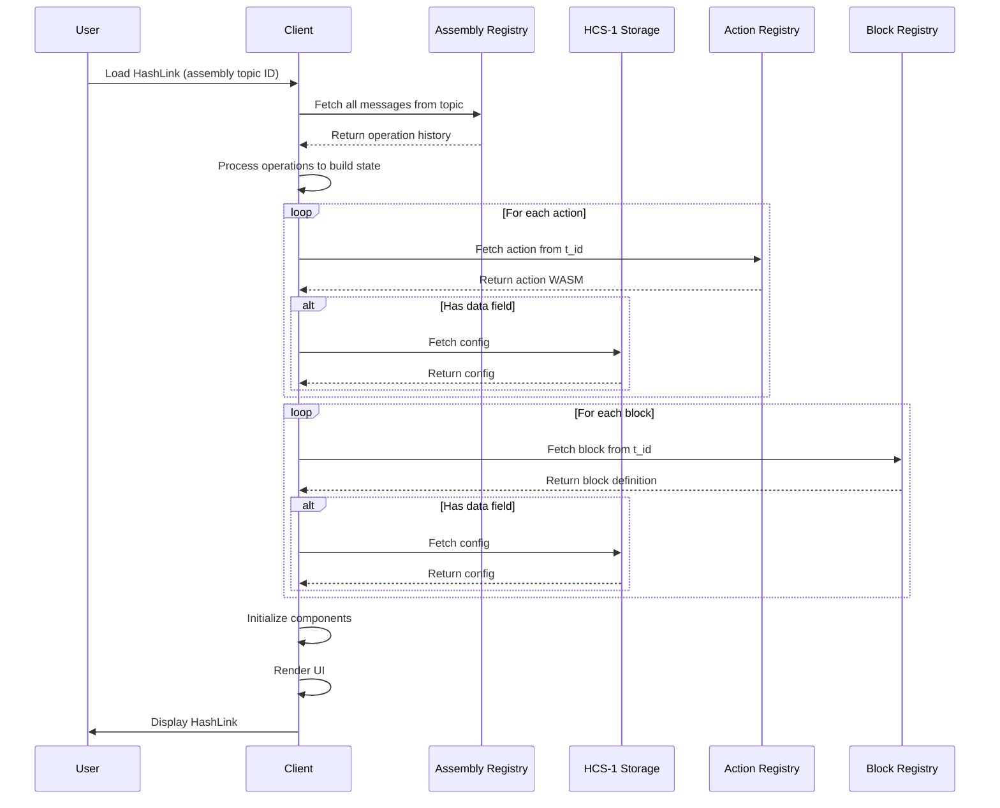

# Assembly Layer - Composition Patterns

## Overview

For implementation details of the Assembly Layer in the standards-sdk, see the [SDK Implementation](./sdk-implementation.md) documentation.

The Assembly Layer defines how to combine Actions (WASM modules) and Blocks (UI components) into complete HashLink experiences. Assembly definitions MAY be large; implementations SHOULD store large configurations using HCS-1 and reference them via the `data` field.

## Core Concepts

Assembly is about:
1. **Binding** - Connecting specific actions to specific blocks
2. **Layout** - Defining how blocks are arranged
3. **Configuration** - Setting default parameters and behaviors

## Assembly Operations

Each assembly topic maintains its own state by processing messages sequentially:

### Operation Types

| Operation | Description | Example |
|-----------|-------------|---------|
| `register` | Register assembly metadata | Initial setup |
| `add-action` | Add an action to this assembly | Associate action by alias |
| `add-block` | Add a block to this assembly | Add a block to layout |
| `update` | Update assembly metadata | Change description/tags |

### Step 1: Create Assembly Topic

Create a new topic for the assembly registry. Implementations MUST use the following memo format for assembly registries:
```
hcs-12:0:60:2
```

Then register the assembly metadata:

```json
{
  "p": "hcs-12",
  "op": "register",
  "name": "Donation Form",
  "description": "Donation form",
  "version": "1.0.0",
  "tags": ["donation", "charity"],
  "author": "0.0.123456"
}
```

### Step 2: Add Actions

Add actions to the same assembly topic:

```json
{
  "p": "hcs-12",
  "op": "add-action",
  "t_id": "0.0.456789",        // Action topic ID (non-indexed)
  "alias": "donate",            // Local name in this assembly
  "config": {                  // Optional action configuration
    "defaultAmount": 10,
    "currency": "HBAR"
  }
}
```

For large configurations, use HCS-1:

```json
{
  "p": "hcs-12",
  "op": "add-action",
  "t_id": "0.0.456789",        // Action topic ID
  "alias": "donate",
  "data": "0.0.987654"         // HCS-1 topic with config
}
```

### Step 3: Add Blocks

Add blocks to the same assembly topic:

```json
{
  "p": "hcs-12",
  "op": "add-block",
  "block_t_id": "0.0.789012",   // Block topic ID (from HCS-1)
  "actions": {                  // Map action keys to topic IDs
    "submit": "0.0.456789"      // Reference action by topic ID
  },
  "attributes": {              // Override block defaults
    "title": "Donation",
    "showRecurring": true
  }
}
```

For complex block configurations:

```json
{
  "p": "hcs-12",
  "op": "add-block",
  "block_t_id": "0.0.789012",   // Block topic ID
  "actions": {                  // Map action keys to topic IDs
    "process": "0.0.456789"
  },
  "data": "0.0.345678"         // HCS-1 topic with full config
}
```

## Practical Examples

### Example 1: NFT Minting Form

```json
// 1. Create assembly topic 0.0.999888 and register
{
  "p": "hcs-12",
  "op": "register",
  "name": "NFT Minting",
  "description": "Mint NFTs with metadata",
  "version": "1.0.0"
}

// 2. Add mint action from topic 0.0.111111
{
  "p": "hcs-12",
  "op": "add-action",
  "t_id": "0.0.111111",        // Non-indexed action topic
  "alias": "mint-nft"
}

// 3. Add form block from topic 0.0.222222
{
  "p": "hcs-12",
  "op": "add-block",
  "block_t_id": "0.0.222222",   // Block topic ID (from HCS-1)
  "actions": {
    "submit": "0.0.111111"     // Map action key to topic ID
  },
  "attributes": {
    "title": "Mint Your NFT",
    "showPreview": true
  }
}
```

### Example 2: Trading Dashboard

```json
// 1. Create assembly topic 0.0.777888 and register
{
  "p": "hcs-12",
  "op": "register",
  "name": "Trading Dashboard",
  "description": "Trading interface",
  "version": "2.0.0",
  "tags": ["defi", "trading"]
}

// 2. Add actions (each from their own topic)
{
  "p": "hcs-12",
  "op": "add-action",
  "t_id": "0.0.333333",        // Swap action topic
  "alias": "swap"
}

{
  "p": "hcs-12",
  "op": "add-action",
  "t_id": "0.0.333334",        // Liquidity action topic
  "alias": "add-liquidity"
}

// 3. Add blocks (each from their own topic)
// Header block
{
  "p": "hcs-12",
  "op": "add-block",
  "block_t_id": "0.0.444444",   // Header block topic
  "actions": {},                // No actions needed for header
  "data": "0.0.555555"         // Complex config via HCS-1
}

// Swap widget with inline config
{
  "p": "hcs-12",
  "op": "add-block",
  "block_t_id": "0.0.444445",   // Swap widget topic
  "actions": {
    "swap": "0.0.333333"        // Map swap action to topic ID
  },
  "attributes": {
    "defaultTokenIn": "HBAR",
    "defaultTokenOut": "USDC"
  }
}

// Main layout composing children
{
  "p": "hcs-12",
  "op": "add-block",
  "block_t_id": "0.0.444446",   // Layout block topic
  "actions": {},                // No actions for layout
  "children": ["0.0.444444", "0.0.444445"]  // Reference child blocks by topic ID
}
```

## Data Structures

### Assembly State

The assembly registry maintains the complete state by processing all operations:

```typescript
interface AssemblyState {
  topicId: string              // The assembly topic ID
  name: string
  description?: string
  version: string
  tags?: string[]
  author?: string
  
  // Components added via operations
  actions: AssemblyAction[]
  blocks: AssemblyBlock[]
  
  // Timestamps
  created: string
  updated: string
  published?: string
}

interface AssemblyAction {
  t_id: string                 // Action topic ID (non-indexed)
  alias: string                // Local name in this assembly
  config?: any                 // Optional configuration
  data?: string                // HCS-1 topic for large configs
  added: string                // When added to assembly
}

interface AssemblyBlock {
  block_t_id: string           // Block topic ID (from HCS-1)
  actions?: Record<string, string> // Map action keys to topic IDs
  attributes?: any             // Override default attributes
  children?: string[]          // Child blocks (by topic ID)
  data?: string                // HCS-1 topic for large configs
  added: string                // When added to assembly
}
```

## Loading and Execution

### Client Implementation



### Action Invocation

When a user interacts with a block that triggers an action:

```typescript
// 1. Block emits action request
const actionRequest = {
  actionId: "swap",
  params: {
    tokenIn: "HBAR",
    tokenOut: "USDC", 
    amount: 100,
    sender: userAccount
  }
}

// 2. Client loads the WASM module
const wasmModule = await loadAction(actionBinding.registryId)

// 3. Execute the action
const result = await wasmModule.POST(
  actionRequest.actionId,
  JSON.stringify(actionRequest.params),
  network,
  assemblyContext.memo
)

// 4. Handle the result
if (result.success && result.data.transaction_bytes) {
  // Submit to Hedera
  const receipt = await submitTransaction(result.data.transaction_bytes)
  // Update UI
  updateBlockState(blockId, { txId: receipt.transactionId })
}
```

## Registry Operations

### Create Assembly Registry

Create a topic with memo:
```
hcs-12:0:60:2
```

Where:
- `0` = Indexed (maintain full history)
- `60` = 60-second cache TTL
- `2` = Assembly registry type

### Assembly Operations Reference

| Operation | Required Fields | Optional Fields | Description |
|-----------|----------------|-----------------|-------------|
| `register` | `name`, `version` | `description`, `tags`, `author` | Register assembly metadata |
| `add-action` | `t_id`, `alias` | `config`, `data` | Add action to assembly |
| `add-block` | `block_t_id` | `actions`, `attributes`, `children`, `data` | Add block to assembly |
| `update` | - | `description`, `tags` | Update assembly metadata |

### Operation Examples

```json
// Register assembly
{
  "p": "hcs-12",
  "op": "register",
  "name": "Example HashLink",
  "version": "1.0.0"
}

// Add action with inline config
{
  "p": "hcs-12",
  "op": "add-action",
  "t_id": "0.0.123456",        // Action topic (non-indexed)
  "alias": "my-action",
  "config": {
    "param1": "value1"
  }
}

// Add block with HCS-1 config
{
  "p": "hcs-12",
  "op": "add-block",
  "block_t_id": "0.0.789012",   // Block topic (from HCS-1)
  "actions": {
    "execute": "0.0.456789"     // Map action to topic ID
  },
  "data": "0.0.111111"
}
```

## Action Source Verification

Since assemblies orchestrate WASM actions that contain executable code, source verification MUST reference the underlying action sources:

```json
{
  "p": "hcs-12",
  "op": "register",
  "t_id": "0.0.123456",
  "name": "Verified Dashboard",
  "version": "1.0.0",
  "source_verification": {
    "source_t_id": "0.0.789012",
    "source_hash": "e3b0c44298fc1c149afbf4c8996fb92427ae41e4649b934ca495991b7852b855",
    "description": "Complete source including assembly configuration and documentation"
  }
}
```

The source archive SHOULD include:
- Assembly configuration files
- Documentation
- Build scripts
- Integration tests

Note: WASM source verification occurs at the Action Registry level (see [Actions documentation](./actions.md#code-verification)).

## Best Practices

1. Use HCS-1 for Large Configs: If action/block configs exceed 500 bytes, implementations SHOULD use the `data` field.
2. Meaningful Aliases: Assemblies SHOULD use descriptive aliases that indicate component purpose.
3. Version Management: Assemblies SHOULD create new assembly topics for major version changes.
4. Test Components: Implementations SHOULD verify action and block compatibility before adding to assembly.
5. Document Sources: Implementations SHOULD maintain clear documentation of component topic IDs.

## Security Considerations

1. Action Validation: Clients MUST verify action hashes before execution.
2. Parameter Sanitization: All user inputs MUST be validated.
3. Registry Verification: Clients MUST ensure `t_id` references point to valid registries.
4. Operation Replay: Clients MUST handle duplicate operations gracefully.
