# HashLinks - Actions, Blocks, and Assembly Standard

## Status: Draft

## Authors
- Kantorcodes [https://twitter.com/kantorcodes](https://twitter.com/kantorcodes)

## Abstract

HashLinks provides a framework for building interactive experiences on Hedera without the overhead of smart contracts. The standard combines WebAssembly modules for logic execution, WordPress Gutenberg blocks for UI components, and an assembly layer for composition.

Normative language in this document uses the key words MUST, MUST NOT, SHOULD, SHOULD NOT, and MAY as described in RFC 2119.

## Motivation

Hedera's ecosystem needs better composability solutions. While smart contracts offer powerful capabilities, they're often expensive and complex for many use cases. HashLinks addresses this gap by providing:

1. Deterministic logic execution through WebAssembly without smart contract fees
2. Reusable UI components based on proven standards (Gutenberg)
3. On-chain verification without relying on centralized infrastructure
4. Seamless integration with existing Hedera wallets and tools

The standard consists of three interconnected layers:
- **[Actions](./actions.md)** - WASM modules for deterministic execution
- **[Blocks](./blocks.md)** - UI components for user interaction
- **[Assembly](./assembly.md)** - Composition layer for combining actions and blocks

For implementation details, see the **[Standards SDK HCS-12 Guide](/docs/libraries/standards-sdk/hcs-12/)** which documents the TypeScript/JavaScript implementation.

## Architecture Overview

The HashLinks architecture consists of three core components:

1. **Actions**: WebAssembly modules that execute business logic
2. **Blocks**: UI components built on the Gutenberg block standard
3. **Assembly**: Composition layer that binds actions to blocks

### Basic Architecture

The relationship between components:

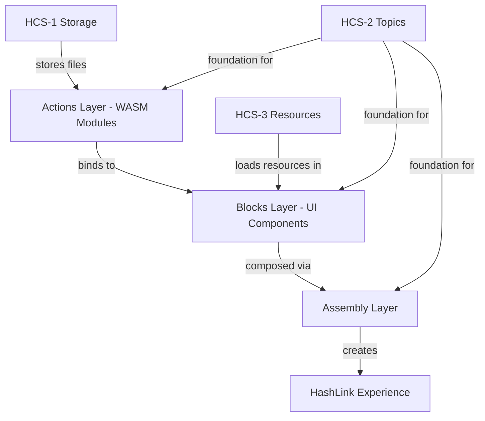

### Detailed Architecture

Complete system architecture including all dependencies:

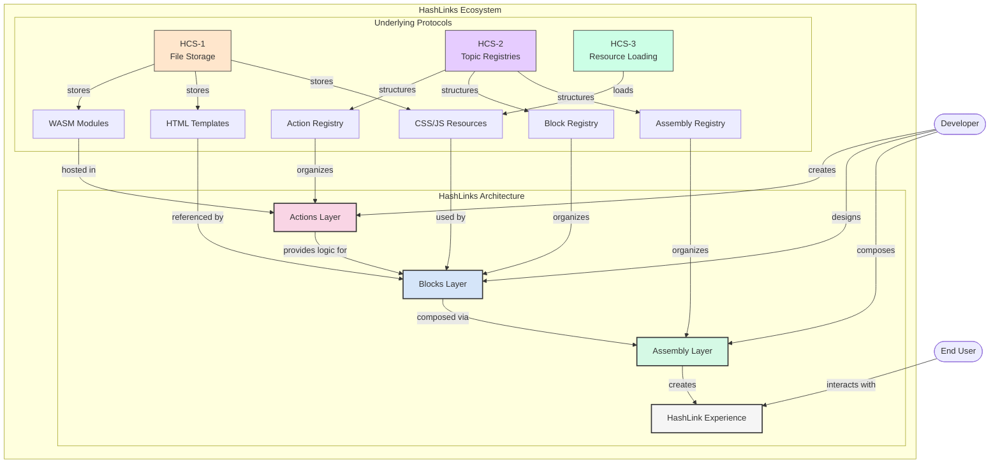

## Topic System

HashLinks leverages HCS-2 for registry management, following the principle of no admin keys to ensure decentralization.

### Topic Types

Registry structure and storage locations:

| Topic Type | Purpose | Configuration |
|------------|---------|---------------|
| **Action Registry** | Stores WASM module references | Non-indexed (latest version) |
| **Assembly Registry** | Complete HashLink configurations | Indexed (maintains history) |
| **HashLinks Registry** | Global directory of HashLinks | Non-indexed |
| **Block Storage** | Block definitions and templates | HCS-1 protocol |
| **Resource References** | Asset loading mechanism | HCS-3 protocol |

Registries SHOULD support HIP-991 fee collection for sustainability.

### Topic Memo Format

Following HCS-2 specification:

```
hcs-12:{indexed}:{ttl}:{type}:[additional parameters]
```

Where:
- `indexed` indicates whether all messages need to be read (0) or only the latest message (1)
- `ttl` specifies a time-to-live in seconds for caching
- `type` defines the component type using an enum value
- Additional parameters vary by topic type

**Type Enum Values**
| Type Enum | Component Type | Description |
|-----------|----------------|-------------|
| `0` | Action | WASM module registry (non-indexed, similar to HCS-6) |
| `1` | Assembly | Composition registry (indexed) |
| `2` | HashLinks | Global directory registry (non-indexed) |

**Action Registry Topic Memo**
```
hcs-12:1:60:0
```

**Assembly Registry Topic Memo**
```
hcs-12:0:60:1
```

**HashLinks Registry Topic Memo**
```
hcs-12:1:60:2
```

## WebAssembly Interface Stability

HashLinks implementations MUST store both the WASM binary and its JavaScript wrapper on-chain. This ensures consistent execution across different environments:

1. **JavaScript Wrapper Requirement** - The wasm-bindgen generated JavaScript must be inscribed alongside the WASM
2. **Version Tracking** - The `interface_version` field tracks the wasm-bindgen version used
3. **Stable Execution** - Both files together ensure deterministic execution regardless of client implementation

This approach addresses the inherent instability of WebAssembly imports and the complexity of wasm-bindgen's memory management.

## Operation Reference

This section defines all operations available in the HCS-12 protocol. Operations MUST be submitted as JSON messages to the appropriate registry topics.

### Action Registry Operations

| Operation | Description | Required Fields |
|-----------|-------------|-----------------|
| `register` | Register a new WASM action module | `p`, `op`, `t_id`, `hash`, `wasm_hash` |

#### Register Action

Registers a new WASM module with its metadata and verification hashes. Messages MUST include the required fields noted above and MAY include optional fields where specified:

```json
{
  "p": "hcs-12",
  "op": "register",
  "t_id": "0.0.123456",
  "hash": "e3b0c44298fc1c149afbf4c8996fb92427ae41e4649b934ca495991b7852b855",
  "wasm_hash": "a1b2c3d4e5f6789012345678901234567890123456789012345678901234567890",
  "js_t_id": "0.0.123457",
  "js_hash": "5f6e7d8c9b0a1234567890123456789012345678901234567890123456789012",
  "interface_version": "0.2.92",
  "info_t_id": "0.0.123458",
  "validation_rules": {
    "amount": {
      "type": "number",
      "min": 0,
      "max": 1000000
    }
  },
  "m": "Token transfer action v1.0.0"
}
```

### Assembly Registry Operations

| Operation | Description | Required Fields |
|-----------|-------------|-----------------|
| `register` | Create a new assembly | `p`, `op`, `name`, `version` |
| `add-action` | Add an action to the assembly | `p`, `op`, `t_id`, `alias` |
| `add-block` | Add a block to the assembly | `p`, `op`, `block_t_id` |
| `update` | Update assembly metadata | `p`, `op` |

#### Register Assembly

Creates a new assembly that can combine actions and blocks:

```json
{
  "p": "hcs-12",
  "op": "register",
  "name": "defi-dashboard",
  "version": "1.0.0",
  "description": "Complete DeFi dashboard with swapping and staking",
  "tags": ["defi", "trading", "staking"],
  "author": "0.0.123456"
}
```

#### Add Action

Adds a WASM action to the assembly:

```json
{
  "p": "hcs-12",
  "op": "add-action",
  "t_id": "0.0.123456",
  "alias": "swap",
  "config": {
    "slippage": 0.5,
    "deadline": 300
  }
}
```

#### Add Block

Adds a UI block to the assembly:

```json
{
  "p": "hcs-12",
  "op": "add-block",
  "block_t_id": "0.0.234568",
  "actions": {
    "swap": "0.0.123456",
    "approve": "0.0.123457"
  },
  "attributes": {
    "title": "Quick Swap",
    "defaultToken": "HBAR"
  }
}
```

#### Update Assembly

Updates assembly metadata:

```json
{
  "p": "hcs-12",
  "op": "update",
  "description": "Updated DeFi dashboard with new features",
  "tags": ["defi", "trading", "staking", "lending"]
}
```

### HashLinks Registry Operations

| Operation | Description | Required Fields |
|-----------|-------------|-----------------|
| `register` | Register a HashLink in the global directory | `p`, `op`, `t_id`, `name` |

#### Register HashLink

Registers an assembly in the global HashLinks directory:

```json
{
  "p": "hcs-12",
  "op": "register",
  "t_id": "0.0.567890",
  "name": "Ultimate DeFi Dashboard",
  "description": "All-in-one DeFi management interface",
  "tags": ["defi", "featured"],
  "category": "finance",
  "author": "0.0.123456",
  "website": "https://example.com"
}
```

## Security Considerations

Key security requirements:

1. Hash Verification: Clients MUST verify WASM, JavaScript wrapper, and metadata hashes before execution.
2. Template Security: Templates MUST NOT include inline scripts; all resources MUST be loaded via HCS-3.
3. State Isolation: Blocks MUST be isolated by default, with explicit permission required for communication.
4. Action Validation: All actions MUST be registered with parameter validation and HTML sanitization.
5. Interface Verification: The JavaScript wrapper MUST match the WASM module interface version.

## Implementation Guide

### Step 1: Create Your WASM Action

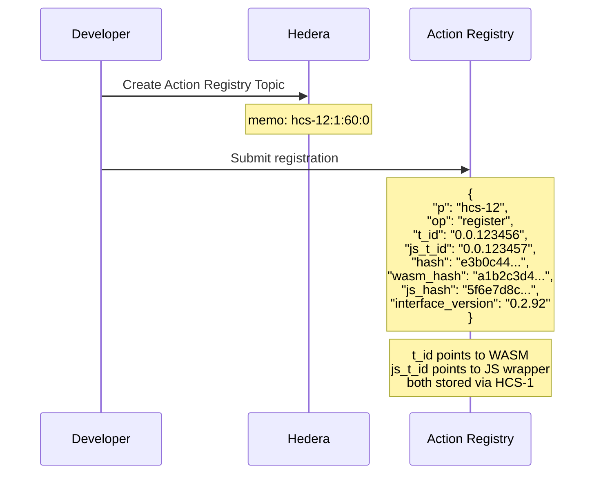

### Step 2: Create UI Block

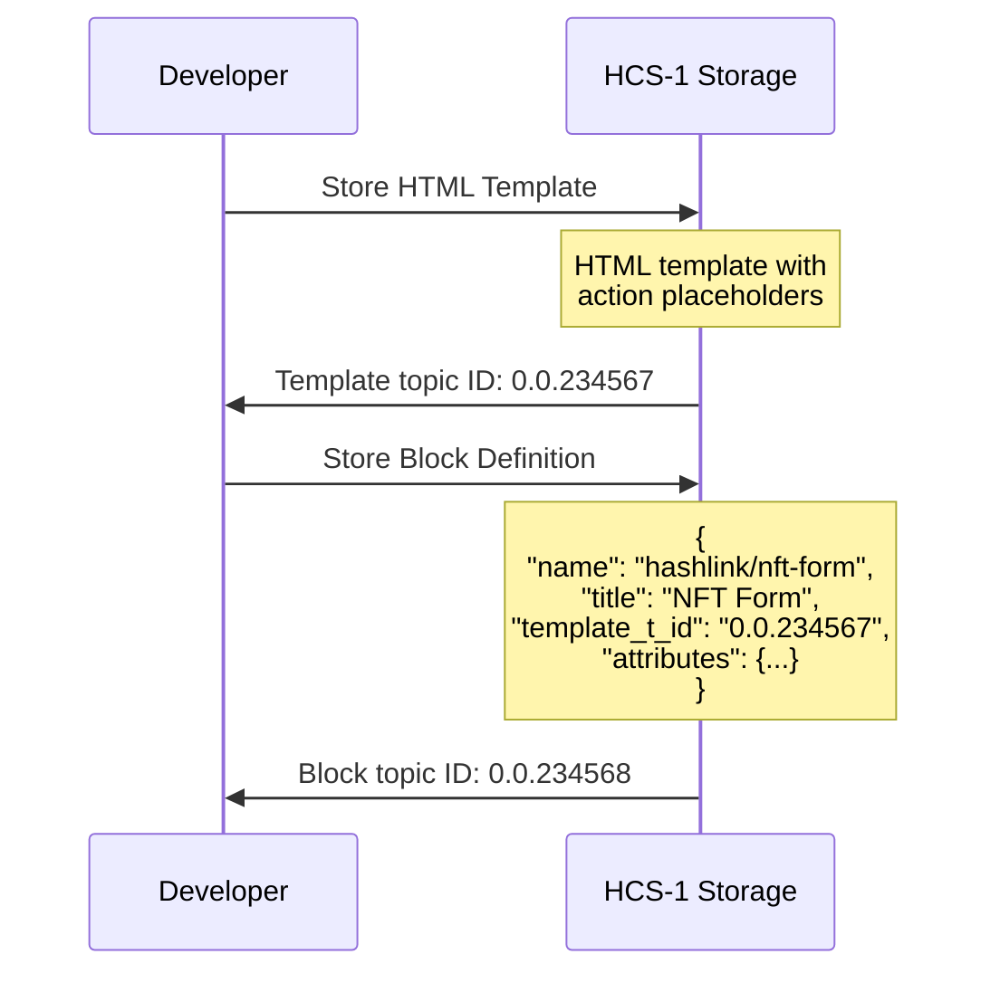

### Step 3: Create Assembly

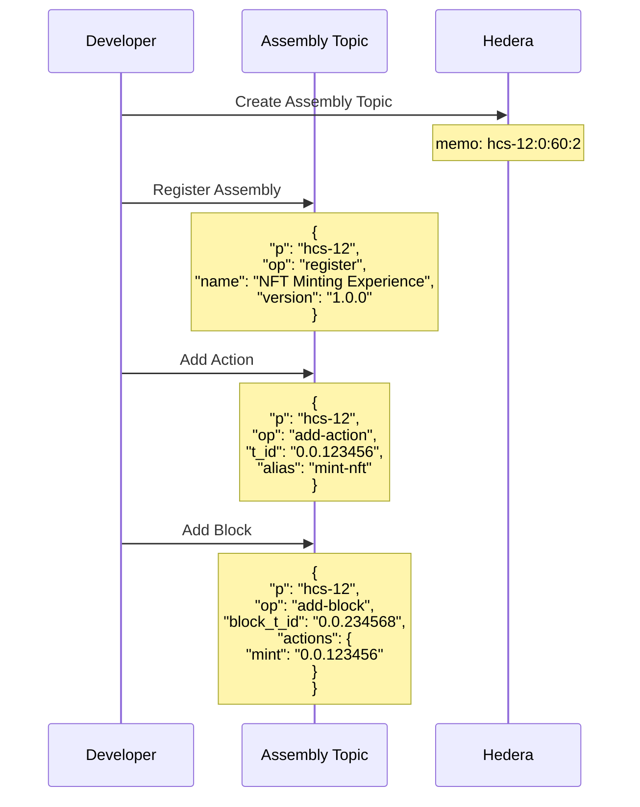

### Step 4: Register in Global Directory

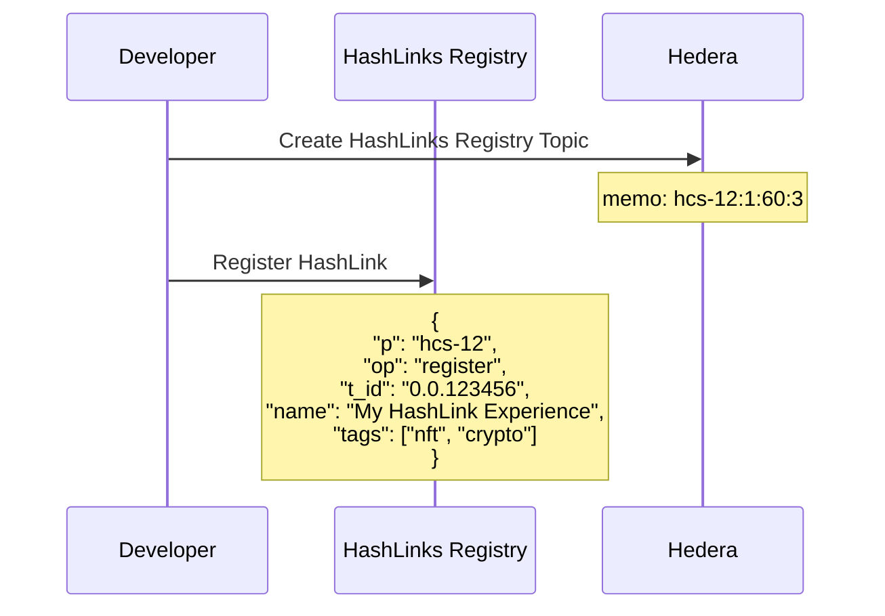

### Step 5: User Interaction Flow

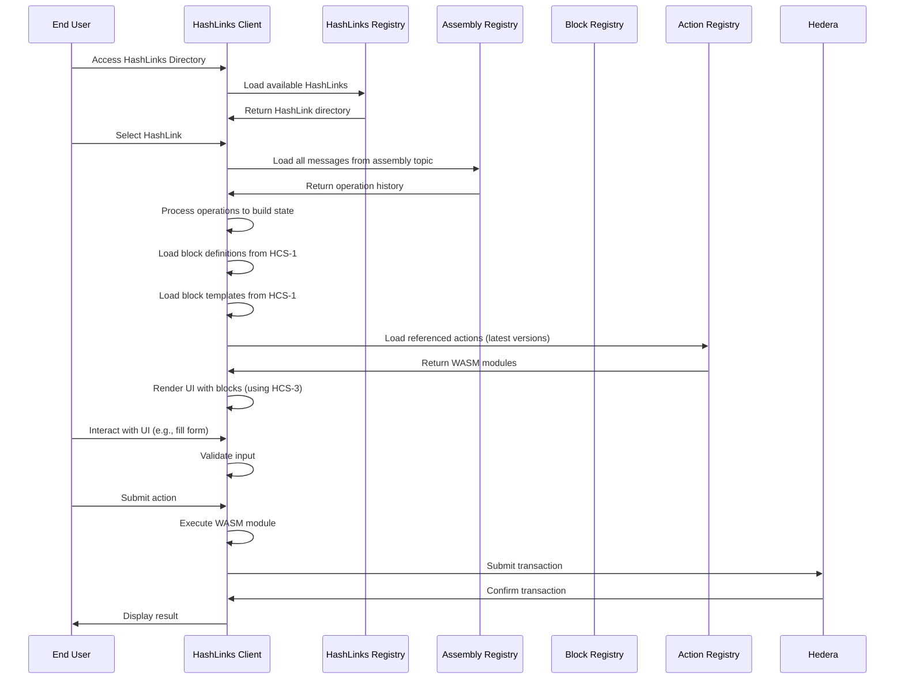

## Client Architecture

Required components for HashLinks client implementation:

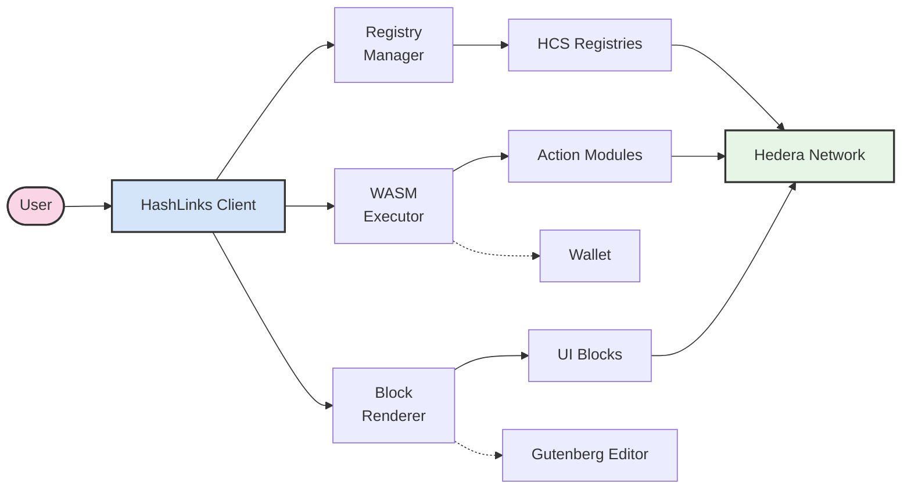


## HCS-10 Interoperability

HashLinks interoperate with the HCS-10 OpenConvAI standard for agent-to-agent and human–agent interactions.

### Agent Integration

Agents can embed HashLinks in their communications to provide interactive experiences:

```json
{
  "p": "hcs-10",
  "op": "message",
  "operator_id": "0.0.789101@0.0.123456",
  "data": "{\"content\":\"Here's a visualization of the data you requested\",\"hashlink\":\"hcs://15/0.0.567890\"}",
  "m": "Message with embedded HashLink"
}
```

Example: DeFi loan coordination between agents:

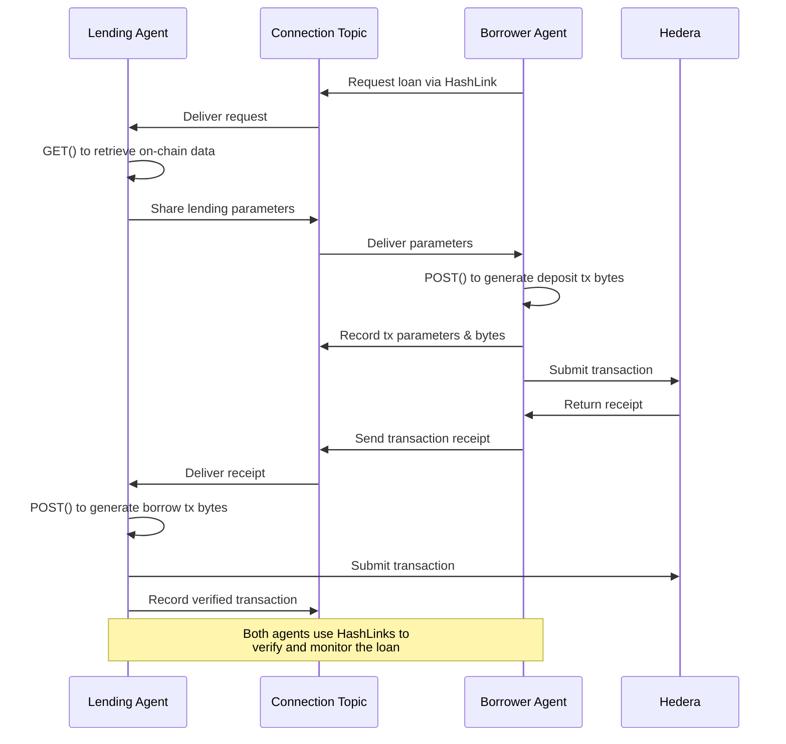

### Human–Agent Interaction

HashLinks enable agents to provide interactive interfaces rather than text-based instructions:

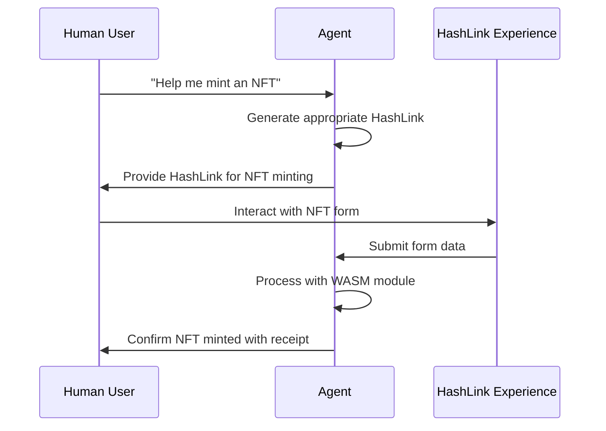

### Integration Architecture

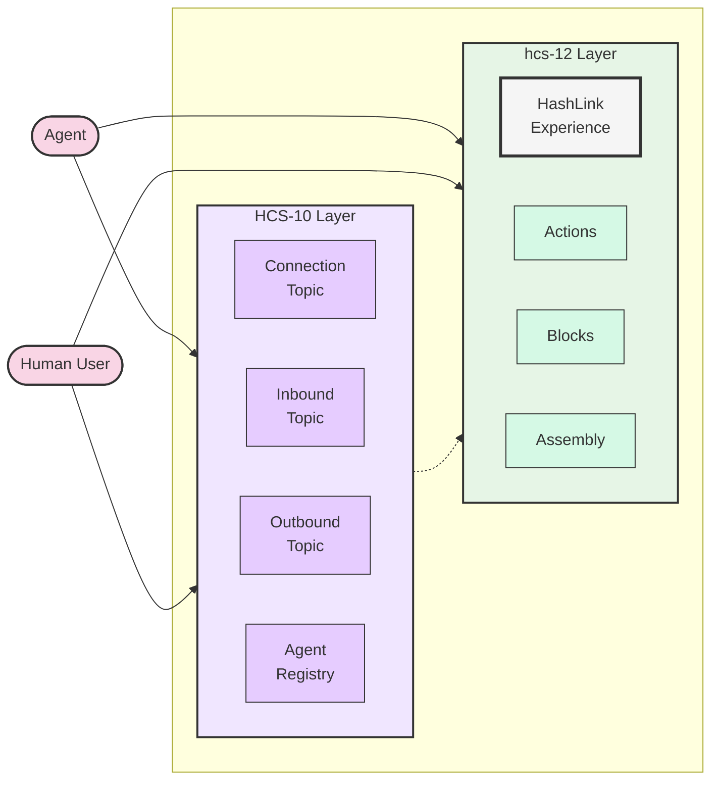

### Technical Implementation

1. **Message Extension**: Add a `hashlink` field to HCS-10 messages for HashLink references
2. **Context Passing**: WASM modules receive conversation context via the memo parameter

## Compatibility

This standard is compatible with:
- HCS-1 for file storage
- HCS-2 for topic registries  
- HCS-3 for resource loading
- HCS-11 for agent profiles
- WordPress Gutenberg block editor

## References

1. [HCS-1 Standard: File Data Management](../hcs-1.md)
2. [HCS-2 Standard: Advanced Topic Registries](../hcs-2.md)
3. [HCS-3 Standard: Recursion within Hedera Consensus Service](../hcs-3.md)
4. [WordPress Gutenberg Block API](https://developer.wordpress.org/block-editor/reference-guides/block-api/block-registration/)
