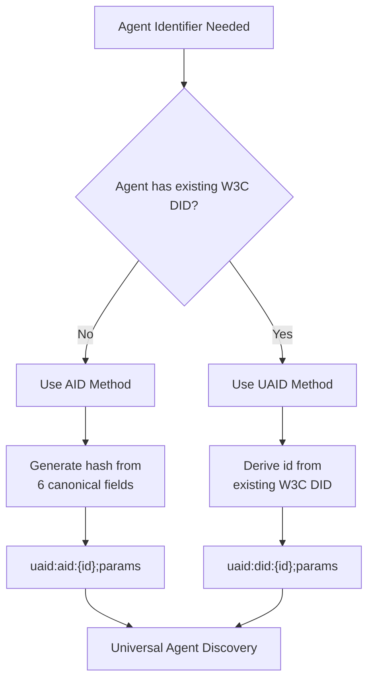

# HCS-14 Standard: Universal Agent ID Standard

### Status: Draft

Discussion: https://github.com/hashgraph-online/hcs-improvement-proposals/discussions/135

Discussions-To: https://github.com/hashgraph-online/hcs-improvement-proposals/discussions/135

Last-Call-Ends: (TBD)

### Table of Contents

- [HCS-14 Standard: Universal Agent ID Standard](#hcs-14-standard-universal-agent-id-standard)
    - [Status: Draft](#status-draft)
    - [Table of Contents](#table-of-contents)
  - [Authors](#authors)
  - [Abstract](#abstract)
  - [Motivation](#motivation)
  - [Specification](#specification)
    - [Guiding Principles](#guiding-principles)
    - [DID Structure](#did-structure)
      - [Registry-Generated Identifiers (AID Target)](#registry-generated-identifiers-aid-target)
      - [Self-Sovereign Identifiers (UAID Targeting a DID)](#self-sovereign-identifiers-uaid-targeting-a-did)
    - [DID Parameter Structure](#did-parameter-structure)
      - [Reserved and Optional Parameters (Informative)](#reserved-and-optional-parameters-informative)
      - [Agent Purpose (Informative)](#agent-purpose-informative)
      - [Hash Generation Methods](#hash-generation-methods)
  - [DID Method Selection](#did-method-selection)
    - [Supported Agent Protocols](#supported-agent-protocols)
    - [Canonical Agent Data](#canonical-agent-data)
    - [Native Protocol IDs](#native-protocol-ids)
    - [Agent Skills](#agent-skills)
      - [Core Skills (0-19)](#core-skills-0-19)
      - [Protocol-Specific Skills (20-39)](#protocol-specific-skills-20-39)
    - [Protocol Identifiers](#protocol-identifiers)
    - [Interoperability (Informative)](#interoperability-informative)
      - [ERC‑8004 Alignment (EVM Agent Registries)](#erc8004-alignment-evm-agent-registries)
      - [Trust Over IP (ToIP) Alignment](#trust-over-ip-toip-alignment)
    - [Hash Generation](#hash-generation)
    - [A2A Agent.json Integration](#a2a-agentjson-integration)
      - [Example: `/.well-known/agent.json` with UAID (Informative)](#example-well-knownagentjson-with-uaid-informative)
      - [Example: HCS‑11 Profile with UAID (Informative)](#example-hcs11-profile-with-uaid-informative)
  - [Implementation](#implementation)
    - [Validation Requirements](#validation-requirements)
    - [Test Vectors](#test-vectors)
      - [Test Vector 1: HCS-10 Agent](#test-vector-1-hcs-10-agent)
      - [Test Vector 2: A2A Agent](#test-vector-2-a2a-agent)
    - [Implementation Requirements](#implementation-requirements)
    - [UAID DID Resolution Profile](#uaid-did-resolution-profile)
  - [Security Considerations](#security-considerations)
  - [Trust and Reputation (Informative)](#trust-and-reputation-informative)
  - [Traceability (Informative)](#traceability-informative)
  - [Examples](#examples)
    - [Example 1: HCS-10 Agent](#example-1-hcs-10-agent)
    - [Example 2: A2A Agent (Microsoft)](#example-2-a2a-agent-microsoft)
    - [Example 3: MCP Server](#example-3-mcp-server)
    - [Example 4: Self-Sovereign Agent (UAID)](#example-4-self-sovereign-agent-uaid)
    - [Example 5: Virtuals Protocol Agent](#example-5-virtuals-protocol-agent)
    - [Example 6: OLAS Service](#example-6-olas-service)
  - [Method Selection Guidelines](#method-selection-guidelines)
    - [When to Use UAID Target "aid" (`uaid:aid:`)](#when-to-use-uaid-target-aid-uaidaid)
    - [When to Use UAID Target "did" (`uaid:did:`)](#when-to-use-uaid-target-did-uaiddid)
  - [Conclusion](#conclusion)

## Authors

- Kantorcodes [https://x.com/kantorcodes](https://x.com/kantorcodes)
- Patches [https://x.com/TMCC_Patches](https://x.com/TMCC_Patches)
- Ahmer Inam [https://www.linkedin.com/in/ahmer/](https://www.linkedin.com/in/ahmer/)
- Jake Hall [https://www.linkedin.com/in/jake-hall-62b6b7176/](https://www.linkedin.com/in/jake-hall-62b6b7176/)
- Sam Nanthans [https://github.com/miseenplace](https://github.com/miseenplace) 

## Abstract

The HCS-14 standard provides a systematic approach for generating globally unique identifiers for AI agents using the W3C Decentralized Identifier (DID) framework. By introducing dual DID methods (AID for registry-generated and UAID for self-sovereign identifiers), this standard enables consistent agent identification across web2 APIs, web3 protocols, and hybrid systems without requiring any specific infrastructure dependencies. Both methods embed routing information directly in the DID, making agent discovery and communication seamless across protocol boundaries.

## Motivation

AI agents are proliferating across diverse platforms with different identification systems. Each protocol has evolved sophisticated identification systems optimized for their specific use cases - Web2 platforms provide stable API-based identifiers, blockchain systems leverage cryptographic addresses, consensus-based networks utilize account IDs, and decentralized registries implement database-optimized identifiers. While each approach works well within its protocol, cross-protocol coordination remains difficult:

**Cross-Protocol Collaboration**: As agents become more sophisticated, they increasingly need to work together across protocol boundaries. A research agent on one protocol might need to collaborate with a data analysis agent on another, or a creative agent might need to coordinate with a transaction agent on a different network. Enabling seamless collaboration amplifies the capabilities of all agents.

**Unified Discovery**: Each protocol has developed robust discovery mechanisms within their ecosystem. By creating a universal identification layer, we can build on these existing systems to enable agents to discover potential collaborators across all protocols, expanding the possibilities for agent interactions.

**Trust Bridge Building**: Different protocols have implemented innovative trust and verification mechanisms suited to their architectures. A universal ID system can serve as a bridge between these trust models, allowing protocols to maintain their security approaches while enabling cross-protocol verification.

**Simplified Integration**: Developers building multi-agent systems currently need to implement custom translation and routing for each protocol pair. A universal identification standard reduces this complexity, allowing developers to focus on agent capabilities rather than integration challenges.

The HCS-14 standard builds upon these opportunities by introducing universal, self-describing agent identifiers that complement existing protocol identification systems. By respecting and leveraging each protocol's native unique identifiers while adding a universal layer, we create a system where:

- **Any agent can be uniquely identified** regardless of its native protocol
- **Dual identification methods** - deterministic generation for discovered agents (AID) or preservation of existing DIDs (UAID)
- **No central authority is required** - anyone can generate and verify IDs
- **Cross-protocol communication becomes trivial** - IDs contain routing information
- **Protocol-native identity** - agents maintain their protocol-specific identities while gaining universal discoverability
- **Trust can be verified cryptographically** - the ID itself proves the agent's properties

## Specification

### Guiding Principles

The HCS-14 standard defines a single UAID scheme targeting either an AID (deterministic) or a DID (sovereign): `uaid:aid` and `uaid:did`. The following principles apply across targets; where target-specific behavior differs, it is stated explicitly.

1. **Decentralized Generation**: HCS‑14 introduces no central authority.
   - AID: any party shall be able to derive the identifier from canonical public inputs without permission.
   - UAID: the subject controls issuance via the underlying DID method; UAID adds no new central dependency beyond that DID method.

2. **Self‑Describing Structure**: The DID shall contain sufficient routing metadata to reach the agent without external lookups. By embedding registry and native ID information in parameters (`did:{method}:{root};registry=...;nativeId=...`), cross‑protocol routing is enabled.

3. **Cryptographic Verifiability**:
   - AID: verifiable by recomputing the hash from the canonical inputs.
   - UAID: verifiable by resolving the underlying DID Document using the base method’s verification rules.

4. **Collision and Uniqueness**:
   - AID: the SHA‑384 hash of canonical inputs provides strong collision resistance (≈2^‑384).
   - UAID: uniqueness and security properties inherit from the underlying DID method.

5. **Protocol‑Agnostic Architecture**: Whether an agent operates via centralized APIs, smart contracts, or consensus networks, HCS‑14 identification works uniformly while respecting each protocol’s native identifiers.

6. **Evolution & Traceability**: The DID format and parameter schema shall support additive evolution without breaking existing identifiers. In addition:
   - AID: any change to the six canonical identity inputs shall produce a new AID.
   - UAID: the identifier remains stable unless the underlying sovereign DID changes.
   - Implementations should link prior and successor identifiers (for example via DID Document `alsoKnownAs`) and may publish operational history via HCS‑11 profiles and HCS‑19 topics.

### DID Structure

The HCS-14 standard uses the W3C DID format with two complementary methods:

#### Registry-Generated Identifiers (AID Target)

```
uaid:aid:{id};{parameters}
```

#### Self-Sovereign Identifiers (UAID Targeting a DID)

```
uaid:did:{id};{parameters}
```

Where:

- `uaid` = Universal Agent Identifier scheme prefix
- `aid` = Agent Identifier target (system-generated)
- `did` = W3C DID target (self-sovereign)
- `id` = Identifier component (see below)
- `parameters` = Semicolon-separated key-value pairs for routing

Notes:
- For `uaid:aid`, `{id}` denotes the Base58-encoded identifier hash (SHA‑384 of canonical JSON; see Hash Generation).
- For `uaid:did`, `{id}` denotes the method‑specific identifier of the base DID after sanitization (no new hash is computed).

### DID Parameter Structure

Both AID and UAID methods use identical parameter structures for routing:

```
uaid:{target}:{id};{optional_parameters}
```

Example with common parameters:

```
uaid:{target}:{id};uid={uid};registry={registry};proto={protocol};nativeId={nativeId};domain={domain}
```

Parameter definitions:

- `target` = Either "did" or "aid"
- `registry` = Registry namespace (e.g., "nanda", "hol", "olas")
- `proto` = Protocol identifier (e.g., "hcs-10", "a2a", "mcp")
- `nativeId` = Protocol's native unique identifier (use CAIP‑10 where applicable, e.g., `eip155:<chainId>:<address>` for EVM accounts, `hedera:<network>:<account>` for Hedera; domain for A2A/NANDA)
- `uid` = Unique identifier within the registry. Examples:
  - NANDA: agent name or registry-specific UID
  - HCS‑10 (Hedera): the account’s operator_id when available, defined as `inboundTopicId@accountId`. If no HCS‑11 profile is registered yet (no topics), use the Hedera account ID until the operator_id is established.
- `domain` = Domain identifier for an agent (e.g. domain.com / foo.hbar / bar.eth / alice.btc) 

- `src` = Multibase base58btc (z…) of the full base DID (optional; included only when the UAID id was sanitized by removing method‑specific parameters, query, or fragment from the base DID).

Notes:
- Parameters are ordered with `uid` first, followed by `registry`, `proto`, `nativeId`, and `domain` (if present). Implementations shall preserve this order when emitting UAIDs.
- Both `registry` and `proto` can be specified together as they serve different purposes - registry indicates the organization/namespace while proto indicates the communication protocol. The `uid` parameter is required and shall be "0" if not applicable.
- The UAID id portion shall not contain `;`. Implementations shall strip everything after the first `;`, `?`, or `#` from the base DID’s method‑specific identifier when forming the UAID id.

#### Reserved and Optional Parameters (Informative)

The DID parameter space is intentionally focused on routing. Descriptive semantics like an agent's purpose or taxonomy are intentionally excluded from the DID to keep identifiers stable and compact.

- `p` / `purpose` (reserved): NOT part of the routing parameters and NOT required for HCS-14. If communities need to convey purpose/taxonomy, include it in the agent profile (e.g., A2A `agent.json` or HCS‑11 profile) and/or map to skill enums. Purpose values shall not appear in the DID string and are not inputs to the UAID hash.

#### Agent Purpose (Informative)

Purpose denotes the intended role or mission of an agent (for example, “support assistant” or “indexer”). Because purpose is descriptive and may change over time, it is excluded from:

- the UAID method string and parameters; and
- the canonical hash inputs used to derive `hash`.

Recommended placement for purpose metadata:
- A2A: a `purpose` field in `/.well-known/agent.json` alongside `skills`.
- HCS‑11: a `purpose` field in the profile JSON (outside the UAID), optionally supported by verifiable credentials.

Rationale: skills enumerations provide deterministic capability encoding; free‑text purpose complements skills without affecting identifier stability.


#### Hash Generation Methods

**AID Method:**

- Hash computed from canonical JSON of 6 agent fields (registry, name, version, protocol, nativeId, skills)
- Deterministic - same agent data always produces same hash
- Used when agents don't have existing W3C DIDs

**UAID Method:**

- Identifier derived from the subject’s existing W3C DID; UAID id equals the DID’s sanitized method‑specific identifier (no new hash). See DID Parameter Structure for sanitization rules and `src` handling. Used when agents already have established DID identities and to preserve sovereign identity.

## DID Method Selection



### Supported Agent Protocols

Note the list of supported protocols is not exhaustive, but is a starting point for the standard. Additional protocols may be added as needed.

| Code           | Protocol               | Description                                      |
| -------------- | ---------------------- | ------------------------------------------------ |
| `a2a`          | Agent-to-Agent         | Google A2A protocol (HTTP+JSON, gRPC)            |
| `mcp`          | Model Context Protocol | Anthropic MCP servers with tools/resources       |
| `hcs-10`       | HCS-10                 | Hedera Consensus Service conversational agents   |
| `nanda`        | NANDA Protocol         | Decentralized AI agent registry with A2A support |
| `acp-virtuals` | ACP Virtuals           | Virtuals Protocol for AI agent commerce          |
| `acp-ibm`      | IBM ACP                | IBM Agent Communication Protocol (REST-based)    |
| `olas`         | OLAS/Autonolas         | Autonomous service registry (discovery only)     |
| `ws`           | WebSocket              | Real-time WebSocket communication                |
| `rest`         | RESTful API            | HTTP REST-based service agents                   |
| `grpc`         | gRPC                   | High-performance gRPC agents                     |
| `mqtt`         | Message Queue          | MQTT or message queue protocols                  |
| `dao`          | DAO Protocol           | Decentralized autonomous agents                  |
| `hybrid`       | Multi-Protocol         | Agents supporting multiple protocols             |

### Canonical Agent Data

The hash is computed from a canonical JSON representation containing ONLY these required fields:

```json
{
  "registry": "string",      // Registry namespace (e.g., "hedera", "google", "olas")
  "name": "string",          // Human-readable agent name
  "version": "string",       // Semantic version (e.g., "1.0.0")
  "protocol": "string",      // Protocol identifier from supported list
  "nativeId": "string",      // Protocol's native unique identifier
  "skills": [number]   // Array of capability enum values (0-39)
}
```

**IMPORTANT**: To ensure deterministic ID generation:

- The hash is computed using ONLY the six required fields above
- Communication details (endpoints, topic IDs, etc.) are NOT included in the hash
- This ensures the same agent always generates the same ID regardless of endpoint changes or metadata updates
- All agents shall provide these six fields to generate a valid HCS-14 ID
- For self-sovereign agents where no specific registry applies, the registry field shall be set to "self"

**Communication Details (Informative)**: While not part of the ID hash, agents should advertise live endpoints via their native discovery channels or profiles:

- **A2A**: `/.well-known/agent.json` hosts the service endpoint URL. The agent name/ID may be carried in the `uid` parameter when applicable.
- **HCS‑10**: Inbound/outbound topic IDs belong in the HCS‑11 profile (`inboundTopicId` / `outboundTopicId`). In the UAID, set `nativeId` to the CAIP‑10 account for the operator and set `uid` to the account’s operator_id when available, defined as `inboundTopicId@accountId`. If the account has not yet registered an HCS‑11 profile (no topics), implementations MAY temporarily set `uid` to the Hedera account ID and update it to the operator_id once available.
- **MCP**: Advertise server endpoints (SSE/HTTP) or stdio transport either in the DID Document `service` section or in the HCS‑11 profile.
- **WebSocket**: Publish connection URLs (e.g., `wss://agent.example.com/ws`) via DID Document `service` or HCS‑11 profile.
- **NANDA**: Provide registry URLs and A2A endpoints according to NANDA’s discovery rules.

These details should be discoverable through each protocol's native mechanisms or via registries that map HCS‑14 DIDs to current endpoints.

Field normalization rules:

- All strings shall be trimmed of leading and trailing whitespace.
- `registry` and `protocol` values shall be normalized to lowercase.
- The `skills` array shall be sorted numerically in ascending order.
- Object keys shall be serialized in alphabetical order in JSON.

### Native Protocol IDs

Most protocols provide native unique identifiers that ensure global uniqueness. HCS‑14 does not mandate any specific network; instead it prescribes a consistent mapping:

| Protocol class         | Native ID Type                     | Example                                      |
| ---------------------- | ---------------------------------- | -------------------------------------------- |
| Blockchain account     | CAIP‑10 account identifier         | `"eip155:1:0x742d…41Bd"`, `"hedera:testnet:0.0.123456"` |
| Web domain             | Domain hosting agent.json (A2A)    | `"microsoft.com"`                            |
| HTTP service           | Service URI                        | `"https://api.example.com/agents/123"`       |
| Named agent registry   | Registry‑scoped agent ID           | `"pirate-bot"`                               |
| Server/runtime         | Server identifier                  | `"mcp-filesystem"`                           |
| Program/service pair   | Chain:Service identifier           | `"1:42"`                                     |

Guidance:
- For chain‑based protocols that define CAIP namespaces, nativeId MUST use the appropriate CAIP‑10 account identifier for that chain namespace.
- For web‑hosted A2A agents, nativeId SHOULD be the domain that serves `/.well-known/agent.json`, with the agent’s name/ID carried in `uid` when applicable.
- Other protocols SHOULD use a stable, protocol‑native identifier that is resolvable within that protocol’s discovery mechanisms.

### Agent Skills

Skills are represented as numeric enums to ensure deterministic sorting, aligned with A2A protocol terminology.

#### Core Skills (0-19)

| Value | Skill                    | Description                                           |
| ----- | ------------------------ | ----------------------------------------------------- |
| 0     | Text Generation          | Generate human-like text for content and conversation |
| 1     | Image Generation         | Create or modify visual content from prompts          |
| 2     | Audio Generation         | Synthesize speech, music, or sound content            |
| 3     | Video Generation         | Produce dynamic video content and animations          |
| 4     | Code Generation          | Generate and modify code across programming languages |
| 5     | Language Translation     | Convert text between different languages              |
| 6     | Content Summarization    | Extract key insights from lengthy content             |
| 7     | Knowledge Retrieval      | Access and reason over structured data                |
| 8     | Data Visualization       | Create visual representations of data                 |
| 9     | Market Intelligence      | Analyze financial and economic trends                 |
| 10    | Transaction Analytics    | Monitor and analyze transaction patterns              |
| 11    | Smart Contract Audit     | Evaluate blockchain code for security                 |
| 12    | Governance Facilitation  | Support decentralized decision-making                 |
| 13    | Security Monitoring      | Detect threats and security anomalies                 |
| 14    | Compliance Analysis      | Ensure regulatory and legal adherence                 |
| 15    | Fraud Detection          | Identify and prevent fraudulent activities            |
| 16    | Multi-Agent Coordination | Orchestrate multiple agent interactions               |
| 17    | API Integration          | Connect with external systems and services            |
| 18    | Workflow Automation      | Automate routine tasks and processes                  |
| 19    | Real-time Communication  | Support live messaging and interaction                |

#### Protocol-Specific Skills (20-39)

| Value | Skill                    | Description                               |
| ----- | ------------------------ | ----------------------------------------- |
| 20    | Resource Provider        | Expose data resources (MCP)               |
| 21    | Tool Provider            | Provide executable tools (MCP)            |
| 22    | Prompt Templates         | Offer reusable prompt templates           |
| 23    | File System Access       | Access local or remote file systems       |
| 24    | Database Integration     | Connect to and query databases            |
| 25    | Web Access               | Browse and analyze web content            |
| 26    | Knowledge Base           | Serve specialized knowledge repositories  |
| 27    | Memory Persistence       | Maintain context between sessions         |
| 28    | Code Analysis            | Understand and manipulate code            |
| 29    | Document Processing      | Process various document formats          |
| 30    | Calendar Management      | Handle scheduling and time management     |
| 31    | Search Services          | Provide specialized search capabilities   |
| 32    | Assistant Orchestration  | Manage multiple AI assistant interactions |
| 33    | Blockchain Integration   | Interact with blockchain networks         |
| 34    | Consensus Participation  | Participate in consensus mechanisms       |
| 35    | Identity Verification    | Verify and manage digital identities      |
| 36    | Cryptographic Operations | Perform encryption and signing            |
| 37    | Event Streaming          | Handle real-time event streams            |
| 38    | Message Routing          | Route messages between agents             |
| 39    | Trust Attestation        | Provide trust and reputation services     |

### Protocol Identifiers

Protocol identifiers shall use **string values** rather than enums to provide flexibility for:

- Adding new protocols without code changes
- Supporting protocol aliases and variations
- Handling protocols with similar names (e.g., `acp-ibm` vs `acp-virtuals`)
- Future protocol evolution and versioning

### Interoperability (Informative)

#### ERC‑8004 Alignment (EVM Agent Registries)

The ERC‑8004 effort proposes trustless, on‑chain agent discovery and reputation primitives in the EVM ecosystem. HCS‑14 aligns as follows:

- HCS‑14 identifiers: both uaid:aid and uaid:did are DID‑Core compatible and can represent on‑chain agents.
- Native identifier: For EVM addresses, `nativeId` should use CAIP‑10 account identifiers `eip155:<chainId>:<address>` to ensure chain‑qualified uniqueness and tooling compatibility.
- Registry namespace: Implementations may set `registry` to a stable namespace representing the ERC‑8004 registry or program (e.g., `olas`, `virtuals`, or a deployment‑specific label). Namespaces shall be documented by the operator.
- DID Document linkage: Resolvers may include a `verificationMethod` derived from the EVM account and advertise `service` entries pointing to A2A/MCP endpoints for cross‑protocol interop.

This mapping preserves determinism (for AID) and sovereign identity (for UAID) while allowing ERC‑8004 registries to act as authoritative sources for state, reputation, or discovery.

#### Trust Over IP (ToIP) Alignment

ToIP profiles build upon W3C DID Core, DID Resolution, and verifiable credentials. UAID is compatible by design:

- Resolution: A uaid:did shall resolve to a DID Document conforming to DID Core with optional `service` entries for supported protocols (e.g., `A2AService`, `MCPService`, `HCS10Service`).
- Verification methods: DID Documents should expose keys or references suitable for ToIP trust frameworks (e.g., Ed25519 for HCS‑10, ECDSA for EVM identities) via `verificationMethod` and appropriate relationships (`authentication`, `assertionMethod`).
- Correlation: Implementations may use `alsoKnownAs` to link uaid:did to protocol‑specific DIDs (e.g., `did:pkh:eip155:…`, `did:ethr:…`, `did:web:…`).

CAIP alignment (informative):

- Networks: Use CAIP‑2 style network identifiers where applicable for protocol resources.
- Accounts: Prefer CAIP‑10 accounts in HCS‑14 `nativeId` (e.g., `eip155:<chainId>:<address>`, `hedera:<network>:<account>`).
- Resources: When referencing HCS resources inside DID Documents (e.g., topics for HCS‑10), implementers MAY use CAIP‑19‑style URIs for clarity and tooling compatibility.

These guidelines enable HCS‑14 subjects to participate in ToIP trust frameworks without altering the identifier.

### Hash Generation

The hash generation process follows these steps. The following steps are normative; implementations shall perform steps 1–6:

1. **Validate** all required fields are present
2. **Normalize** strings (lowercase registry/protocol, trim whitespace)
3. **Sort** capabilities numerically and object keys lexicographically
4. **Serialize** to canonical JSON with sorted keys
5. **Hash** using SHA-384 with UTF-8 encoding
6. **Encode** hash as Base58

Rationale: SHA-384 is selected for its larger security margin and robustness under quantum search (e.g., Grover's algorithm) while remaining widely available in standard libraries. This choice is about collision resistance for identifiers; it does not imply novel cryptographic trust assumptions.

```typescript
function generateAgentDID(agentData: AgentData): string {
  // 1. Validate required fields
  if (
    !agentData.registry ||
    !agentData.name ||
    !agentData.version ||
    !agentData.protocol ||
    !agentData.nativeId
  ) {
    throw new Error('Missing required fields');
  }

  // 2. Create canonical object with ONLY required fields
  const canonical = {
    registry: agentData.registry.toLowerCase().trim(),
    name: agentData.name.trim(),
    version: agentData.version.trim(),
    protocol: agentData.protocol.toLowerCase().trim(),
    nativeId: agentData.nativeId.trim(),
    skills: (agentData.skills || []).sort((a, b) => a - b),
  };

  // 3. Generate hash
  const sortedJson = JSON.stringify(canonical, Object.keys(canonical).sort());
  const hash = sha384(sortedJson);
  const base58Hash = bs58.encode(hash);

  // 4. Build DID with parameters
  const params: string[] = [];
  params.push(`registry=${agentData.registry}`);
  params.push(`proto=${agentData.protocol}`);
  params.push(`nativeId=${agentData.nativeId}`);
  params.push(`uid=${agentData.uid ?? '0'}`);

  // Deterministic AID: derived from canonical fields
  return `uaid:aid:${base58Hash};${params.join(';')}`;
}
```

### A2A Agent.json Integration

For A2A protocol agents, skills are extracted from the skills array in the domain's `/.well-known/agent.json` file:

```typescript
function extractSkillsFromA2AAgent(agentCard: A2AAgentCard): number[] {
  const skills: number[] = [];

  // Map A2A skills to HCS-14 skill enums
  for (const skill of agentCard.skills || []) {
    const skillName = skill.name.toLowerCase();
    const skillDesc = skill.description.toLowerCase();

    if (skillName.includes('chat') || skillName.includes('conversation')) {
      skills.push(0); // Text Generation
    }
    if (skillName.includes('search') || skillName.includes('query')) {
      skills.push(31); // Search Services
    }
    if (skillName.includes('data') || skillDesc.includes('retrieve')) {
      skills.push(7); // Knowledge Retrieval
    }
    if (skillName.includes('code') || skillName.includes('generate')) {
      skills.push(4); // Code Generation
    }
  }

  // Add capabilities-based skills
  if (agentCard.capabilities?.streaming) {
    skills.push(19); // Real-time Communication
  }
  if (agentCard.capabilities?.pushNotifications) {
    skills.push(17); // API Integration
  }

  // All A2A agents have API Integration capability
  skills.push(17); // API Integration

  return [...new Set(skills)].sort((a, b) => a - b);
}
```

#### Example: `/.well-known/agent.json` with UAID (Informative)

Agents served over A2A should include a deterministic AID DID for cross‑protocol discovery when no sovereign DID already exists. The following illustrative agent card embeds an AID and basic routing metadata:

```json
{
  "name": "Customer Support Assistant",
  "description": "A2A agent for customer support",
  "version": "1.0.0",
  "did": "uaid:aid:QmV5dK7pQ2wX8nL4mT6yB3jF0uA9eC1zS;uid=customer-support-assistant;registry=microsoft;nativeId=microsoft.com",
  "protocol": "a2a",
  "endpoints": {
    "a2a": "https://support.microsoft.com/a2a"
  },
  "skills": [0, 17, 19]
}
```

Notes:
- The `did` field contains the UAID DID; parsers may also accept an `id` field if preferred by the ecosystem, but emitters should use `did` for clarity.
- The `nativeId` corresponds to the domain hosting this file; the agent name/id is carried in `uid`.

#### Example: HCS‑11 Profile with UAID (Informative)

HCS‑11 profiles shall include a top‑level `uaid` field. For agents and servers, use `uaid:did` to enable cross‑protocol routing and correlation:

```json
{
  "version": "1.0",
  "type": 1,
  "display_name": "AI Assistant Bot",
  "uaid": "uaid:did:QmX4fB9XpS3yKqP8MHTbcQW7R6wN4PrGHz;uid=helper-bot;registry=hol;nativeId=hedera:testnet:0.0.2656337",
  "inboundTopicId": "0.0.789101",
  "outboundTopicId": "0.0.789102"
}
```

## Implementation

### Validation Requirements

Implementations shall:

1. **Deterministic JSON**: Produce identical JSON for identical inputs
2. **UTF-8 Encoding**: All strings shall be UTF-8 encoded before hashing
3. **Stable Sorting**: Arrays and object keys shall be sorted deterministically
4. **Required Fields**: Fail if registry/name/version/protocol/nativeId missing
5. **Native ID**: Include protocol's native unique identifier

### Test Vectors

#### Test Vector 1: HCS-10 Agent

**Input:**

```json
{
  "registry": "hol",
  "name": "Support Agent",
  "version": "1.0.0",
  "protocol": "hcs-10",
  "nativeId": "hedera:testnet:0.0.123456",
  "skills": [0, 17]
}
```

**Canonical JSON:**

```json
{
  "skills": [0, 17],
  "name": "Support Agent",
  "nativeId": "hedera:testnet:0.0.123456",
  "protocol": "hcs-10",
  "registry": "hol",
  "version": "1.0.0"
}
```

**Expected UAID (AID target):** `uaid:aid:{base58hash};uid=0;registry=hol;nativeId=hedera:testnet:0.0.123456`

#### Test Vector 2: A2A Agent

**Input:**

```json
{
  "registry": "google",
  "name": "Customer Bot",
  "version": "2.1.0",
  "protocol": "a2a",
  "nativeId": "salesforce-support-agent",
  "skills": [0, 17, 19]
}
```

**Canonical JSON:**

```json
{
  "skills": [0, 17, 19],
  "name": "Customer Bot",
  "nativeId": "salesforce-support-agent",
  "protocol": "a2a",
  "registry": "google",
  "version": "2.1.0"
}
```

**Expected UAID (AID target):** `uaid:aid:{base58hash};uid=support-agent;registry=google;nativeId=salesforce.com`

### Implementation Requirements

Implementations shall comply with the following technical specifications:

1. **String Normalization**: Registry and protocol fields shall be converted to lowercase. All string fields shall have leading and trailing whitespace removed.

2. **Deterministic Serialization**: JSON objects shall be serialized with keys sorted lexicographically. Skills arrays shall be sorted numerically in ascending order.

3. **Hash Generation**: SHA-384 shall be applied to UTF-8 encoded canonical JSON. The resulting hash shall be encoded using Base58.

4. **Field Validation**: All required fields (registry, name, version, protocol, nativeId, skills) shall be present and non-empty.

5. **Native Identifier**: The nativeId field shall contain the protocol's canonical unique identifier as specified in the Native Protocol IDs table.

6. **Skills Array**: The skills field shall contain an array of numeric skill identifiers. Empty arrays are permitted.

Determinism and Collisions (AID): AID identifiers are deterministic by design. Identical canonical agent data yields the same AID. In practice, uniqueness is anchored by `nativeId` (e.g., public key or domain) and `registry`. If distinct deployments require separate identifiers, bump `version` or use distinct `uid` values outside the hash; do not introduce non‑deterministic inputs into the canonical set.

Change management and traceability: Any change to the six canonical fields shall result in a new AID. UAIDs change only when the underlying sovereign DID changes. Implementations should maintain linkage between prior and new identifiers (for example, via DID Document `alsoKnownAs` entries or a custom relation), and may record state transitions or operational history in HCS‑11 profile documents and/or HCS‑19 audit topics.

### UAID DID Resolution Profile

Conformant resolvers shall return a DID Document satisfying the following minimal profile:

- `id`: the identifier of the subject (uaid:aid or uaid:did).
- `verificationMethod`: zero or more entries binding the UAID to cryptographic material when available (e.g., Ed25519 public key for `hcs-10`, EVM account for CAIP‑10 identifiers), referenced from `authentication` and/or `assertionMethod`.
- `service`: zero or more entries advertising routable endpoints derived from declared protocol(s); recommended types include `A2AService`, `MCPService`, and `HCS10Service` with HTTP(S), gRPC, WS, or DIDComm URIs as appropriate.

Resolvers may include `alsoKnownAs` links to protocol‑specific DIDs (e.g., `did:pkh`, `did:ethr`, `did:web`) to optimize federation with ToIP trust frameworks.

## Security Considerations

1. **No Secrets**: Never include private keys or secrets in canonical data
2. **Endpoint Validation**: Validate endpoints before inclusion in hash
3. **Registry Trust**: Trust model inherits from registry namespace verification

## Trust and Reputation (Informative)

“Trust” in this specification refers to distinct concepts:

- Identity/cryptographic trust: anyone can verify that a UAID corresponds to canonical public data (hash regeneration or DID resolution). This is covered by HCS‑14.
- Routing/source trust: consumers decide which registries or namespaces they rely on for discovery (e.g., `registry=hol`, `registry=olas`). HCS‑14 carries routing hints but does not endorse any registry.
- Behavioral reputation: performance history, quality, and policy adherence of an agent. HCS‑14 does not encode reputation in the UAID or parameters. Implementations may link reputation via:
  - DID Documents (service endpoints or `alsoKnownAs` to reputation systems); and/or
  - verifiable credentials or signed attestations that reference the UAID.

This separation keeps AIDs deterministic and UAIDs self‑sovereign and verifiable, while allowing ecosystems to build rich trust frameworks on top.

## Traceability (Informative)

HCS‑14 separates immutable identification from mutable operational context to enable end‑to‑end traceability without sacrificing identifier stability:

- Identity: AID is deterministic and can be regenerated from canonical inputs. UAID is sovereign and remains stable unless the underlying DID changes.
- Routing: parameters (e.g., `registry`, `nativeId`, `uid`) provide stable, protocol‑specific anchors.
- Context: profiles and logs (e.g., HCS‑11 and HCS‑19) may document capabilities, purposes, configuration versions, and event history while the identifier remains constant.

## Examples

### Example 1: HCS-10 Agent

```json
{
  "registry": "hol",
  "name": "Support Agent",
  "version": "1.0.0",
  "protocol": "hcs-10",
  "nativeId": "hedera:testnet:0.0.123456",
  "skills": [0, 17]
}
```

**Generated UAID (AID target):** `uaid:aid:QmX4fB9XpS3yKqP8MHTbcQW7R6wN4PrGHz;uid=0;registry=hol;nativeId=hedera:testnet:0.0.123456`

### Example 2: A2A Agent (Microsoft)

```json
{
  "registry": "microsoft",
  "name": "Customer Support Assistant",
  "version": "1.0.0",
  "protocol": "a2a",
  "nativeId": "microsoft.com",
  "skills": [0, 7, 17, 31]
}
```

**Generated UAID (AID target):** `uaid:aid:Qm7X8kL3mN5vP1wQ8xR2tY6hB4jC9sA2eE;uid=customer-support-assistant;registry=microsoft;nativeId=microsoft.com`

_Note: uid references the agent name from Microsoft's agent.json file hosted at microsoft.com/.well-known/agent.json_

### Example 3: MCP Server

```json
{
  "registry": "anthropic",
  "name": "Filesystem Tools",
  "version": "1.0.0",
  "protocol": "mcp",
  "nativeId": "mcp-filesystem",
  "skills": [20, 21, 23]
}
```

**Generated UAID (AID target):** `uaid:aid:QmP2fA5XpL7yKmN9MHQbcRW4R5wO3KtGIn;uid=0;registry=anthropic;nativeId=mcp-filesystem`

### Example 4: Self-Sovereign Agent (UAID)

```json
{
  "registry": "hol",
  "name": "AI Assistant",
  "version": "1.0.0",
  "protocol": "hcs-10",
  "nativeId": "302a300506032b65700321009f8d5e7c6b3a2f1e4d9c8b7a6e5f4e3d2c1b0a9e8d7c6b5a4f3e2d1c0b9a8e7d",
  "skills": [0, 19]
}
```

**Scenario:** Agent already has W3C DID: `did:key:z6MkhaXgBZDvotDkL5257faiztiGiC2QtKLGpbnnEGta2doK`.
**Generated UAID (DID target):** `uaid:did:z6MkhaXgBZDvotDkL5257faiztiGiC2QtKLGpbnnEGta2doK;uid=0;proto=hcs-10;nativeId=hedera:testnet:0.0.123456`

_Note: UAID id equals the did:key method‑specific identifier; no new hash is computed._

### Example 5: Virtuals Protocol Agent

```json
{
  "registry": "virtuals",
  "name": "Commerce Bot",
  "version": "1.0.0",
  "protocol": "acp-virtuals",
  "nativeId": "eip155:1:0x742d35Cc6634C0532925a3b844Bc9e7595f41Bd",
  "skills": [0, 9, 10, 33]
}
```

**Generated UAID (AID target):** `uaid:aid:QmV5dK7pQ2wX8nL4mT6yB3jF0uA9eC1zS;uid=0;registry=virtuals;nativeId=eip155:1:0x742d35Cc6634C0532925a3b844Bc9e7595f41Bd`

### Example 6: OLAS Service

```json
{
  "registry": "olas",
  "name": "Prediction Service",
  "version": "1.2.0",
  "protocol": "olas",
  "nativeId": "1:42",
  "skills": [16, 33, 34]
}
```

**Generated UAID (AID target):** `uaid:aid:QmZ8kL4mN6vP2wQ9xR3tY7hB5jC1sA9eD;uid=0;registry=olas;nativeId=1:42`

## Method Selection Guidelines

### When to Use UAID Target "aid" (`uaid:aid:`)

**Use for system-generated identifiers when:**

- Agents don't have existing W3C DIDs
- Systems need to create deterministic IDs for discovered agents
- Legacy systems or protocols that don't support DIDs
- Most common use case for discovery and indexing systems
- Default method for most current AI agents

### When to Use UAID Target "did" (`uaid:did:`)

**Use for self-sovereign identifiers when:**

- Agent already has an established W3C DID identity
- Agent generates its own identifier and wants autonomy
- Cross-chain or cross-protocol agent migration scenarios
- Advanced agents with sophisticated identity management
- Future-proofing for fully decentralized agent ecosystems

## Conclusion

The HCS-14 standard provides a robust protocol for generating deterministic, globally unique agent identifiers using the W3C DID framework. By introducing both AID (registry-generated) and UAID (self-sovereign) methods, this approach supports current registry-based discovery systems while enabling future self-sovereign agent ecosystems. The semicolon-separated parameter format allows agents to be located in their origin registries while maintaining the benefits of decentralized identifiers. This dual approach enables seamless agent discovery and communication across heterogeneous protocol environments, supporting both today's and tomorrow's AI agent architectures.

---

**Copyright**

This document is licensed under [APACHE-2.0](https://www.apache.org/licenses/LICENSE-2.0).
